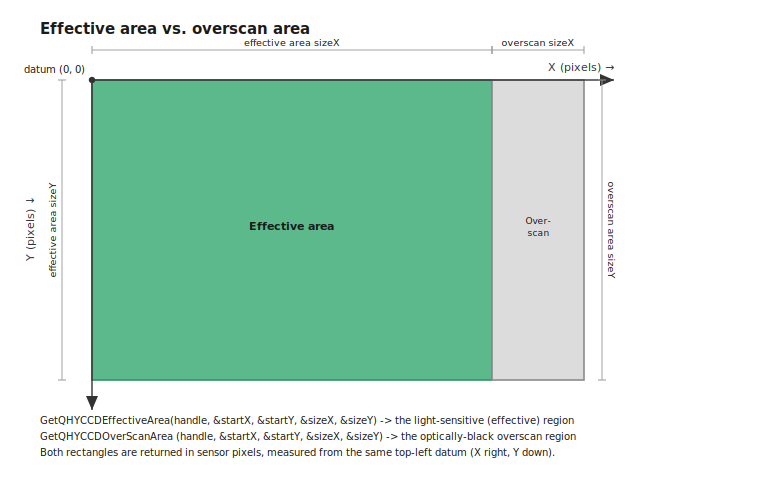
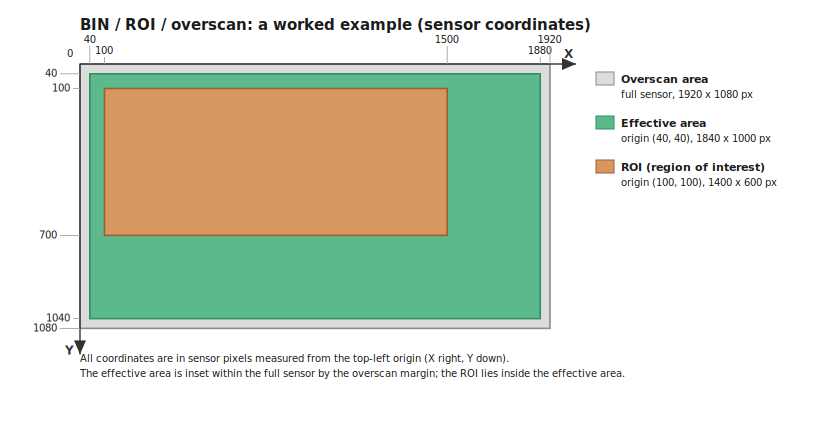
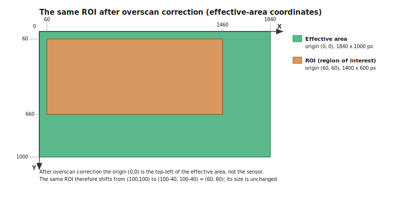

# QHYCCD SDK Manual (English Edition)

> **Unofficial English translation.** This document is a complete English rendering of the official
> QHYCCD SDK manual, translated from the Chinese source because it is substantially more complete than
> QHYCCD's own English PDF. It supports development against the QHYCCD SDK (used in this project via the
> vendored `qhyccd-rs` / `libqhyccd-sys` crates).

## About this document

- **Primary source (translated):** official QHYCCD SDK manual, Chinese edition - *QHYCCD SDK 说明文档* **V2.1**
  (PDF dated 2022-05-25) - <https://www.qhyccd.cn/file/repository/publish/SDK/code/QHYCCD_SDK_V2.1.pdf>
- **Cross-referenced for terminology:** official English edition - *QHYCCD SDK API EN* **V2.3** -
  <https://www.qhyccd.cn/file/repository/publish/SDK/code/QHYCCD%20SDK_API_EN_V2.3.pdf>
  (the English PDF omits much of the Chinese content, so the Chinese edition is the authoritative source here).
- **Scope:** SDK introduction, the full **function reference (69 functions)**, the **feature-configuration guide
  (49 topics)**, **9 complete C example programs**, and the **image data structures**.
- **Code fidelity:** all API names, function signatures, macros / `CONTROL_ID` identifiers, and numeric values are
  reproduced **verbatim** from the source. The official example programs are reproduced **faithfully** and may
  therefore contain minor copy-paste artifacts, inverted checks, or typos present in the original manual (for
  example, a status string printed in both the success and failure branch). Treat the examples as illustrative
  and add proper error handling for production use.
- **How it was produced:** the Chinese source text was extracted, split by section, translated, and then each
  section was independently re-checked against the source by a separate reviewer for completeness, accuracy,
  code fidelity, and terminology. To avoid redistributing QHYCCD's copyrighted imagery, the diagrams have been
  **redrawn from scratch as original SVGs** (conveying the same coordinates/geometry), the SDK-archive screenshot is
  rendered as a text listing, and the trigger-board photographs are omitted (described in a table, with a pointer to
  QHYCCD's official board notes); data tables were reconstructed as Markdown. Generated 2026-06-20.

## Table of Contents

- [1. SDK Introduction](#1-sdk-introduction)
- [2. Function Reference](#2-function-reference)
  - [1. InitQHYCCDResource](#1-initqhyccdresource)
  - [2. ScanQHYCCD](#2-scanqhyccd)
  - [3. GetQHYCCDId](#3-getqhyccdid)
  - [4. OpenQHYCCD](#4-openqhyccd)
  - [5. CloseQHYCCD](#5-closeqhyccd)
  - [6. ReleaseQHYCCDResource](#6-releaseqhyccdresource)
  - [7. GetQHYCCDNumberOfReadMode](#7-getqhyccdnumberofreadmode)
  - [8. GetQHYCCDReadModeName](#8-getqhyccdreadmodename)
  - [9. GetQHYCCDReadModeResolution](#9-getqhyccdreadmoderesolution)
  - [10. SetQHYCCDReadMode](#10-setqhyccdreadmode)
  - [11. SetQHYCCDStreamMode](#11-setqhyccdstreammode)
  - [12. InitQHYCCD](#12-initqhyccd)
  - [13. GetQHYCCDFWVersion](#13-getqhyccdfwversion)
  - [14. GetQHYCCDSDKVersion](#14-getqhyccdsdkversion)
  - [15. GetQHYCCDChipInfo](#15-getqhyccdchipinfo)
  - [16. GetQHYCCDEffectiveArea](#16-getqhyccdeffectivearea)
  - [17. GetQHYCCDOverScanArea](#17-getqhyccdoverscanarea)
  - [18. SetQHYCCDBinMode](#18-setqhyccdbinmode)
  - [19. SetQHYCCDResolution](#19-setqhyccdresolution)
  - [20. GetQHYCCDCurrentROI](#20-getqhyccdcurrentroi)
  - [21. SetQHYCCDDebayerOnOff](#21-setqhyccddebayeronoff)
  - [22. IsQHYCCDControlAvailable](#22-isqhyccdcontrolavailable)
  - [23. GetQHYCCDParamMinMaxStep](#23-getqhyccdparamminmaxstep)
  - [24. GetQHYCCDParam](#24-getqhyccdparam)
  - [25. SetQHYCCDParam](#25-setqhyccdparam)
  - [26. GetQHYCCDMemLength](#26-getqhyccdmemlength)
  - [27. ExpQHYCCDSingleFrame](#27-expqhyccdsingleframe)
  - [28. GetQHYCCDSingleFrame](#28-getqhyccdsingleframe)
  - [29. CancelQHYCCDExposingAndReadout](#29-cancelqhyccdexposingandreadout)
  - [30. CancelQHYCCDExposing](#30-cancelqhyccdexposing)
  - [31. BeginQHYCCDLive](#31-beginqhyccdlive)
  - [32. GetQHYCCDLiveFrame](#32-getqhyccdliveframe)
  - [33. StopQHYCCDLive](#33-stopqhyccdlive)
  - [34. ControlQHYCCDTemp](#34-controlqhyccdtemp)
  - [35. IsQHYCCDCFWPlugged](#35-isqhyccdcfwplugged)
  - [36. SendOrder2QHYCCDCFW](#36-sendorder2qhyccdcfw)
  - [37. GetQHYCCDCFWStatus](#37-getqhyccdcfwstatus)
  - [38. SetQHYCCDGPSVCOXFreq](#38-setqhyccdgpsvcoxfreq)
  - [39. SetQHYCCDGPSLedCalMode](#39-setqhyccdgpsledcalmode)
  - [40. SetQHYCCDGPSPOSA](#40-setqhyccdgpsposa)
  - [41. SetQHYCCDGPSPOSB](#41-setqhyccdgpsposb)
  - [42. SetQHYCCDGPSMasterSlave](#42-setqhyccdgpsmasterslave)
  - [43. SetQHYCCDGPSSlaveModeParameter](#43-setqhyccdgpsslavemodeparameter)
  - [44. SetQHYCCDEnableLiveModeAntiRBI](#44-setqhyccdenablelivemodeantirbi)
  - [45. EnableQHYCCDBurstMode](#45-enableqhyccdburstmode)
  - [46. EnableQHYCCDBurstCountFun](#46-enableqhyccdburstcountfun)
  - [47. ResetQHYCCDFrameCounter](#47-resetqhyccdframecounter)
  - [48. SetQHYCCDBurstModeStartEnd](#48-setqhyccdburstmodestartend)
  - [49. SetQHYCCDBurstIDLE](#49-setqhyccdburstidle)
  - [50. ReleaseQHYCCDBurstIDLE](#50-releaseqhyccdburstidle)
  - [51. SetQHYCCDBurstModePatchNumber](#51-setqhyccdburstmodepatchnumber)
  - [52. GetQHYCCDTrigerInterfaceNumber](#52-getqhyccdtrigerinterfacenumber)
  - [53. GetQHYCCDTrigerInterfaceName](#53-getqhyccdtrigerinterfacename)
  - [54. SetQHYCCDTrigerInterface](#54-setqhyccdtrigerinterface)
  - [55. SetQHYCCDTrigerMode](#55-setqhyccdtrigermode)
  - [56. SetQHYCCDTrigerFunction](#56-setqhyccdtrigerfunction)
  - [57. EnableQHYCCDTrigerOut](#57-enableqhyccdtrigerout)
  - [58. EnableQHYCCDTrigerOutA](#58-enableqhyccdtrigerouta)
  - [59. SendSoftTriger2QHYCCDCam](#59-sendsofttriger2qhyccdcam)
  - [60. SetQHYCCDTrigerFilterOnOff](#60-setqhyccdtrigerfilteronoff)
  - [61. SetQHYCCDTrigerFilterTime](#61-setqhyccdtrigerfiltertime)
  - [62. EnableQHYCCDImageOSD](#62-enableqhyccdimageosd)
  - [63. EnableQHYCCDMessage](#63-enableqhyccdmessage)
  - [64. RegisterPnpEventIn](#64-registerpnpeventin)
  - [65. RegisterPnpEventOut](#65-registerpnpeventout)
  - [66. SetQHYCCDTwoChannelCombineParameter](#66-setqhyccdtwochannelcombineparameter)
  - [67. GetQHYCCDPreciseExposureInfo](#67-getqhyccdpreciseexposureinfo)
  - [68. GetQHYCCDRollingShutterEndOffset](#68-getqhyccdrollingshutterendoffset)
  - [69. QHYCCDSensorPhaseReTrain](#69-qhyccdsensorphaseretrain)
- [3. Feature Configuration](#3-feature-configuration)
  - [1. Obtaining the camera handle](#1-obtaining-the-camera-handle)
  - [2. Setting the readout mode](#2-setting-the-readout-mode)
  - [3. Setting single-frame or live mode](#3-setting-single-frame-or-live-mode)
  - [4. Initializing the camera](#4-initializing-the-camera)
  - [5. Connecting the camera](#5-connecting-the-camera)
  - [6. Disconnecting the camera](#6-disconnecting-the-camera)
  - [7. Checking the features supported by the camera](#7-checking-the-features-supported-by-the-camera)
  - [8. Getting the SDK version number](#8-getting-the-sdk-version-number)
  - [9. Getting the driver version number](#9-getting-the-driver-version-number)
  - [10. Getting the device's current FPGA version number](#10-getting-the-devices-current-fpga-version-number)
  - [11. Get Camera Chip Information](#11-get-camera-chip-information)
  - [12. Set BIN Mode](#12-set-bin-mode)
  - [13. Set Color Mode and Get the Bayer Pattern](#13-set-color-mode-and-get-the-bayer-pattern)
  - [14. Set Bit Depth and Image Data Format](#14-set-bit-depth-and-image-data-format)
  - [15. Switch Readout Mode, BIN Mode, and Image Data Format](#15-switch-readout-mode-bin-mode-and-image-data-format)
  - [16. Set and Get the ROI (Region of Interest)](#16-set-and-get-the-roi-region-of-interest)
  - [17. Get the Camera Overscan Area](#17-get-the-camera-overscan-area)
  - [18. Get the Camera Effective Area](#18-get-the-camera-effective-area)
  - [19. Set Camera Overscan Correction](#19-set-camera-overscan-correction)
  - [20. Mixed Use of BIN, ROI, and Overscan Correction](#20-mixed-use-of-bin-roi-and-overscan-correction)
  - [21. Get the Actual Number of Output Data Bits](#21-get-the-actual-number-of-output-data-bits)
  - [22. Get the Camera Output Data Alignment Format](#22-get-the-camera-output-data-alignment-format)
  - [23. Get the Memory Length Required for the Camera Image](#23-get-the-memory-length-required-for-the-camera-image)
  - [24. Set and Get the Exposure Time](#24-set-and-get-the-exposure-time)
  - [25. Set and Get the Gain](#25-set-and-get-the-gain)
  - [26. Set the Offset](#26-set-the-offset)
  - [27. Set and Get Traffic](#27-set-and-get-traffic)
  - [28. Set and Get the RGB Components of the White Balance](#28-set-and-get-the-rgb-components-of-the-white-balance)
  - [29. Set and Get the Brightness](#29-set-and-get-the-brightness)
  - [30. Set the Contrast](#30-set-the-contrast)
  - [31. Setting the Gamma Value](#31-setting-the-gamma-value)
  - [32. Setting the Image Transfer Speed](#32-setting-the-image-transfer-speed)
  - [33. Setting the Amp-Glow Suppression Feature](#33-setting-the-amp-glow-suppression-feature)
  - [34. Setting DDR](#34-setting-ddr)
  - [35. Setting Row Noise Reduction](#35-setting-row-noise-reduction)
  - [36. Setting the WDM Broadcast Feature](#36-setting-the-wdm-broadcast-feature)
  - [37. Setting and Reading the High/Low Gain Mode](#37-setting-and-reading-the-highlow-gain-mode)
  - [38. Setting the Guide Mode Switch for 5II-Series Cameras](#38-setting-the-guide-mode-switch-for-5ii-series-cameras)
  - [39. Single-Frame Capture Feature](#39-single-frame-capture-feature)
  - [40. Live Capture Feature](#40-live-capture-feature)
  - [41. Reading the Camera Humidity Sensor](#41-reading-the-camera-humidity-sensor)
  - [42. Reading the Camera Pressure Sensor](#42-reading-the-camera-pressure-sensor)
  - [43. Setting the Camera Circulation Pump On/Off](#43-setting-the-camera-circulation-pump-onoff)
  - [44. Camera Temperature Control](#44-camera-temperature-control)
  - [45. Filter Wheel Control](#45-filter-wheel-control)
  - [46. Configuring GPS](#46-configuring-gps)
  - [47. Configuring AntiRBI Mode](#47-configuring-antirbi-mode)
  - [48. Configuring Burst Mode](#48-configuring-burst-mode)
  - [49. Configuring External Trigger Mode](#49-configuring-external-trigger-mode)
- [4. Example Programs](#4-example-programs)
  - [Example 1. Single-frame Mode](#example-1-single-frame-mode)
  - [Example 2. Live Mode](#example-2-live-mode)
  - [Example 3. Switching Readout Mode, BIN Mode, and Data Format in Live Mode](#example-3-switching-readout-mode-bin-mode-and-data-format-in-live-mode)
  - [Example 4. Camera Cooling and Humidity/Pressure Sensors](#example-4-camera-cooling-and-humiditypressure-sensors)
  - [Example 5. Color Filter Wheel](#example-5-color-filter-wheel)
  - [Example 6. GPS Function](#example-6-gps-function)
  - [Example 7. AntiRBI](#example-7-antirbi)
  - [Example 8. Burst Mode](#example-8-burst-mode)
  - [Example 9. External Trigger](#example-9-external-trigger)
- [5. Image Data Structures](#5-image-data-structures)
- [Appendix A — Terminology Glossary (Chinese to English)](#appendix-a--terminology-glossary-chinese-to-english)
  - [(a) Structural / section labels](#a-structural--section-labels)
  - [(b) Camera domain terms](#b-camera-domain-terms)
  - [Recurring boilerplate phrases (translate consistently)](#recurring-boilerplate-phrases-translate-consistently)

## 1. SDK Introduction

The QHYCCD SDK is a C++ link library compiled and produced with Visual Studio. The link library integrates all of the functions used to control the camera.

Through the SDK you can perform secondary development and software updates. When doing secondary development, you need to adopt different calling conventions depending on the programming language you compile with. In addition, when using the SDK you must pay attention to the bit width of your software: the bit width of the SDK depends solely on the bit width of your software — 32-bit software uses the 32-bit SDK, and 64-bit software uses the 64-bit SDK.

The SDK can be downloaded from the official website at: https://www.qhyccd.cn/html/prepub/log.html#!log.md

This page records the latest current version of the SDK. What you download is a compressed archive: the `include` folder contains the SDK header files, the `x64` folder contains the 64-bit SDK, the `x86` folder contains the 32-bit SDK, and the `qhyccd.ini` file is a configuration file that contains configuration parameters for some features.

```text
Extracted SDK package/
├── include/      SDK header files (.h)
├── x64/          64-bit SDK (qhyccd.dll, qhyccd.lib, and supporting DLLs)
├── x86/          32-bit SDK
└── qhyccd.ini    configuration file (parameters for some features)
```
*Figure: layout of the extracted SDK package archive.*

Besides `qhyccd.dll`, the archive also contains several additional files: `qhyccd.exp`, `qhyccd.lib`, `ftd2xx.dll`, `tbb.dll`, `winusb.dll`, `msvcp90.dll`, and `msvcr90.dll`. `qhyccd.exp` is the SDK's export library file; it is not needed most of the time and can be ignored. `qhyccd.lib` is the static link library; you need this library file when developing with static linking. `ftd2xx.dll` is the library for the FTD chip; it is not needed most of the time and can be ignored. `tbb.dll` is a library used when doing C# development; if needed, you can place it in the same directory as `qhyccd.dll`. `msvcr90.dll` and `msvcp90.dll` are the VC++ runtime libraries; when your program reports that a runtime library is missing, you can copy them into the program directory.

## 2. Function Reference

Most of the API functions in the SDK indicate whether they executed successfully through their return value. This return value is a macro defined in advance in `qhyccderr.h`; typically the return value is `QHYCCD_SUCCESS` or `QHYCCD_ERROR`, whose values are `0` and `-1` respectively. A few functions have no return value, or return a value of a different type; such functions are noted specially below.

### 1. InitQHYCCDResource

```c
uint32_t InitQHYCCDResource(void);
```

**Parameters**

- None.

**Description**

Initializes the SDK's resources. If the function executes successfully, it returns `QHYCCD_SUCCESS`. Call it once at the start of the program; do not call it multiple times, as multiple calls may cause the program to crash.

**Returns**

`QHYCCD_SUCCESS` on success.

**Example**

```c
uint32_t ret = QHYCCD_ERROR;
ret = InitQHYCCDResource();
if(ret == QHYCCD_SUCCESS)
{
      printf("Initialize QHYCCD resource success.\n");
}
else
{
      printf("Initialize QHYCCD resource fail.\n");
}
```

### 2. ScanQHYCCD

```c
uint32_t ScanQHYCCD(void);
```

**Parameters**

- None.

**Description**

Scans for connected QHYCCD cameras. When it finishes, it returns the number of devices found.

**Returns**

The number of cameras detected.

**Example**

```c
int num = 0;
num = ScanQHYCCD();
if(num > 0)
{
     printf("%d cameras has been connected\n",num);
}
else
{
     printf("no camera has been connected\n");
}
```

### 3. GetQHYCCDId

```c
uint32_t GetQHYCCDId(uint32_t index,char *id);
```

**Parameters**

- `index` — The index of the device in the QHYCCD device list; its valid range is determined by the value returned for the number of cameras.
- `id` — A variable used to store the camera ID.

**Description**

Gets the camera's ID. The retrieved ID is stored in a character array; this ID can be used to open the camera device and obtain a camera handle. The function returns `QHYCCD_SUCCESS` on success. Each camera's ID is composed of the camera model and the serial number. For example, in `QHY183C-c915484fa76ea7552`, the leading `QHY183C` is the camera model and the trailing `c915484fa76ea7552` is the camera's serial number. Each camera has its own unique serial number; even cameras of the same model use different serial numbers, and under normal conditions the serial number is fixed and does not change.

**Returns**

`QHYCCD_SUCCESS` on success.

**Example**

```c
int i,ret;
char id[32] = {0};
for(i = 0;i < camNum;i++) // camNum is the return value of ScanQHYCCD
{
       ret = GetQHYCCDId(i,id);
       if(ret == QHYCCD_SUCCESS)
       {
             printf("Found connected camera,the id is %s\n",id);
       }
       else
       {
             printf("some errors occered!(%d %d)\n",i,ret);
       }
}
```

### 4. OpenQHYCCD

```c
uint32_t OpenQHYCCD(char *id);
```

**Parameters**

- `id` — The camera's ID, which can be obtained via the `GetQHYCCDId` function.

**Description**

Opens the camera by its ID. On success it returns the camera's device handle, through which the camera's functions can be controlled. If the handle is not null, the function executed successfully.

**Returns**

A non-null device handle on success; `NULL` on failure.

**Example**

```c
qhyccd_handle *camhandle = NULL;
camhandle = OpenQHYCCD(id);
if(camhandle != NULL)
{
     printf("Open QHYCCD success!\n");
}
else
{
     printf("Open QHYCCD failed!\n");
}
```

### 5. CloseQHYCCD

```c
uint32_t CloseQHYCCD(qhyccd_handle *handle);
```

**Parameters**

- `handle` — The camera's device handle.

**Description**

Closes the camera and disconnects from it. Returns `QHYCCD_SUCCESS` on success.

**Returns**

`QHYCCD_SUCCESS` on success.

**Example**

```c
int ret = QHYCCD_ERROR;
ret = CloseQHYCCD(camhandle);
if(ret == QHYCCD_SUCCESS)
{
      printf("Close camera success.\n");
}
else
{
      printf("Close camera failed.");
}
```

### 6. ReleaseQHYCCDResource

```c
uint32_t ReleaseQHYCCDResource(void);
```

**Parameters**

- None.

**Description**

Releases the camera's resources. If the function executes successfully, it returns `QHYCCD_SUCCESS`.

**Returns**

`QHYCCD_SUCCESS` on success.

**Example**

```c
int ret = QHYCCD_ERROR;
ret = ReleaseQHYCCDResource();
if(ret == QHYCCD_SUCCESS)
{
      printf("Release QHYCCD resource success.\n");
}
else
{
      printf("Release QHYCCD resource failed.\n");
}
```

### 7. GetQHYCCDNumberOfReadMode

```c
uint32_t GetQHYCCDNumberOfReadMode(qhyccd_handle *h, uint32_t *numModes);
```

**Parameters**

- `handle` — The camera device's handle.
- `numModes` — A variable used to store the number of the camera's readout modes.

**Description**

Gets the number of the camera's readout modes. Every camera has at least one readout mode, and different readout modes have different names. In addition, for some cameras the maximum image resolution also changes depending on the readout mode, and different readout modes have different characteristics. For details, you can contact our technical support to learn about the differences and characteristics of the various readout modes on different cameras. The function returns `QHYCCD_SUCCESS` on success.

**Returns**

`QHYCCD_SUCCESS` on success.

**Example**

```c
uint32_t ret, numModes;
ret = GetQHYCCDNumberOfReadMode(camhandle, &numModes);
if(ret = QHYCCD_SUCCESS)
{
      printf("Set stream mode success!\n" );
}
else
{
      printf("Set stream mode success!\n" );
}
```

### 8. GetQHYCCDReadModeName

```c
uint32_t GetQHYCCDReadModeName(qhyccd_handle *h, uint32_t modeNumber, char* name);
```

**Parameters**

- `handle` — The camera device's handle.
- `modeNumber` — The readout mode number of the camera; its valid range is determined by the number of readout modes.
- `name` — A variable used to store the readout mode name.

**Description**

Gets the name of a readout mode. The function returns `QHYCCD_SUCCESS` on success.

**Returns**

`QHYCCD_SUCCESS` on success.

**Example**

```c
uint32_t ret = QHYCCD_ERROR;
char name[80] = { 0 };
for(int i = 0; i < numModes; i ++)
{
      ret = GetQHYCCDReadModeName(camhandle, i, name);
      if(ret == QHYCCD_ERROR)
      {
            printf("Current read mode is %d,its name is %s.\n", i, name);
      }
}
```

### 9. GetQHYCCDReadModeResolution

```c
uint32_t GetQHYCCDReadModeResolution(qhyccd_handle *h, uint32_t modeNumber, uint32_t* width, uint32_t* height);
```

**Parameters**

- `handle` — The camera device's handle.
- `modeNumber` — The readout mode number of the camera; its valid range is determined by the number of readout modes.
- `width` — A variable used to store the image width for a given readout mode.
- `height` — A variable used to store the image height for a given readout mode.

**Description**

Used to obtain the image size of the camera in different readout modes. The image size of most cameras is fixed; however, some cameras use different resolutions in different readout modes, such as the QHY42PRO, QHY2020, and QHY294PRO. The function returns `QHYCCD_SUCCESS` on success.

**Returns**

`QHYCCD_SUCCESS` on success.

**Example**

```c
uint32_t ret = QHYCCD_ERROR;
uint32_t width,height;
for(int i = 0; i < numModes; i ++)
{
      ret = GetQHYCCDReadModeResolution(camhandle, i, width, height);
      if(ret == QHYCCD_ERROR)
      {
            printf("Current read mode is %d,its resolution is %d x %d.\n", width, height);
      }
}
```

### 10. SetQHYCCDReadMode

```c
uint32_t SetQHYCCDReadMode(qhyccd_handle *h, uint32_t modeNumber);
```

**Parameters**

- `handle` — The camera device's handle.
- `modeNumber` — The readout mode number; its valid range is determined by the number of readout modes.

**Description**

Sets the camera's readout mode. Returns `QHYCCD_SUCCESS` on success.

**Returns**

`QHYCCD_SUCCESS` on success.

**Example**

```c
uint32_t ret = QHYCCD_ERROR;
ret = SetQHYCCDReadMode(camhandle, 0);
if(ret == QHYCCD_SUCCESS)
{
      printf("Set Read Mode successfully.\n");
}
```

### 11. SetQHYCCDStreamMode

```c
uint32_t SetQHYCCDStreamMode(qhyccd_handle *handle, uint8_t mode);
```

**Parameters**

- `handle` — the camera device handle.
- `mode` — the camera's working mode; a value of 0 selects single-frame mode, and a value of 1 selects live (streaming) mode.

**Description**

Sets the camera's working mode; you can select either single-frame or live (streaming) mode. The function returns `QHYCCD_SUCCESS` on success.

**Returns**

`QHYCCD_SUCCESS` on success.

**Example**

```c
// Set single-frame mode:
int ret = QHYCCD_ERROR;
ret = SetQHYCCDStreamMode(camhandle,0);
if(ret = QHYCCD_SUCCESS)
{
      printf("Set stream mode success!\n");
}
else
{
      printf("Set stream mode success!\n");
}


// Set live (streaming) mode:
ret = SetQHYCCDStreamMode(camhandle,1);
if(ret = QHYCCD_SUCCESS)
{
      printf("Set stream mode success!\n");
}
else
{
      printf("Set stream mode success!\n");
}
```

### 12. InitQHYCCD

```c
uint32_t InitQHYCCD(qhyccd_handle *handle);
```

**Parameters**

- `handle` — the camera device handle.

**Description**

Initializes the camera parameters and the SDK's internal resources. The time required for initialization varies between camera models. Returns `QHYCCD_SUCCESS` on success.

**Returns**

`QHYCCD_SUCCESS` on success.

**Example**

```c
int ret = QHYCCD_ERROR;
ret = InitQHYCCD(camhandle);
if(ret == QHYCCD_SUCCESS)
{
      printf("Init QHYCCD success!\n");
}
else
{
      printf("Init QHYCCD fail!\n");
}
```

### 13. GetQHYCCDFWVersion

```c
uint32_t GetQHYCCDFWVersion(qhyccd_handle *handle, uint8_t *buf);
```

**Parameters**

- `handle` — the camera device handle.
- `buf` — the variable that stores the firmware version number.

**Description**

Retrieves the version of the camera driver (firmware). The version is a date, for example 18-3-30. The function returns `QHYCCD_SUCCESS` on success.

QHYCCD cameras are currently divided into two types, WINUSB and CYUSB cameras, and the firmware version is computed slightly differently for these two types. Please refer to the example code below for details.

**Returns**

`QHYCCD_SUCCESS` on success.

**Example**

```c
int ret = QHYCCD_ERROR;
unsigned char fwv[32];
ret = GetQHYCCDFWVersion(camhandle,fwv);
if(ret == QHYCCD_SUCCESS)
{
      if((fwv[0] >> 4) <= 9)
      {
            printf("Version:20%d-%d-%d", (fwv[0]>>4)+0x10,fwv[0]&~0xf0,fwv[1]); //WINUSB cameras
      }
      else
      {


        printf("Version:20%d-%d-%d",fwv[0]>>4,fwv[0]&~0xf0,fwv[1]); //CYUSB cameras
    }
}
```

### 14. GetQHYCCDSDKVersion

```c
uint32_t GetQHYCCDSDKVersion(uint32_t *year, uint32_t *month, uint32_t *day, uint32_t *subday);
```

**Parameters**

- `year` — the year.
- `month` — the month.
- `day` — the day.
- `subday` — the sub-version number.

**Description**

Retrieves the SDK version number, that is, the version of `qhyccd.dll`. `subday` is a sub-version number used to distinguish between multiple versions released on the same day. You can use the retrieved SDK version to determine whether the SDK you are currently using is the latest version. The function returns `QHYCCD_SUCCESS` on success.

**Returns**

`QHYCCD_SUCCESS` on success.

**Example**

```c
uint32_t year,month,day,subday;
ret = GetQHYCCDSDKVersion(&year, &month, &day, &subday);
if(ret == QHYCCD_SUCCESS)
{
      printf("%d-%d-%d,%d\n",year,month,day,subday);
}
else
{
      printf("Get QHYCCD SDK version fail.\n");
}
```

### 15. GetQHYCCDChipInfo

```c
uint32_t GetQHYCCDChipInfo(qhyccd_handle *h, double *chipw, double *chiph, uint32_t *imagew, uint32_t *imageh, double *pixelw, double *pixelh, uint32_t *bpp);
```

**Parameters**

- `handle` — the camera device handle.
- `chipw` — the chip width, in millimeters.
- `chiph` — the chip height, in millimeters.
- `imagew` — the image width, in pixels.
- `imageh` — the image height, in pixels.
- `pixelw` — the pixel width, in micrometers.
- `pixelh` — the pixel height, in micrometers.
- `bpp` — the bit depth of the image data.

**Description**

Retrieves the camera's chip information, including the chip dimensions, the maximum image resolution, the pixel dimensions, and the bit depth of the image data. The function returns `QHYCCD_SUCCESS` on success.

**Returns**

`QHYCCD_SUCCESS` on success.

**Example**

```c
int ret = QHYCCD_ERROR;
int w,h,bpp;
double chipw,chiph,pixelw,pixelh;

ret = GetQHYCCDChipInfo(camhandle,&chipw,&chiph,&w,&h,&pixelw,&pixelh,&bpp);
if(ret == QHYCCD_SUCCESS)
{
      printf("GetQHYCCDChipInfo success!\n");
      printf("CCD/CMOS chip information:\n");
      printf("Chip width : %3f mm\n",chipw);
      printf("Chip height : %3f mm\n",chiph);
      printf("Chip pixel width : %3f um\n",pixelw);
      printf("Chip pixel height : %3f um\n",pixelh);
      printf("image width : %d\n",w);
      printf("image height : %d\n",h);
      printf("Camera depth : %d\n",bpp);
}
else
{
      printf("GetQHYCCDChipInfo failed!\n");
}
```

### 16. GetQHYCCDEffectiveArea

```c
uint32_t GetQHYCCDEffectiveArea(qhyccd_handle *handle, uint32_t *startX, uint32_t *startY, uint32_t *sizeX, uint32_t *sizeY);
```

**Parameters**

- `handle` — the camera device handle.
- `startX` — the x coordinate of the starting position of the effective area.
- `startY` — the y coordinate of the starting position of the effective area.
- `sizeX` — the width of the effective area.
- `sizeY` — the height of the effective area.

**Description**

This function outputs the effective size and starting position of the image. The function returns `QHYCCD_SUCCESS` on success. The starting position uses the first pixel at the top-left corner of the image as the datum point with coordinates (0,0). In addition, because some cameras' images have no overscan area, the effective area and the image size are identical for those cameras.

**Returns**

`QHYCCD_SUCCESS` on success.

**Example**

```c
int startx,starty,sizex,sizey;
int ret = QHYCCD_ERROR;
ret = GetQHYCCDEffectiveArea(camhandle,&startx,&starty,&sizex,&sizey);
if(ret == QHYCCD_SUCCESS)
{
      printf("Get camera effective area success.\n");
}
else
{
      printf("Get camera effective area failed.\n");
}
```

### 17. GetQHYCCDOverScanArea

```c
uint32_t GetQHYCCDOverScanArea(qhyccd_handle *h, uint32_t *startX, uint32_t *startY, uint32_t *sizeX, uint32_t *sizeY);
```

**Parameters**

- `handle` — the camera device handle.
- `startX` — the x coordinate of the starting position of the image overscan area.
- `startY` — the y coordinate of the starting position of the image overscan area.
- `sizeX` — the width of the image overscan area.
- `sizeY` — the height of the image overscan area.

**Description**

This function outputs the size and starting position of the overscan area. The function returns `QHYCCD_SUCCESS` on success. The starting position uses the coordinates (0,0) at the top-left corner of the image as the datum point. If the retrieved overscan area size is 0, the camera has no overscan area. In addition, the position of the overscan area is not restricted to one particular side of the effective area; it may also be located at other positions relative to the effective area. The overscan area position differs between camera models, but it is the same for cameras of the same model.

**Returns**

`QHYCCD_SUCCESS` on success.

**Example**

```c
int startx,starty,sizex,sizey;
int ret = QHYCCD_ERROR;
ret = GetQHYCCDOverScanArea(camhandle, &startx, &starty, &sizex, &sizey);
if(ret == QHYCCD_SUCCESS)
{
      printf("Get camera overscan area success.\n");
}
else
{
      printf("Get camera overscan area failed.\n");
}
```

The figure below illustrates the effective area and the overscan area:


*Figure: Effective area vs. overscan area, showing effective area sizeX/sizeY, overscan area sizeX/sizeY, and the effective/overscan area datum mark*

### 18. SetQHYCCDBinMode

```c
uint32_t SetQHYCCDBinMode(qhyccd_handle *handle, uint32_t wbin, uint32_t hbin);
```

**Parameters**

- `handle` — the camera device handle.
- `wbin` — the horizontal BIN.
- `hbin` — the vertical BIN.

**Description**

Used to set the camera's BIN mode, such as 1X1, 2X2, and so on. You can use the `IsQHYCCDControlAvailable()` function to query the BIN modes supported by the camera. When calling this function, it must be used together with the `SetQHYCCDResolution()` function. Returns `QHYCCD_SUCCESS` on success.

**Returns**

`QHYCCD_SUCCESS` on success.

**Example**

```c
ret = SetQHYCCDBinMode(camhandle,2,2);
if(ret = QHYCCD_SUCCESS)
{
      printf("Set camera bin mode successfully.\n");
}
else
{
      printf("Set camera bin mode fail.\n");
}
```

### 19. SetQHYCCDResolution

```c
uint32_t SetQHYCCDResolution(qhyccd_handle *handle, uint32_t x, uint32_t y, uint32_t xsize, uint32_t ysize);
```

**Parameters**

- `handle` — the camera device handle.
- `x` — the x coordinate of the starting position.
- `y` — the y coordinate of the starting position.
- `xsize` — the image width to set.
- `ysize` — the image height to set.

**Description**

Used to set the camera image's resolution and ROI. The datum reference point is the top-left corner of the image. The function returns `QHYCCD_SUCCESS` on success.

**Returns**

`QHYCCD_SUCCESS` on success.

**Example**

```c
ret = SetQHYCCDResolution(camhandle,0,0,500,500);// starting position is the top-left corner, ROI size is 500X500
if(ret == QHYCCD_SUCCESS)
{
      printf("Set camera resolution success.\n");
}
else
{
      printf("Set camera resolution fail.\n");
}
```

### 20. GetQHYCCDCurrentROI

```c
uint32_t GetQHYCCDCurrentROI(qhyccd_handle *handle, uint32_t *startX, uint32_t *startY, uint32_t *sizeX, uint32_t *sizeY);
```

**Parameters**

- `handle` — the camera device handle.
- `startX` — the x coordinate of the starting position.
- `startY` — the y coordinate of the starting position.
- `sizeX` — the image width to set.
- `sizeY` — the image height to set.

**Description**

Used to retrieve the camera image's ROI settings. The datum reference point is the top-left corner of the image. The function returns `QHYCCD_SUCCESS` on success.

**Returns**

`QHYCCD_SUCCESS` on success.

**Example**

```c
uint32_t startX, startY, sizeX, sizeY;
ret = GetQHYCCDCurrentROI(camhandle, &startX, &startY, &sizeX, &sizeY);
if(ret == QHYCCD_SUCCESS)
{
      printf("Get camera resolution success.\n");
}
else
{
      printf("Get camera resolution fail.\n");
}
```

### 21. SetQHYCCDDebayerOnOff

```c
uint32_t SetQHYCCDDebayerOnOff(qhyccd_handle *handle, bool onoff);
```

**Parameters**

- `handle` — the camera device handle.
- `onoff` — whether to enable or disable color mode; `true` enables it, `false` disables it.

**Description**

Used to enable or disable the color mode of a color camera. This is only effective on color cameras; before calling this function, you must first call the `IsQHYCCDControlAvailable` function to determine whether the camera is a color camera. If the function executes successfully, it returns `QHYCCD_SUCCESS`.

**Returns**

`QHYCCD_SUCCESS` on success.

**Example**

```c
ret = SetQHYCCDDebayerOnOff(camhandle,true);
if(ret == QHYCCD_SUCCESS)
{
      printf("Set camera debayer on success.\n");
}
else
{
      printf("Set camera debayer on fail.\n");
}
```

### 22. IsQHYCCDControlAvailable

```c
uint32_t IsQHYCCDControlAvailable(qhyccd_handle *handle, CONTROL_ID controlId);
```

**Parameters**

- `handle` — the camera device handle.
- `controlId` — the enumeration variable representing a camera feature.

**Description**

Determines whether the camera supports a given feature based on the `CONTROL_ID`. If the camera supports the feature it returns `QHYCCD_SUCCESS`, otherwise it returns `QHYCCD_ERROR`. For the specific meaning of each `CONTROL_ID`, see the description in "Feature 3. Checking the Features Supported by the Camera."

**Returns**

`QHYCCD_SUCCESS` if the feature is supported, otherwise `QHYCCD_ERROR`.

**Example**

```c
ret = IsQHYCCDControlAvailable(camhandle,CONTROL_GAIN);
if(ret == QHYCCD_SUCCESS)
{

       printf("This camera can setup gain.\n");
}
else
{
       printf("This camera can setup gain.\n");
}
```

### 23. GetQHYCCDParamMinMaxStep

```c
uint32_t GetQHYCCDParamMinMaxStep(qhyccd_handle *handle, CONTROL_ID controlId, double *min, double *max, double *step);
```

**Parameters**

- `handle` — the camera device handle.
- `controlId` — the enumeration variable representing a camera feature.
- `min` — used to store the minimum value of the parameter's setting range.
- `max` — used to store the maximum value of the parameter's setting range.
- `step` — used to store the minimum step size for the parameter setting.

**Description**

You can use the `CONTROL_ID` to obtain the valid value range for a camera parameter setting. Through this function you can obtain the maximum and minimum values of that range as well as the minimum setting step size. It returns `QHYCCD_SUCCESS` on success.

**Returns**

`QHYCCD_SUCCESS` on success.

**Example**

```c
double min,max,step;
ret = GetQHYCCDParamMinMaxStep(camhandle, CONTROL_GAIN, &min, &max, &step);
if(ret == QHYCCD_SUCCESS)
{
      printf("min = %lf max = %lf step = %lf\n",min,max,step);
}
else
{
      printf("Get param min max step fail\n");
}
```

### 24. GetQHYCCDParam

```c
uint32_t GetQHYCCDParam(qhyccd_handle *handle, CONTROL_ID controlId);
```

**Parameters**

- `handle` — the camera device handle.
- `controlId` — the enumeration variable representing a camera feature.

**Description**

Obtains the current value of a camera feature parameter according to the `CONTROL_ID`, such as the configured exposure time, gain, offset, and so on. On success it returns the camera parameter; on failure it returns `QHYCCD_ERROR`. Note also that some of these features are not supported by all cameras; before using them you must use the `IsQHYCCDControlAvailable` function to check whether the camera supports this function.

**Returns**

The camera parameter value on success; `QHYCCD_ERROR` on failure.

**Example**

```c
ret = GetQHYCCDParam(camhandle,CONTROL_EXPOSURE);
if(ret != QHYCCD_ERROR)
{
      printf("The camera's expose time is %d ms.\n",ret/1000);


}
else
{
       printf("Get the camera's expose time fail.\n");
}
```

The following are all the `CONTROL_ID` values supported by `GetQHYCCDParam`:

| Index | CONTROL_ID | Description |
|-------|------------|-------------|
| 0 | `CONTROL_WBR` | Get the red white-balance parameter value |
| 1 | `CONTROL_WBG` | Get the green white-balance parameter value |
| 2 | `CONTROL_WBB` | Get the blue white-balance parameter value |
| 3 | `CONTROL_EXPOSURE` | Get the exposure time parameter value |
| 4 | `CONTROL_GAIN` | Get the gain parameter value |
| 5 | `CONTROL_OFFSET` | Get the offset parameter value |
| 6 | `CONTROL_SPEED` | Get the speed parameter value |
| 7 | `CONTROL_USBTRAFFIC` | Get the Traffic parameter value |
| 8 | `CONTROL_VACUUM_PUMP` | Get the vacuum pump setting parameter value |
| 9 | `CONTROL_SensorChamberCycle_PUMP` | Get the circulation pump setting parameter value |
| 10 | `CONTROL_TRANSFERBIT` | Get the image bit depth parameter value |
| 11 | `CONTROL_CURTEMP` | Get the current temperature |
| 12 | `CONTROL_CURPWM` | Get the current cooling power |
| 13 | `CONTROL_COOLER` | Get the target temperature setting value |
| 14 | `CONTROL_BRIGHTNESS` | Get the brightness parameter value |
| 15 | `CONTROL_CONTRAST` | Get the contrast parameter value |
| 16 | `CONTROL_GAMMA` | Get the Gamma parameter value |
| 17 | `CONTROL_AMPV` | Get the amp-glow suppression parameter value |
| 18 | `CONTROL_VCAM` | Get the BroadCast WDM driver setting parameter value |
| 19 | `CAM_CHIPTEMPERATURESENSOR_INTERFACE` | Get the on-chip temperature sensor parameter value |
| 20 | `CAM_VIEW_MODE` | Get the camera's preview mode setting (not enabled) |
| 21 | `CAM_GPS` | Get the GPS feature parameter setting value |
| 22 | `CONTROL_CFWSLOTSNUM` | Get the number of filter wheel slots |
| 23 | `CONTROL_CFWPORT` | Get the current filter wheel position |
| 24 | `CONTROL_DDR` | Get the DDR parameter setting value |
| 25 | `CAM_LIGHT_PERFORMANCE_MODE` | Get the high/low gain parameter setting value |
| 26 | `CAM_QHY5II_GUIDE_MODE` | Get the 5II camera guide mode setting value |
| 27 | `DDR_BUFFER_CAPACITY` | Get the current amount of data in the DDR buffer |
| 28 | `DDR_BUFFER_READ_THRESHOLD` | Get the DDR buffer readout threshold |
| 29 | `OutputDataActualBits` | Get the actual bit depth of the raw output data |
| 30 | `OutputDataAlignment` | Get the output data alignment format (not enabled) |
| 31 | `CAM_HUMIDITY` | Get the camera humidity sensor parameter value |
| 32 | `CAM_PRESSURE` | Get the camera pressure sensor parameter value |
| 33 | `CAM_Sensor_ULVO_Status` | Get the camera ULVO status |

### 25. SetQHYCCDParam

```c
uint32_t SetQHYCCDParam(qhyccd_handle *handle, CONTROL_ID controlId, double value);
```

**Parameters**

- `handle` — the camera device handle.
- `controlId` — the enumeration variable representing a camera feature.
- `value` — the parameter setting value.

**Description**

Sets a camera feature parameter according to the `CONTROL_ID`. If the function executes successfully, it returns `QHYCCD_SUCCESS`. You can use the `IsQHYCCDControlAvailable` function to check whether the camera supports this feature, and you can use the `GetQHYCCDParamMinMaxStep` function to obtain the parameter's setting range and step size.

**Returns**

`QHYCCD_SUCCESS` on success.

**Example**

```c
ret = SetQHYCCDParam(camhandle,CONTROL_EXPOSURE,20*1000);
if(ret == QHYCCD_SUCCESS)
{
       printf("Set camera's expose time success.\n");
}
else
{
       printf("Set camera's expose time fail.\n");
}
```

The following are all the `CONTROL_ID` values supported by `SetQHYCCDParam`:

| Index | CONTROL_ID | Description |
|-------|------------|-------------|
| 1 | `CONTROL_WBR` | Set the red white balance |
| 2 | `CONTROL_WBG` | Set the green white balance |
| 3 | `CONTROL_WBB` | Set the blue white balance |
| 4 | `CONTROL_EXPOSURE` | Set the exposure time |
| 5 | `CONTROL_GAIN` | Set the gain |
| 6 | `CONTROL_OFFSET` | Set the offset value |
| 7 | `CONTROL_SPEED` | Set the speed |
| 8 | `CONTROL_USBTRAFFIC` | Set the Traffic |
| 9 | `CONTROL_VACUUM_PUMP` | Turn the vacuum pump on or off |
| 10 | `CONTROL_SensorChamberCycle_PUMP` | Turn the circulation pump on or off |
| 11 | `CONTROL_TRANSFERBIT` | Set the bit depth |
| 12 | `CONTROL_ROWNOISERE` | Enable row noise reduction to reduce horizontal random banding |
| 13 | `CONTROL_MANULPWM` | Set the cooler power |
| 14 | `CAM_GPS` | Set GPS |
| 15 | `CAM_IGNOREOVERSCAN_INTERFACE` | Set overscan-area correction |
| 16 | `QHYCCD_3A_AUTOBALANCE` | Set auto white balance |
| 17 | `QHYCCD_3A_AUTOEXPOSURE` | Set auto exposure |
| 18 | `QHYCCD_3A_AUTOFOCUS` | Set auto focus |
| 19 | `CONTROL_BRIGHTNESS` | Set the brightness |
| 20 | `CONTROL_CONTRAST` | Set the contrast |
| 21 | `CONTROL_GAMMA` | Set the Gamma |
| 22 | `CONTROL_AMPV` | Turn amp-glow suppression on or off |
| 23 | `CONTROL_COOLER` | Set the cooler target temperature |
| 24 | `CONTROL_VCAM` | Turn BroadCast WDM on or off |
| 25 | `CAM_VIEW_MODE` | Set the preview mode (not enabled) |
| 26 | `CONTROL_CFWPORT` | Set the target filter wheel slot |
| 27 | `CONTROL_DDR` | Turn DDR on or off |
| 28 | `CAM_LIGHT_PERFORMANCE_MODE` | Set high/low gain switching |
| 29 | `CAM_QHY5II_GUIDE_MODE` | Turn the guide mode of the 5II series cameras on or off |
| 30 | `CONTROL_ImgProc` | Set image-processing mirror or rotation operations |

### 26. GetQHYCCDMemLength

```c
uint32_t GetQHYCCDMemLength(qhyccd_handle *handle);
```

**Parameters**

- `handle` — the camera device handle.

**Description**

Returns the maximum required memory length for the camera image. The memory length returned by this function is a fixed value, and it is slightly larger than the actual required value in order to avoid unexpected memory-overflow problems. It is calculated as follows:

- Monochrome camera: `(imagew+100)*(imageh+100)*2`
- Color camera: `(imagew+100)*(imageh+100)*3`

**Returns**

The required image data length in bytes.

**Example**

```c
uint32_t length = 0;
length = GetQHYCCDMemLength(camhandle);
if(length > 0)
{
      printf("Get memory length successfully.\n");
}
else
{
      printf("Get memory length failed.\n");
}
```

### 27. ExpQHYCCDSingleFrame

```c
uint32_t ExpQHYCCDSingleFrame(qhyccd_handle *handle);
```

**Parameters**

- `handle` — the camera device handle.

**Description**

Starts a single-frame mode exposure. After being called, the camera will begin exposing a single-frame image. If the function executes successfully, it returns `QHYCCD_SUCCESS`. Some individual cameras may return other values; under normal circumstances, any return value other than `QHYCCD_ERROR` can be regarded as a successful execution.

**Returns**

`QHYCCD_SUCCESS` on success (a return value other than `QHYCCD_ERROR` may be treated as success on some cameras).

**Example**

```c
int ret = QHYCCD_ERROR;
ret = ExpQHYCCDSingleFrame(camhandle);
if(ret = QHYCCD_SUCCESS)
{
      printf("Camera expose success.\n" );
}
else
{
      printf("Camera expose failed.\n" );
}
```

### 28. GetQHYCCDSingleFrame

```c
uint32_t GetQHYCCDSingleFrame(qhyccd_handle *handle, uint32_t *w, uint32_t *h, uint32_t *bpp, uint32_t *channels, uint8_t *imgdata);
```

**Parameters**

- `handle` — the camera device handle.
- `w` — used to store the width information of the acquired image.
- `h` — used to store the height information of the acquired image.
- `bpp` — used to store the bit depth information of the acquired image.
- `channels` — used to store the number of channels of the acquired image.
- `imgdata` — used to store the acquired image data.

**Description**

Acquires one frame of image data from the camera; the acquired data is stored in `ImgData`. If the function executes successfully, it returns `QHYCCD_SUCCESS`.

**Returns**

`QHYCCD_SUCCESS` on success.

**Example**

```c
int ret = QHYCCD_ERROR;
ret = GetQHYCCDSingleFrame(camhandle,&w,&h,&bpp,&channels,ImgData);
if(ret == QHYCCD_SUCCESS)
{
      printf("Get camera single frame success.\n" );
}
else
{
      printf("Get camera single frame failed.\n" );
}
```

### 29. CancelQHYCCDExposingAndReadout

```c
uint32_t CancelQHYCCDExposingAndReadout(qhyccd_handle *handle);
```

**Parameters**

- `handle` — the camera device handle.

**Description**

Stops the camera exposure and also stops data readout. When stopping, you must keep the software and the camera in sync: the camera does not output data and the software does not receive data. If the function executes successfully, it returns `QHYCCD_SUCCESS`.

**Returns**

`QHYCCD_SUCCESS` on success.

**Example**

```c
int ret = QHYCCD_ERROR;
ret = CancelQHYCCDExposingAndReadout(camhandle);
if(ret == QHYCCD_SUCCESS)
{
      printf("Cancel camera expose and readout success.\n" );
}
else
{
      printf("Cancel camera expose and readout failed.\n" );
}
```

### 30. CancelQHYCCDExposing

```c
uint32_t CancelQHYCCDExposing(qhyccd_handle *handle);
```

**Parameters**

- `handle` — the camera device handle.

**Description**

Stops the camera exposure. For CYUSB cameras, these two stop-exposure functions are identical: stopping the exposure also stops data readout. However, for WINUSB cameras, this function stops only the exposure time, and the image data still needs to be read out. If the function executes successfully, it returns `QHYCCD_SUCCESS`.

**Returns**

`QHYCCD_SUCCESS` on success.

**Example**

```c
int ret = QHYCCD_ERROR;
ret = CancelQHYCCDExposing(camhandle);
if(ret == QHYCCD_SUCCESS)
{
       printf("Cancel camera expose success!\n" );
}
else
{
       printf("Cancel camera expose failed.\n" );
}
```

### 31. BeginQHYCCDLive

```c
uint32_t BeginQHYCCDLive(qhyccd_handle *handle);
```

**Parameters**

- `handle` — the camera's device handle.

**Description**

Starts live mode exposure. Once the exposure begins, the camera continuously streams video data, and the host application must repeatedly call `GetQHYCCDLiveFrame` to read out the image data.

**Returns**

The function returns `QHYCCD_SUCCESS` on success.

**Example**

```c
int ret = QHYCCD_ERROR;
ret = BeginQHYCCDLive(camhandle);
if(ret == QHYCCD_SUCCESS)
{
      printf("Camera begin live success.\n");
}
else
{
      printf("Camera begin live failed.\n");
}
```

### 32. GetQHYCCDLiveFrame

```c
uint32_t GetQHYCCDLiveFrame(qhyccd_handle *handle, uint32_t *w,
uint32_t *h, uint32_t *bpp, uint32_t *channels, uint8_t *imgdata);
```

**Parameters**

- `handle` — the camera's device handle.
- `w` — stores the width of the acquired image.
- `h` — stores the height of the acquired image.
- `bpp` — stores the bit depth of the acquired image.
- `channels` — stores the number of channels of the acquired image.
- `imgdata` — stores the acquired image data.

**Description**

Retrieves image data from the camera; the acquired data is stored in `imgdata`.

**Returns**

The function returns `QHYCCD_SUCCESS` on success.

**Example**

```c
int ret = QHYCCD_ERROR;
ret = GetQHYCCDLiveFrame(camhandle,&w,&h,&bpp,&channels,ImgData);
if(ret == QHYCCD_SUCCESS)
{
      printf("Get camera live frame success.\n");
}
else
{
      printf("Get camera live frame failed.\n");
}
```

### 33. StopQHYCCDLive

```c
uint32_t StopQHYCCDLive(qhyccd_handle *handle);
```

**Parameters**

- `handle` — the camera's device handle.

**Description**

Stops the camera's live mode.

**Returns**

The function returns `QHYCCD_SUCCESS` on success.

**Example**

```c
ret = StopQHYCCDLive(camhandle);
if(ret == QHYCCD_SUCCESS)
{
      printf("Stop camera live success.\n");
}
else
{
      printf("Stop camera live fail.\n");
}
```

### 34. ControlQHYCCDTemp

```c
uint32_t ControlQHYCCDTemp(qhyccd_handle *handle, double targettemp);
```

**Parameters**

- `handle` — the camera's device handle.
- `targettemp` — the camera's target temperature.

**Description**

Sets the target temperature for the camera's cooling. This is the same as the `CONTROL_COOLER` function of `SetQHYCCDParam`. Before use, you can call `IsQHYCCDControlAvailable()` to determine whether the camera supports cooling.

**Returns**

The function returns `QHYCCD_SUCCESS` on success.

**Example**

```c
double temp = 0;
ret = ControlQHYCCDTemp(camhandle,temp);
if(ret == QHYCCD_SUCCESS)
{
      printf("Control camera temperature success.\n");
}
else
{
      printf("Control camera temperature fail.\n");
}
```

### 35. IsQHYCCDCFWPlugged

```c
uint32_t IsQHYCCDCFWPlugged(qhyccd_handle *handle);
```

**Parameters**

- `handle` — the camera's device handle.

**Description**

Checks whether the filter wheel is connected. Only the QHY5IIICOOL series and the MINICAM5F_M implement this function. If `QHYCCD_SUCCESS` is returned, it is considered connected.

**Returns**

The function returns `QHYCCD_SUCCESS` when the filter wheel is connected.

**Example**

```c
ret = IsQHYCCDCFWPlugged(camhandle);
if(ret == QHYCCD_SUCCESS)
{
      printf("CFW has been connected.\n");
}
else
{
      printf("CFW didn't be connected.\n");
}
```

### 36. SendOrder2QHYCCDCFW

```c
uint32_t SendOrder2QHYCCDCFW(qhyccd_handle *handle, char *order,
uint32_t length);
```

**Parameters**

- `handle` — the device handle returned by the camera.
- `order` — the target position of the filter wheel.
- `length` — the character length of `order`, usually 1.

**Description**

Controls the filter wheel to rotate to the specified position.

**Returns**

The function returns `QHYCCD_SUCCESS` on success.

**Example**

```c
char order = '0';
ret = SendOrder2QHYCCDCFW(camhandle,&order,1);
if(ret == QHYCCD_SUCCESS)
{
      printf("Set CFW success.\n");
}
else
{
      printf("Set CFW error.\n");
}
```

### 37. GetQHYCCDCFWStatus

```c
uint32_t GetQHYCCDCFWStatus(qhyccd_handle *handle, char *status);
```

**Parameters**

- `handle` — the camera's device handle.
- `status` — the status information of the filter wheel.

**Description**

Gets the current position of the filter wheel, that is, the current slot. This function performs the same role as the `CONTROL_CFWPORT` function of `GetQHYCCDParam`, but the return value differs: this function returns data of type `char`, whereas `GetQHYCCDParam` returns data of type `double`. When doing secondary development in a C# environment, this function may fail to retrieve the data correctly, so it is recommended to use the `GetQHYCCDParam` function for secondary development in C#.

**Returns**

The function returns `QHYCCD_SUCCESS` on success.

**Example**

```c
char status;
ret = GetQHYCCDCFWStatus(camhandle, &status);
if(ret == QHYCCD_SUCCESS)
{
      printf("Now position is %c.\n", status );
}
else
{
      printf("Get QHYCCD CFW status error.\n");
}
```

### 38. SetQHYCCDGPSVCOXFreq

```c
uint32_t SetQHYCCDGPSVCOXFreq(qhyccd_handle *handle, uint16_t i);
```

**Parameters**

- `handle` — the camera's device handle.
- `i` — the VCOX frequency.

**Description**

Controls the VCOX frequency of a GPS camera. Currently only the QHY174-GPS supports this function.

**Returns**

The function returns `QHYCCD_SUCCESS` on success.

**Example**

```c
int i = 100;
ret = SetQHYCCDGPSVCOXFreq(camhandle,i);
if(ret == QHYCCD_SUCCESS)
{
      printf("Set QHYCCD VCOX frequency success.\n");
}
else
{
      printf("Set QHYCCD VCOX frequency fail.\n");
}
```

### 39. SetQHYCCDGPSLedCalMode

```c
uint32_t SetQHYCCDGPSLedCalMode(qhyccd_handle *handle, uint8_t i);
```

**Parameters**

- `handle` — the camera's device handle.
- `i` — the LED switch and mode selection: 0 turns it off, 1 is slave mode, 2 is master mode.

**Description**

Sets the on/off switch and calibration mode for LED calibration. When the parameter is 0 the LED is turned off; when the parameter is 1 it is slave-mode calibration; and when the parameter is 2 it is master-mode calibration. Generally, this function only needs to be called when turning the LED off, because the calibration mode is selected automatically when setting Position A and Position B. Currently only the QHY174-GPS supports this function.

**Returns**

The function returns `QHYCCD_SUCCESS` on success.

**Example**

```c
int i = 2;
ret = SetQHYCCDGPSLedCalMode(camhandle,i);
if(ret == QHYCCD_SUCCESS)
{
      printf("Set QHYCCD led cal mode success.\n");
}
else
{
      printf("Set QHYCCD led cal mode fail.\n");
}
```

### 40. SetQHYCCDGPSPOSA

```c
void SetQHYCCDGPSPOSA(qhyccd_handle *handle, uint8_t is_slave,
uint32_t pos, uint8_t width);
```

**Parameters**

- `handle` — the camera's device handle.
- `is_slave` — the camera's working mode: 0 for master mode, 1 for slave mode.
- `pos` — the pulse position.
- `width` — the pulse width, usually fixed at 54.

**Description**

Sets the LED pulse position used for shutter exposure. This position must be set whenever the exposure time is changed. The measurement circuit uses this position as the shutter start time. Currently only the QHY174-GPS supports this function.

**Returns**

None. This function returns `void`.

**Example**

```c
int pos = 1000,width = 54;
SetQHYCCDGPSPOSA(camhandle,pos,width);
```

### 41. SetQHYCCDGPSPOSB

```c
void SetQHYCCDGPSPOSB(qhyccd_handle *handle, uint8_t is_slave,
uint32_t pos, uint8_t width);
```

**Parameters**

- `handle` — the camera handle returned by `OpenQHYCCD()`.
- `is_slave` — depends on which mode the camera is using; `0`: master mode, `1`: slave mode.
- `pos` — sets the LED pulse position.
- `width` — the LED pulse width, typically set to `54`.

**Description**

Sets the LED pulse position, used for shutter exposure. When the exposure time is changed, this position must be set. The measurement circuit uses this position as the shutter end time. For now, only the QHY174-GPS supports this function.

**Returns**

None. This function returns `void`.

**Example**

```c
int pos = 10000,width = 54;
SetQHYCCDGPSPOSA(camhandle,pos,width);
```

### 42. SetQHYCCDGPSMasterSlave

```c
uint32_t SetQHYCCDGPSMasterSlave(qhyccd_handle *handle, uint8_t i);
```

**Parameters**

- `handle` — the camera device handle.
- `i` — sets the camera's master/slave mode; `0` is master mode, `1` is slave mode.

**Description**

Controls the master/slave mode of a GPS camera. For now, only the QHY174-GPS supports this function.

**Returns**

Returns `QHYCCD_SUCCESS` if the function executes successfully.

**Example**

```c
int i = 0;
ret = SetQHYCCDGPSMasterSlave(camhandle,i);
if(ret == QHYCCD_SUCCESS)
{
      printf("Set QHYCCD GPS master slave success.\n");
}
else
{
      printf("Set QHYCCD GPS master slave fail.\n");
}
```

### 43. SetQHYCCDGPSSlaveModeParameter

```c
void SetQHYCCDGPSSlaveModeParameter(qhyccd_handle *handle, uint32_t
target_sec, uint32_t target_us, uint32_t deltaT_sec, uint32_t deltaT_us,
uint32_t expTime);
```

**Parameters**

- `handle` — the camera device handle.
- `target_sec` — the start time, in seconds; this is the "JS" defined by QHYCCD, which refers to a span of time.
- `target_us` — the start time, in microseconds.
- `deltaT_sec` — the interval, in seconds.
- `deltaT_us` — the interval, in microseconds.
- `expTime` — the exposure time, in microseconds.

**Description**

Sets the capture parameters in slave mode. For now, only the QHY174-GPS supports this function.

**Returns**

Returns `QHYCCD_SUCCESS` if the function executes successfully.

**Example**

Suppose the time is set to 2017.10.19 0:30; we can obtain a JS of 695925030. Now we want the camera to start exposing ten minutes later (600s), with an exposure time of 100ms and an exposure interval of 200ms.

```c
target_sec=695925030+600;
target_us=0;
deltaT_sec=0
deltaT_us=200*1000;
expTime=100*1000;
SetQHYCCDGPSSlaveModeParameter(camhandle, target_sec, target_us, deltaT_sec, deltaT_us, expTime) ;
```

### 44. SetQHYCCDEnableLiveModeAntiRBI

```c
uint32_t SetQHYCCDEnableLiveModeAntiRBI(qhyccd_handle *h, uint32_t
value);
```

**Parameters**

- `h` — the camera device handle.
- `value` — enables or disables AntiRBI mode, `0x1C00`.

**Description**

Used to turn on the camera's AntiRBI mode. After it is turned on, the image is output in an alternating bright-then-dark pattern. This mode can eliminate the effect of residual images.

**Returns**

Returns `QHYCCD_SUCCESS` when the function executes successfully.

**Example**

```c
ret = SetQHYCCDEnableLiveModeAntiABI(camhandle, 0x1C00);
if (ret == QHYCCD_SUCCESS)
{
      printf("Enable Live Mode AntiRBI successfully.\n");
}
else
{
      printf("Enable Live Mode AntiRBI failed.\n");
}
```

### 45. EnableQHYCCDBurstMode

```c
uint32_t EnableQHYCCDBurstMode(qhyccd_handle *h,bool i);
```

**Parameters**

- `h` — the camera device handle.
- `i` — enables or disables Burst mode; `true` to enable, `false` to disable.

**Description**

Enables or disables Burst mode. Burst mode is a submode of live mode and can only be set while in live mode. When Burst mode is enabled, the camera pauses its video stream output and waits for a start command; after receiving the start command, the camera outputs the pre-configured images according to the settings.

**Returns**

Returns `QHYCCD_SUCCESS` when the function executes successfully.

**Example**

```c
ret = EnableQHYCCDBurstMode(camhandle, true);
if(ret == QHYCCD_SUCCESS)
{
      printf("Enable Burst Mode Successfully.\n");
}
else
{
      printf("Enable Burst Mode Failed.\n");
}
```

### 46. EnableQHYCCDBurstCountFun

```c
uint32_t EnableQHYCCDBurstCountFun(qhyccd_handle *h,bool i);
```

**Parameters**

- `h` — the camera device handle.
- `i` — enables or disables the counting function in Burst mode; `true` to enable, `false` to disable.

**Description**

Enables or disables the counting function in Burst mode.

**Returns**

Returns `QHYCCD_SUCCESS` when the function executes successfully.

**Example**

```c
ret = EnableQHYCCDBurstCountFun(camhandle, true);
if(ret == QHYCCD_SUCCESS)
{
      printf("Enable Burst Mode Count Function successfully.\n");
}
else
{
      printf("Enable Burst Mode Count Function failed.\n");
}
```

### 47. ResetQHYCCDFrameCounter

```c
uint32_t ResetQHYCCDFrameCounter(qhyccd_handle *h);
```

**Parameters**

- `h` — the camera device handle.

**Description**

Resets the counter value to 0. In Burst mode, the counter is cleared to zero each time the `ReleaseQHYCCDBurstIDLE` function is called, so this function does not need to be executed in Burst mode.

**Returns**

Returns `QHYCCD_SUCCESS` when the function executes successfully.

**Example**

```c
ret = ResetQHYCCDFrameCounter(camhandle);
if(ret == QHYCCD_SUCCESS)
{
      printf("Reset Frame Counter Successfully.\n");
}
else
{
      printf("Reset Frame Counter Failed.\n");
}
```

### 48. SetQHYCCDBurstModeStartEnd

```c
uint32_t SetQHYCCDBurstModeStartEnd(qhyccd_handle *h, unsigned short
start, unsigned short end);
```

**Parameters**

- `h` — the camera device handle.
- `start` — the start frame of the image output.
- `end` — the end frame of the image output.

**Description**

Outputs the specified images according to the settings. For example, setting `start` to `1` and `end` to `4` outputs the 2nd and 3rd frames.

**Returns**

Returns `QHYCCD_SUCCESS` when the function executes successfully.

**Example**

```c
ret = SetQHYCCDBurstModeStartEnd(camhandle, 1, 4);
if(ret == QHYCCD_SUCCESS)
{
      printf("Set Burst Mode Start and End Successfully.\n");
}
else
{
      printf("Set Burst Mode Start and End Failed.\n");
}
```

### 49. SetQHYCCDBurstIDLE

```c
uint32_t SetQHYCCDBurstIDLE(qhyccd_handle *h);
```

**Parameters**

- `h` — the camera device handle.

**Description**

Puts the camera into the IDLE state. This function must be used together with `ReleaseQHYCCDBurstIDLE`.

**Returns**

Returns `QHYCCD_SUCCESS` when the function executes successfully.

**Example**

```c
ret = SetQHYCCDBurstIDLE(camhandle);
if(ret == QHYCCD_SUCCESS)
{
      printf("Set Burst Mode IDLE Successfully.\n");
}
else
{
      printf("Set Burst Mode IDLE Failed.\n");
}
```

### 50. ReleaseQHYCCDBurstIDLE

```c
uint32_t ReleaseQHYCCDBurstIDLE(qhyccd_handle *h);
```

**Parameters**

- `h` — the camera device handle.

**Description**

Must be used together with the `SetQHYCCDBurstIDLE` function. It releases the camera's IDLE state in Burst mode. After the IDLE state is released, the camera outputs the pre-configured images.

**Returns**

Returns `QHYCCD_SUCCESS` when the function executes successfully.

**Example**

```c
ret = ReleaseQHYCCDBurstIDLE(camhandle);
if(ret == QHYCCD_SUCCESS)
{
       printf("Set Burst Mode IDLE Successfully.\n");
}
else
{
       printf("Set Burst Mode IDLE Failed.\n");
}
```

### 51. SetQHYCCDBurstModePatchNumber

```c
uint32_t SetQHYCCDBurstModePatchNumber(qhyccd_handle *h, uint32_t value);
```

**Parameters**

- `h` — the camera's device handle.
- `value` — the size of the data packet.

**Description**

Used to pad data packets in Burst mode, so that an insufficient amount of data does not prevent the image from being output.

**Returns**

Returns `QHYCCD_SUCCESS` when the function executes successfully.

**Example**

```c
ret = SetQHYCCDBurstModePatchNumber(camhandle, 32001);
if(ret == QHYCCD_SUCCESS)
{
      printf("Set Burst Mode patch number Successfully.\n");
}
else
{
      printf("Set Burst Mode patch number Failed.\n");
}
```

### 52. GetQHYCCDTrigerInterfaceNumber

```c
uint32_t GetQHYCCDTrigerInterfaceNumber(qhyccd_handle *handle, uint32_t *modeNumber);
```

**Parameters**

- `handle` — the camera's device handle.
- `modeNumber` — the number of interfaces.

**Description**

Gets the number of trigger interfaces on the camera. Some cameras support multiple trigger interfaces; this function lets you find out how many interfaces there are.

**Returns**

The function returns `QHYCCD_SUCCESS` on success.

**Example**

```c
uint32_t retVal = QHYCCD_ERROR;
uint32_t number;
retVal = GetQHYCCDTrigerInterfaceNumber(camhandle, &number);
if(ret == QHYCCD_SUCCESS)
{
      printf("Get interface number successfully.\n");
}
```

### 53. GetQHYCCDTrigerInterfaceName

```c
uint32_t GetQHYCCDTrigerInterfaceName(qhyccd_handle *handle, uint32_t modeNumber, char *name);
```

**Parameters**

- `handle` — the camera's device handle.
- `modeNumber` — the index of the interface name.
- `name` — the name of the interface.

**Description**

Gets the names of the trigger interfaces supported by the camera.

**Returns**

The function returns `QHYCCD_SUCCESS` on success.

**Example**

```c
uint32_t retVal = QHYCCD_ERROR;
char name[40] = { 0 };
for(int i = 0; i < number; i++)
{
      retVal = GetQHYCCDTrigerInterfaceName(camhandle, i, name);
      if(retVal == QHYCCD_SUCCESS)
      {
            printf("Get triger interface name successfully.\n");
      }
}
```

### 54. SetQHYCCDTrigerInterface

```c
uint32_t SetQHYCCDTrigerInterface(qhyccd_handle *handle, uint32_t trigerMode);
```

**Parameters**

- `handle` — the camera's device handle.
- `trigerMode` — the camera's trigger interface.

**Description**

Sets the camera's trigger interface. When the camera supports multiple trigger interfaces, you can select one with this function.

**Returns**

The function returns `QHYCCD_SUCCESS` on success.

**Example**

```c
uint32_t retVal = QHYCCD_ERROR;
retVal = SetQHYCCDTrigerInterface(camhandle, 0);
if(retVal == QHYCCD_SUCCESS)
{
      printf("Set triger mode successfully.\n");
}
```

### 55. SetQHYCCDTrigerMode

```c
uint32_t SetQHYCCDTrigerMode(qhyccd_handle *handle, uint32_t trigerMode);
```

**Parameters**

- `handle` — the camera's device handle.
- `trigerMode` — the camera's trigger mode.

**Description**

Sets the camera's trigger function mode. When the parameter is 0, the external trigger function is turned off, which is equivalent to `SetQHYCCDTrigerFunction(camhandle, false)`. When the camera supports multiple trigger modes, you can use this function to set the operating mode of the trigger function. This feature is not yet fully implemented and can be ignored for now.

**Returns**

The function returns `QHYCCD_SUCCESS` on success.

**Example**

```c
ret = SetQHYCCDTrigerMode(camhandle, 0);
if(ret == QHYCCD_SUCCESS)
{
      printf("Set Trigger Mode Successfully.\n");
}
```

### 56. SetQHYCCDTrigerFunction

```c
uint32_t SetQHYCCDTrigerFunction(qhyccd_handle, bool value);
```

**Parameters**

- `handle` — the camera's device handle.
- `value` — enable or disable the external trigger function; `true` to enable, `false` to disable.

**Description**

Enables or disables the camera's external trigger function. When the external trigger is enabled, the camera enters Trigger In mode; in this mode the camera does not start exposing immediately but instead waits for an external trigger signal.

**Returns**

The function returns `QHYCCD_SUCCESS` on success.

**Example**

```c
ret = SetQHYCCDTrigerFunction(camhandle, true);
if(ret == QHYCCD_SUCCESS)
{
      printf(" Open QHYCCD triger success.\n");
}
else
{
      printf(" Open QHYCCD triger fail.\n");
}
```

### 57. EnableQHYCCDTrigerOut

```c
uint32_t EnableQHYCCDTrigerOut(qhyccd_handle *handle);
```

**Parameters**

- `handle` — the camera's device handle.

**Description**

Enables the camera's Trigger Out function. When enabled, the camera outputs a measurement waveform related to the exposure. Note: due to hardware constraints, the QHY4040 and QHY4040PRO cannot use the Trigger In and Trigger Out functions at the same time.

**Returns**

The function returns `QHYCCD_SUCCESS` on success.

**Example**

```c
uint32_t retVal = QHYCCD_ERROR;
retVal = EnableQHYCCDTrigerOut(camhandle);
if(retVal == QHYCCD_SUCCESS)
{
      printf("Enable trigger out successfully.\n");
}
```

### 58. EnableQHYCCDTrigerOutA

```c
uint32_t EnableQHYCCDTrigerOutA(qhyccd_handle *handle);
```

**Parameters**

- `handle` — the camera's device handle.

**Description**

Enables the camera's Trigger Out function and outputs the trigger signal in mode A. When enabled, the camera outputs a measurement waveform related to the exposure.

**Returns**

The function returns `QHYCCD_SUCCESS` on success.

**Example**

```c
uint32_t retVal = QHYCCD_ERROR;
retVal = EnableQHYCCDTrigerOutA(camhandle);
if(retVal == QHYCCD_SUCCESS)
{
      printf("Enable trigger out successfully.\n");
}
```

### 59. SendSoftTriger2QHYCCDCam

```c
uint32_t SendSoftTriger2QHYCCDCam(qhyccd_handle *handle);
```

**Parameters**

- `handle` — the camera's device handle.

**Description**

When the camera is in Trigger In mode, you can use this function to send a software trigger signal to the camera to trigger image capture.

**Returns**

The function returns `QHYCCD_SUCCESS` on success.

**Example**

```c
uint32_t retVal = QHYCCD_ERROR;
retVal = SendQHYCCDTriger2QHYCCDCam(camhandle);
if(retVal == QHYCCD_SUCCESS)
{
      printf("Send software trigger signal successfully.\n");
}
```

### 60. SetQHYCCDTrigerFilterOnOff

```c
uint32_t SetQHYCCDTrigerFilterOnOff(qhyccd_handle *handle, bool onoff);
```

**Parameters**

- `handle` — the camera's device handle.
- `onoff` — enable or disable filtering.

**Description**

Enables or disables the filtering function. The filtering function can mask power fluctuations caused by mechanical switches. It is enabled by default, with a filter time of 100 ms.

**Returns**

The function returns `QHYCCD_SUCCESS` on success.

**Example**

```c
uint32_t retVal = QHYCCD_ERROR;
retVal = SetQHYCCDTrigerFilterOnOff(camhandle, false);
if(retVal == QHYCCD_SUCCESS)
{
      printf("Turn trigger filter off successfully.\n");
}
```

### 61. SetQHYCCDTrigerFilterTime

```c
uint32_t SetQHYCCDTrigerFilterTime(qhyccd_handle *handle, uint32_t time);
```

**Parameters**

- `handle` — the camera's device handle.
- `time` — the filter time, in ms. The valid range is 1~100000 ms.

**Description**

Sets the filter time for trigger mode. The default is 100 ms.

**Returns**

The function returns `QHYCCD_SUCCESS` on success.

**Example**

```c
uint32_t retVal = QHYCCD_ERROR;
retVal = SetQHYCCDTrigerFilterTime(camhandle, 150);
if(retVal == QHYCCD_SUCCESS)
{
      printf("Set trigger filter time successfully.\n");
}
```

### 62. EnableQHYCCDImageOSD

```c
uint32_t EnableQHYCCDImageOSD(qhyccd_handle *h, uint32_t i);
```

**Parameters**

- `h` — the camera's device handle.
- `i` — whether to display text: 0 for no display, 1 to display the frame sequence number, 2 to display GPS information.

**Description**

Displays text in the top-left corner of the image, such as the frame sequence number, GPS information, and so on. Returns `QHYCCD_SUCCESS` on success.

**Returns**

`QHYCCD_SUCCESS` on success.

**Example**

```c
ret = EnableQHYCCDImageOSD(camhandle, 1);
if(ret == QHYCCD_SUCCESS)
{
      printf("Enable display image sequence number successfully.\n");
}
else
{
      printf("Enable display image sequence number failed.\n");
}
```

### 63. EnableQHYCCDMessage

```c
void EnableQHYCCDMessage(bool enable);
```

**Parameters**

- `enable` — enables or disables debug output.

**Description**

Enables or disables the SDK's internal debug message output. When message output is enabled, the messages can be captured through the compiler or with DebugView; the DebugView capture keyword is QHYCCD.

**Returns**

None. This function returns `void`.

**Example**

```c
EnableQHYCCDMessage(true);
```

### 64. RegisterPnpEventIn

```c
void RegisterPnpEventIn(void (*in_pnp_event_in_func)(char *id));
```

**Parameters**

- `in_pnp_event_in_func` — an address pointer to the function to register.

**Description**

Registers a camera-connect event. When a camera is connected, the SDK calls the function registered in the host application.

**Returns**

None. This function returns `void`.

**Example**

```c
void pnp_Event_In_Func(char *id)
{
     printf("Camera In.\n");
}

RegisterPnpEventIn(pnp_Event_In_Func);
```

### 65. RegisterPnpEventOut

```c
void RegisterPnpEventOut(void (*in_pnp_event_out_func)(char *id));
```

**Parameters**

- `in_pnp_event_out_func` — an address pointer to the function to register.

**Description**

Registers a camera-disconnect event. When a camera is disconnected, the SDK calls the function registered in the host application.

**Returns**

None. This function returns `void`.

**Example**

```c
void pnp_Event_Out_Func(char *id)
{
     printf("Camera Out.\n");
}

RegisterPnpEventOut(pnp_Event_Out_Func);
```

### 66. SetQHYCCDTwoChannelCombineParameter

```c
uint32_t SetQHYCCDTwoChannelCombineParameter(qhyccd_handle *handle, double x, double ah, double bh, double al, double bl);
```

**Parameters**

- `handle` — the camera's device handle.
- `x` — the high/low gain switchover point.
- `ah` — the slope coefficient of the high-gain channel.
- `bh` — the intercept coefficient of the high-gain channel.
- `al` — the slope coefficient of the low-gain channel.
- `bl` — the intercept coefficient of the low-gain channel.

**Description**

For cameras that have separate high-gain and low-gain channels. When 16-bit data is output by combining the high-gain and low-gain channels, temperature may affect the result, preventing a smooth transition between high and low gain. In that case this function can be used to make adjustments to ensure the accuracy and linearity of the combination. Returns `QHYCCD_SUCCESS` on success.

**Returns**

`QHYCCD_SUCCESS` on success.

**Example**

```c
uint32_t ret = QHYCCD_ERROR;
ret = SetQHYCCDTwoChannelCombineParameter(camhandle, 4096, 0, 30000, 16, 30000);
if(ret == QHYCCD_SUCCESS)
{
      printf("Setup combine parameter successfully.\n");
}
else
{
    printf("Setup combine parameter failed.\n");
}
```

### 67. GetQHYCCDPreciseExposureInfo

```c
uint32_t GetQHYCCDPreciseExposureInfo(qhyccd_handle *h, uint32_t *PixelPeriod_ps, uint32_t *LinePeriod_ns, uint32_t *FramePeriod_us, uint32_t *ClocksPerLine, uint32_t *LinesPerFrame, uint32_t *ActualExposureTime, uint8_t *isLongExposureMode);
```

**Parameters**

- `h` — the camera's device handle.
- `PixelPeriod_ps` — the pixel period length, in picoseconds.
- `LinePeriod_ns` — the line period length, in nanoseconds.
- `FramePeriod_us` — the frame period length, in microseconds; this differs between single-frame and live modes and between different readout modes.
- `ClocksPerLine` — the number of clocks per line.
- `LinesPerFrame` — the number of lines per image frame.
- `ActualExposureTime` — the actual exposure time, in microseconds.
- `isLongExposureMode` — the long/short exposure flag: 0 for short exposure, 1 for long exposure. The determination is based on whether the value exceeds the frame period.

**Description**

Gets precise exposure-related information, including the line period, frame period, actual exposure time, and so on. Returns `QHYCCD_SUCCESS` on success.

**Returns**

`QHYCCD_SUCCESS` on success.

**Example**

```c
uint32_t PixelPeriod_ps, LinePeriod_ns, FramePeriod_us, ClocksPerLine, LinesPerFrame, ActualExposureTime;
uint8_t isLongExposureMode;

ret = GetQHYCCDPreciseExposureInfo(camhandle, &PixelPeriod_ps, &LinePeriod_ns, &FramePeriod_us,
&ClocksPerLine, &LinesPerFrame, &ActualExposureTime, &isLongExposureMode);
if(ret == QHYCCD_SUCCESS)
{
      printf("Get precise exposure information successfully.\n");
}
else
{
      printf("Get precise exposure information failed.\n");
}
```

### 68. GetQHYCCDRollingShutterEndOffset

```c
uint32_t GetQHYCCDRollingShutterEndOffset(qhyccd_handle *h, uint32_t row, double *offset);
```

**Parameters**

- `h` — the camera's device handle.
- `row` — the image row number.
- `offset` — the returned computed offset value.

**Description**

Computes the exposure-time offset value based on the image row number. The return value of this function, used together with GPS time, can yield the precise exposure time of each image row. Returns `QHYCCD_SUCCESS` on success.

**Returns**

`QHYCCD_SUCCESS` on success.

**Example**

```c
double offset;
ret = GetQHYCCDRollingShutterEndOffset(camhandle, 1000, &offset);
if(ret == QHYCCD_SUCCESS)
{
      printf("Enable display image sequence number successfully.\n");
}
else
{
      printf("Enable display image sequence number failed.\n");
}
```

### 69. QHYCCDSensorPhaseReTrain

```c
void QHYCCDSensorPhaseReTrain(qhyccd_handle *handle);
```

**Parameters**

- `handle` — the camera's device handle.

**Description**

Resolves image-banding problems caused by sensor phase. When this function is called, the camera recomputes the phase value internally.

**Returns**

None. This function returns `void`.

**Example**

```c
QHYCCDSensorPhaseReTrain(camhandle);
```

## 3. Feature Configuration

The standard workflow for controlling a camera is: 1. Connect the camera → 2. Control the camera → 3. Disconnect the camera. The connect operation opens the camera and performs the related initial setup. The control operations control the camera's various features, including parameter settings and the control of features such as cooling, CFW, GPS, Trigger, Burst, and so on. The disconnect operation closes the camera and releases the related resources.

### 1. Obtaining the camera handle

Scan for the number and IDs of the cameras connected to the device, then open a camera by its ID and obtain the device handle.

The functions used are `InitQHYCCDResource`, `ScanQHYCCD`, `GetQHYCCDId`, and `OpenQHYCCD`. Below is example code for obtaining the camera handle:

```c
uint32_t retVal = QHYCCD_ERROR;
char camId[40] = {0};
qhyccd_handle *camHandle = NULL;

// Initialize the SDK's internal resources
retVal = InitQHYCCDResource();
if(retVal == QHYCCD_SUCCESS)
{
      printf("Initialize SDK resource successfully.\n");
}
else
{
      printf("Initialize SDK resource failed.\n");
      return -1;
}

// Scan for cameras and return the number of devices
camNum = ScanQHYCCD();
if(camNum == 0)
{
     printf("Didn't find QHYCCD cameras.\n");
     return -1;
}

// Connect to the first device in the QHY camera list
for(int i = 0; i < camNum; i ++)
{
      retVal = GetQHYCCDId(i, camId); // Get the device ID
      if(retVal == QHYCCD_SUCCESS)
      {
            printf("Get camera's ID successfully.\n");
            break;
      }
      else
      {
            printf("Get camera's ID failed.\n");
            return -1;
      }
}

camHandle = OpenQHYCCD(camId); // Open the device by its device ID and return the device handle
if(camHandle != NULL)
{
     printf("Openc camera successfully.\n");
}
else
{
     printf("Openc camera failed.\n");
     return -1;
}
```

### 2. Setting the readout mode

Set the camera's readout mode. Different camera models have different readout modes, and a camera exhibits different characteristics in different readout modes.

The functions used are `GetQHYCCDNumberOfReadMode`, `GetQHYCCDReadModeName`, `GetQHYCCDReadModeResolution`, and `SetQHYCCDReadMode`. Below is example code for setting the readout mode:

```c
// Get the number of the camera's readout modes; a return value of 1 means there is only one standard readout mode (STANDARD MODE)
retVal = GetQHYCCDNumberOfReadMode(camHandle,readModeNum);
if(retVal == QHYCCD_SUCCESS)
{
      printf("Get Read Mode number successfully.\n");
}
else
{
      printf("Get Read Mode number failed.\n");
      return -1;
}

for(int i = 0; i < readModeNum; i++)
{
      // Get the name of the readout mode
      retVal = GetQHYCCDReadModeName(camHandle, i, readModeName);

    if(retVal == QHYCCD_SUCCESS)
    {
          printf("Get Read Mode name successfully.\n");
    }
    else
    {
          printf("Get Read Mode name failed.\n");
          return -1;
    }

    // Get the resolution of the current readout mode
    retVal = GetQHYCCDReadModeResolution(camHandle, i, readModeWidth,readModeHeight);
    if(retVal == QHYCCD_SUCCESS)
    {
          printf("Get Read Mode resolution successfully.\n");
    }
    else
    {
          printf("Get Read Mode resolution failed.\n");
          return -1;
    }
}

// Set the readout mode; the parameter ranges from 0 to readModeNum-1. Here mode 0 is set as an example.
retVal = SetQHYCCDReadMode(camHandle,0);
if(retVal == QHYCCD_SUCCESS)
{
      printf("Get Read Mode name successfully.\n");
}
else
{
      printf("Get Read Mode name failed.\n");
      return -1;
}
```

### 3. Setting single-frame or live mode

Set the camera to work in single-frame or live mode.

The functions used are `IsQHYCCDControlAvailable` and `SetQHYCCDStreamMode`. Below is example code for setting single-frame or live mode:

```c
// Set single-frame mode
retVal = IsQHYCCDControlAvailable(camHandle, CAM_SINGLEFRAMEMODE); // Check whether single-frame mode is supported
if(retVal == QHYCCD_SUCCESS)
{
      printf("This camera has single mode.\n");
}
else
{
      printf("This camera have no single mode.\n");
      return -1;
}

retVal = SetQHYCCDStreamMode(camHandle, 0);

if(retVal == QHYCCD_SUCCESS)
{
      printf("Set Stream Mode successfully.\n");
}
else
{
      printf("Set Stream Mode failed.\n");
      return -1;
}
// Set live mode
retVal = IsQHYCCDControlAvailable(camHandle, CAM_LIVEFRAMEMODE); // Check whether live mode is supported // [sic] source uses CAM_LIVEFRAMEMODE; the macro defined elsewhere is CAM_LIVEVIDEOMODE
if(retVal == QHYCCD_SUCCESS)
{
      printf("This camera has single mode.\n");
}
else
{
      printf("This camera have no single mode.\n");
      return -1;
}

retVal = SetQHYCCDStreamMode(camHandle, 1);
if(retVal == QHYCCD_SUCCESS)
{
      printf("Set Stream Mode successfully.\n");
}
else
{
      printf("Set Stream Mode failed.\n");
      return -1;
}
```

### 4. Initializing the camera

Initialize the camera's parameters and adjust the camera's working state.

The function used is `InitQHYCCD`. Below is example code for initializing the camera:

```c
retVal = InitQHYCCD(camHandle);
if(retVal == QHYCCD_SUCCESS)
{
      printf("Initialize camera successfully.\n");
}
else
{
      printf("Initialize camera successfully.\n");
      return -1;
}
```

### 5. Connecting the camera

This operation opens the camera and performs its initialization setup. Once opened successfully, it returns the camera's device handle, through which the camera's readout mode and working mode are set and the camera's parameters are initialized.

The functions used are `InitQHYCCDResource`, `ScanQHYCCD`, `GetQHYCCDId`, `OpenQHYCCD`, `GetQHYCCDNumberOfReadMode`, `GetQHYCCDReadModeName`, `GetQHYCCDReadModeResolution`, `SetQHYCCDReadMode`, `SetQHYCCDStreamMode`, and `InitQHYCCD`. Below is example code for connecting the camera:

```c
int camNum = 0,readModeNum = 0;
uint32_t retVal = QHYCCD_ERROR;
char camId[40] = {0};
char readModeName[40] = {0};
int readModeWidth = 0,readModeHeight = 0;
qhyccd_handle *camHandle = NULL;

/**************************************************************************/
/************************ Open the camera, get the handle ***************/
/**************************************************************************/
// Initialize the SDK's internal resources
retVal = InitQHYCCDResource();
if(retVal == QHYCCD_SUCCESS)
{
      printf("Initialize SDK resource successfully.\n");
}
else
{
      printf("Initialize SDK resource failed.\n");
      return -1;
}

// Scan for cameras and return the number of devices
camNum = ScanQHYCCD();
if(camNum == 0)
{
     printf("Didn't find QHYCCD cameras.\n");
     return -1;
}

// Connect to the first device in the QHY camera list
for(int i = 0; i < camNum; i ++)
{
      retVal = GetQHYCCDId(i, camId); // Get the device ID
      if(retVal == QHYCCD_SUCCESS)
      {
            printf("Get camera's ID successfully.\n");
            break;
      }
      else
      {
            printf("Get camera's ID failed.\n");
            return -1;
      }
}

camHandle = OpenQHYCCD(camId); // Open the device by its device ID and return the device handle
if(camHandle != NULL)
{
       printf("Openc camera successfully.\n");
}
else
{
       printf("Openc camera failed.\n");
       return -1;
}

/**************************************************************************/
/****************************** Mode settings ***************************/
/**************************************************************************/
// Get the number of the camera's readout modes; a return value of 1 means there is only one standard readout mode (STANDARD MODE)
retVal = GetQHYCCDNumberOfReadMode(camHandle,readModeNum);
if(retVal == QHYCCD_SUCCESS)
{
      printf("Get Read Mode number successfully.\n");
}
else
{
      printf("Get Read Mode number failed.\n");
      return -1;
}

for(int i = 0; i < readModeNum; i++)
{
      // Get the name of the readout mode
      retVal = GetQHYCCDReadModeName(camHandle, i, readModeName);
      if(retVal == QHYCCD_SUCCESS)
      {
            printf("Get Read Mode name successfully.\n");
      }
      else
      {
            printf("Get Read Mode name failed.\n");
            return -1;
      }

       // Get the resolution of the current readout mode
       retVal = GetQHYCCDReadModeResolution(camHandle, i, readModeWidth,readModeHeight);
       if(retVal == QHYCCD_SUCCESS)
       {
             printf("Get Read Mode resolution successfully.\n");
       }
       else
       {
             printf("Get Read Mode resolution failed.\n");
             return -1;
       }
}

// Set the readout mode; the parameter ranges from 0 to readModeNum-1. Here mode 0 is set as an example.
retVal = SetQHYCCDReadMode(camHandle,0);
if(retVal == QHYCCD_SUCCESS)
{
       printf("Get Read Mode name successfully.\n");
}
else
{
       printf("Get Read Mode name failed.\n");
       return -1;
}

// Set single-frame or live mode; the parameter is 0 for single-frame and 1 for live. Single-frame mode is set here.
retVal = IsQHYCCDControlAvailable(camHandle, CAM_SINGLEFRAMEMODE); // Check whether single-frame mode is supported
if(retVal == QHYCCD_SUCCESS)
{
      printf("This camera has single mode.\n");
}
else
{
      printf("This camera have no single mode.\n");
      return -1;
}

retVal = SetQHYCCDStreamMode(camHandle, 0);
if(retVal == QHYCCD_SUCCESS)
{
      printf("Set Stream Mode successfully.\n");
}
else
{
      printf("Set Stream Mode failed.\n");
      return -1;
}

/**************************************************************************/
/****************************** Initialize the camera *******************/
/**************************************************************************/
retVal = InitQHYCCD(camHandle);
if(retVal == QHYCCD_SUCCESS)
{
      printf("Initialize camera successfully.\n");
}
else
{
      printf("Initialize camera successfully.\n");
      return -1;
}
```

### 6. Disconnecting the camera

Close the camera and release the related resources. There are two things to be aware of when disconnecting the camera. First, before disconnecting the camera, if the camera is capturing you must end the capture task first; for the specific procedure, see the description of the feature for ending a capture task. Second, after the `CloseQHYCCD` function has been executed, the camera's device handle is destroyed, so do not perform any further interaction with the camera at that point.

The functions used are `CloseQHYCCD` and `ReleaseQHYCCDResource`. The specific code is as follows:

```c
// Close the camera
retVal = CloseQHYCCD(camHandle);
if(retVal == QHYCCD_SUCCESS)
{
      printf("Close camera successfully.\n");
}
else
{
      printf("Close camera failed.\n");
}

// Release the SDK resources
retVal = ReleaseQHYCCDResource();
if(retVal == QHYCCD_SUCCESS)
{
      printf("Release resource successfully.\n");
}
else
{
      printf("Release resource failed.\n");
}
```

### 7. Checking the features supported by the camera

Check whether the camera supports a particular feature based on a `CONTROL_ID`. This feature can be used after obtaining the camera's device handle.

This feature can be used after obtaining the camera handle via the `OpenQHYCCD` function. The function used is `IsQHYCCDControlAvailable`. Taking the brightness feature as an example, the code to check whether the camera supports this feature is:

```c
int retVal = QHYCCD_ERROR;

retVal = IsQHYCCDControlAvailable(camhandle, CONTROL_BRIGHTNESS);
if(retVal == QHYCCD_SUCCESS)
{
      printf("Camera have this function.\n");
}
else
{
      printf("Camera don't have this function.\n");
}
```

The `CONTROL_ID` definitions are located in `qhyccdstruct.h`. Below are all of the `CONTROL_ID` definitions:

| No. | CONTROL_ID | Description |
|-----|------------|-------------|
| 0 | `CONTROL_BRIGHTNESS` | Check whether the camera supports the brightness setting feature |
| 1 | `CONTROL_CONTRAST` | Check whether the camera supports the contrast setting feature |
| 2 | `CONTROL_WBR` | Check whether the camera supports the red white-balance setting feature |
| 3 | `CONTROL_WBB` | Check whether the camera supports the blue white-balance setting feature |
| 4 | `CONTROL_WBG` | Check whether the camera supports the green white-balance setting feature |
| 5 | `CONTROL_GAMMA` | Check whether the camera supports the Gamma setting feature |
| 6 | `CONTROL_GAIN` | Check whether the camera supports the gain setting feature |
| 7 | `CONTROL_OFFSET` | Check whether the camera supports the offset setting feature |
| 8 | `CONTROL_EXPOSURE` | Check whether the camera supports the exposure-time setting feature |
| 9 | `CONTROL_SPEED` | Check whether the camera supports the speed setting feature |
| 10 | `CONTROL_TRANSFERBIT` | Check whether the camera supports the image bit-depth setting feature |
| 11 | `CONTROL_CHANNELS` | Check whether the camera can detect the number of channels; currently discontinued |
| 12 | `CONTROL_USBTRAFFIC` | Check whether the camera supports the USB Traffic setting feature |
| 13 | `CONTROL_ROWNOISERE` | Check whether the camera supports the row noise reduction feature |
| 14 | `CONTROL_CURTEMP` | Check whether the camera can read the current temperature |
| 15 | `CONTROL_CURPWM` | Check whether the camera can read the current cooling power |
| 16 | `CONTROL_MANULPWM` | Check whether the camera supports the manual cooling feature |
| 17 | `CONTROL_CFWPORT` | Check whether the camera supports the filter wheel control feature |
| 18 | `CONTROL_COOLER` | Check whether the camera supports the automatic cooling feature |
| 19 | `CONTROL_ST4PORT` | Check whether the camera supports the ST4 guiding port |
| 20 | `CAM_COLOR` | Check whether the camera can report a Bayer pattern |
| 21 | `CAM_BIN1X1MODE` | Check whether the camera supports 1X1 BIN |
| 22 | `CAM_BIN2X2MODE` | Check whether the camera supports 2X2 BIN |
| 23 | `CAM_BIN3X3MODE` | Check whether the camera supports 3X3 BIN |
| 24 | `CAM_BIN4X4MODE` | Check whether the camera supports 4X4 BIN |
| 25 | `CAM_MECHANICALSHUTTER` | Check whether the camera supports a mechanical shutter |
| 26 | `CAM_TRIGER_INTERFACE` | Check whether the camera supports the external trigger feature |
| 27 | `CAM_TECOVERPROTECT_INTERFACE` | Check whether the camera supports the cooler over-temperature protection feature; this feature limits the cooler power to a maximum of 70% (not enabled) |
| 28 | `CAM_SINGNALCLAMP_INTERFACE` | Check whether the camera supports the SINGNALCLAMP feature; this feature is specific to CCD cameras and targets the dark band that appears after a bright star |
| 29 | `CAM_FINETONE_INTERFACE` | Check whether the camera supports the fine-tuning feature; this feature is for CCD cameras and can optimize the camera's noise characteristics by fine-tuning the CCD's drive and sampling timing |
| 30 | `CAM_SHUTTERMOTORHEATING_INTERFACE` | Check whether the camera supports the shutter motor heating feature |
| 31 | `CAM_CALIBRATEFPN_INTERFACE` | Check whether the camera supports the FPN calibration feature; this feature is used to reduce FPN noise, such as vertical stripes |
| 32 | `CAM_CHIPTEMPERATURESENSOR_INTERFACE` | Check whether the camera supports an on-chip temperature sensor |
| 33 | `CAM_USBREADOUTSLOWEST_INTERFACE` | Check whether the camera supports the slowest USB readout feature (this feature duplicates the `CONTROL_SPEED` feature and is no longer used) |
| 34 | `CAM_8BITS` | Check whether the camera supports 8-bit image data output |
| 35 | `CAM_16BITS` | Check whether the camera supports 16-bit image data output |
| 36 | `CAM_GPS` | Check whether the camera supports the GPS feature |
| 37 | `CAM_IGNOREOVERSCAN_INTERFACE` | Check whether the camera supports the overscan-area calibration feature |
| 38 | `QHYCCD_3A_AUTOBALANCE` | Check whether the camera supports the automatic white balance feature |
| 39 | `QHYCCD_3A_AUTOEXPOSURE` | Check whether the camera supports the automatic exposure feature |
| 40 | `QHYCCD_3A_AUTOFOCUS` | Check whether the camera supports the automatic focus feature |
| 41 | `CONTROL_AMPV` | Check whether the camera supports the amp-glow suppression feature |
| 42 | `CONTROL_VCAM` | Check whether the camera supports the WDM broadcast feature |
| 43 | `CAM_VIEW_MODE` | Check whether the preview mode is supported (not enabled) |
| 44 | `CONTROL_CFWSLOTSNUM` | Check whether the camera can read the number of filter wheel slots |
| 45 | `IS_EXPOSING_DONE` | Check whether the camera has finished exposing (not enabled) |
| 46 | `ScreenStretchB` | Check whether the camera can perform Black grayscale stretching |
| 47 | `ScreenStretchW` | Check whether the camera can perform White grayscale stretching |
| 48 | `CONTROL_DDR` | Check whether the camera supports the DDR feature |
| 49 | `CAM_LIGHT_PERFORMANCE_MODE` | Check whether the camera supports the high/low gain switching feature |
| 50 | `CAM_QHY5II_GUIDE_MODE` | Check whether the camera is a 5II-series camera that supports guiding mode |
| 51 | `DDR_BUFFER_CAPACITY` | Check whether the camera can read the current amount of data in the DDR buffer |
| 52 | `DDR_BUFFER_READ_THRESHOLD` | Check whether the camera can read the buffer read threshold |
| 53 | `DefaultGain` | Check whether the camera can read the recommended default gain value |
| 54 | `DefaultOffset` | Check whether the camera can read the recommended default offset value |
| 55 | `OutputDataActualBits` | Check whether the camera can read the actual number of bits of the output data |
| 56 | `OutputDataAlignment` | Check whether the camera supports reading the output data alignment format |
| 57 | `CAM_SINGLEFRAMEMODE` | Check whether the camera supports single-frame mode |
| 58 | `CAM_LIVEVIDEOMODE` | Check whether the camera supports live mode |
| 59 | `CAM_IS_COLOR` | Check whether the camera is a color camera |
| 60 | `hasHardwareFrameCounter` | Check whether the camera supports the hardware frame counter feature |
| 61 | `CONTROL_MAX_ID_Error` | Get the maximum value of `CONTROL_ID` (deprecated) |
| 62 | `CAM_HUMIDITY` | Check whether the camera supports a humidity sensor |
| 63 | `CAM_PRESSURE` | Check whether the camera supports a pressure sensor |
| 64 | `CONTROL_VACUUM_PUMP` | Check whether the camera supports a vacuum pump |
| 65 | `CONTROL_SensorChamberCycle_PUMP` | Check whether the camera supports an internal circulation pump |
| 66 | `CAM_32BITS` | Check whether the camera supports 32-bit image data output |
| 67 | `CAM_Sensor_ULVO_Status` | Check whether the camera supports the ULVO status detection feature |
| 68 | `CAM_SensorPhaseReTrain` | Check whether the camera supports the phase adjustment feature; this feature can handle image striping problems caused by phase |
| 69 | `CAM_InitConfigFromFlash` | Check whether the camera supports reading/writing config from/to Flash |
| 70 | `CAM_TRIGER_MODE` | Check whether the camera supports the feature for setting multiple trigger modes |
| 71 | `CAM_TRIGER_OUT` | Check whether the camera supports the trigger output feature |
| 72 | `CAM_BURST_MODE` | Check whether the camera supports Burst mode |
| 73 | `CAM_SPEAKER_LED_ALARM` | Check whether the camera supports the signal light feature (currently only for custom models) |
| 74 | `CAM_WATCH_DOG_FPGA` | Check whether the camera's FPGA supports the watchdog handling feature (currently only for custom models) |
| 75 | `CAM_BIN6X6MODE` | Check whether the camera supports 6X6 BIN |
| 76 | `CAM_BIN8X8MODE` | Check whether the camera supports 8X8 BIN |
| 77 | `CAM_GlobalSensorGPSLED` | Check whether the camera sensor supports a global LED calibration light |
| 78 | `CONTROL_ImgProc` | Check whether the camera supports the image processing feature |
| 79 | `CONTROL_MAX_ID` | Get the maximum value of `CONTROL_ID` |

### 8. Getting the SDK version number

Get the version number of the SDK currently in use; the version number is usually the release date of the SDK.

This feature can be used at any time. The function used is `GetQHYCCDSDKVersion`. The code is as follows:

```c
int retVal = QHYCCD_ERROR;
uint32_t year,month,day,subday;

retVal = GetQHYCCDSDKVersion(&year,&month,&day,&subday);
if(retVal == QHYCCD_SUCCESS)
{
      printf("The SDK version is %d-%d-%d-%d.\n", year, month, day, subday);
}
```

### 9. Getting the driver version number

Get the camera's firmware version; the version is usually the release date or modification date.

This feature can be used after obtaining the device handle via the `OpenQHYCCD` function. The function used is `GetQHYCCDFWVersion`. Example code is as follows:

```c
int retVal = QHYCCD_ERROR;
unsigned char fwVer[32];

retVal = GetQHYCCDFWVersion(camHandle,fwVer);
if(retVal == QHYCCD_SUCCESS)
{
    if((fwv[0] >> 4) <= 9)
    {
          printf("Firmware Version: %d-%d-%d", (fwVer[0]>>4)+0x10, fwVer[0]&~0xf0, fwVer[1]);
    }
    else
    {
          printf("Firmware Version: %d-%d-%d", fwVer[0]>>4, fwVer[0]&~0xf0, fwVer[1]);
    }
}
```

### 10. Getting the device's current FPGA version number

Get the device's FPGA version number. A device has two FPGA version numbers: one is the normal version number and the other is a backup version number. When reading the first version number fails, you can try reading the second version number.

This feature can be used after obtaining the device handle via the `OpenQHYCCD` function. The function used is `GetQHYCCDFPGAVersion`. Example code is as follows:

```c
int retVal = QHYCCD_ERROR;
uint32_t fpgaVer[32] = {0};

// Get the first FPGA version number
retVal = GetQHYCCDFPGAVersion(camHandle,0,fpgaVer);
if(retVal == QHYCCD_SUCCESS)
{
      printf("First FPGA Version: %d-%d-%d-%d", fpgaVer[0],fpgaVer[1],fpgaVer[2],fpgaVer[3]);
}

// Get the second FPGA version number
retVal = GetQHYCCDFPGAVersion(camHandle,1,fpgaVer);
if(retVal == QHYCCD_SUCCESS)
{
      printf("Second FPGA Version: %d-%d-%d-%d", fpgaVer[0],fpgaVer[1],fpgaVer[2],fpgaVer[3]);
}
```

### 11. Get Camera Chip Information

Get the camera's hardware parameters, including the chip dimensions, the pixel size, the image dimensions, and the image bit depth. Note that the image bit depth is not fixed: when you change the bit depth, the image bit depth returned by this function changes accordingly.

This feature is available after the camera is initialized with `InitQHYCCD`. The function used is `GetQHYCCDChipInfo`. Example code:

```c
uint32_t retVal = QHYCCD_SUCCESS;
uint32_t imagew, imageh, bpp;
double chipw, chiph, pixelw, pixelh;

retVal = GetQHYCCDChipInfo(camHandle, &chipw, &chiph, &imagew, &imageh, &pixelw, &pixelh, &bpp);
if(retVal == QHYCCD_SUCCESS)
{
      printf("Chip Width: %f mm Chip Height: %f mm", chipw, chiph);
      printf("Pixel Width: %f nm Pixel Height: %f nm", pixelw, pixelh);
      printf("Image Width: %d Image Height: %d Image Bits: %d", imagew, imageh, bpp);
}
```

### 12. Set BIN Mode

A camera typically has four BIN modes: 1X1 BIN, 2X2 BIN, 3X3 BIN, and 4X4 BIN. The supported BIN modes differ between cameras, so before setting one you should first check whether the camera supports that BIN mode. In addition, you must set the resolution together with the BIN mode. This is a required feature setting.

This feature is available after the camera is initialized with `InitQHYCCD`. The functions used are `IsQHYCCDControlAvailable`, `GetQHYCCDChipInfo`, `SetQHYCCDBinMode`, and `SetQHYCCDResolution`. Example code:

```c
//Set 1x1 BIN
int retVal = QHYCCD_ERROR;
uint32_t binX = 1, binY = 1;
uint32_t imgW, imgH, imgBpp;
double chipW, chipH, pixelW, pixelH;

//Check whether 1x1 BIN is supported
retVal = IsQHYCCDControlAvailable(camHandle, CAM_BIN1X1MODE);
if(retVal == QHYCCD_SUCCESS)
{
      //Set 1x1 BIN
      retVal = SetQHYCCDBinMode(camHandle, binX, binY);
      if(retVal == QHYCCD_SUCCESS)
      {
            retVal = GetQHYCCDChipInfo(camHandle, &chipW, &chipH, &imgW, &imgH, &pixelW, &pixelH, &imgBpp);
            if(retVal == QHYCCD_SUCCESS)
            {
                  //The resolution must be set together with the BIN mode
                  retVal = SetQHYCCDResolution(camHandle, 0, 0, imgW / binX, imgH / binY);
                  if(retVal == QHYCCD_SUCCESS)
                  {
                        printf("Set Resolution Successfully.\n");
                  }
            }
      }
}
```

### 13. Set Color Mode and Get the Bayer Pattern

Enable or disable color mode and get the camera's Bayer pattern. This is a required setting. Only color cameras support this feature, so before setting it you must first call `IsQHYCCDControlAvailable` to check whether the camera is a color camera.

This feature is available after the camera is initialized with `InitQHYCCD`. The functions used are `IsQHYCCDControlAvailable` and `SetQHYCCDDebayerOnOff`. Example code:

```c
uint32_t retVal = QHYCCD_SUCCESS;
int bayer;

//Check whether this is a color camera
retVal = IsQHYCCDConrolAvail(camHandle, CAM_IS_COLOR);
if(retVal == QHYCCD_SUCCESS)
{
      //Enable color mode
      retVal = SetQHYCCDDebayerOnOff(camhandle, true);
      if(retVal == QHYCCD_SUCCESS)
      {
            printf("Setup Color Mode ON Successfully.\n");
      }

    //Get the camera's Bayer pattern
    bayer = IsQHYCCDControlAvailable(camhandle, CAM_COLOR);

    if(retVal != QHYCCD_ERROR)
    {
          printf("Get camera's bayer format successfully.\n");
    }
}
```

Regarding the camera's Bayer pattern, there are four enumeration values defined in `qhyccdstruct.h`. The enumeration is defined as follows:

```c
enum BAYER_ID
{
   BAYER_GB = 1,
   BAYER_GR,
   BAYER_BG,
   BAYER_RG
};
```

These four enumeration values represent GBRG, GRBG, BGGR, and RGGB respectively.

### 14. Set Bit Depth and Image Data Format

Set the bit depth of the output image data. This is a required feature setting. Note that the bit depth of the output image data and the bit depth of the raw data may not be the same. For example, if the camera's raw data is 12-bit and you set the camera to output 16-bit data, the camera internally pads the low bits of the raw data with zeros to convert it to 16-bit data; if you set the camera to output 8-bit data, the camera internally takes the high eight bits of the raw data to convert it to 8-bit data.

This feature is available after the camera is initialized with `InitQHYCCD`. The functions used are `SetQHYCCDParam` or `SetQHYCCDBitsMode`; these two functions perform the same operation. Below is example code for setting the image bit depth:

```c
//Set 8-bit image
uint32_t retVal = QHYCCD_ERROR;
retVal = IsQHYCCDControlAvailable(camHandle, CAM_8BITS);
if(retVal == QHYCCD_SUCCESS)
{
      //retVal = SetQHYCCDBitsMode(camhandle, 8); //Has the same effect as SetQHYCCDParam
      retVal = SetQHYCCDParam(camHandle, CONTROL_TRANSFERBITS, 8);
      if(retVal == QHYCCD_SUCCESS)
      {
            printf("Set Image Bits Successfully.\n");
      }
}
//Set 16-bit image
uint32_t retVal = QHYCCD_ERROR;
retVal = IsQHYCCDControlAvailable(camHandle, CAM_8BITS);
if(retVal == QHYCCD_SUCCESS)
{
      //retVal = SetQHYCCDBitsMode(camhandle, 16); //Has the same effect as SetQHYCCDParam
      retVal = SetQHYCCDParam(camHandle, CONTROL_TRANSFERBITS, 16);
      if(retVal == QHYCCD_SUCCESS)
      {
            printf("Set Image bits successfully.\n");
      }
}
```

This function is generally used together with `SetQHYCCDDebayerOnOff` to set the image data format. The way the image data structure is set differs between single-frame mode and live mode.

In single-frame mode, some cameras cannot output 8-bit images, and astronomy software generally selects 16-bit monochrome mode when capturing in single-frame mode. Therefore, in single-frame mode the camera is generally set uniformly to 16-bit monochrome mode, in which case there is no need to consider switching the data format. When working in live mode, there are usually three image data modes: 8-bit monochrome (RAW8), 8-bit color (RGB24), and 16-bit monochrome (RAW16); in this case you must consider switching the data format. For details, refer to the feature on switching readout mode, BIN, and data format.

Below is example code for setting the three data formats:

```c
//Set 8-bit monochrome mode
retVal = SetQHYCCDParam(camHandle, CONTROL_TRANSFERBIT, 8);
if(retVal == QHYCCD_SUCCESS)
{
      printf("Set bits mode successfully.\n");
}
retVal = SetQHYCCDDebayerOnOff(camHandle, false);
if(retVal == QHYCCD_SUCCESS)
{
      printf("Set color mode successfully.\n");
}

//Set 16-bit monochrome mode
retVal = SetQHYCCDParam(camHandle, CONTROL_TRANSFERBIT, 16);
if(retVal == QHYCCD_SUCCESS)
{
      printf("Set bits mode successfully.\n");
}
retVal = SetQHYCCDDebayerOnOff(camHandle, false);
if(retVal == QHYCCD_SUCCESS)
{
      printf("Set color mode successfully.\n");
}

//Set 8-bit color mode
retVal = SetQHYCCDParam(camHandle, CONTROL_TRANSFERBIT, 8);
if(retVal == QHYCCD_SUCCESS)
{
      printf("Set bits mode successfully.\n");
}
retVal = SetQHYCCDDebayerOnOff(camHandle, true);
if(retVal == QHYCCD_SUCCESS)
{
      printf("Set color mode successfully.\n");
}
```

### 15. Switch Readout Mode, BIN Mode, and Image Data Format

When you need to switch the camera's readout mode, BIN mode, or data format during capture, you must first end the camera's capture task, then configure the readout mode, BIN mode, data format, etc. During configuration you must call `InitQHYCCD` to initialize the camera, and after configuration is complete resume the capture task. Note also that because an initialization operation is performed during the switch, after the switch you must re-set the parameters according to their previous values, such as Expose Time, Gain, Offset, Traffic, and so on.

After the camera is connected you can use the switching feature, and you can switch repeatedly as many times as needed. The functions used are `SetQHYCCDReadMode`, `SetQHYCCDStreamMode`, `InitQHYCCD`, `SetQHYCCDBinMode`, `SetQHYCCDResolution`, `SetQHYCCDParam`, and so on. Example code:

```c
//End the camera's capture task; for details see the single-frame or live capture feature

//Re-set the readout mode
retVal = SetQHYCCDReadMode(camHandle, readMode);
if(retVal == QHYCCD_ERROR){
      printf("Get Read Mode name failed.\n");
      return -1;

}

//Re-set the Stream Mode
retVal = SetQHYCCDStreamMode(camHandle, streamMode);
if(retVal == QHYCCD_ERROR){
      printf("Set Stream Mode failed.\n");
      return -1;
}

//Re-initialize the camera
retVal = InitQHYCCD(camHandle);
if(retVal == QHYCCD_ERROR){
      printf("Initialize camera successfully.\n");
      return -1;
}

//Re-set the BIN mode
retVal = SetQHYCCDBinMode(camhandle, binx, biny);
if(retVal == QHYCCD_ERROR){
      printf("Set Bin Mode failed.\n");
      return -1;
}
retVal = SetQHYCCDResolution(camhandle, startx, starty, sizex, sizey);
if(retVal == QHYCCD_ERROR){
      printf("Set Resolution failed.\n");
      return -1;
}

//Re-set the data format
retVal = SetQHYCCDDebayerOnOff(camhandle, color);
if(retVal == QHYCCD_ERROR){
      printf("Set Color Mode failed.\n");
      return -1;
}
retVal = SetQHYCCDParam(camhandle, CONTROL_TRANSFERBIT, bits);
if(retVal == QHYCCD_ERROR){
      printf("Set Bits Mode failed.\n");
      return -1;
}

//Re-set the camera parameters; for details see the parameter setting feature
retVal = SetQHYCCDParam(camhandle, CONTROL_EXPOSURE, time);
if(retVal == SetQHYCCD_SUCCESS)
{
      printf("Setup expose time successfully.\n");
}
retVal = SetQHYCCDParam(camhandle, CONTROL_GAIN, gain);
if(retVal == SetQHYCCD_SUCCESS)
{
      printf("Setup gain successfully.\n");
}
retVal = SetQHYCCDParam(camhandle, CONTROL_OFFSET, offset);
if(retVal == SetQHYCCD_SUCCESS)
{
      printf("Setup offset successfully.\n");
}
retVal = SetQHYCCDParam(camhandle, CONTROL_USBTRAFFIC, traffic);
if(retVal == SetQHYCCD_SUCCESS)
{
      printf("Setup traffic successfully.\n");
}
...

//Resume the capture task; for details see the single-frame or live capture feature
```

### 16. Set and Get the ROI (Region of Interest)

Using the first pixel in the top-left corner as the reference point, display the image of a specified region.

There are two kinds of ROI: software ROI and hardware ROI. With software ROI, the camera still outputs the entire image and the SDK crops the image internally, so the image readout time is not shortened and the frame rate in live mode cannot be improved. Hardware ROI means the image is cropped inside the camera and only the image data of the specified region is output, so it shortens the image readout time and improves the frame rate in live mode.

This feature is available after the BIN mode has been set. It is an optional feature. The functions used are `SetQHYCCDResolution` and `GetQHYCCDCurrentROI`. Below is example code for displaying an image of size 500x400 starting from the first pixel in the top-left corner:

```c
//Set the ROI
int retVal = QHYCCD_ERROR;

retVal = SetQHYCCDResolution(camHandle, 0, 0, 500, 400);
if(retVal == QHYCCD_SUCCESS)
{
      printf("Set ROI Successfully.\n");
}

//Get the ROI setting
uint32_t x, y, sizex, sizey;
retVal = GetQHYCCDCurrentROI(camHandle, &x, &y, &sizex, &sizey);
if(retVal == QHYCCD_SUCCESS)
{
      printf("Get ROI setting successfully.\n");
}
```

### 17. Get the Camera Overscan Area

Get the overscan area of the image. The overscan image data is needed when performing dark-frame correction. If the returned overscan area parameters are 0, the camera has no overscan area. The starting position and size of the overscan area differ between BIN modes.

This feature is available after the BIN mode has been set. The function used is `GetQHYCCDOverScanArea`. Below is example code for getting the overscan area:

```c
uint32_t retVal = QHYCCD_ERROR;
uint32_t startx, starty, sizex, sizey;

retVal = GetQHYCCDOverScanArea(camHandle, &startx, &starty, &sizex, &sizey);
if(retVal == QHYCCD_SUCCESS)
{
      printf("Get overscan area successfully.\n");
}
```

### 18. Get the Camera Effective Area

Get the camera's effective area. Based on this area you can set the ROI to output the effective area directly.

This feature is available after the BIN mode has been set. The function used is `GetQHYCCDEffectiveArea`. Below is example code for getting the effective area:

```c
uint32_t retVal = QHYCCD_ERROR;
uint32_t startx, starty, sizex, sizey;

retVal = GetQHYCCDEffectiveArea(camHandle, &startx, &starty, &sizex, &sizey);
if(retVal == QHYCCD_SUCCESS)
{
      printf("Get effective area successfully.\n");
}
```

### 19. Set Camera Overscan Correction

Set the camera's overscan correction. Once set, the overscan area is removed and only the image data of the effective area is output.

There are two ways to set overscan correction. The first way is implemented by setting the ROI: you first get the effective area, then set the ROI through the `SetQHYCCDResolution` function to output the image data of the effective area directly.

This feature is available after the BIN mode has been set, and it can also be set at the same time as the BIN mode. The functions used are `GetQHYCCDEffectiveArea` and `SetQHYCCDResolution`. Example code:

```c
uint32_t startx, starty, sizex, sizey;

retVal = GetQHYCCDEffectiveArea(camHandle, &startx, &starty, &sizex, &sizey);
if(retVal == QHYCCD_SUCCESS)
{
      retVal = SetQHYCCDResolution(camhandle, startx, starty, sizex, sizey);
      if(retVal == QHYCCD_SUCCESS)
      {
            printf("Set ROI successfully.\n");
      }
}
```

The second way is to set it through the `SetQHYCCDParam` function; once set, only the image data of the effective area is output. The difference between the two methods is that when overscan correction and an ROI are set at the same time, the ROI's reference point changes. This is described in detail below in the feature on the mixed use of BIN, ROI, and overscan correction.

This feature is available after the BIN mode has been set. Below is example code for setting overscan correction:

```c
retVal = SetQHYCCDParam(camHandle, CAM_IGNOREOVERSCAN_INTERFACE, 1.0);
if(retVal == QHYCCD_SUCCESS)
{
      printf("Set ignore overscan successfully.\n");
}
```

### 20. Mixed Use of BIN, ROI, and Overscan Correction

When you set overscan correction using method one, all of the camera's image-cropping operations are configured using the first pixel in the top-left corner of the raw image as the reference point. If the image is regarded as a coordinate system, the first pixel in the top-left corner is the coordinate origin.

Suppose a full-resolution image of size 1920x1080 with an overscan area of width 40 and height 40 distributed around the four edges of the image, an effective area whose starting position is (40,40) and whose size is 1840x1000, and an ROI whose starting position is (100,100) and whose size is 1400x600, as shown in the figure below:


*Figure: Mixed use of BIN, ROI and overscan correction: full sensor with overscan border (gray), effective area (green) and selected ROI (brown), with pixel coordinates*

In this case, the code to set the ROI is as follows:

```c
retVal = SetQHYCCDResolution(camHandle, 100, 100, 1400, 600);
if(retVal == SetQHYCCD_SUCCESS)
{
      printf("Setup ROI successfully.\n");
}
```

The code to set overscan correction is as follows:

```c
retVal = SetQHYCCDResolution(camHandle, 40, 40, 1840, 1000);
if(retVal == SetQHYCCD_SUCCESS)
{
      printf("Setup ROI successfully.\n");
}
```

After overscan correction is set, the image will display only the effective area, and the ROI's starting position will change from (100, 100) to (60, 60). However, the ROI is in fact still set with reference to the original full-resolution image, so when setting it the starting position must have the overscan size added to it. In this case, to set an ROI at the same position and size, the code is:

```c
retVal = SetQHYCCDResolution(camHandle, 40 + 60, 40 + 60, 1400, 600);
if(retVal == SetQHYCCD_SUCCESS)
{
      printf("Setup ROI successfully.\n");
}
```

Overscan correction and ROI after 2X2 BIN are similar to those in 1X1 BIN mode, except that the sizes become half of the original. For example, the example image above, after 2X2 BIN, becomes a full-resolution image of size 960x540, with an overscan area of width 20 and height 20, an effective area whose starting position is (20,20) and whose size is 920x500, and an ROI whose starting position is (50,50) and whose size is 700x300.

In this case, the code to set the ROI is:

```c
retVal = SetQHYCCDResolution(camHandle, 50, 50, 700, 300);
if(retVal == SetQHYCCD_SUCCESS)
{
      printf("Setup ROI successfully.\n");
}
```

The code to set overscan correction is:

```c
retVal = SetQHYCCDResolution(camHandle, 20, 20, 920, 500);
if(retVal == SetQHYCCD_SUCCESS)
{
    printf("Setup ROI successfully.\n");
}
```

As in 1X1 BIN mode, after overscan correction is set the image will display only the effective area. As seen on the image, the ROI's starting position changes from (50,50) to (30,30). However, the ROI is in fact still set with reference to the full-resolution image in 2X2 BIN mode, so when setting it the starting position must have the overscan size added to it. In this case, to set an ROI at the same position and size, the code is:

```c
retVal = SetQHYCCDResolution(camHandle, 20 + 30, 20 + 30, 920, 500);
if(retVal == SetQHYCCD_SUCCESS)
{
      printf("Setup ROI successfully.\n");
}
```

The principle is the same for the other BIN modes, and you can set them up using the same method.

**Method Two:**

When you set overscan correction using method two, the ROI's reference position changes: its reference position becomes the first pixel in the top-left corner of the effective area.

Suppose a full-resolution image of size 1920x1080 with an overscan area of width 40 and height 40 distributed around the four edges of the image, an effective area whose starting position is (40,40) and whose size is 1840x1000, and an ROI whose starting position is (100,100) and whose size is 1400x600, as shown in the figure below:


*Figure: Same full-sensor/overscan/effective-area/ROI diagram as in Method One (fig-03).*

In this case, the code to set the ROI is as follows:

```c
retVal = SetQHYCCDResolution(camHandle, 100, 100, 1400, 600);
if(retVal == SetQHYCCD_SUCCESS)
{
      printf("Setup ROI successfully.\n");
}
```

The code to set overscan correction is as follows:

```c
retVal = SetQHYCCDParam(camHandle, CAM_IGNOREOVERSCAN_INTERFACE, 1.0);
if(retVal == SetQHYCCD_SUCCESS)
{
      printf("Setup ROI successfully.\n");
}
```

After overscan correction is set, the image will display only the effective area, and the ROI's starting position will change from (100, 100) to (60, 60), as shown in the figure below:


*Figure: ROI within the effective area after overscan correction, with pixel coordinates*

In this case, to set an ROI at the same position and size, the code is:

```c
retVal = SetQHYCCDResolution(camHandle, 60, 60, 1400, 600);
if(retVal == SetQHYCCD_SUCCESS)
{
      printf("Setup ROI successfully.\n");
}
```

Overscan correction and ROI after 2X2 BIN are similar to those in 1X1 BIN mode, except that the sizes become half of the original. For example, the example image above, after 2X2 BIN, becomes a full-resolution image of size 960x540, with an overscan area of width 20 and height 20, an effective area whose starting position is (20,20) and whose size is 920x500, and an ROI whose starting position is (50,50) and whose size is 700x300.

In this case, the code to set the ROI is:

```c
retVal = SetQHYCCDResolution(camHandle, 50, 50, 700, 300);
if(retVal == SetQHYCCD_SUCCESS)
{
      printf("Setup ROI successfully.\n");
}
```

The code to set overscan correction is:

```c
retVal = SetQHYCCDResolution(camHandle, 20, 20, 920, 500);
if(retVal == SetQHYCCD_SUCCESS)
{
      printf("Setup ROI successfully.\n");
}
```

As in 1X1 BIN mode, after overscan correction is set the image will display only the effective area, and the ROI's starting position changes from (50,50) to (30,30). In this case, to set an ROI at the same position and size, the code is:

```c
retVal = SetQHYCCDResolution(camHandle, 30, 30, 920, 500);
if(retVal == SetQHYCCD_SUCCESS)
{
      printf("Setup ROI successfully.\n");
}
```

The principle is similar for the other BIN modes, and you can set them up using the same method.

### 21. Get the Actual Number of Output Data Bits

Get the actual number of data bits output by the camera. This bit count is the actual number of bits of the raw data output by the sensor. The camera processes the raw data internally, producing 8-bit image data by taking the high-order bits, or producing 16-bit image data by padding the low-order bits with zeros.

This feature can be used after the data format has been set. The function used is `GetQHYCCDParam`. The following is example code for getting the actual bit count:

```c
uint32_t retVal;
retVal = (uint32_t)GetQHYCCDParam(camHandle, OutputDataActualBits);
if(retVal != QHYCCD_ERROR)
{
      printf("Camera actual output bits is %d\n", retVal);
}
```

### 22. Get the Camera Output Data Alignment Format

Get the camera output data alignment format. If the return value is 1, the data is high-bit aligned; if the return value is 0, the data is low-bit aligned.

```c
uint32_t retVal;
retVal = (uint32_t)GetQHYCCDParam(camHandle, OutputDataAlignment);
if(retVal != QHYCCD_ERROR)
{
      printf("Get camera output data alignment successfully.\n");
}
```

### 23. Get the Memory Length Required for the Camera Image

Get the maximum memory length required for the camera image. The memory length returned by this function is a fixed value, and it is slightly larger than the actual required value in order to avoid memory overflow problems caused by unexpected situations. It is calculated as follows:

Monochrome camera: `(imagew+100)*(imageh+100)*2`

Color camera: `(imagew+100)*(imageh+100)*3`

This feature can be used after the camera is initialized with the `InitQHYCCD` function. The function used is `GetQHYCCDMemLength`. The following is example code for getting the memory length:

```c
int length = GetQHYCCDMemLength(camhandle);
if(length > 0)
{
      printf("Get image memory length successfully.\n");
}
```

Alternatively, you can calculate the required memory length yourself based on the image size and data format, as follows:

```c
length = imagew * imageh * channels * bits / 8
```

`imagew` and `imageh` are respectively the image width and image height of the configured image resolution. `channels` depends on whether color mode is enabled or disabled: when color mode is enabled, the `channels` value is 3; when color mode is disabled, the `channels` value is 1. `bits` is the configured number of image data bits.

### 24. Set and Get the Exposure Time

Set the camera's exposure time. The exposure time is in microseconds. Before setting it, you need to use the `IsQHYCCDControlAvailable` function to check whether the exposure time can be set, and you can use `GetQHYCCDParamMinMaxStep` to get the parameter setting range. The check and the parameter range only need to be confirmed once.

This feature can be used after the camera is initialized with the `InitQHYCCD` function. The functions used are `IsQHYCCDControlAvailable`, `GetQHYCCDParamMinMaxStep`, and `SetQHYCCDParam`. The following is example code for setting the exposure time:

```c
int retVal = QHYCCD_ERROR;
double min, max, step;

//Check whether setting the exposure time is supported
retVal = IsQHYCCDControlAvailable(camHandle, CONTROL_EXPOSURE);
if(retVal == QHYCCD_SUCCESS)
{
      //Get the exposure time setting range
      retVal = GetQHYCCDParamMinMaxStep(camHandle, CONTROL_EXPOSURE, &min, &max, &step);

    if(retVal == QHYCCD_SUCCESS)
    {
          printf("Get expose time range successfully.\n");
    }

    //Set the exposure time
    retVal = SetQHYCCDParam(camHandle, CONTROL_EXPOSURE, 1000.0);   //Set a 1ms exposure time
    if(retVal == QHYCCD_SUCCESS)
    {
       printf("Set Exposure Successfully.\n");
    }

    //Get the exposure time
    double value;
    value = GetQHYCCDParam(camHandle, CONTROL_EXPOSURE);
}
```

Note that the exposure time setting can be adjusted in both single-frame mode and live mode. However, if the camera is currently exposing, you need to abort the exposure first, then set the new value, and then start capturing again.

In single-frame mode, you need to first call the `CancelQHYCCDExposingAndReadout` function to abort the exposure, then adjust the exposure time, and then call the `ExpQHYCCDSingleFrame` function to start capturing again. However, since only a single frame is captured at a time in single-frame mode, it is rarely necessary to consider changing the exposure time in the middle of an exposure. The following is example code for setting the exposure time in single-frame mode:

```c
//If currently exposing, this function must be executed to abort the exposure; otherwise it is not needed
retVal = CancelQHYCCDExposingAndReadout(camHandle);
if(retVal == QHYCCD_SUCCESS)
{
      printf("Cancel expose successfully.\n");
}

//Set the exposure time
retVal = SetQHYCCDParam(camHandle, CONTROL_EXPOSURE, 20000.0);
if(retVal == QHYCCD_SUCCESS)
{
      printf("Set expose time successfully.\n");
}

//If currently exposing, this function must be executed to restart the exposure; otherwise it is not needed
retVal = ExpQHYCCDSingleFrame(camHandle);
if(retVal != QHYCCD_ERROR)
{
      printf("Begin single capture successfully.\n");
}
```

In live mode, two cases need to be considered: long exposures and short exposures. For short exposures, the frame rate refreshes quickly and not much time is spent, so you can set the value directly. But in long-exposure mode, because the exposure time setting takes effect on the next frame, it would take too much time; therefore, after setting the exposure time, you need to first call the `StopQHYCCDLive` function to abort the exposure, and then call the `BeginQHYCCDLive` function to start capturing again. The dividing point between long and short exposures can be decided by yourself — 1s, 2s, or any other time will do. The following is example code for setting the exposure time when performing a long exposure in live mode:

```c
//Set the exposure time
retVal = SetQHYCCDParam(camHandle, CONTROL_EXPOSURE, 20000.0);
if(retVal == QHYCCD_SUCCESS)
{
      printf("Set expose time successfully.\n");
}

//End live mode
retVal = StopQHYCCDLive(camHandle);
if(retVal == QHYCCD_SUCCESS)
{
      printf("Stop live capture successfully.\n");
}
//Restart live mode
retVal = BeginQHYCCDLive(camHandle);
if(retVal == QHYCCD_SUCCESS)
{
      printf("Begin live capture successfully.\n");
}
```

### 25. Set and Get the Gain

Set the camera's gain. The larger the parameter value, the brighter the image. The so-called gain is a multiplication operation: after the camera finishes exposing, the image data is multiplied by a coefficient. The coefficient used in the multiplication is determined by the sensor; the gain curve and unit gain of each camera can be viewed in the product interface. This operation will not cause the computed pixel value to exceed the upper limit — for example, the maximum pixel value of an 8-bit image is typically 255, and the maximum pixel value of a 16-bit image is typically 65535. Before setting the gain, you need to use the `IsQHYCCDControlAvailable` function to check whether this setting is supported, and use the `GetQHYCCDParamMinMaxStep` function to determine the parameter setting range. The check and the parameter setting range only need to be determined once.

Because gain is data processing performed after the exposure is complete, it is not necessary to end the capture task and then restart capturing. In addition, due to the differences between single-frame and live modes, the parameter setting range of some cameras is not consistent between single-frame and live modes.

This feature can be used after the camera is initialized with the `InitQHYCCD` function. The functions used are `IsQHYCCDControlAvailable`, `GetQHYCCDParamMinMaxStep`, and `SetQHYCCDParam`. The following is example code for setting the gain:

```c
int retVal = QHYCCD_ERROR;
double min, max, step;

//Check whether setting the gain is supported
retVal = IsQHYCCDControlAvailable(camHandle, CONTROL_GAIN);
if(retVal == QHYCCD_SUCCESS)
{
      //Get the parameter setting range and minimum step
      retVal = GetQHYCCDParamMinMaxStep(camHandle, CONTROL_GAIN, &min, &max, &step);
      if(retVal == QHYCCD_SUCCESS)
      {
            printf("Get gain range successfully.\n");
      }

     //Set the gain
     retVal = SetQHYCCDParam(camHandle, CONTROL_GAIN, 1.0);
     if(retVal == QHYCCD_SUCCESS)
     {
           printf("Set gain successfully.\n");
     }

     //Get the gain
     double value;
     value = GetQHYCCDParam(camHandle, CONTROL_GAIN);   //Translator note: the source had CONTROL_OFFSET here, which is a source bug; corrected to CONTROL_GAIN
}
```

### 26. Set the Offset

Set the camera's offset value. The larger the parameter value, the brighter the image. Similar to setting the gain, the offset is also actually a processing applied to the image data; the difference is that gain is a multiplication operation while offset is an addition operation: after the camera finishes exposing, a certain value is added on top of the original image data. This operation will not cause the computed pixel value to exceed the upper limit — for example, the maximum pixel value of an 8-bit image is typically 255, and the maximum pixel value of a 16-bit image is typically 65535.

Likewise, the offset value can also be set directly, without stopping the capture and then restarting it. In addition, the setting range of some cameras also differs between single-frame and live modes.

Before setting the offset value, you need to use the `IsQHYCCDControlAvailable` function to check whether this setting is supported, and use the `GetQHYCCDParamMinMaxStep` function to determine the parameter setting range. The check and the parameter setting range only need to be determined once.

This feature can be used after the camera is initialized with the `InitQHYCCD` function. The functions used are `IsQHYCCDControlAvailable`, `GetQHYCCDParamMinMaxStep`, and `SetQHYCCDParam`. The following is example code for setting the offset value:

```c
int retVal = QHYCCD_ERROR;
double min, max, step;

//Check whether setting the offset is supported
retVal = IsQHYCCDControlAvailable(camHandle, CONTROL_OFFSET);
if(retVal == QHYCCD_SUCCESS)
{
      //Get the parameter setting range and minimum step
      retVal = GetQHYCCDParamMinMaxStep(camHandle, CONTROL_OFFSET, &min, &max, &step);
      if(retVal == QHYCCD_SUCCESS)
      {
            printf("Get offset range successfully.\n");
      }

    //Set the Offset
    retVal = SetQHYCCDParam(camHandle, CONTROL_OFFSET, 1.0);
    if(retVal == QHYCCD_SUCCESS)
    {
          printf("Set offset successfully.\n");
    }

    //Get the offset value
    double value;
    value = GetQHYCCDParam(camHandle, CONTROL_OFFSET);
}
```

### 27. Set and Get Traffic

Setting this parameter allows you to adjust the frame rate in live mode in order to obtain the maximum frame rate suitable for the computer. The larger the parameter value, the slower the frame rate. Note that this parameter cannot directly set the frame rate of live mode to a fixed value; it only serves to regulate it.

Its working principle is to add some extra empty data after each row of image data, which increases the readout time of the entire image and thereby lowers the frame rate. It can also be set in single-frame mode, but the effect will not be very noticeable, because the readout speed in single-frame mode is already much slower than in live mode, so even adding a little time does not have much effect.

Before setting Traffic, you need to use the `IsQHYCCDControlAvailable` function to check whether this setting is supported, and use the `GetQHYCCDParamMinMaxStep` function to determine the parameter setting range. The check and the parameter setting range only need to be determined once.

This feature can be used after the camera is initialized with the `InitQHYCCD` function. The functions used are `IsQHYCCDControlAvailable`, `GetQHYCCDParamMinMaxStep`, and `SetQHYCCDParam`. The following is example code for setting Traffic:

```c
int retVal = QHYCCD_ERROR;
double min, max, step;

//Check whether setting Traffic is supported
retVal = IsQHYCCDControlAvailable(camHandle, CONTROL_USBTRAFFIC);
if(retVal == QHYCCD_SUCCESS)
{
      //Get the parameter setting range and minimum step
      retVal = GetQHYCCDParamMinMaxStep(camHandle, CONTROL_USBTRAFFIC, &min, &max, &step);
      if(retVal == QHYCCD_SUCCESS)
      {
            printf("Get traffic range successfully.\n");
      }

    //Set Traffic
    retVal = SetQHYCCDParam(camHandle, CONTROL_USBTRAFFIC, 1.0);   //Set Traffic to 1
    if(retVal == QHYCCD_SUCCESS)
    {
          printf("Set traffic successfully.\n");
    }

    //Get Traffic
    double value;
    value = GetQHYCCDParam(camHandle, CONTROL_USBTRAFFIC);
}
```

### 28. Set and Get the RGB Components of the White Balance

Set the camera's RGB gain. By setting this parameter, you can make the image closer to true color. This setting only takes effect in the live mode of color cameras. The larger the value, the higher the proportion of that color, and similar to the gain setting, it can be set at any time.

Before setting the RGB gain, you need to use the `IsQHYCCDControlAvailable` function to check whether this setting is supported, and use the `GetQHYCCDParamMinMaxStep` function to determine the parameter setting range. The check and the parameter setting range only need to be determined once.

This feature can be used after the camera is initialized with the `InitQHYCCD` function. The functions used are `IsQHYCCDControlAvailable`, `GetQHYCCDParamMinMaxStep`, and `SetQHYCCDParam`. The following is example code for setting the RGB gain:

```c
uint32_t retVal = QHYCCD_ERROR;
double min, max, step;

//Check whether red white balance is supported
retVal = IsQHYCCDControlAvailable(camHandle, CONTROL_WBR);
if(retVal == QHYCCD_SUCCESS)
{
      //Get the parameter setting range
      retVal = GetQHYCCDParamMinMaxStep(camHandle, CONTROL_WBR, &min, &max, &step);
      if(retVal == QHYCCD_SUCCESS)
      {
            printf("Get red gain range successfully.\n");
      }

    //Set the red white balance parameter
    retVal = SetQHYCCDParam(camHandle, CONTROL_WBR, 64.0);
    if(retVal == QHYCCD_SUCCESS)
    {
          printf("Set red gain successfully.\n");
    }

    //Get the red white balance parameter
    double value;
    value = GetQHYCCDParam(camHandle, CONTROL_WBR);
}

//Check whether green white balance is supported
retVal = IsQHYCCDControlAvailable(camHandle, CONTROL_WBG);
if(retVal == QHYCCD_SUCCESS)
{
      //Get the parameter setting range
      retVal = GetQHYCCDParamMinMaxStep(camHandle, CONTROL_WBG, &min, &max, &step);
      if(retVal == QHYCCD_SUCCESS)
      {
            printf("Get green gain range successfully.\n");
      }

    //Set the green white balance parameter
    retVal = SetQHYCCDParam(camHandle, CONTROL_WBG, 64.0);
    if(retVal == QHYCCD_SUCCESS)
    {
          printf("Set green gain successfully.\n");
    }

    //Get the green white balance parameter
    double value;
    value = GetQHYCCDParam(camHandle, CONTROL_WBG);
}

//Check whether blue white balance is supported
retVal = IsQHYCCDControlAvailable(camHandle, CONTROL_WBB);
if(retVal == QHYCCD_SUCCESS)
{
      //Get the parameter setting range
      retVal = GetQHYCCDParamMinMaxStep(camHandle, CONTROL_WBB, &min, &max, &step);
      if(retVal == QHYCCD_SUCCESS)
      {
            printf("Get blue gain range successfully.\n");
      }

    //Set the blue white balance parameter
    retVal = SetQHYCCDParam(camHandle, CONTROL_WBB, 64.0);
    if(retVal == QHYCCD_SUCCESS)
    {
          printf("Set blue gain successfully.\n");
    }

    //Get the blue white balance parameter
    double value;
    value = GetQHYCCDParam(camHandle, CONTROL_WBB);
}
```

### 29. Set and Get the Brightness

Set the brightness of the image. This setting processes the image data internally within the SDK. The default value is 0.0; the larger the value, the brighter the image, and the smaller the value, the darker the image. It is only valid in live mode.

This parameter has no precondition restrictions and can be set at any time. Before setting it, you need to use the `IsQHYCCDControlAvailable` function to check whether this setting is supported, and use the `GetQHYCCDParamMinMaxStep` function to determine the parameter setting range. The check and the parameter setting range only need to be determined once.

This feature can be used after the camera is initialized with the `InitQHYCCD` function. The functions used are `IsQHYCCDControlAvailable`, `GetQHYCCDParamMinMaxStep`, and `SetQHYCCDParam`. The following is example code for setting the brightness:

```c
uint32_t retVal = QHYCCD_ERROR;
double min, max, step;

//Check whether brightness is supported
retVal = IsQHYCCDControlAvailable(camHandle, CONTROL_BRIGHTNESS);
if(retVal == QHYCCD_SUCCESS)
{
      //Get the parameter setting range and step
      retVal = GetQHYCCDParamMinMaxStep(camHandle, CONTROL_BRIGHTNESS, &min, &max, &step);
      if(retVal == QHYCCD_SUCCESS)
      {
            printf("Get brightness range successfully.\n");
      }

    //Set the brightness
    retVal = SetQHYCCDParam(camHandle, CONTROL_BRIGHTNESS, 0.0);
    if(retVal == QHYCCD_SUCCESS)
    {
          printf("Set brightness successfully.\n");
    }

    //Get the brightness value
    double value;
    value = GetQHYCCDParam(camHandle, CONTROL_BRIGHTNESS);
}
```

### 30. Set the Contrast

Set the contrast of the image. This setting processes the image data internally within the SDK. The default value is 0.0; the larger the value, the more vivid the image. It is only valid in live mode.

This parameter has no precondition restrictions and can be set at any time. Before setting it, you need to use the `IsQHYCCDControlAvailable` function to check whether this setting is supported, and use the `GetQHYCCDParamMinMaxStep` function to determine the parameter setting range. The check and the parameter setting range only need to be determined once.

This feature can be used after the camera is initialized with the `InitQHYCCD` function. The functions used are `IsQHYCCDControlAvailable`, `GetQHYCCDParamMinMaxStep`, and `SetQHYCCDParam`. The following is example code for setting the contrast:

```c
uint32_t retVal = QHYCCD_ERROR;
double min, max, step;

//Check whether contrast is supported
retVal = IsQHYCCDControlAvailable(camHandle, CONTROL_CONTRAST);
if(retVal == QHYCCD_SUCCESS)
{
      //Get the parameter setting range and step
      retVal = GetQHYCCDParamMinMaxStep(camHandle, CONTROL_CONTRAST, &min, &max, &step);
      if(retVal == QHYCCD_SUCCESS)
      {
            printf("Get contrast range successfully.\n");
      }

    //Set the contrast
    retVal = SetQHYCCDParam(camHandle, CONTROL_CONTRAST, 0.0);
    if(retVal == QHYCCD_SUCCESS)
    {
          printf("Set contrast Successfully.\n");
    }

    //Get the contrast setting value
    double value;
    value = GetQHYCCDParam(camHandle, CONTROL_CONTRAST);
}
```

### 31. Setting the Gamma Value

Sets the gamma value of the image. This setting is processed by the SDK internally on the image data. The default value is 1; the larger the value, the brighter the image. It is effective only in live mode.

This parameter has no preconditions and can be set at any time. Before setting this parameter, use the `IsQHYCCDControlAvailable` function to check whether the setting is supported, and use the `GetQHYCCDParamMinMaxStep` function to determine the parameter's valid range. The check and the parameter range only need to be determined once.

This feature is available after the camera is initialized with `InitQHYCCD`. The functions used are `IsQHYCCDControlAvailable`, `GetQHYCCDParamMinMaxStep`, and `SetQHYCCDParam`. Below is the example code for setting the contrast:

```c
uint32_t retVal = QHYCCD_ERROR;
double min, max, step;

// Check whether the gamma setting is supported
retVal = IsQHYCCDControlAvailable(camHandle, CONTROL_GAMMA);
if(retVal == QHYCCD_SUCCESS)
{
      // Get the parameter range and step
      retVal = GetQHYCCDParamMinMaxStep(camHandle, CONTROL_GAMMA, &min, &max, &step);
      if(retVal == QHYCCD_SUCCESS)
      {
            printf("Get gamma range successfully.\n");
      }

    // Set gamma
    retVal = SetQHYCCDParam(camHandle, CONTROL_GAMMA, 1.0);
    if(retVal == QHYCCD_SUCCESS)
    {
          printf("Set gamma successfully.\n");
    }

    // Get the gamma value
    double value;
    value = GetQHYCCDParam(camhandle, CONTROL_GAMMA);
}
```

### 32. Setting the Image Transfer Speed

Sets the transfer speed of the image data. This setting can shorten the readout time in single-frame mode or increase the frame rate in live mode.

Before setting this parameter, use the `IsQHYCCDControlAvailable` function to check whether the setting is supported, and use the `GetQHYCCDParamMinMaxStep` function to determine the parameter's valid range. The check and the parameter range only need to be determined once.

This feature is available after the camera is initialized with `InitQHYCCD`. The functions used are `IsQHYCCDControlAvailable`, `GetQHYCCDParamMinMaxStep`, and `SetQHYCCDParam`. Below is the example code for setting the transfer speed:

```c
uint32_t retVal = QHYCCD_ERROR;
double min, max, step;

// Check whether the speed setting is supported
retVal = IsQHYCCDControlAvailable(camHandle, CONTROL_SPEED);
if(retVal == QHYCCD_SUCCESS)
{
      // Get the parameter range and step
      retVal = GetQHYCCDParamMinMaxStep(camHandle, CONTROL_SPEED, &min, &max, &step);
      if(retVal == QHYCCD_SUCCESS)
      {
            printf("Get speed range successfully.\n");
      }

    // Set the speed
    retVal = SetQHYCCDParam(camHandle, CONTROL_SPEED, 0.0);
    if(retVal == QHYCCD_SUCCESS)
    {
          printf("Set speed successfully.\n");
    }

    // Get the speed setting value
    double value;
    value = GetQHYCCDParam(camHandle, CONTROL_SPEED);
}
```

### 33. Setting the Amp-Glow Suppression Feature

Turns the camera's amp-glow suppression feature on or off. A parameter value of 1 turns it on, and 0 turns it off. Enabling this feature can reduce the effect of amp glow in the image.

Before setting this parameter, use the `IsQHYCCDControlAvailable` function to check whether the setting is supported. The check only needs to be determined once.

This feature is available after the camera is initialized with `InitQHYCCD`. The functions used are `IsQHYCCDControlAvailable` and `SetQHYCCDParam`. Below is the example code for setting amp-glow suppression:

```c
uint32_t retVal = QHYCCD_ERROR;

// Check whether amp-glow control is supported
retVal = IsQHYCCDControlAvailable(camHandle);
if(retVal == QHYCCD_SUCCESS)
{
      // Turn the amp-glow control feature on
      retVal = SetQHYCCDParam(camHandle, CONTROL_AMPV, 1.0);
      if(retVal == QHYCCD_SUCCESS)
      {
            printf("Set AMPV successfully.\n");
      }

    // Turn the amp-glow control feature off
    retVal = SetQHYCCDParam(camHandle, CONTROL_AMPV, 0.0);
    if(retVal == QHYCCD_SUCCESS)
    {
        printf("Set AMPV successfully.\n");
    }

    // Get the amp-glow control setting value
    double value;
    value = GetQHYCCDParam(camHandle, CONTROL_AMPV);
}
```

### 34. Setting DDR

Turns the camera's DDR feature on or off. A parameter value of 1 turns it on, and 0 turns it off. When DDR is enabled, it can buffer the image data, avoiding the image loss caused by dropped data packets. In single-frame mode, DDR is enabled by default and must not be turned off; in live mode, you can choose to enable or disable it as needed.

Before setting this parameter, use the `IsQHYCCDControlAvailable` function to check whether the setting is supported. The check only needs to be determined once.

This feature is available after the camera is initialized with `InitQHYCCD`. The functions used are `IsQHYCCDControlAvailable` and `SetQHYCCDParam`. Below is the example code for setting amp-glow suppression:

```c
uint32_t retVal = QHYCCD_ERROR;

// Check whether the DDR feature is supported
retVal = IsQHYCCDControlAvailable(camHandle, CONTROL_DDR);
if(reVal == QHYCCD_SUCCESS)
{
      // Turn DDR on
      retVal = SetQHYCCDParam(camHandle, CONTROL_DDR, 1.0);
      if(retVal == QHYCCD_SUCCESS)
      {
            printf("Set DDR successfully.\n");
      }

    // Turn DDR off
    retVal = SetQHYCCDParam(camHandle, CONTROL_DDR, 0.0);
    if(retVal == QHYCCD_SUCCESS)
    {
          printf("Set DDR successfully.\n");
    }

    // Get the DDR parameter setting value
    double value;
    value = GetQHYCCDParam(camHandle, CONTROL_DDR);
}
```

### 35. Setting Row Noise Reduction

Turns row noise reduction on or off. When the feature is enabled, the SDK internally performs a calculation based on the average of the overscan area in order to reduce horizontal random striping. Currently only the QHY5II-M camera supports this feature.

This feature is available after the camera is initialized with `InitQHYCCD`. Below is the example code for setting the row noise reduction feature:

```c
uint32_t retVal = QHYCCD_ERROR;

// Check whether the row noise reduction feature is supported
retVal = IsQHYCCDControlAvailable(camHandle, CONTROL_ROWNOISERE);
if(reVal == QHYCCD_SUCCESS)
{

    retVal = SetQHYCCDParam(camHandle, CONTROL_ROWNOISERE, 1.0);
    if(retVal == QHYCCD_SUCCESS)
    {
          printf("Set row noisere successfully.\n");
    }
}
```

### 36. Setting the WDM Broadcast Feature

Turns the WDM broadcast feature on or off. With this feature, the video image can be sent to multiple target software applications. For example, when using SharpCap to connect a camera with WDM capability, the video image displayed by SharpCap can be sent to other WDM-capable software for display. This is suitable for online video broadcasting applications.

This feature can only be used in live mode, and for now it does not support sending 16-bit image data; currently it only supports sending 8-bit monochrome and color image data. In addition, using this feature requires installing the BroadCast WDM driver, which can be installed via the AllInOne installation package available on the download page of the official website.

This feature is available after the camera is initialized with `InitQHYCCD`. The functions used are `IsQHYCCDControlAvailable` and `SetQHYCCDParam`. Below is the example code for enabling the feature:

```c
uint32_t retVal = QHYCCD_ERROR;

// Check whether the broadcast feature is supported
retVal = IsQHYCCDControlAvailable(camHandle, CONTROL_VCAM);
if(reVal == QHYCCD_SUCCESS)
{
      // Turn the broadcast feature on
      retVal = SetQHYCCDParam(camHandle, CONTROL_VCAM, 1.0);
      if(retVal == QHYCCD_SUCCESS)
      {
            printf("Set row noisere successfully.\n");
      }

    // Turn the broadcast feature off
    retVal = SetQHYCCDParam(camHandle, CONTROL_VCAM, 0.0);
    if(retVal == QHYCCD_SUCCESS)
    {
          printf("Set row noisere successfully.\n");
    }

    // Get the broadcast feature setting parameter
    double value;
    value = GetQHYCCDParam(camHandle, CONTROL_VCAM);
}
```

### 37. Setting and Reading the High/Low Gain Mode

Sets the high/low gain. A parameter value of 0 selects low-gain mode, and a value of 1 selects high-gain mode. Currently only the QHY5III178 and QHY178 use this feature; other cameras have merged the high/low gain setting into the gain setting feature.

This feature is available after the camera is initialized with `InitQHYCCD`. The functions used are `IsQHYCCDControlAvailable` and `SetQHYCCDParam`. Below is the example code for setting high/low gain:

```c
uint32_t retVal = QHYCCD_ERROR;

// Check whether high/low gain switching is supported
retVal = IsQHYCCDControlAvailable(camHandle, CAM_LIGHT_PERFORMANCE_MODE);
if(reVal == QHYCCD_SUCCESS)
{
    // Set low-gain mode
    retVal = SetQHYCCDParam(camHandle, CAM_LIGHT_PERFORMANCE_MODE, 0.0);
    if(retVal == QHYCCD_SUCCESS)
    {
          printf("Set low gain mode successfully.\n");
    }

    // Set high-gain mode
    retVal = SetQHYCCDParam(camHandle, CAM_LIGHT_PERFORMANCE_MODE, 1.0);
    if(retVal == QHYCCD_SUCCESS)
    {
          printf("Set high gain mode successfully.\n");
    }

    // Get the high/low gain mode setting value
    double value;
    value = GetQHYCCDParam(camHandle, CAM_LIGHT_PERFORMANCE_MODE);
}
```

### 38. Setting the Guide Mode Switch for 5II-Series Cameras

Turns the guide mode on or off for 5II-series cameras. A value of 1 enables it and 0 disables it; the default state is enabled.

When guide mode is enabled, true 16-bit data cannot be output: the bit depth of the raw data that is output is actually still 8-bit, and the camera pads the lower bits of the 8-bit raw data with zeros to convert it into 16-bit data. When it is disabled, the camera can produce 12-bit raw data, and the camera pads the lower bits of the 12-bit raw data with zeros to convert it into 16-bit data.

This feature is available after the camera is initialized with `InitQHYCCD`. The functions used are `IsQHYCCDControlAvailable` and `SetQHYCCDParam`. Below is the example code for setting the guide mode:

```c
retVal = IsQHYCCDControlAvailable(camHandle, CAM_QHY5II_GUIDE_MODE);
if(reVal == QHYCCD_SUCCESS)
{
      retVal = SetQHYCCDParam(camHandle, CAM_QHY5II_GUIDE_MODE, 1.0);
      if(retVal == QHYCCD_SUCCESS)
      {
            printf("Set QHY5II guide mode successfully.\n");
      }
}
```

### 39. Single-Frame Capture Feature

Controls the camera's single-frame capture feature. Each exposure can obtain only one frame of image. If the `GetQHYCCDSingleFrame` function is called to retrieve the image before the exposure has completed, the SDK will block internally and wait until the exposure has completed and the data has been read out.

This feature is available after connecting the camera and setting the BIN, resolution, bit depth, and color mode. The functions used are `ExpQHYCCDSingleFrame`, `GetQHYCCDSingleFrame`, and `CancelQHYCCDExposingAndReadout`. Below is the example code for single-frame mode:

```c
int retVal = QHYCCD_ERROR;
int length = 0;
uint32_t w, h, bits, channels;
uint8_t *ImgData;

// Get the image data memory length and allocate storage space
length = GetQHYCCDLength(camHandle);
ImgData = (uint8_t *)malloc(length);

// Start a single-frame exposure
retVal = ExpQHYCCDSingleFrame(camHandle);
if(retVal != QHYCCD_ERROR)
{
      printf("Start expose successfully.\n");

    // Get the single-frame image data
    retVal = GetQHYCCDSingleFrame(camHandle, &w, &h, &bits, &channels, ImgData);
    if(retVal == QHYCCD_SUCCESS)
    {
          printf("Get single frame successfully.\n");
    }
}

// End the exposure and capture
retVal = CancelQHYCCDExposingAndReadout(camHandle);
if(retVal == QHYCCD_SUCCESS)
{
      printf("Stop single frame successfully.\n", pre)
}
```

When capture is complete, or in some cases when capture needs to be stopped midway, you need to use the stop-capture feature. The example code is as follows:

```c
retVal = CancelQHYCCDExposingAndReadout(camHandle);
if(retVal == QHYCCD_SUCCESS)
{
      printf("Stop single frame successfully.\n", pre)
}
```

After stopping capture, you must call the `ExpQHYCCDSingleFrame` function again before you can continue to retrieve image data with the `GetQHYCCDSingleFrame` function.

### 40. Live Capture Feature

Controls the camera's live capture feature. With this feature you can obtain a video data stream from the camera, and the video stream data can be used to obtain a real-time continuous sequence of images. In live mode, you need to continuously call the `GetQHYCCDLiveFrame` function in order to continuously retrieve image data.

This feature is available after connecting the camera and setting the BIN, resolution, bit depth, and color mode. The functions used are `BeginQHYCCDLive`, `GetQHYCCDLiveFrame`, and `StopQHYCCDLive`. Below is the example code for capturing thirty frames of images in live mode:

```c
int retVal = QHYCCD_ERROR;
int length = 0, num = 0;
uint32_t w, h, bits, channels;
uint8_t *ImgData;

// Get the image data memory length and allocate storage space
length = GetQHYCCDLength(camHandle);
ImgData = (uint8_t *)malloc(length);

// Start a live-mode exposure
retVal = BeginQHYCCDLive(camHandle);
if(retVal == QHYCCD_SUCCESS)
{
      while(num < 100)
      {
           // Get the live image data
           retVal = GetQHYCCDLiveFrame(camHandle, &w, &h, &bits, &channels, ImgData);

        if(retVal == QHYCCD_SUCCESS)
        {
              printf("Get live frame successfully.\n");
              num ++;
        }
    }
}

// End the live-mode exposure and capture
retVal = StopQHYCCDLive(camHandle);
if(retVal == QHYCCD_SUCCESS)
{
      printf("Stop live frame successfully.\n", pre)
}
```

When capture is complete, you need to use the stop-capture feature. The example code is as follows:

```c
retVal = StopQHYCCDLive(camHandle);
if(retVal == QHYCCD_SUCCESS)
{
      printf("Stop live frame successfully.\n");
}
```

After stopping capture, you must call the `BeginQHYCCDLiveFrame` function again before you can retrieve image data with the `GetQHYCCDLiveFrame` function. Since live mode retrieves image data by calling it in a loop, it is more reliable to first exit the data-retrieval loop and then call the `StopQHYCCDLive` function.

### 41. Reading the Camera Humidity Sensor

Read the information from the camera's humidity sensor. This value changes continuously; poll it repeatedly to get real-time data.

Before reading this parameter, use the `IsQHYCCDControlAvailable` function to check whether this feature is supported; the check only needs to be performed once.

This feature is available after the camera is initialized with `InitQHYCCD`. The functions used are `IsQHYCCDControlAvailable` and `GetQHYCCDParam`. The following is example code for reading the humidity sensor information:

```c
int retVal = QHYCCD_ERROR;
double hum;
retVal = IsQHYCCDControlAvailable(camHandle,CAM_HUMIDITY );
if(retVal == QHYCCD_SUCCESS)
{
      hum = GetQHYCCDParam(camHandle, CAM_HUMIDITY);
      printf("Camera humidity: %f\n", hum)
}
```

### 42. Reading the Camera Pressure Sensor

Read the information from the camera's pressure sensor. This value changes continuously; poll it repeatedly to get real-time data.

Before reading this parameter, use the `IsQHYCCDControlAvailable` function to check whether this feature is supported; the check only needs to be performed once.

This feature is available after the camera is initialized with `InitQHYCCD`. The functions used are `IsQHYCCDControlAvailable` and `GetQHYCCDParam`. The following is example code for reading the pressure sensor information:

```c
int retVal = QHYCCD_ERROR;
double pre;
retVal = IsQHYCCDControlAvailable(camHandle,CAM_PRESSURE );
if(retVal == QHYCCD_SUCCESS)
{
      pre = GetQHYCCDParam(camHandle, CAM_PRESSURE);
      printf("Camera pressure: %f\n", pre)
}
```

### 43. Setting the Camera Circulation Pump On/Off

Turn the camera's circulation pump on and off: 1 turns it on, 0 turns it off.

This feature is available after the camera is initialized with `InitQHYCCD`. The functions used are `IsQHYCCDControlAvailable` and `SetQHYCCDParam`. The following is example code for turning the circulation pump on:

```c
retVal = IsQHYCCDControlAvailable(camHandle, CONTROL_SensorChamberCycle_PUMP);
if(retVal == QHYCCD_SUCCESS)
{
      //Turn the circulation pump on
      retVal = SetQHYCCDParam(camHandle, CONTROL_SensorChamberCycle_PUMP, 1.0);
      if(retVal == QHYCCD_SUCCESS)
      {
            printf("Set pump on successfully.\n");
      }

    //Turn the circulation pump off
    retVal = SetQHYCCDParam(camHandle, CONTROL_SensorChamberCycle_PUMP, 0.0);
    if(retVal == QHYCCD_SUCCESS)
    {
          printf("Set pump off successfully.\n");
    }
}
```

### 44. Camera Temperature Control

The camera's cooling feature includes cooling control, reading the current cooling power, and reading the current temperature.

Cooling control comes in two forms: manual control and automatic control. Manual control directly sets the cooling power of the cooler, so the camera cools at a fixed power. Automatic cooling only requires setting a target temperature; the camera then adjusts the cooling power according to its internal algorithm so that the camera temperature reaches the target temperature.

In automatic mode, cooling control differs slightly between CMOS and CCD cameras. A CMOS camera automatically adjusts the cooling power within the camera driver, so you can set the target temperature only once, or set it repeatedly. The CCD camera driver, however, does not have this capability, so you must set the target temperature continuously in order to achieve the automatic-adjustment behavior.

The camera's cooling power and temperature change continuously; poll them repeatedly to get real-time data.

In addition, when using the temperature-control feature in single-frame mode, you must temporarily stop setting and reading the camera temperature while the image data is being read out, and resume using the temperature-control feature only after the camera has finished reading out the data.

A CMOS camera's cooling range is generally about 35 °C below the ambient temperature. When the camera performs short exposures, it generates extra heat, which reduces the camera's cooling range. By comparison, CCD cameras have somewhat better cooling performance. Also note that after the camera reaches the target temperature, it does not stabilize at the target temperature immediately; instead it fluctuates for a while and then settles at the target temperature.

Before setting up cooling, call the `IsQHYCCDControlAvailable` function to check whether the camera has a cooling feature.

This feature is available after the camera is initialized with `InitQHYCCD`. The functions used are `IsQHYCCDControlAvailable`, `GetQHYCCDParam`, and `SetQHYCCDParam`. The following is example code for camera cooling:

```c
uint32_t retVal = QHYCCD_ERROR;
double pwm, temp, nowpwm, nowtemp;

//Check whether the camera supports the cooling feature
retVal = IsQHYCCDControlAvailable(camHandle, CONTROL_COOLER);
if(retVal == QHYCCD_SUCCESS)
{
      printf("Camera has cooler function.\n");
}

//Set the cooling power, manual mode
pwm = 50.0;
retVal = SetQHYCCDParam(camHandle, CONTROL_MANULPWM, pwm / 100.0 * 255.0); //Set the cooling power to 50%
if(retVal == QHYCCD_SUCCESS)
{
      printf("Set manual PWM successfully.\n");
}

//Set the target cooling temperature, automatic mode
temp = -10.0;
while(true)
{
     retVal = SetQHYCCDParam(camHandle, CONTROL_COOLER, temp);   //Set brightness to -10.0 [source comment is a stray copy-paste; it should read target temperature]
     if(retVal == QHYCCD_SUCCESS)
     {
           printf("Set target temperature successfully.\n");
     }

    sleep(1000); //No need to set too frequently; once per second is enough
}

//Get the current cooler power
while(true)
{
     nowpwm = GetQHYCCDParam(camHandle, CONTROL_CURPWM);
     printf("Now PWM : %f%%.\n", nowpwm / 255.0 * 100.0);

    sleep(1000); //Read once per second to get real-time data
}

//Get the current temperature
while(true)
{
     nowtemp = GetQHYCCDParam(camHandle, CONTROL_CURTEMP);
     printf("Now TEMP : %f.\n", nowtemp);

    sleep(1000);//Read once per second to get real-time data
}

//Turn cooling off
retVal = SetQHYCCDParam(camHandle, CONTROL_MANULPWM, 0.0);
if(retVal == QHYCCD_SUCCESS)
{
      printf("Set cooler off successfully.\n");
}
```

### 45. Filter Wheel Control

Some cameras can connect a filter wheel through a 4PIN port and control the filter wheel directly via the SDK. The functions involved include checking whether the camera supports filter-wheel control, checking whether the filter wheel is connected, getting the number of filter-wheel slots, setting the target slot to drive the filter wheel to rotate, and reading the filter wheel's current position.

The filter-wheel slot setting range is 0 to cfwNum-1, where cfwNum is the number of filter-wheel slots. When the filter wheel reaches the target position, it returns position information, so you can poll the filter-wheel position continuously and determine whether the filter wheel is still rotating by comparing the current position with the target position.

When setting the filter-wheel position, `SetQHYCCDParam` and `SendOrder2QHYCCDCFW` perform the same function; the difference is how the parameter is provided. The parameter set by `SetQHYCCDParam` is the value corresponding to the ASCII characters '0', '1', '2', ... — i.e. the decimal ASCII codes 48, 49, 50, ... (the source manual misprints 49 as 4) — whereas `SendOrder2QHYCCDCFW` uses a `char`-type ASCII code as its parameter. When reading the filter-wheel position, `GetQHYCCDParam` and `GetQHYCCDCFWStatus` perform the same function; the difference is that the filter-wheel position obtained from `GetQHYCCDParam` is the value corresponding to the ASCII code, such as 48, 49, 50, etc., while the value obtained from `GetQHYCCDCFWStatus` is a `char`-type ASCII code.

In addition, when reading the filter-wheel position, if you are developing in C/C++ you may use either function to set or read the filter-wheel position; if you are using another language, it is recommended that you use the `SetQHYCCDParam` and `GetQHYCCDParam` functions, otherwise you may be unable to set the target position correctly or to obtain position information.

This feature is available after the camera is initialized with `InitQHYCCD`. The functions used are `IsQHYCCDControlAvailable`, `IsQHYCCDCFWPlugged`, `SetQHYCCDParam` (`SendOrder2QHYCCDCFW`), and `GetQHYCCDParam` (`GetQHYCCDCFWStatus`). The `SetQHYCCDParam` and `SendOrder2QHYCCDCFW` functions perform the same function, and the `GetQHYCCDParam` and `GetQHYCCDCFWStatus` functions perform the same function. The following is example code for filter-wheel control:

```c
uint32_t retVal = QHYCCD_ERROR;

//Check whether filter-wheel control is supported
retVal = IsQHYCCDControlAvailable(camHandle, CONTROL_CFWPORT);
if(retVal == QHYCCD_SUCCESS)
{
      printf("This camera can control CFW.\n");
}

//Get the number of filter-wheel slots
int posNum;
posNum = GetQHYCCDParam(camHandle, CONTROL_CFWSLOTSNUM);
printf("This CFW has %s slots.\n");

//Set the filter-wheel target position to the third slot, method 1
retVal = SetQHYCCDParam(camHandle, CONTROL_CFWPORT, 50.0);
if(retVal == QHYCCD_SUCCESS)
{
      printf("Setup target position successfully.\n");
}
//Set the filter-wheel target position to the third slot, method 2
retVal = SendOrder2QHYCCDCFW(camHandle, '2', 1);
if(retVal == QHYCCD_SUCCESS)
{
      printf("Setup target position successfully.\n");
}

//Read the filter-wheel position to determine its running state, method 1
double nowPos;
while(nowPos != targetPos)
{
     nowPos = GetQHYCCDParam(camHandle, CONTROL_CFWPORT);
     printf("Now CFW position is %c.\n", (int)nowPos);
}
//Read the filter-wheel position to determine its running state, method 2
char nowPos;
while(nowPos != targetPos)
{
    retVal = GetQHYCCDCFWStatus(camHandle, &nowPos);
    if(retVal == QHYCCD_SUCCESS)
    {
          printf("Now CFW position is %c.\n", nowPos);
    }
}
```

### 46. Configuring GPS

Some cameras support a GPS feature, which can be used to measure the camera's exposure time so that the precise start and end times of a frame's exposure can be obtained. In addition, the GPS feature can be used to achieve synchronized camera operation.

The GPS feature has two operating modes: master mode and slave mode. Master mode is the ordinary working mode and supports ROI. In slave mode the camera is triggered by time and performs the capture task according to the configured start time, exposure time, exposure interval, and other parameters; slave mode does not support ROI.

There are currently two ways for a camera to receive GPS signals. One is that the camera itself has a GPS port, so the signal receiver can be connected directly to the camera, as on the QHY174-GPS. The other is that the camera itself does not have a GPS port and instead connects a GPS signal converter through a 5-pin or 6-pin GPIO port; the signal converter connects to the GPS signal receiver, which is how GPS data is received.

After the GPS signal receiver is connected, you must wait for the GPS signal to lock. The time required for the GPS signal to lock is not fixed, as it is affected by signal strength. After the GPS signal locks, you must calibrate the VCOX and the LED. VCOX calibration is used to eliminate the effect of temperature drift on the PPS counter, while LED calibration is used to obtain a more precise exposure start and end time.

The specific operation of VCOX calibration is to adjust the VCOX frequency so that the PPS counter value approaches 1000000. When the PPS signal is lost, the PPS counter value becomes 10000500, so do not let the PPS counter value exceed 10000500, to avoid confusion.

LED calibration obtains the precise exposure start and end times by changing Position A and Position B. The specific operation is to observe the LED lamp next to the CMOS: when you increase Position A and find that the LED pulse changes from invisible to visible, that is the shutter start time — this position is the start position. When you increase Position B and find that the LED pulse changes from visible to invisible, that position is the end position. Each time the exposure time and `USBTRAFFIC` change, you must recalibrate Position A and Position B. The following table gives the pre-tested settings of Position A and Position B for different exposure times:

| 8BIT, USBTRAFFIC=0 — EXPOSURE (ms) | START POS (B) | END POS (A) | 16BIT, USBTRAFFIC=0 — EXPOSURE (ms) | START POS (B) | END POS (A) |
|---|---|---|---|---|---|
| 1.0 | 486080 | 2850 | 1.0 | 902840 | 4190 |
| 2.0 | 411270 | 2850 | 2.0 | 602930 | 4190 |
| 5.0 | 185930 | 2850 | 5.0 | 185930 | 4190 |
| 7.0 | 36290 | 2850 | 10.0 | 228050 | 4190 |
| 8.0 | 6280 | 2850 | 20.0 | 10930 | 4190 |
| 10.0 | 6280 | 2850 | 30.0 | 10930 | 4190 |
| 20.0 | 6280 | 2850 | 40.0 | 10930 | 4190 |
| 40.0 | 6280 | 2850 | 100.0 | 10930 | 4190 |
| 100.0 | 6280 | 2850 | 200.0 | 10930 | 4190 |
| 200.0 | 6280 | 2850 | 500.0 | 10930 | 4190 |
| 500.0 | 6280 | 2850 | | | |

In theory, both single-frame mode and live mode produce timing information. The received GPS data is stored in the first forty-four bytes of the image data. The following is a description of each byte and how to compute the values.

GPS data structure:

**Sequence Number**

| Byte | Field | Byte | Field |
|---|---|---|---|
| 0 | Sequence Number MSB | 1 | Sequence Number |
| 2 | Sequence Number | 3 | Sequence Number LSB |
| 4 | temporary Sequence Number (Normally no use) | | |

**Image Width**

| Byte | Field | Byte | Field |
|---|---|---|---|
| 5 | Image Width MSB | 6 | Image Width LSB |

**Image Height**

| Byte | Field | Byte | Field |
|---|---|---|---|
| 7 | Image Height MSB | 8 | Image Height LSB |

**Latitude**

| Byte | Field | Byte | Field |
|---|---|---|---|
| 9 | latitude MSB | 10 | latitude |
| 11 | latitude | 12 | latitude LSB |

**Longitude**

| Byte | Field | Byte | Field |
|---|---|---|---|
| 13 | longitude MSB | 14 | longitude |
| 15 | longitude | 16 | longitude LSB |

**Shutter Start Time (JS)**

| Byte | Field | Byte | Field |
|---|---|---|---|
| 17 | Start_Flag | 18 | Start Second MSB |
| 19 | Start Second | 20 | Start Second |
| 21 | Start Second LSB | 22 | Start micro second MSB |
| 23 | Start micro second | 24 | Start micro second LSB |

**Shutter End Time (JS)**

| Byte | Field | Byte | Field |
|---|---|---|---|
| 25 | End flag | 26 | End Second MSB |
| 27 | End Second | 28 | End Second |
| 29 | End Second LSB | 30 | End micro second MSB |
| 31 | End micro second | 32 | End micro second LSB |

**GPS Status**

| Byte | Field |
|---|---|
| 33 | now flag |

**Current Time** (the vertical-sync time of the CMOS sensor, not the precise shutter open or close time)

| Byte | Field | Byte | Field |
|---|---|---|---|
| 34 | now second MSB | 35 | now second |
| 36 | now second | 37 | now second LSB |
| 38 | now micro second MSB | 39 | now micro second |
| 40 | now micro second LSB | | |

**PPS Counter Value**

| Byte | Field | Byte | Field |
|---|---|---|---|
| 41 | count of PPS MSB | 42 | count of PPS |
| 43 | count of PPS LSB | | |

Data conversion method:

```c
//Frame sequence number
int seqNumber, tempNumber;
seqNumber = 256*256*256*imageHead[0]+256*256*imageHead[1]+256*imageHead[2]+imageHead[3];
tempNumber = imageHead[4];

//Image width
int width;
width = 256*imageHead[5]+imageHead[6];

//Image height
int height;
height = 256*imageHead[7]+imageHead[8];

//Latitude
int temp, deg, min, south;
double fractMin, latitude;
temp = 256*256*256*imageHead[9]+256*256*imageHead[10]+256*imageHead[11]+imageHead[12];
south = temp > 1000000000;
deg = (temp % 1000000000) / 10000000;
min = (temp % 10000000) / 100000;
fractMin = (temp % 100000) / 100000.0;
latitude = (deg + (min + fractMin) / 60.0) * (south==0 ? 1 : -1);

//Longitude
int temp, deg, min, west;
double fractMin, longitude;
temp = 256*256*256*imageHead[13]+256*256*imageHead[14]+256*imageHead[15]+imageHead[16];
west = temp > 1000000000;
deg = (temp % 1000000000) / 1000000;
min = (temp % 1000000) / 10000;
fractMin = (temp % 10000) / 10000.0;
longitude = (deg + (min + fractMin) / 60.0) * (west==0 ? 1 : -1);

//Shutter start time
int start_flag, start_sec, start_us;
start_flag = imageHead[17];
start_sec = 256*256*256*imageHead[18]+256*256*imageHead[19]+256*imageHead[20]+imageHead[21];
start_us = 256*256*imageHead[22]+256*imageHead[23]+imageHead[24];

//Shutter end time
int end_flag, end_sec, end_us;
end_flag = imageHead[25];
end_sec = 256*256*256*imageHead[26]+256*256*imageHead[27]+256*imageHead[28]+imageHead[29];
end_us = 256*256*imageHead[30]+256*imageHead[31]+imageHead[32];

//GPS status
int now_flag;
now_flag = (imageHead[33] / 16 ) %4;

//Current time
int now_sec, now_us;
now_sec = 256*256*256*imageHead[34]+256*256*imageHead[35]+256*imageHead[36]+imageHead[37];
now_us = 256*256*imageHead[38]+256*imageHead[39]+imageHead[40];

//PPS count value
int pps;
pps = 256*256*imageHead[41]+256*imageHead[42]+imageHead[43];

//Exposure time
double expose
exposure = (end_sec - start_sec) * 1000 * 1000 + (end_us - start_us);
```

Time format conversion:

`start_sec`, `end_sec`, and `now_sec` are the total number of seconds from 00:00:00 on October 10, 1995 up to now. They can be converted into year/month/day/hour/minute/second format. The following is the conversion code:

```c
typedef struct
{
uint16_t year;
uint16_t month;
uint16_t date;
uint16_t hour;
uint16_t min;
uint16_t sec;
uint16_t week;
}drive_time,*pdrive_time;

drive_time UTC;

drive_time struct_time =    //Initialize the time
{
.year = 1995,
.month = 10,
.date = 10,
.hour = 0,
.min = 0,
.sec = 0,
};

bool isLeapYear( int year )
{
     if (year % 400 == 0 || (year % 4 == 0 && year % 100 != 0))
           return true;

    return false;
}

//Get Coordinated Universal Time; to convert to Beijing time, add 8 hours
int get_UTC(unsigned long second, pdrive_time UTC)
{
      const char Leap_Year_day[2][12] =
{ {31,28,31,30,31,30,31,31,30,31,30,31},{31,29,31,30,31,30,31,31,30,31,30,31} };
      int Leap_Year = 0;
      int month_day = 0;

    Leap_Year = isLeapYear(struct_time.year);
    month_day = Leap_Year_day[Leap_Year][struct_time.month-1];

    UTC->year = struct_time.year;
    UTC->month = struct_time.month;
    UTC->date = struct_time.date;
    UTC->hour = struct_time.hour +(second / 3600 % 24);
    UTC->min = struct_time.min+ (second / 60 % 60);
    UTC->sec = struct_time.sec +(second % 60);

    uint16_t count_days = second / 86400;

    if(UTC->sec >=60)
    {
         UTC->sec = UTC->sec%60;
         (UTC->min) ++;
    }

    if(UTC->min >=60)
    {
         UTC->min = UTC->min%60;
         (UTC->hour) ++;
    }
    if(UTC->hour >=24)
    {
         UTC->hour = UTC->hour%24;
         (count_days) ++;
    }

    for(int i = 0 ; i < count_days; i++ )
    {
          Leap_Year = isLeapYear(UTC->year);
          month_day = Leap_Year_day[Leap_Year][(UTC->month)-1];

         (UTC->date) ++;
         if((UTC->date) > month_day)
         {
              (UTC->date) = 1;
              (UTC->month) ++;
              if((UTC->month) > 12)
              {
                   (UTC->month) = 1;
                   (UTC->year) ++;
                   if( ( (UTC->year) - (struct_time.year) ) >100)
                   return -1;
              }
         }
    }

    return   0;
}

get_UTC(start_sec, &UTC);
printf("%d %d %d %d %d %d %d\n", UTC.year, UTC.month, UTC.date, UTC.hour, UTC.min, UTC.sec);
```

This feature is available after the camera is initialized with `InitQHYCCD`, but the GPS information can only be obtained after the image data is acquired. The functions used are `SetQHYCCDParam`, `SetQHYCCDGPSVCOXFreq`, `SetQHYCCDGPSLedCalMode`, `SetQHYCCDGPSPOSA`, `SetQHYCCDGPSPOSB`, `SetQHYCCDGPSMasterSlave`, and `SetQHYCCDGPSSlaveModeParameter`. The following is example code that captures 200 frames in live mode and computes the GPS data:

```c
int retVal = QHYCCD_ERROR;
char gps[44] = { 0 };
int length = 0;
int imagew, imageh, bits, channels;
int seqNumber, tempNumber, width, height;
int status, pps;
int temp, deg, min, south, west;
double fractMin, latitude, longitude;
int start_sec, start_us, end_sec, end_us, now_sec, now_us;
double exposure;

//Check whether the GPS feature is supported
retVal = IsQHYCCDControlAvailable(camHandle, CAM_GPS);
if(retVal == QHYCCD_SUCCESS)
{
      printf("The camera can use GPS function.\n");
}

//Turn the GPS feature on
retVal = SetQHYCCDParam(camHandle, CAM_GPS, 1.0);
if(retVal == QHYCCD_SUCCESS)
{
      printf("Turn GPS on successfully.\n");
}

//This setting must be adjusted according to the actual situation so that the PPS count approaches 1000000; only the QHY174-GPS needs this
retVal = SetQHYCCDGPSVCOXFreq(camHandle, 2);
if(retVal == QHYCCD_SUCCESS)
{
      printf("Set GPS VCOX frequency successfully.\n");
}

//Set the calibration-pulse Position A and Position B; these must be set according to the actual situation; only the QHY174-GPS needs this
SetQHYCCDGPSPOSA(camHandle, 0, pos, 40);
SetQHYCCDGPSPOSB(camHandle, 0, pos, 40);

length = GetQHYCCDMemLength(camHandle);
ImgData = (uint8_t *)malloc(length);

int num = 0;
//Start live-mode capture
retVal = BeginQHYCCDLive(camHandle);
while(num < 200)
{
     retVal = GetQHYCCDLiveFrame(camHandle, &imagw, &imageh, &bits, &channels, ImgData);
     if(retVal == QHYCCD_SUCCESS)
     {
           retVal = QHYCCD_ERROR;
           num ++;

         memcpy(gps, ImgData, 44);
         //GPS status
         now_flag = (gps[33] / 16 ) %4;
         //PPS count value
         pps = 256*256*gps[41] + 256*gps[42] + gps[43];
         //Frame sequence number
         seqNumber = 256*256*256*gps[0] + 256*256*gps[1] + 256*gps[2] + gps[3];

          //Image width
          width = 256*gps[5] + gps[6];
          //Image height
          height = 256*gps[7] + gps[8];
          //Latitude
          temp = 256*256*256*gps[9] + 256*256*gps[10] + 256*gps[11] + gps[12];
          south = temp > 1000000000;
          deg = (temp % 1000000000) / 10000000;
          min = (temp % 10000000) / 100000;
          fractMin = (temp % 100000) / 100000.0;
          latitude = (deg + (min + fractMin) / 60.0) * (south==0 ? 1 : -1);
          //Longitude
          temp = 256*256*256*gps[13] + 256*256*gps[14] + 256*gps[15] + gps[16];
          west = temp > 1000000000;
          deg = (temp % 1000000000) / 1000000;
          min = (temp % 1000000) / 10000;
          fractMin = (temp % 10000) / 10000.0;
          longitude = (deg + (min + fractMin) / 60.0) * (west==0 ? 1 : -1);
          //Shutter start time
          start_sec = 256*256*256*gps[18] + 256*256*gps[19] + 256*gps[20] + gps[21];
          start_us = 256*256*gps[22] + 256*gps[23] + gps[24];
          //Shutter end time
          end_sec = 256*256*256*gps[26] + 256*256*gps[27] + 256*gps[28] + gps[29];
          end_us = 256*256*gps[30] + 256*gps[31] + gps[32];
          //Current time
          now_sec = 256*256*256*gps[34] + 256*256*gps[35] + 256*gps[36] + gps[37];
          now_us = 256*256*gps[38] + 256*gps[39] + gps[40];
          //Exposure time
          exposure = (end_sec - start_sec) * 1000 * 1000 + (end_us - start_us);
     }
}

//Stop live-mode capture
retVal = StopQHYCCDLive(camHamdle);
if(retVal == QHYCCD_SUCCESS)
{
      printf("Stop live capture successfully.\n");
}

//Turn the LED and GPS features off
retVal = SetQHYCCDGPSLedCalMode(camHandle, 0);
if(retVal == QHYCCD_SUCCESS)
{
      printf("Turn GPS LED off successfully.\n");
}
retVal = SetQHYCCDParam(camHandle, CAM_GPS, 0);
if(retVal == QHYCCD_SUCCESS)
{
      printf("Turn GPS off successfully.\n");
}
```

Using the GPS feature in single-frame mode is similar to using it in live mode; it also uses the first 44 bytes of the image data for the computation. The difference is that in single-frame mode only one frame is captured at a time, so if you want to obtain real-time GPS information you must capture continuously. The following is example code that captures a single frame and computes its GPS information:

```c
int retVal = QHYCCD_ERROR;
char gps[44] = { 0 };
int length = 0;
int imagew, imageh, bits, channels;
int seqNumber, tempNumber, width, height;
int status, pps;
int temp, deg, min, south, west;
double fractMin, latitude, longitude;
int start_sec, start_us, end_sec, end_us, now_sec, now_us;
double exposure;

//Check whether the GPS feature is supported
retVal = IsQHYCCDControlAvailable(camHandle, CAM_GPS);
if(retVal == QHYCCD_SUCCESS)
{
      printf("The camera can use GPS function.\n");
}

//Turn the GPS feature on
retVal = SetQHYCCDParam(camHandle, CAM_GPS, 1.0);
if(retVal == QHYCCD_SUCCESS)
{
      printf("Turn GPS on successfully.\n");
}

//This setting must be adjusted according to the actual situation so that the PPS count approaches 1000000; only the QHY174-GPS needs this
retVal = SetQHYCCDGPSVCOXFreq(camHandle, 2);
if(retVal == QHYCCD_SUCCESS)
{
      printf("Set GPS VCOX frequency successfully.\n");
}

//Set the calibration-pulse Position A and Position B; these must be set according to the actual situation; only the QHY174-GPS needs this
SetQHYCCDGPSPOSA(camHandle, 0, pos, 40);
SetQHYCCDGPSPOSB(camHandle, 0, pos, 40);

length = GetQHYCCDMemLength(camHandle);
ImgData = (uint8_t *)malloc(length);

int num = 0;
//Start single-frame capture
retVal = ExpQHYCCDSingleFrame(camHandle);
retVal = GetQHYCCDSingleFrame(camHandle, &imagw, &imageh, &bits, &channels, ImgData);
if(retVal == QHYCCD_SUCCESS)
{
      retVal = QHYCCD_ERROR;
      num ++;

    memcpy(gps, ImgData, 44);
    //GPS status
    now_flag = (gps[33] / 16 ) %4;
    //PPS count value
    pps = 256*256*gps[41] + 256*gps[42] + gps[43];
    //Frame sequence number
    seqNumber = 256*256*256*gps[0] + 256*256*gps[1] + 256*gps[2] + gps[3];
    //Image width
    width = 256*gps[5] + gps[6];
    //Image height
    height = 256*gps[7] + gps[8];
    //Latitude
    temp = 256*256*256*gps[9] + 256*256*gps[10] + 256*gps[11] + gps[12];
    south = temp > 1000000000;
    deg = (temp % 1000000000) / 10000000;
    min = (temp % 10000000) / 100000;
    fractMin = (temp % 100000) / 100000.0;
    latitude = (deg + (min + fractMin) / 60.0) * (south==0 ? 1 : -1);
    //Longitude
    temp = 256*256*256*gps[13] + 256*256*gps[14] + 256*gps[15] + gps[16];
    west = temp > 1000000000;
    deg = (temp % 1000000000) / 1000000;
    min = (temp % 1000000) / 10000;
    fractMin = (temp % 10000) / 10000.0;
    longitude = (deg + (min + fractMin) / 60.0) * (west==0 ? 1 : -1);
    //Shutter start time
    start_sec = 256*256*256*gps[18] + 256*256*gps[19] + 256*gps[20] + gps[21];
    start_us = 256*256*gps[22] + 256*gps[23] + gps[24];
    //Shutter end time
    end_sec = 256*256*256*gps[26] + 256*256*gps[27] + 256*gps[28] + gps[29];
    end_us = 256*256*gps[30] + 256*gps[31] + gps[32];
    //Current time
    now_sec = 256*256*256*gps[34] + 256*256*gps[35] + 256*gps[36] + gps[37];
    now_us = 256*256*gps[38] + 256*gps[39] + gps[40];
    //Exposure time
    exposure = (end_sec - start_sec) * 1000 * 1000 + (end_us - start_us);
}

//Stop single-frame capture
retVal = CancelQHYCCDExposingAndReadout(camHamdle);
if(retVal == QHYCCD_SUCCESS)
{
      printf("Stop single capture successfully.\n");
}

//Turn the LED and GPS features off
retVal = SetQHYCCDGPSLedCalMode(camHandle, 0);
if(retVal == QHYCCD_SUCCESS)
{
      printf("Turn GPS LED off successfully.\n");
}
retVal = SetQHYCCDParam(camHandle, CAM_GPS, 0);
if(retVal == QHYCCD_SUCCESS)
{
      printf("Turn GPS off successfully.\n");
}
```

### 47. Configuring AntiRBI Mode

Set the camera's AntiRBI mode. This mode can eliminate the effect of residual images (ghosting). After this mode is enabled, the camera automatically begins capturing with one short-exposure frame and one normal-exposure frame alternating; in the images, the camera outputs frames in an alternating bright/dark pattern. This feature can only be used in live mode.

The function used is `SetQHYCCDEnableLiveModeAntiRBI`. The following is example code:

```c
int ret = QHYCCD_ERROR;
int num = 0, length = 0;
int imagew, imageh, bits, channels;

//Enable AntiRBI mode
ret = SetQHYCCDEnableLiveModeAntiRBI(camHandle, 1);
if(ret == QHYCCD_SUCCESS)
{
      printf("Enable live mode AntiRBI successfully.\n");
}

//Get the image-data memory length and allocate memory
length = GetQHYCCDMemLength(camHandle);
ImgData = (uint8_t *)malloc(length);

//Start live-mode exposure
ret = BeginQHYCCDLive(camHandle);
if(ret == QHYCCD_SUCCESS)
{
      printf("Begin live successfully.\n");
}

while(num < 100)
{
     //Get live image data
     ret = GetQHYCCDLiveFrame(camHandle, &imagew, &imageh, &bits, &channels, ImgData);
     if(ret == QHYCCD_SUCCESS)
     {
           printf("Get live frame successfully.\n");
           num ++;
     }
}
```

### 48. Configuring Burst Mode

Burst mode is a sub-mode of live mode. In this mode the camera does not output image data continuously; instead it waits for a start-capture signal, and when it receives the signal it outputs several consecutive frames. The number of frames output can be configured.

Also note:

1. When using Burst mode in fiber-optic mode, the first Burst capture produces one fewer frame. For example, if you set start and end to 1 and 6, the normal output would be 2 3 4 5, but in practice the first Burst capture only outputs 3 4 5 — frame 2 cannot be received. The second and subsequent captures can obtain the Burst images 2 3 4 5 normally. This issue will be fixed later.
2. On the QHY2020 and QHY4040, it has been found that with short exposure times the output frame sequence numbers are [start+1, end-1], but with long exposures the output is [start+2, end].
3. If the configured end value is large when the camera has just been connected, the camera will start outputting images immediately after it enters Burst mode. Therefore, you should wait until the camera enters the IDLE state before setting start and end and performing related Burst operations.

This feature can be used in live mode. The functions used are `EnableQHYCCDBurstMode`, `EnableQHYCCDBurstCountFun`, `ResetQHYCCDFrameCounter`, `SetQHYCCDBurstModeStartEnd`, `SetQHYCCDBurstIDLE`, `ReleaseQHYCCDBurstIDLE`, and `SetQHYCCDBurstModePatchNumber`. The following is example code for Burst mode:

```c
int ret = QHYCCD_ERROR;
int num = 0, length = 0;
int start, end;
int imagew, imageh, bits, channels;

//Get the image-data memory length and allocate memory
length = GetQHYCCDMemLength(camHandle);
ImgData = (uint8_t *)malloc(length);

//Enable burst mode
ret = EnableQHYCCDBurstMode(camHandle, true);
if(ret == QHYCCD_SUCCESS)
{
      printf("Enable burst mode successfully.\n");
}

//Set the start-frame and end-frame positions; the camera will output the frames in between
start = 1;
end = 3;
ret = SetQHYCCDBurstModeStartEnd(camHandle, start, end);
if(ret == QHYCCD_SUCCESS)
{
      printf("Set burst mode start end successfully.\n");
}

//Set the patch (padding) data amount to avoid image data being unable to be output
ret = SetQHYCCDBurstModePatchNumber(camhandle, 32001);
if(ret == QHYCCD_SUCCESS)
{
      printf("Set burst mode patch number successfully.\n");
}

//Start live-mode exposure
ret = BeginQHYCCDLive(camHandle);
if(ret == QHYCCD_SUCCESS)
{
      printf("Begin live successfully.\n");
}

//Make the camera output image data; this must be used together with SetQHYCCDBurstIDLE and ReleaseQHYCCDBurstIDLE
ret = SetQHYCCDBurstIDLE(camHandle);
if(ret == QHYCCD_SUCCESS)
{
    printf("Set burst mode IDLE successfully.\n");

    ret = ReleaseQHYCCDBurstIDLE(camHandle);
    if(ret == QHYCCD_SUCCESS)
    {
          printf("Release burst mode IDLE successfully.\n");
    }
}

//Get live image data
while(true)
{
     retVal = GetQHYCCDLiveFrame(camHandle, &imagew, &imageh, &bits, &channels, ImgData);
     if(retVal == QHYCCD_SUCCESS)
     {
           printf("Get live frame successfully.\n");
           num ++;
     }
}

//Note: after capturing Burst-mode images you do not need to end live mode; end live-mode capture only after all captures are complete. You can also reset start and end without ending live mode.
```

### 49. Configuring External Trigger Mode

Set the camera's trigger feature. The trigger feature has two forms: trigger input and trigger output.

The trigger-input feature sends a trigger signal from outside to control the camera's capture. When trigger mode is enabled, you cannot control the camera to complete a capture task by calling the original exposure functions; instead you must input a trigger signal to the camera from outside. After the camera receives the trigger signal, it begins exposing, and once the exposure is complete you call the image-data-acquisition function to obtain the image data. The trigger signal can be generated either by software or by hardware.

The trigger-output feature is that the camera outputs an exposure-related pulse when it captures an image, from which you can derive the relevant exposure information.

The trigger feature can be used in both single-frame and live mode. The trigger feature differs among cameras. You can use the trigger-input and trigger-output features at the same time, or use only one of them.

This feature can be used after the camera is connected, but you can only perform a capture task after setting the BIN, resolution, bit depth, and color mode. The functions used are `IsQHYCCDControlAvailable`, `GetQHYCCDParamMinMaxStep`, `SetQHYCCDTrigerFunction`, and `SetQHYCCDTrigerMode`. The following is example code for using this feature in single-frame mode:

```c
int retVal = QHYCCD_ERROR;
double min, max, step;

//Check whether the camera supports the trigger feature
retVal = IsQHYCCDControlAvailable(camHandle, CAM_TRIGER_INTERFACE);
iif(retVal == QHYCCD_SUCCESS)
{
      printf("This camera can use trigger function.\n");
}

//Get the number and names of the trigger interfaces
uint32_t num = 0;
retVal = GetQHYCCDTrigerInterfaceNumber(camhandle, &num);
if(num > 1)
{
     char name[40] = { 0 };

     for(int i = 0; i < num; i ++)
     {
           retVal = GetQHYCCDTrigerInterName(camhandle, i, name);
           if(retVal == QHYCCD_SUCCESS)
           {
                 printf("Get triger interface successfully.\n");
           }
     }
}

//Set the trigger interface
retVal = SetQHYCCDTrigerInterface(camhandle, 0);
if(retVal == QHYCCD_SUCCESS)
{
      printf("Set interface successfully.\n");
}

//Enable the trigger feature
retVal = SetQHYCCDTrigerFunction(camHandle, true);
if(retVal == QHYCCD_SUCCESS)
{
      printf("Enable trigger mode successfully.\n");
}

//Enable the trigger-output feature
retVal = EnableQHYCCDTrigerOut(camhandle);
if(retVal == QHYCCD_SUCCESS)
{
      printf("Enable trigger out successfully.\n");
}

//Start single-frame capture
retVal = ExpQHYCCDSingleFrame(camHandle);
if(retVal != QHYCCD_ERROR)
{
      printf("Start single expose successfully.\n");
}

//Block until the single frame is obtained
retVal = GetQHYCCDSingleFrame(camHandle, &imagew, &imageh, &bpp, &channels, ImgData);
if(retVal == QHYCCD_SUCCESS)
{
      printf("Get single frame successfully.\n");
}

//End single-frame capture
retVal = CancelQHYCCDExposingAndReadout(camhandle);
if(retVal == QHYCCD_SUCCESS)
{
      printf("Stop single capture successfully.\n");
}
```

Trigger-control hardware notes:

There are currently two types of camera trigger interface: one is the GPIO interface, and the other is the SMA interface.

If you use the GPIO interface, we recommend using the matching level-conversion board for control. Cameras whose triggering can be controlled through the GPIO interface include the QHY4040, QHY4040PRO, QHY600, QHY268, QHY461, and QHY411. These cameras are all falling-edge triggered, but their trigger logic levels differ: the QHY4040 uses 2.5 V triggering, while the QHY4040PRO, QHY600, QHY268, QHY461, and QHY411 use 1.8 V triggering. Taking a camera with a 6-pin GPIO interface as an example, the level-conversion board exposes the following labelled connections and controls:

| Label on the board | Purpose |
|---|---|
| Connect to camera | Cable to the camera's GPIO trigger port |
| Direction | Toggle switch that sets the signal direction |
| Jumper | Selects the Trigger Out logic level (see below) |
| Trigger Out | Trigger output signal |
| Trigger In | Trigger input signal |
| GND | Signal ground |

> The original QHYCCD manual shows two photographs of this board ("Connection 1" and "Connection 2"). They differ only in the jumper position; the exact wiring images are available in the official level-conversion board notes linked below.

These two connection methods differ only in the jumper configuration. The Trigger Out level of Connection1 is fixed at 5 V, while the Trigger Out level of Connection2 is 1.8 V or 2.5 V — 1.8 V for the QHY4040PRO, QHY600, QHY268, QHY461, and QHY411, and 2.5 V for the QHY4040. Also note that, due to hardware constraints, the QHY4040 and QHY4040PRO can only use one of the Trigger In or Trigger Out features at a time.

Level-conversion board notes:
http://note.youdao.com/noteshare?id=4b265780689cadb651452299be5b19dd&sub=6D04551AD06E41548FE9D341BC9DC48E

Cameras that currently use the SMA trigger interface include the QHY4040, QHY411ERIS, QHY461, QHY550, QHY990, QHY991, QHY21, QHY22, QHY23, and the A-series cameras. All cameras that use the SMA interface for triggering use the same logic-level standard: 1.8–2.5 V, with a power input of less than 20 mA, and the trigger method is falling-edge triggering. The center pin of the SMA connector is positive, and the outer copper shell is GND. In addition, some cameras with an SMA trigger interface have only a Trigger In connector and no Trigger Out connector, so they can only use the Trigger In feature.

https://note.youdao.com/share/?token=B19CB8A8576141279B0AB6E16913792D&gid=7234866

## 4. Example Programs

### Example 1. Single-frame Mode

```c
#include <stdio.h>
#include <stdlib.h>
#include <unistd.h>
#include <string.h>
#include "qhyccd.h"

int main(int argc,char *argv[])
{
     int num = 0;
     qhyccd_handle *camhandle = NULL;
     int ret = QHYCCD_ERROR;
     char id[32];
     int found = 0;
     unsigned int w,h,bpp,channels;
     unsigned char *ImgData;
     double chipw,chiph,pixelw,pixelh;

    // Initialize the SDK
    ret = InitQHYCCDResource();
    if(ret == QHYCCD_ERROR)
    {
          printf("Init SDK failed!\n");
          goto failure;
    }

    // Scan for cameras
    num = ScanQHYCCD();
    if(num <= 0)
    {
         printf("Not Found QHYCCD camera.\n\n");
         goto failure;
    }

    // Get the camera ID


for(int i = 0;i < num;i++)
{
      ret = GetQHYCCDId(i,id);
      if(ret == QHYCCD_SUCCESS)
      {
            printf("connected a camera,id is %s\n",id);
            found = 1;
            break;
      }
}

if(found == 1)
{
      // Open the camera and get the device handle
     camhandle = OpenQHYCCD(id);
     if(camhandle == NULL)
     {
          printf("Open QHYCCD fail \n");
          goto failure;
     }

     // Set the readout mode
     ret = SetQHYCCDReadMode(camhandle, 0);
     if(ret == QHYCCD_ERROR)
     {
           printf("Set read mode failed.\n");
           goto failure;
     }

     // Set single-frame mode
     ret = SetQHYCCDStreamMode(camhandle, 0);
     if(ret == QHYCCD_ERROR)
     {
           printf("Set stream mode failed.\n");
           goto failure;
     }

     // Initialize the camera
     ret = InitQHYCCD(camhandle);
     if(ret == QHYCCD_ERROR)
     {
           printf("Init camera failed.\n",ret);
           goto failure;
     }


// Get the camera hardware information
ret = GetQHYCCDChipInfo(camhandle,&chipw,&chiph,&w,&h,&pixelw,&pixelh,&bpp);
if(ret == QHYCCD_SUCCESS)
{
      printf("GetQHYCCDChipInfo success!\n");
      printf("CCD/CMOS chip information:\n");
      printf("Chip width %3f mm,Chip height %3f mm\n",chipw,chiph);
      printf("Chip pixel width %3f um,Chip pixel height %3f um\n",pixelw,pixelh);
      printf("Chip Max Resolution is %d x %d,depth is %d\n",w,h,bpp);
}
else
{
      printf("GetQHYCCDChipInfo fail\n");
      goto failure;
}

// Set BIN
ret = SetQHYCCDBinMode(camhandle, cambinx, cambiny);
if(ret == QHYCCD_ERROR)
{
      printf("Set BIN mode failed.\n");
      goto failure;
}

// Set the resolution
ret = SetQHYCCDResolution(camhandle, 0, 0, w, h);
if(ret == QHYCCD_ERROR)
{
      printf("Set resolution failed.\n");
      goto failure;
}

// Set Color
ret = IsQHYCCDControlAvailable(camhandle,CAM_IS_COLOR);
if(ret == QHYCCD_SUCCESS)
{
      printf("This is a color camera.\n");
      ret = SetQHYCCDDebayerOnOff(camhandle,false);
      if(ret == QHYCCD_ERROR)
      {
            printf("Setup color failed.\n");
            goto failure;
      }


}

// Set Bits
ret = IsQHYCCDControlAvailable(camhandle,CONTROL_TRANSFERBIT);
if(ret == QHYCCD_SUCCESS)
{
      ret = SetQHYCCDParam(camhandle, CONTROL_TRANSFERBIT, 16);
      if(ret == QHYCCD_ERROR)
      {
            printf("Set bits failed.\n");
            goto failure;
      }
}

// Set Traffic
ret = IsQHYCCDControlAvailable(camhandle, CONTROL_USBTRAFFIC);
if(ret == QHYCCD_SUCCESS)
{
      ret = SetQHYCCDParam(camhandle, CONTROL_USBTRAFFIC, 30);
      if(ret == QHYCCD_ERROR)
      {
            printf("SetQHYCCDParam CONTROL_USBTRAFFIC failed.\n");
            goto failure;
      }
}

// Set Gain
ret = IsQHYCCDControlAvailable(camhandle,CONTROL_GAIN);
if(ret == QHYCCD_SUCCESS)
{
      ret = SetQHYCCDParam(camhandle,CONTROL_GAIN,30);
      if(ret == QHYCCD_ERROR)
      {
            printf("Set gain failed.\n");
            goto failure;
      }
}

// Set Offset
ret = IsQHYCCDControlAvailable(camhandle,CONTROL_OFFSET);
if(ret == QHYCCD_SUCCESS)
{
      ret = SetQHYCCDParam(camhandle,CONTROL_OFFSET,10);
      if(ret == QHYCCD_ERROR)


     {
          printf("Set offset failed.\n");
          goto failure;
     }
}

// Set DDR
ret = IsQHYCCDControlAvailable(camhandle,CONTROL_DDR);
if(ret == QHYCCD_SUCCESS)
{
      ret = SetQHYCCDParam(camhandle,CONTROL_DDR,1.0);
      if(ret == QHYCCD_ERROR)
      {
            printf("Set DDR failed.\n");
            goto failure;
      }
}

// Set the exposure time
ret = SetQHYCCDParam(camhandle, CONTROL_EXPOSURE, 1000000);
if(ret == QHYCCD_ERROR)
{
      printf("Set expose time failed.\n");
      goto failure;
}

// Get the image data memory length and allocate the memory buffer
uint32_t length = GetQHYCCDMemLength(camhandle);
if(length > 0)
{
      ImgData = (unsigned char *)malloc(length);
      memset(ImgData,0,length);
}
else
{
      printf("Get the min memory space length failure \n");
      goto failure;
}

// Start the exposure
ret = ExpQHYCCDSingleFrame(camhandle);
if( ret == QHYCCD_ERROR )
{
      printf("Start single expose failed.\n");


            goto failure;
       }

       // Get the image data
       ret = GetQHYCCDSingleFrame(camhandle,&w,&h,&bpp,&channels,ImgData);
       if(ret == QHYCCD_SUCCESS)
       {
             printf("Get single frame succeessfully.\n");
             //show the image,this function need you do in software
       }
       else
       {
             printf("Get single frame failed.\n",ret);
       }

       delete(ImgData);
}
else
{
       printf("The camera is not QHYCCD camera or other error. \n");
       goto failure;
}

if(camhandle)
{
     // Stop the camera capture
       ret = CancelQHYCCDExposingAndReadout(camhandle);
       if(ret == QHYCCD_ERROR)
       {
             printf("Cancel exposing and readout failed.\n");
             goto failure;
       }

       // Close the camera
       ret = CloseQHYCCD(camhandle);
       if(ret == QHYCCD_ERROR)
       {
             printf("Close camera failed.\n");
             goto failure;
       }
}

// Release the SDK resources
ret = ReleaseQHYCCDResource();


     if(ret == QHYCCD_ERROR)
     {
           printf("Rlease SDK resource failed.\n");
           goto failure;
     }

     return 0;

failure:
      printf("Some fatal error happened.\n");
      return 1;
}
```

### Example 2. Live Mode

```c
#include <stdio.h>
#include <stdlib.h>
#include <unistd.h>
#include <string.h>
#include "qhyccd.h"

int main(int argc,char *argv[])
{
     int num = 0;
     qhyccd_handle *camhandle = NULL;
     int ret = QHYCCD_ERROR;
     char id[32];
     int found = 0;
     unsigned int w,h,bpp,channels;
     unsigned char *ImgData;
     double chipw,chiph,pixelw,pixelh;

     //Initialize the SDK
     ret = InitQHYCCDResource();
     if(ret == QHYCCD_ERROR)
     {
           printf("Init SDK failed!\n");
           goto failure;
     }

     //Scan for cameras
     num = ScanQHYCCD();
     if(num <= 0)
     {
           printf("Not Found QHYCCD camera.\n\n");
           goto failure;
     }

     //Get the camera ID
     for(int i = 0;i < num;i++)
     {
           ret = GetQHYCCDId(i,id);
           if(ret == QHYCCD_SUCCESS)
           {
                 printf("connected a camera,id is %s\n",id);
                 found = 1;
                 break;
           }
     }

     if(found == 1)
     {
           //Open the camera and obtain the device handle
           camhandle = OpenQHYCCD(id);
           if(camhandle == NULL)
           {
                printf("Open QHYCCD fail \n");
                goto failure;
           }

           //Set the readout mode
           ret = SetQHYCCDReadMode(camhandle, 0);
           if(ret == QHYCCD_ERROR)
           {
                 printf("Set read mode failed.\n");
                 goto failure;
           }

           //Set live (stream) mode
           ret = SetQHYCCDStreamMode(camhandle, 1);
           if(ret == QHYCCD_ERROR)
           {
                 printf("Set stream mode failed.\n");
                 goto failure;
           }

           //Initialize the camera
           ret = InitQHYCCD(camhandle);
           if(ret == QHYCCD_ERROR)
           {
                 printf("Init camera failed.\n",ret);
                 goto failure;
           }

           //Get the camera hardware information
           ret = GetQHYCCDChipInfo(camhandle,&chipw,&chiph,&w,&h,&pixelw,&pixelh,&bpp);
           if(ret == QHYCCD_SUCCESS)
           {
                 printf("GetQHYCCDChipInfo success!\n");
                 printf("CCD/CMOS chip information:\n");
                 printf("Chip width %3f mm,Chip height %3f mm\n",chipw,chiph);
                 printf("Chip pixel width %3f um,Chip pixel height %3f um\n",pixelw,pixelh);
                 printf("Chip Max Resolution is %d x %d,depth is %d\n",w,h,bpp);
           }
           else
           {
                 printf("GetQHYCCDChipInfo fail\n");
                 goto failure;
           }

           //Set BIN
           ret = SetQHYCCDBinMode(camhandle, cambinx, cambiny);
           if(ret == QHYCCD_ERROR)
           {
                 printf("Set BIN mode failed.\n");
                 goto failure;
           }

           //Set the resolution
           ret = SetQHYCCDResolution(camhandle, 0, 0, w, h);
           if(ret == QHYCCD_ERROR)
           {
                 printf("Set resolution failed.\n");
                 goto failure;
           }

           //Set Color
           ret = IsQHYCCDControlAvailable(camhandle,CAM_IS_COLOR);
           if(ret == QHYCCD_SUCCESS)
           {
                 printf("This is a color camera.\n");
                 ret = SetQHYCCDDebayerOnOff(camhandle,false);
                 if(ret == QHYCCD_ERROR)
                 {
                       printf("Setup color failed.\n");
                       goto failure;
                 }
           }

           //Set Bits
           ret = IsQHYCCDControlAvailable(camhandle,CONTROL_TRANSFERBIT);
           if(ret == QHYCCD_SUCCESS)
           {
                 ret = SetQHYCCDParam(camhandle, CONTROL_TRANSFERBIT, 16);
                 if(ret == QHYCCD_ERROR)
                 {
                       printf("Set bits failed.\n");
                       goto failure;
                 }
           }

           //Set Gain
           ret = IsQHYCCDControlAvailable(camhandle,CONTROL_GAIN);
           if(ret == QHYCCD_SUCCESS)
           {
                 ret = SetQHYCCDParam(camhandle,CONTROL_GAIN,30);
                 if(ret == QHYCCD_ERROR)
                 {
                       printf("Set gain failed.\n");
                       goto failure;
                 }
           }

           //Set Offset
           ret = IsQHYCCDControlAvailable(camhandle,CONTROL_OFFSET);
           if(ret == QHYCCD_SUCCESS)
           {
                 ret = SetQHYCCDParam(camhandle,CONTROL_OFFSET,10);
                 if(ret == QHYCCD_ERROR)
                 {
                       printf("Set offset failed.\n");
                       goto failure;
                 }
           }

           //Set Traffic
           ret = IsQHYCCDControlAvailable(camhandle, CONTROL_USBTRAFFIC);
           if(ret == QHYCCD_SUCCESS)
           {
                 ret = SetQHYCCDParam(camhandle, CONTROL_USBTRAFFIC, 30);
                 if(ret == QHYCCD_ERROR)
                 {
                       printf("SetQHYCCDParam CONTROL_USBTRAFFIC failed.\n");
                       goto failure;
                 }
           }

           //Set red balance
           ret = IsQHYCCDControlAvailable(camhandle,CONTROL_WBR);
           if(ret == QHYCCD_SUCCESS)
           {
                 ret = SetQHYCCDParam(camhandle,CONTROL_WBR,30.0);
                 if(ret == QHYCCD_ERROR)
                 {
                       printf("Set red balance failed.\n");
                       goto failure;
                 }
           }

           //Set green balance
           ret = IsQHYCCDControlAvailable(camhandle,CONTROL_WBG);
           if(ret == QHYCCD_SUCCESS)
           {
                 ret = SetQHYCCDParam(camhandle,CONTROL_WBG,30.0);
                 if(ret == QHYCCD_ERROR)
                 {
                       printf("Set green balance failed.\n");
                       goto failure;
                 }
           }

           //Set blue balance
           ret = IsQHYCCDControlAvailable(camhandle,CONTROL_WBB);
           if(ret == QHYCCD_SUCCESS)
           {
                 ret = SetQHYCCDParam(camhandle,CONTROL_WBB,30.0);
                 if(ret == QHYCCD_ERROR)
                 {
                       printf("Set blue balance failed.\n");
                       goto failure;
                 }
           }

           //Set brightness
           ret = IsQHYCCDControlAvailable(camhandle,CONTROL_BRIGHTNESS);
           if(ret == QHYCCD_SUCCESS)
           {
                 ret = SetQHYCCDParam(camhandle,CONTROL_BRIGHTNESS,0.0);
                 if(ret == QHYCCD_ERROR)
                 {
                       printf("Set brightness failed.\n");
                       goto failure;
                 }
           }

           //Set contrast
           ret = IsQHYCCDControlAvailable(camhandle,CONTROL_CONTRAST);
           if(ret == QHYCCD_SUCCESS)
           {
                 ret = SetQHYCCDParam(camhandle,CONTROL_CONTRAST,0.0);
                 if(ret == QHYCCD_ERROR)
                 {
                       printf("Set contrast failed.\n");
                       goto failure;
                 }
           }

           //Set Gamma
           ret = IsQHYCCDControlAvailable(camhandle,CONTROL_GAMMA);
           if(ret == QHYCCD_SUCCESS)
           {
                 ret = SetQHYCCDParam(camhandle,CONTROL_GAMMA,1.0);
                 if(ret == QHYCCD_ERROR)
                 {
                       printf("Set gamma failed.\n");
                       goto failure;
                 }
           }

           //Set DDR
           ret = IsQHYCCDControlAvailable(camhandle,CONTROL_DDR);
           if(ret == QHYCCD_SUCCESS)
           {
                 ret = SetQHYCCDParam(camhandle,CONTROL_DDR,1.0);
                 if(ret == QHYCCD_ERROR)
                 {
                       printf("Set DDR failed.\n");
                       goto failure;
                 }
           }

           //Set the exposure time
           ret = SetQHYCCDParam(camhandle, CONTROL_EXPOSURE, 10000);
           if(ret == QHYCCD_ERROR)
           {
                 printf("Set expose time failed.\n");
                 goto failure;
           }

           //Get the image data memory length and allocate memory
           uint32_t length = GetQHYCCDMemLength(camhandle);
           if(length > 0)
           {
                 ImgData = (unsigned char *)malloc(length);
                 memset(ImgData,0,length);
           }
           else
           {
                 printf("Get the min memory space length failure \n");
                 goto failure;
           }

           //Start the exposure
           ret = BeginQHYCCDLive(camhandle);
           if( ret == QHYCCD_ERROR )
           {
                 printf("Start live expose failed.\n");
                 goto failure;
           }

           int fame = 0;
           //Get the image data
           while(frame < 100)
           {
                 ret = QHYCCD_ERROR;
                 while(ret != QHYCCD_SUCCESS)
                 {
                       ret = GetQHYCCDLiveFrame(camhandle,&w,&h,&bpp,&channels,ImgData);
                 }

                 printf("Get live frame succeessfully.\n");
                 frame ++;
                 //show the image,this function need you do in software
           }

           delete(ImgData);
     }
     else
     {
           printf("The camera is not QHYCCD camera or other error. \n");
           goto failure;
     }

     if(camhandle)
     {
           //Stop the camera capture
           ret = StopQHYCCDLive(camhandle);
           if(ret == QHYCCD_ERROR)
           {
                 printf("Stop live capture failed.\n");
                 goto failure;
           }

           //Close the camera
           ret = CloseQHYCCD(camhandle);
           if(ret == QHYCCD_ERROR)
           {
                 printf("Close camera failed.\n");
                 goto failure;
           }
     }

     //Release the SDK resources
     ret = ReleaseQHYCCDResource();
     if(ret == QHYCCD_ERROR)
     {
           printf("Rlease SDK resource failed.\n");
           goto failure;
     }

     return 0;

failure:
     printf("Some fatal error happened.\n");
     return 1;
}
```

### Example 3. Switching Readout Mode, BIN Mode, and Data Format in Live Mode

```c
#include <stdio.h>
#include <stdlib.h>
#include <unistd.h>
#include <string.h>
#include "qhyccd.h"

int main(int argc,char *argv[])
{
     int num = 0;
     qhyccd_handle *camhandle = NULL;
     int ret = QHYCCD_ERROR;
     char id[32];
     int found = 0;
     int fame = 0;
     unsigned int w,h,bpp,channels;
     unsigned char *ImgData;
     double chipw,chiph,pixelw,pixelh;

     // Initialize the SDK
     ret = InitQHYCCDResource();
     if(ret == QHYCCD_ERROR)
     {
           printf("Init SDK failed!\n");
           goto failure;
     }

     // Scan for cameras
     num = ScanQHYCCD();
     if(num <= 0)
     {
          printf("Not Found QHYCCD camera.\n\n");
          goto failure;
     }

     // Get the camera ID
     for(int i = 0;i < num;i++)
     {


    ret = GetQHYCCDId(i,id);
    if(ret == QHYCCD_SUCCESS)
    {
          printf("connected a camera,id is %s\n",id);
          found = 1;
          break;
    }
}

if(found == 1)
{
      // Open the camera and obtain the device handle
    camhandle = OpenQHYCCD(id);
    if(camhandle == NULL)
    {
         printf("Open QHYCCD fail \n");
         goto failure;
    }

    // Set readout mode 0
    ret = SetQHYCCDReadMode(camhandle, 0);
    if(ret == QHYCCD_ERROR)
    {
          printf("Set read mode failed.\n");
          goto failure;
    }

    // Set live (stream) mode
    ret = SetQHYCCDStreamMode(camhandle, 1);
    if(ret == QHYCCD_ERROR)
    {
          printf("Set stream mode failed.\n");
          goto failure;
    }

    // Initialize the camera
    ret = InitQHYCCD(camhandle);
    if(ret == QHYCCD_ERROR)
    {
          printf("Init camera failed.\n",ret);
          goto failure;
    }

    // Get the camera hardware information


ret = GetQHYCCDChipInfo(camhandle,&chipw,&chiph,&w,&h,&pixelw,&pixelh,&bpp);
if(ret == QHYCCD_SUCCESS)
{
      printf("GetQHYCCDChipInfo success!\n");
      printf("CCD/CMOS chip information:\n");
      printf("Chip width %3f mm,Chip height %3f mm\n",chipw,chiph);
      printf("Chip pixel width %3f um,Chip pixel height %3f um\n",pixelw,pixelh);
      printf("Chip Max Resolution is %d x %d,depth is %d\n",w,h,bpp);
}
else
{
      printf("GetQHYCCDChipInfo fail\n");
      goto failure;
}

// Set BIN mode to 1X1
cambinx = 1;
cambiny = 1;
ret = SetQHYCCDBinMode(camhandle, cambinx, cambiny);
if(ret == QHYCCD_ERROR)
{
      printf("Set BIN mode failed.\n");
      goto failure;
}
ret = SetQHYCCDResolution(camhandle, 0, 0, w/cambinx, h/cambiny);
if(ret == QHYCCD_ERROR)
{
      printf("Set resolution failed.\n");
      goto failure;
}

// Set the data format to RAW16
ret = IsQHYCCDControlAvailable(camhandle,CAM_IS_COLOR);
if(ret == QHYCCD_SUCCESS)
{
      printf("This is a color camera.\n");
      ret = SetQHYCCDDebayerOnOff(camhandle,false);
      if(ret == QHYCCD_ERROR)
      {
            printf("Setup color failed.\n");
            goto failure;
      }
}
ret = IsQHYCCDControlAvailable(camhandle,CONTROL_TRANSFERBIT);


if(ret == QHYCCD_SUCCESS)
{
      ret = SetQHYCCDParam(camhandle, CONTROL_TRANSFERBIT, 16);
      if(ret == QHYCCD_ERROR)
      {
            printf("Set bits failed.\n");
            goto failure;
      }
}

// Set Traffic
ret = IsQHYCCDControlAvailable(camhandle, CONTROL_USBTRAFFIC);
if(ret == QHYCCD_SUCCESS)
{
      ret = SetQHYCCDParam(camhandle, CONTROL_USBTRAFFIC, 30);
      if(ret == QHYCCD_ERROR)
      {
            printf("SetQHYCCDParam CONTROL_USBTRAFFIC failed.\n");
            goto failure;
      }
}

// Set Gain
ret = IsQHYCCDControlAvailable(camhandle,CONTROL_GAIN);
if(ret == QHYCCD_SUCCESS)
{
      ret = SetQHYCCDParam(camhandle,CONTROL_GAIN,30);
      if(ret == QHYCCD_ERROR)
      {
            printf("Set gain failed.\n");
            goto failure;
      }
}

// Set Offset
ret = IsQHYCCDControlAvailable(camhandle,CONTROL_OFFSET);
if(ret == QHYCCD_SUCCESS)
{
      ret = SetQHYCCDParam(camhandle,CONTROL_OFFSET,10);
      if(ret == QHYCCD_ERROR)
      {
            printf("Set offset failed.\n");
            goto failure;
      }


}

// Set DDR
ret = IsQHYCCDControlAvailable(camhandle,CONTROL_DDR);
if(ret == QHYCCD_SUCCESS)
{
      ret = SetQHYCCDParam(camhandle,CONTROL_DDR,1.0);
      if(ret == QHYCCD_ERROR)
      {
            printf("Set DDR failed.\n");
            goto failure;
      }
}

// Set the exposure time
ret = SetQHYCCDParam(camhandle, CONTROL_EXPOSURE, 1000000);
if(ret == QHYCCD_ERROR)
{
      printf("Set expose time failed.\n");
      goto failure;
}

// Get the length of the image data memory and allocate the memory buffer
uint32_t length = GetQHYCCDMemLength(camhandle);
if(length > 0)
{
      ImgData = (unsigned char *)malloc(length);
      memset(ImgData,0,length);
}
else
{
      printf("Get the min memory space length failure \n");
      goto failure;
}

// Start exposure
ret = BeginQHYCCDLive(camhandle);
if( ret == QHYCCD_ERROR )
{
      printf("Start live expose failed.\n");
      goto failure;
}

// Get the image data


while(frame < 100)
{
     ret = QHYCCD_ERROR;
     while(ret != QHYCCD_SUCCESS)
     {
           ret = GetQHYCCDLiveFrame(camhandle,&w,&h,&bpp,&channels,ImgData);
     }

     printf("Get live frame succeessfully.\n");
     frame ++;
     //show the image,this function need you do in software
}

// Stop camera capture
ret = StopQHYCCDLive(camhandle);
if(ret == QHYCCD_ERROR)
{
      printf("Stop live capture failed.\n");
      goto failure;
}

/**********************************************************************************/
/***** Reconfigure the readout mode, BIN mode, and data format from the readout mode onward, and reset the related parameters *****/
/**********************************************************************************/

// Reconfigure to readout mode 1
ret = SetQHYCCDReadMode(camhandle, 1);
if(ret == QHYCCD_ERROR)
{
      printf("Set read mode failed.\n");
      goto failure;
}

// Set live (stream) mode
ret = SetQHYCCDStreamMode(camhandle, 1);
if(ret == QHYCCD_ERROR)
{
      printf("Set stream mode failed.\n");
      goto failure;
}

// Initialize the camera
ret = InitQHYCCD(camhandle);
if(ret == QHYCCD_ERROR)


{
    printf("Init camera failed.\n",ret);
    goto failure;
}

// Reconfigure the BIN mode to 2X2 BIN
cambinx = 2;
cambiny = 2;
ret = SetQHYCCDBinMode(camhandle, cambinx, cambiny);
if(ret == QHYCCD_ERROR)
{
      printf("Set BIN mode failed.\n");
      goto failure;
}
ret = SetQHYCCDResolution(camhandle, 0, 0, w/cambinx, h/cambiny);
if(ret == QHYCCD_ERROR)
{
      printf("Set resolution failed.\n");
      goto failure;
}

// Reconfigure the data format to RAW8
ret = IsQHYCCDControlAvailable(camhandle,CAM_IS_COLOR);
if(ret == QHYCCD_SUCCESS)
{
      printf("This is a color camera.\n");
      ret = SetQHYCCDDebayerOnOff(camhandle, false);
      if(ret == QHYCCD_ERROR)
      {
            printf("Setup color failed.\n");
            goto failure;
      }
}
ret = IsQHYCCDControlAvailable(camhandle,CONTROL_TRANSFERBIT);
if(ret == QHYCCD_SUCCESS)
{
      ret = SetQHYCCDParam(camhandle, CONTROL_TRANSFERBIT, 8);
      if(ret == QHYCCD_ERROR)
      {
            printf("Set bits failed.\n");
            goto failure;
      }
}


// Set Gain
ret = IsQHYCCDControlAvailable(camhandle,CONTROL_GAIN);
if(ret == QHYCCD_SUCCESS)
{
      ret = SetQHYCCDParam(camhandle,CONTROL_GAIN,30);
      if(ret == QHYCCD_ERROR)
      {
            printf("Set gain failed.\n");
            goto failure;
      }
}

// Set Offset
ret = IsQHYCCDControlAvailable(camhandle,CONTROL_OFFSET);
if(ret == QHYCCD_SUCCESS)
{
      ret = SetQHYCCDParam(camhandle,CONTROL_OFFSET,10);
      if(ret == QHYCCD_ERROR)
      {
            printf("Set offset failed.\n");
            goto failure;
      }
}

// Set Traffic
ret = IsQHYCCDControlAvailable(camhandle, CONTROL_USBTRAFFIC);
if(ret == QHYCCD_SUCCESS)
{
      ret = SetQHYCCDParam(camhandle, CONTROL_USBTRAFFIC, 30);
      if(ret == QHYCCD_ERROR)
      {
            printf("SetQHYCCDParam CONTROL_USBTRAFFIC failed.\n");
            goto failure;
      }
}

// Set red balance
ret = IsQHYCCDControlAvailable(camhandle,CONTROL_WBR);
if(ret == QHYCCD_SUCCESS)
{
      ret = SetQHYCCDParam(camhandle,CONTROL_WBR,30.0);
      if(ret == QHYCCD_ERROR)
      {
            printf("Set red balance failed.\n");


        goto failure;
    }
}

// Set green balance
ret = IsQHYCCDControlAvailable(camhandle,CONTROL_WBG);
if(ret == QHYCCD_SUCCESS)
{
      ret = SetQHYCCDParam(camhandle,CONTROL_WBG,30.0);
      if(ret == QHYCCD_ERROR)
      {
            printf("Set green balance failed.\n");
            goto failure;
      }
}

// Set blue balance
ret = IsQHYCCDControlAvailable(camhandle,CONTROL_WBB);
if(ret == QHYCCD_SUCCESS)
{
      ret = SetQHYCCDParam(camhandle,CONTROL_WBB,30.0);
      if(ret == QHYCCD_ERROR)
      {
            printf("Set blue balance failed.\n");
            goto failure;
      }
}

// Set brightness
ret = IsQHYCCDControlAvailable(camhandle,CONTROL_BRIGHTNESS);
if(ret == QHYCCD_SUCCESS)
{
      ret = SetQHYCCDParam(camhandle,CONTROL_BRIGHTNESS,0.0);
      if(ret == QHYCCD_ERROR)
      {
            printf("Set brightness failed.\n");
            goto failure;
      }
}

// Set contrast
ret = IsQHYCCDControlAvailable(camhandle,CONTROL_CONTRAST);
if(ret == QHYCCD_SUCCESS)
{


    ret = SetQHYCCDParam(camhandle,CONTROL_CONTRAST,0.0);
    if(ret == QHYCCD_ERROR)
    {
          printf("Set contrast failed.\n");
          goto failure;
    }
}

// Set Gamma
ret = IsQHYCCDControlAvailable(camhandle,CONTROL_GAMMA);
if(ret == QHYCCD_SUCCESS)
{
      ret = SetQHYCCDParam(camhandle,CONTROL_GAMMA,1.0);
      if(ret == QHYCCD_ERROR)
      {
            printf("Set gamma failed.\n");
            goto failure;
      }
}

// Set DDR
ret = IsQHYCCDControlAvailable(camhandle,CONTROL_DDR);
if(ret == QHYCCD_SUCCESS)
{
      ret = SetQHYCCDParam(camhandle,CONTROL_DDR,1.0);
      if(ret == QHYCCD_ERROR)
      {
            printf("Set DDR failed.\n");
            goto failure;
      }
}

// Set the exposure time
ret = SetQHYCCDParam(camhandle, CONTROL_EXPOSURE, 10000);
if(ret == QHYCCD_ERROR)
{
      printf("Set expose time failed.\n");
      goto failure;
}

// Start exposure
ret = BeginQHYCCDLive(camhandle);
if( ret == QHYCCD_ERROR )
{


            printf("Start live expose failed.\n");
            goto failure;
       }

       // Get the image data
       while(frame < 100)
       {
            ret = QHYCCD_ERROR;
            while(ret != QHYCCD_SUCCESS)
            {
                  ret = GetQHYCCDLiveFrame(camhandle,&w,&h,&bpp,&channels,ImgData);
            }

            printf("Get live frame succeessfully.\n");
            frame ++;
            //show the image,this function need you do in software
       }

       // Stop camera capture
       ret = StopQHYCCDLive(camhandle);
       if(ret == QHYCCD_ERROR)
       {
             printf("Stop live capture failed.\n");
             goto failure;
       }

       delete(ImgData);
}
else
{
       printf("The camera is not QHYCCD camera or other error. \n");
       goto failure;
}

if(camhandle)
{
     // Close the camera
       ret = CloseQHYCCD(camhandle);
       if(ret == QHYCCD_ERROR)
       {
             printf("Close camera failed.\n");
             goto failure;
       }


          // Release the SDK resources
          ret = ReleaseQHYCCDResource();
          if(ret == QHYCCD_ERROR)
          {
          printf("Rlease SDK resource failed.\n");
          goto failure;
          }
     }

     return 0;

failure:
      printf("Some fatal error happened.\n");
      return 1;
}
```

### Example 4. Camera Cooling and Humidity/Pressure Sensors

**Automatic mode**

```c
#include <stdio.h>
#include <stdlib.h>
#include <unistd.h>
#include <string.h>
#include <pthread.h>
#include "qhyccd.h"
qhyccd_handle *camhandle = NULL;

int main(int argc,char *argv[])
{
     uint32_t ret = QHYCCD_ERROR;
     int num = 0;
     int found = 0;
     char id[32];
     double nowTemp, nowPWM;
     int time = 0;


     ret = InitQHYCCDResource();
     if(ret == QHYCCD_ERROR)
     {
           printf("Initialize SDK resource failed.\n");
           goto failure;
     }


num = ScanQHYCCD();
if(num <= 0)
{
     printf("Not Found QHYCCD,please check the usblink or the power.\n");
     goto failure;
}

for(int i = 0;i < num;i++)
{
      ret = GetQHYCCDId(i,id);
      if(ret == QHYCCD_SUCCESS)
      {
            printf("Connected to the first camera from the list,id is %s.\n",id);
            found = 1;
      }
}

if(found == 1)
{
      camhandle = OpenQHYCCD(id);
      if(camhandle == NULL)
      {
           printf("Open camera failed.\n");
           goto failure;
      }

     ret = SetQHYCCDStreamMode(camhandle,0);
     if(ret == QHYCCD_ERROR)
     {
           printf("Set stream mode failed.\n");
           goto failure;
     }

     ret = InitQHYCCD(camhandle);
     if(ret == QHYCCD_ERROR)
     {
           printf("Init camera failed.\n");
           goto failure;
     }

     /*****************************************************************************/
     /*********** Automatic mode: this mode requires setting a target ***********/
     /*********** temperature. CCD cameras need it set continuously;  ***********/
     /*********** CMOS cameras can set it just once or repeatedly.    ***********/
     /*********** Automatic mode and manual mode cannot be used at    ***********/
     /*********** the same time.                                      ***********/
    /****************************************************************************/
    // Loop to control camera cooling for 10 min
    while(time < 600)
    {
         // Set the target temperature to -10 degrees
         ret = SetQHYCCDParam(camhandle, CONTROL_COOLER, -10.0);
         if(ret == QHYCCD_ERROR)
         {
               printf("Set target temperature failed.\n");
         }

         nowTemp = GetQHYCCDParam(camhandle,CONTROL_CURTEMP);// Get the current temperature
         nowPWM = GetQHYCCDParam(camhandle,CONTROL_CURPWM);// Get the current power
         printf("Temperature:%.1f° C,PWM:%.1f%%.\n",nowTemp,nowPWM/255.0 * 100);

         time ++;
         sleep(1000); // Delay 1s
    }

    // Turn off camera cooling
    ret = SetQHYCCDParam(camhandle, CONTROL_MANULPWM, 0);
    if(ret == QHYCCD_ERROR)
    {
          printf("Close camera cooler failed!(%d)\n",ret);
    }
}

if(camhandle)
{
     ret = CloseQHYCCD(camhandle);// Close the camera
    if(ret == QHYCCD_ERROR)
    {
          printf("Close camera failed.\n");
          goto failure;
    }

    ret = ReleaseQHYCCDResource();// Release camera resources
    if(ret == QHYCCD_ERROR)
    {
          printf("Rlease SDK resource failed.\n");
          goto failure;
    }
}


     return 0;

failure:
      printf("some fatal error happened\n");
      return 1;
}
```

**Manual mode**

```c
#include <stdio.h>
#include <stdlib.h>
#include <unistd.h>
#include <string.h>
#include <pthread.h>
#include "qhyccd.h"
qhyccd_handle *camhandle = NULL;

int main(int argc,char *argv[])
{
     int ret = QHYCCD_ERROR;
     int found = 0, num = 0;
     char id[32];

     ret = InitQHYCCDResource();
     if(ret == QHYCCD_ERROR)
     {
           printf("Initialize SDK resource failed.\n");
           goto failure;
     }

     num = ScanQHYCCD();
     if(num <= 0)
     {
          printf("Not Found QHYCCD,please check the usblink or the power.\n");
          goto failure;
     }

     for(int i = 0;i < num;i++)
     {
           ret = GetQHYCCDId(i,id);
           if(ret == QHYCCD_SUCCESS)
           {
                 printf("Connected to the first camera from the list,id is %s.\n",id);
                 found = 1;
           }
     }


if(found == 1)
{
      camhandle = OpenQHYCCD(id);
      if(camhandle == NULL)
      {
           printf("Open camera failed.\n");
           goto failure;
      }

     ret = SetQHYCCDStreamMode(camhandle,0);
     if(ret == QHYCCD_ERROR)
     {
           printf("Set stream mode failed.\n");
           goto failure;
     }

     ret = InitQHYCCD(camhandle);
     if(ret == QHYCCD_ERROR)
     {
           printf("Init camera failed.\n");
           goto failure;
     }

     int time = 0;
     double nowTemp, nowPWM;

     /*****************************************************************************/
     /*********** Manual mode: this mode requires setting the cooling ***********/
     /*********** power. Both CCD and CMOS cameras only need it set    ***********/
     /*********** once. Manual mode and automatic mode cannot be used  ***********/
     /*********** at the same time.                                    ***********/
     /*****************************************************************************/
     // Set the cooling power to 70%
     double pwm = 70.0;
     ret = SetQHYCCDParam(camhandle, CONTROL_MANULPWM, pwm / 100.0 * 255.0);
     if(ret == QHYCCD_ERROR)
     {
           printf("Set camera PWM failed.\n");
     }

     // Continuously read the camera temperature for 10 min
     while(time < 600)
     {
          nowTemp = GetQHYCCDParam(camhandle,CONTROL_CURTEMP);// Get the current temperature
          nowPWM = GetQHYCCDParam(camhandle,CONTROL_CURPWM);// Get the current power


                printf("Temperature:%.1f° C,PWM:%.1f%%.\n",nowTemp,nowPWM/255.0 * 100);

                time ++;
                sleep(1000); // Delay 1s
         }

         // Turn off camera cooling
         ret = SetQHYCCDParam(camhandle, CONTROL_MANULPWM, 0);
         if(ret == QHYCCD_ERROR)
         {
               printf("Close camera cooler failed!(%d)\n",ret);
         }
    }
    if(camhandle)
    {
         ret = CloseQHYCCD(camhandle);// Close the camera
         if(ret == QHYCCD_ERROR)
         {
               printf("Close QHYCCD failed.\n");
               goto failure;
         }

         ret = ReleaseQHYCCDResource();// Release camera resources
         if(ret == QHYCCD_ERROR)
         {
               printf("Rlease SDK resource failed.\n");
               goto failure;
         }
    }

    return 0;

failure:
      printf("some fatal error happened\n");
      return 1;
}
```

### Example 5. Color Filter Wheel

This example demonstrates how to control a color filter wheel (CFW): it initializes the SDK, opens the camera, checks whether the filter wheel is connected, queries the number of slots, commands the wheel to move to a target position, and polls the current position until the wheel reaches that target.

```c
#include <stdio.h>
#include <stdlib.h>
#include <unistd.h>
#include <string.h>
#include <pthread.h>


#include "qhyccd.h"
qhyccd_handle *camhandle = NULL;

int main(int argc,char *argv[])
{
     int ret = QHYCCD_ERROR;
     int found = 0, num = 0;
     char id[32];
     double status;

     ret = InitQHYCCDResource();// Initialize the SDK resources
     if(ret == QHYCCD_ERROR)
     {
           printf("Initialize SDK resource failed.\n");
           goto failure;
     }

     num = ScanQHYCCD();// Scan for cameras
     if(num <= 0)
     {
          printf("Not Found QHYCCD,please check the usblink or the power.\n");
          goto failure;
     }

     for(int i = 0;i < num;i++)
     {
           ret = GetQHYCCDId(i,id);// Get the camera ID
          if(ret == QHYCCD_SUCCESS)
          {
                printf("Connected to the first camera from the list,id is %s.\n",id);
                found = 1;
          }
     }

     if(found == 1)
     {
           camhandle = OpenQHYCCD(id);// Open the camera
          if(camhandle == NULL)
          {
               printf("Open camera failed.\n");
               goto failure;
          }

          ret = SetQHYCCDReadMode(camhandle,0);// Set the readout mode


    if(ret == QHYCCD_ERROR)
    {
          printf("Set read mode failed.\n");
          goto failure;
    }

    ret = SetQHYCCDStreamMode(camhandle,0);// Set single-frame mode
    if(ret == QHYCCD_ERROR)
    {
          printf("Set stream mode failed.\n");
          goto failure;
    }

    ret = InitQHYCCD(camhandle);// Initialize the camera
    if(ret == QHYCCD_ERROR)
    {
          printf("Init camera failed.\n");
          goto failure;
    }

    ret = IsQHYCCDCFWPlugged(camhandle);// Check the filter wheel connection status
    if(ret == QHYCCD_SUCCESS)
    {
          printf("CFW is plugged.\n");

         num = (int)GetQHYCCDParam(camhandle, CONTROL_SLOTSNUM);// Get the number of filter wheel slots
         if(num != 0)
         {
              ret = SetQHYCCDParam(camhandle, CONTROL_CFWPORT, 50.0);// Set the target slot to the third position
              if(ret == QHYCCD_SUCCESS)
              {
                    while(status != 50.0)// Loop to read the position and check whether it has reached the target
                    {
                         status = GetQHYCCDParam(camhandle, CONTROL_CFWPORT);// Get the current position
                         sleep(500);// Delay 500ms
                    }
              }
         }
    }
}

if(camhandle)
{
     ret = CloseQHYCCD(camhandle);// Close the camera


         if(ret == QHYCCD_ERROR)
         {
               printf("Close QHYCCD failed.\n");
               goto failure;
         }

         ret = ReleaseQHYCCDResource();// Release the camera resources
         if(ret == QHYCCD_ERROR)
         {
               printf("Rlease SDK resource failed.\n");
               goto failure;
         }
    }

    return 0;

failure:
      printf("some fatal error happened\n");
      return 1;
}
```

[Translator note: the source writes `camHandle` in the `GetQHYCCDParam` polling call, an obvious copy-paste typo of the declared handle variable `camhandle`; corrected here so the example compiles. The original source code's brace structure is also irregular (the `if(found == 1)` block is not closed before the `if(camhandle)` cleanup block); this has been reproduced faithfully from the source.]

### Example 6. GPS Function

```c
#include <stdio.h>
#include <stdlib.h>
#include <unistd.h>
#include <string.h>
#include "qhyccd.h"

int main(int argc,char *argv[])
{
     int num = 0;
     qhyccd_handle *camhandle = NULL;
     int ret = QHYCCD_ERROR;
     char id[32];
     int found = 0;
     unsigned int w,h,bpp,channels;
     unsigned char *ImgData;
     double chipw,chiph,pixelw,pixelh;
     char gps[44] = { 0 };
     int seqNumber, tempNumber, width, height;
     int status, pps;
     int temp, deg, min, south, west;
     double fractMin, latitude, longitude;
     int start_sec, start_us, end_sec, end_us, now_sec, now_us;


double exposure;


//Initialize the SDK
ret = InitQHYCCDResource();
if(ret == QHYCCD_ERROR)
{
      printf("Init SDK failed!\n");
      goto failure;
}

//Scan for cameras
num = ScanQHYCCD();
if(num <= 0)
{
     printf("Not Found QHYCCD camera.\n\n");
     goto failure;
}

//Get the camera ID
for(int i = 0;i < num;i++)
{
      ret = GetQHYCCDId(i,id);
      if(ret == QHYCCD_SUCCESS)
      {
            printf("connected a camera,id is %s\n",id);
            found = 1;
            break;
      }
}

if(found == 1)
{
      //Open the camera and obtain the device handle
     camhandle = OpenQHYCCD(id);
     if(camhandle == NULL)
     {
          printf("Open QHYCCD fail \n");
          goto failure;
     }

     //Set the readout mode
     ret = SetQHYCCDReadMode(camhandle, 0);
     if(ret == QHYCCD_ERROR)
     {

     printf("Set read mode failed.\n");
     goto failure;
}

//Set live mode
ret = SetQHYCCDStreamMode(camhandle, 1);
if(ret == QHYCCD_ERROR)
{
      printf("Set stream mode failed.\n");
      goto failure;
}

//Initialize the camera
ret = InitQHYCCD(camhandle);
if(ret == QHYCCD_ERROR)
{
      printf("Init camera failed.\n",ret);
      goto failure;
}

//Get the camera hardware information
ret = GetQHYCCDChipInfo(camhandle,&chipw,&chiph,&w,&h,&pixelw,&pixelh,&bpp);
if(ret == QHYCCD_SUCCESS)
{
      printf("GetQHYCCDChipInfo success!\n");
      printf("CCD/CMOS chip information:\n");
      printf("Chip width %3f mm,Chip height %3f mm\n",chipw,chiph);
      printf("Chip pixel width %3f um,Chip pixel height %3f um\n",pixelw,pixelh);
      printf("Chip Max Resolution is %d x %d,depth is %d\n",w,h,bpp);
}
else
{
      printf("GetQHYCCDChipInfo fail\n");
      goto failure;
}

//Set BIN
ret = SetQHYCCDBinMode(camhandle, cambinx, cambiny);
if(ret == QHYCCD_ERROR)
{
      printf("Set BIN mode failed.\n");
      goto failure;
}


//Set the resolution
ret = SetQHYCCDResolution(camhandle, 0, 0, w, h);
if(ret == QHYCCD_ERROR)
{
      printf("Set resolution failed.\n");
      goto failure;
}

//Set Color
ret = IsQHYCCDControlAvailable(camhandle,CAM_IS_COLOR);
if(ret == QHYCCD_SUCCESS)
{
      printf("This is a color camera.\n");
      ret = SetQHYCCDDebayerOnOff(camhandle,false);
      if(ret == QHYCCD_ERROR)
      {
            printf("Setup color failed.\n");
            goto failure;
      }
}

//Set Bits
ret = IsQHYCCDControlAvailable(camhandle,CONTROL_TRANSFERBIT);
if(ret == QHYCCD_SUCCESS)
{
      ret = SetQHYCCDParam(camhandle, CONTROL_TRANSFERBIT, 16);
      if(ret == QHYCCD_ERROR)
      {
            printf("Set bits failed.\n");
            goto failure;
      }
}

//Set Gain
ret = IsQHYCCDControlAvailable(camhandle,CONTROL_GAIN);
if(ret == QHYCCD_SUCCESS)
{
      ret = SetQHYCCDParam(camhandle,CONTROL_GAIN,30);
      if(ret == QHYCCD_ERROR)
      {
            printf("Set gain failed.\n");
            goto failure;
      }
}


//Set Offset
ret = IsQHYCCDControlAvailable(camhandle,CONTROL_OFFSET);
if(ret == QHYCCD_SUCCESS)
{
      ret = SetQHYCCDParam(camhandle,CONTROL_OFFSET,10);
      if(ret == QHYCCD_ERROR)
      {
            printf("Set offset failed.\n");
            goto failure;
      }
}

//Set Traffic
ret = IsQHYCCDControlAvailable(camhandle, CONTROL_USBTRAFFIC);
if(ret == QHYCCD_SUCCESS)
{
      ret = SetQHYCCDParam(camhandle, CONTROL_USBTRAFFIC, 30);
      if(ret == QHYCCD_ERROR)
      {
            printf("SetQHYCCDParam CONTROL_USBTRAFFIC failed.\n");
            goto failure;
      }
}

//Set red balance
ret = IsQHYCCDControlAvailable(camhandle,CONTROL_WBR);
if(ret == QHYCCD_SUCCESS)
{
      ret = SetQHYCCDParam(camhandle,CONTROL_WBR,30.0);
      if(ret == QHYCCD_ERROR)
      {
            printf("Set red balance failed.\n");
            goto failure;
      }
}

//Set green balance
ret = IsQHYCCDControlAvailable(camhandle,CONTROL_WBG);
if(ret == QHYCCD_SUCCESS)
{
      ret = SetQHYCCDParam(camhandle,CONTROL_WBG,30.0);
      if(ret == QHYCCD_ERROR)
      {


        printf("Set green balance failed.\n");
        goto failure;
    }
}

//Set blue balance
ret = IsQHYCCDControlAvailable(camhandle,CONTROL_WBB);
if(ret == QHYCCD_SUCCESS)
{
      ret = SetQHYCCDParam(camhandle,CONTROL_WBB,30.0);
      if(ret == QHYCCD_ERROR)
      {
            printf("Set blue balance failed.\n");
            goto failure;
      }
}

//Set brightness
ret = IsQHYCCDControlAvailable(camhandle,CONTROL_BRIGHTNESS);
if(ret == QHYCCD_SUCCESS)
{
      ret = SetQHYCCDParam(camhandle,CONTROL_BRIGHTNESS,0.0);
      if(ret == QHYCCD_ERROR)
      {
            printf("Set brightness failed.\n");
            goto failure;
      }
}

//Set contrast
ret = IsQHYCCDControlAvailable(camhandle,CONTROL_CONTRAST);
if(ret == QHYCCD_SUCCESS)
{
      ret = SetQHYCCDParam(camhandle,CONTROL_CONTRAST,0.0);
      if(ret == QHYCCD_ERROR)
      {
            printf("Set contrast failed.\n");
            goto failure;
      }
}

//Set Gamma
ret = IsQHYCCDControlAvailable(camhandle,CONTROL_GAMMA);
if(ret == QHYCCD_SUCCESS)


{
    ret = SetQHYCCDParam(camhandle,CONTROL_GAMMA,1.0);
    if(ret == QHYCCD_ERROR)
    {
          printf("Set gamma failed.\n");
          goto failure;
    }
}

//Set DDR
ret = IsQHYCCDControlAvailable(camhandle,CONTROL_DDR);
if(ret == QHYCCD_SUCCESS)
{
      ret = SetQHYCCDParam(camhandle,CONTROL_DDR,1.0);
      if(ret == QHYCCD_ERROR)
      {
            printf("Set DDR failed.\n");
            goto failure;
      }
}

//Set the exposure time
ret = SetQHYCCDParam(camhandle, CONTROL_EXPOSURE, 10000);
if(ret == QHYCCD_ERROR)
{
      printf("Set expose time failed.\n");
      goto failure;
}

//Get the image data memory length and allocate the memory buffer
uint32_t length = GetQHYCCDMemLength(camhandle);
if(length > 0)
{
      ImgData = (unsigned char *)malloc(length);
      memset(ImgData,0,length);
}
else
{
      printf("Get the min memory space length failure \n");
      goto failure;
}

//Check whether the GPS function is supported
ret = IsQHYCCDControlAvailable(camHandle, CAM_GPS);
if(ret == QHYCCD_SUCCESS)

{
     printf("The camera can use GPS function.\n");
}

//Turn on the GPS function
ret = SetQHYCCDParam(camHandle, CAM_GPS, 1.0);
if(ret == QHYCCD_SUCCESS)
{
      printf("Turn GPS on successfully.\n");
}

//This setting must be adjusted according to the actual conditions so that the PPS counter value gets close to 1000000; only QHY174-GPS requires this
ret = SetQHYCCDGPSVCOXFreq(camHandle, 2);
if(ret == QHYCCD_SUCCESS)
{
      printf("Set GPS VCOX frequency successfully.\n");
}

//Set position A and position B of the calibration pulse; these must be set according to the actual conditions; only QHY174-GPS requires this
SetQHYCCDGPSPOSA(camHandle, 0, pos, 40);
SetQHYCCDGPSPOSB(camHandle, 0, pos, 40);

//Start exposure
ret = BeginQHYCCDLive(camhandle);
if( ret == QHYCCD_ERROR )
{
      printf("Start live expose failed.\n");
      goto failure;
}

int fame = 0;
//Get the image data
while(frame < 100)
{
     ret = QHYCCD_ERROR;
     while(ret != QHYCCD_SUCCESS)
     {
           ret = GetQHYCCDLiveFrame(camhandle,&w,&h,&bpp,&channels,ImgData);
     }

     printf("Get live frame succeessfully.\n");
     frame ++;
     //show the image,this function need you do in software

     memcpy(gps, ImgData, 44);

           //GPS state
           now_flag = (gps[33] / 16 ) %4;
           //PPS counter value
           pps = 256*256*gps[41] + 256*gps[42] + gps[43];
           //Frame sequence number
           seqNumber = 256*256*256*gps[0] + 256*256*gps[1] + 256*gps[2] + gps[3];
           //Image width
           width = 256*gps[5] + gps[6];
           //Image height
           height = 256*gps[7] + gps[8];
           //Latitude
           temp = 256*256*256*gps[9] + 256*256*gps[10] + 256*gps[11] + gps[12];
           south = temp > 1000000000;
           deg = (temp % 1000000000) / 10000000;
           min = (temp % 10000000) / 100000;
           fractMin = (temp % 100000) / 100000.0;
           latitude = (deg + (min + fractMin) / 60.0) * (south==0 ? 1 : -1);
           //Longitude
           temp = 256*256*256*gps[13] + 256*256*gps[14] + 256*gps[15] + gps[16];
           west = temp > 1000000000;
           deg = (temp % 1000000000) / 1000000;
           min = (temp % 1000000) / 10000;
           fractMin = (temp % 10000) / 10000.0;
           longitude = (deg + (min + fractMin) / 60.0) * (west==0 ? 1 : -1);
           //Shutter start time
           start_sec = 256*256*256*gps[18] + 256*256*gps[19] + 256*gps[20] + gps[21];
           start_us = 256*256*gps[22] + 256*gps[23] + gps[24];
           //Shutter end time
           end_sec = 256*256*256*gps[26] + 256*256*gps[27] + 256*gps[28] + gps[29];
           end_us = 256*256*gps[30] + 256*gps[31] + gps[32];
           //Current time
           now_sec = 256*256*256*gps[34] + 256*256*gps[35] + 256*gps[36] + gps[37];
           now_us = 256*256*gps[38] + 256*gps[39] + gps[40];
           //Exposure time
           exposure = (end_sec - start_sec) * 1000 * 1000 + (end_us - start_us);
       }

       delete(ImgData);
}
else
{
       printf("The camera is not QHYCCD camera or other error. \n");
       goto failure;
}

if(camhandle)
{
     //Stop camera capture
       ret = StopQHYCCDLive(camhandle);

          if(ret == QHYCCD_ERROR)
          {
                printf("Stop live capture failed.\n");
                goto failure;
          }

          //Close the camera
          ret = CloseQHYCCD(camhandle);
          if(ret == QHYCCD_ERROR)
          {
                printf("Close camera failed.\n");
                goto failure;
          }
     }

     //Release the SDK resources
     ret = ReleaseQHYCCDResource();
     if(ret == QHYCCD_ERROR)
     {
           printf("Rlease SDK resource failed.\n");
           goto failure;
     }

     return 0;

failure:
      printf("Some fatal error happened.\n");
      return 1;
}
```

### Example 7. AntiRBI

```c
#include <stdio.h>
#include <stdlib.h>
#include <unistd.h>
#include <string.h>
#include "qhyccd.h"

int main(int argc,char *argv[])
{
     int num = 0;
     qhyccd_handle *camhandle = NULL;
     int ret = QHYCCD_ERROR;
     char id[32];


int found = 0;
unsigned int w,h,bpp,channels;
unsigned char *ImgData;
double chipw,chiph,pixelw,pixelh;

// Initialize the SDK
ret = InitQHYCCDResource();
if(ret == QHYCCD_ERROR)
{
      printf("Init SDK failed!\n");
      goto failure;
}

// Scan for cameras
num = ScanQHYCCD();
if(num <= 0)
{
     printf("Not Found QHYCCD camera.\n\n");
     goto failure;
}

// Get the camera ID
for(int i = 0;i < num;i++)
{
      ret = GetQHYCCDId(i,id);
      if(ret == QHYCCD_SUCCESS)
      {
            printf("connected a camera,id is %s\n",id);
            found = 1;
            break;
      }
}

if(found == 1)
{
      // Open the camera and obtain the device handle
     camhandle = OpenQHYCCD(id);
     if(camhandle == NULL)
     {
          printf("Open QHYCCD fail \n");
          goto failure;
     }

     // Set the readout mode


ret = SetQHYCCDReadMode(camhandle, 0);
if(ret == QHYCCD_ERROR)
{
      printf("Set read mode failed.\n");
      goto failure;
}

// Set live (stream) mode
ret = SetQHYCCDStreamMode(camhandle, 1);
if(ret == QHYCCD_ERROR)
{
      printf("Set stream mode failed.\n");
      goto failure;
}

// Initialize the camera
ret = InitQHYCCD(camhandle);
if(ret == QHYCCD_ERROR)
{
      printf("Init camera failed.\n",ret);
      goto failure;
}

// Get the camera hardware information
ret = GetQHYCCDChipInfo(camhandle,&chipw,&chiph,&w,&h,&pixelw,&pixelh,&bpp);
if(ret == QHYCCD_SUCCESS)
{
      printf("GetQHYCCDChipInfo success!\n");
      printf("CCD/CMOS chip information:\n");
      printf("Chip width %3f mm,Chip height %3f mm\n",chipw,chiph);
      printf("Chip pixel width %3f um,Chip pixel height %3f um\n",pixelw,pixelh);
      printf("Chip Max Resolution is %d x %d,depth is %d\n",w,h,bpp);
}
else
{
      printf("GetQHYCCDChipInfo fail\n");
      goto failure;
}

// Set BIN
ret = SetQHYCCDBinMode(camhandle, cambinx, cambiny);
if(ret == QHYCCD_ERROR)
{
      printf("Set BIN mode failed.\n");


    goto failure;
}

// Set the resolution
ret = SetQHYCCDResolution(camhandle, 0, 0, w, h);
if(ret == QHYCCD_ERROR)
{
      printf("Set resolution failed.\n");
      goto failure;
}

// Set Color
ret = IsQHYCCDControlAvailable(camhandle,CAM_IS_COLOR);
if(ret == QHYCCD_SUCCESS)
{
      printf("This is a color camera.\n");
      ret = SetQHYCCDDebayerOnOff(camhandle,false);
      if(ret == QHYCCD_ERROR)
      {
            printf("Setup color failed.\n");
            goto failure;
      }
}

// Set Bits
ret = IsQHYCCDControlAvailable(camhandle,CONTROL_TRANSFERBIT);
if(ret == QHYCCD_SUCCESS)
{
      ret = SetQHYCCDParam(camhandle, CONTROL_TRANSFERBIT, 16);
      if(ret == QHYCCD_ERROR)
      {
            printf("Set bits failed.\n");
            goto failure;
      }
}

// Set Gain
ret = IsQHYCCDControlAvailable(camhandle,CONTROL_GAIN);
if(ret == QHYCCD_SUCCESS)
{
      ret = SetQHYCCDParam(camhandle,CONTROL_GAIN,30);
      if(ret == QHYCCD_ERROR)
      {
            printf("Set gain failed.\n");


         goto failure;
    }
}

// Set Offset
ret = IsQHYCCDControlAvailable(camhandle,CONTROL_OFFSET);
if(ret == QHYCCD_SUCCESS)
{
      ret = SetQHYCCDParam(camhandle,CONTROL_OFFSET,10);
      if(ret == QHYCCD_ERROR)
      {
            printf("Set offset failed.\n");
            goto failure;
      }
}

// Set Traffic
ret = IsQHYCCDControlAvailable(camhandle, CONTROL_USBTRAFFIC);
if(ret == QHYCCD_SUCCESS)
{
      ret = SetQHYCCDParam(camhandle, CONTROL_USBTRAFFIC, 30);
      if(ret == QHYCCD_ERROR)
      {
            printf("SetQHYCCDParam CONTROL_USBTRAFFIC failed.\n");
            goto failure;
      }
}

// Set red balance
ret = IsQHYCCDControlAvailable(camhandle,CONTROL_WBR);
if(ret == QHYCCD_SUCCESS)
{
      ret = SetQHYCCDParam(camhandle,CONTROL_WBR,30.0);
      if(ret == QHYCCD_ERROR)
      {
            printf("Set red balance failed.\n");
            goto failure;
      }
}

// Set green balance
ret = IsQHYCCDControlAvailable(camhandle,CONTROL_WBG);
if(ret == QHYCCD_SUCCESS)
{


    ret = SetQHYCCDParam(camhandle,CONTROL_WBG,30.0);
    if(ret == QHYCCD_ERROR)
    {
          printf("Set green balance failed.\n");
          goto failure;
    }
}

// Set blue balance
ret = IsQHYCCDControlAvailable(camhandle,CONTROL_WBB);
if(ret == QHYCCD_SUCCESS)
{
      ret = SetQHYCCDParam(camhandle,CONTROL_WBB,30.0);
      if(ret == QHYCCD_ERROR)
      {
            printf("Set blue balance failed.\n");
            goto failure;
      }
}

// Set brightness
ret = IsQHYCCDControlAvailable(camhandle,CONTROL_BRIGHTNESS);
if(ret == QHYCCD_SUCCESS)
{
      ret = SetQHYCCDParam(camhandle,CONTROL_BRIGHTNESS,0.0);
      if(ret == QHYCCD_ERROR)
      {
            printf("Set brightness failed.\n");
            goto failure;
      }
}

// Set contrast
ret = IsQHYCCDControlAvailable(camhandle,CONTROL_CONTRAST);
if(ret == QHYCCD_SUCCESS)
{
      ret = SetQHYCCDParam(camhandle,CONTROL_CONTRAST,0.0);
      if(ret == QHYCCD_ERROR)
      {
            printf("Set contrast failed.\n");
            goto failure;
      }
}


// Set Gamma
ret = IsQHYCCDControlAvailable(camhandle,CONTROL_GAMMA);
if(ret == QHYCCD_SUCCESS)
{
      ret = SetQHYCCDParam(camhandle,CONTROL_GAMMA,1.0);
      if(ret == QHYCCD_ERROR)
      {
            printf("Set gamma failed.\n");
            goto failure;
      }
}

// Set DDR
ret = IsQHYCCDControlAvailable(camhandle,CONTROL_DDR);
if(ret == QHYCCD_SUCCESS)
{
      ret = SetQHYCCDParam(camhandle,CONTROL_DDR,1.0);
      if(ret == QHYCCD_ERROR)
      {
            printf("Set DDR failed.\n");
            goto failure;
      }
}

// Set the exposure time
ret = SetQHYCCDParam(camhandle, CONTROL_EXPOSURE, 10000);
if(ret == QHYCCD_ERROR)
{
      printf("Set expose time failed.\n");
      goto failure;
}

// Enable AntiRBI mode
ret = SetQHYCCDEnableLiveModeAntiRBI(camHandle, 1);
if(ret == QHYCCD_SUCCESS)
{
      printf("Enable live mode AntiRBI successfully.\n");
}

// Get the length of the image data memory and allocate the memory space
uint32_t length = GetQHYCCDMemLength(camhandle);
if(length > 0)
{
      ImgData = (unsigned char *)malloc(length);
      memset(ImgData,0,length);


       }
       else
       {
              printf("Get the min memory space length failure \n");
              goto failure;
       }

       // Start the exposure
       ret = BeginQHYCCDLive(camhandle);
       if( ret == QHYCCD_ERROR )
       {
             printf("Start live expose failed.\n");
             goto failure;
       }

       int fame = 0;
       // Get the image data
       while(frame < 100)
       {
            ret = QHYCCD_ERROR;
            while(ret != QHYCCD_SUCCESS)
            {
                  ret = GetQHYCCDLiveFrame(camhandle,&w,&h,&bpp,&channels,ImgData);
            }

              printf("Get live frame succeessfully.\n");
              frame ++;
              //show the image,this function need you do in software
       }

       delete(ImgData);
}
else
{
       printf("The camera is not QHYCCD camera or other error. \n");
       goto failure;
}

if(camhandle)
{
     // Stop the camera capture
       ret = StopQHYCCDLive(camhandle);
       if(ret == QHYCCD_ERROR)
       {


                 printf("Stop live capture failed.\n");
                 goto failure;
          }

          // Close the camera
          ret = CloseQHYCCD(camhandle);
          if(ret == QHYCCD_ERROR)
          {
                printf("Close camera failed.\n");
                goto failure;
          }
     }

     // Release the SDK resources
     ret = ReleaseQHYCCDResource();
     if(ret == QHYCCD_ERROR)
     {
           printf("Rlease SDK resource failed.\n");
           goto failure;
     }

     return 0;

failure:
      printf("Some fatal error happened.\n");
      return 1;
}
```

### Example 8. Burst Mode

This example demonstrates how to capture frames using the camera's Burst Mode.

```c
#include <stdio.h>
#include <stdlib.h>
#include <unistd.h>
#include <string.h>
#include <qhyccd.h>
#include <sys/time.h>

int main(int argc,char *argv[])
{
     int num = 0;
     qhyccd_handle *camhandle;
     int ret;
     char id[32];
     int length;


     int found = 0;
     unsigned int w,h,bpp,channels;
     unsigned int ex, ey, sizex, sizey;
     unsigned char *ImgData;
     double chipw,chiph,pixelw,pixelh;

     unsigned int imagew;
     unsigned int imageh;

     ret = InitQHYCCDResource();
     if(ret == QHYCCD_ERROR)
     {
           printf("InitQHYCCDResource failed.\n");
           return;
     }

     num = ScanQHYCCD();
     if(num <= 0)
     {
          printf("ScanQHYCCD no camera be found.\n");
          return;
     }

     for(int i = 0;i < num;i++)
     {
           ret = GetQHYCCDId(i,id);
           if(ret == QHYCCD_SUCCESS)
           {
                 printf("GetQHYCCDId id = %s\n", id);
                 found = 1;
                 break;
           }
     }

     if(found == 1)
     {
           camhandle = OpenQHYCCD(id);
           if(camhandle == NULL)
           {
                printf("OpenQHYCCD failed.\n");
                return;
           }

          ret = SetQHYCCDReadMode(camhandle, 0);


          if(ret == QHYCCD_ERROR)
          {
                printf("SetQHYCCDReadMode failed.\n");
          }

          ret = SetQHYCCDStreamMode(camhandle, 1);
          if(ret == QHYCCD_ERROR)
          {
                printf("SetQHYCCDStreamMode failed.\n");
          }

          ret = InitQHYCCD(camhandle);
          if(ret == QHYCCD_ERROR)
          {
                printf("InitQHYCCD failed.\n");
          }

          ret = GetQHYCCDEffectiveArea(camhandle, &ex, &ey, &sizex, &sizey);
          if(ret == QHYCCD_ERROR)
          {
                printf("GetQHYCCDEffectiveArea failed.\n");
          }

          ret = GetQHYCCDChipInfo(camhandle, &chipw, &chiph, &imagew, &imageh, &pixelw, &pixelh, &bpp);
          if (ret == QHYCCD_SUCCESS)
          {
                printf("GetQHYCCDChipInfo:\n");
                printf("Chip size width x height      : %.3f x %.3f [mm]\n", chipw, chiph);
                printf("Pixel size width x height  : %.3f x %.3f [um]\n", pixelw, pixelh);
                printf("Image size width x height    : %d x %d\n", imagew, imageh);
          }
          else
          {
                printf("GetQHYCCDChipInfo failed.\n");
                return;
          }

          ret = SetQHYCCDBinMode(camhandle, 1, 1);
          if(ret == QHYCCD_SUCCESS)
          {
                printf("SetQHYCCDBinMode failed.\n");
          }

          ret = SetQHYCCDResolution(camhandle, 0, 0, imagew, imageh);


          if(ret == QHYCCD_ERROR)
          {
                printf("SetQHYCCDResolution failed.\n");
          }

          ret = SetQHYCCDDebayerOnOff(camhandle, false);
          if(ret == QHYCCD_ERROR)
          {
                printf("SetQHYCCDDebayerOnOff failed.\n");
          }

          ret = SetQHYCCDParam(camhandle,CONTROL_TRANSFERBIT,16);
          if(ret == QHYCCD_ERROR)
          {
                printf("SetQHYCCDParam BITS failed.\n");
          }

          ret = SetQHYCCDParam(camhandle,CONTROL_BRIGHTNESS,0);
          if(ret == QHYCCD_ERROR)
          {
                printf("SetQHYCCDParam BRIGHTNESS failed.\n");
          }

          ret = SetQHYCCDParam(camhandle,CONTROL_CONTRAST,0);
          if(ret == QHYCCD_ERROR)
          {
                printf("SetQHYCCDParam CONTRAST failed.\n");
          }

          ret = SetQHYCCDParam(camhandle,CONTROL_GAMMA,1.0);
          if(ret == QHYCCD_ERROR)
          {
                printf("SetQHYCCDParam GAMMA failed.\n");
          }

          ret = SetQHYCCDParam(camhandle, CONTROL_USBTRAFFIC, 0);
          if(ret == QHYCCD_ERROR)
          {
                printf("SetQHYCCDParam TRAFFIC failed.\n");
          }

          ret = SetQHYCCDParam(camhandle, CONTROL_DDR, 1.0);
          if(ret == QHYCCD_ERROR)
          {
                printf("SetQHYCCDParam DDR failed.\n");
          }

          ret = SetQHYCCDParam(camhandle, CONTROL_EXPOSURE, 200000);
          if(ret == QHYCCD_ERROR)
          {
                printf("SetQHYCCDParam EXPOSURE failed.\n");
          }

          length = GetQHYCCDMemLength(camhandle);
          printf("GetQHYCCDMemLength length = %d\n", length);
          if(length > 0)
          {
                ImgData = (unsigned char *)malloc(length);
                memset(ImgData,0,length);
          }

          //begin live capture,it will start live thread in SDK
          ret = BeginQHYCCDLive(camhandle);
          printf("BeginQHYCCDLive ret = %d\n", ret);

          //Setup start and end frame,after setting this,camera will output middle frames when capture,for example setup 1 and 3,camera will output 2 frame
          ret = SetQHYCCDBurstModeStartEnd(camhandle, 1, 3);
          //Add patch data,it ca avoid data not enough that can't output image
          ret = SetQHYCCDBurstModePatchNumber(camhandle, 2000);

          //Enable Burst Mode
          ret = EnableQHYCCDBurstMode(camhandle, true);
          usleep(10000);

          //Start Burst Mode capture,it need add a delay between two functions
          ret = SetQHYCCDBurstIDLE(camhandle);
          usleep(20000);
          ret = ReleaseQHYCCDBurstIDLE(camhandle);

          //Get images
          ret = QHYCCD_ERROR;
          while(ret != QHYCCD_SUCCESS)
          {
                ret = GetQHYCCDLiveFrame(camhandle,&w,&h,&bpp,&channels,ImgData);
                //printf("GetQHYCCDLiveFrame ret= %d\n", ret);
          }
          printf("w = %d h = %d bpp = %d channels = %d\n", w, h, bpp, channels);


          ret = StopQHYCCDLive(camhandle);
          if(ret == QHYCCD_ERROR)
          {
                printf("StopQHYCCDLive failed.\n");
          }
     }

     delete(ImgData);

     if(camhandle)
     {
          ret = CloseQHYCCD(camhandle);
          if(ret == QHYCCD_ERROR)
          {
                printf("CloseQHYCCD failed.\n");
          }
     }

     ret = ReleaseQHYCCDResource();
     if(ret == QHYCCD_ERROR)
     {
           printf("ReleaseQHYCCDResource failed.\n");
     }

     return 0;
}
```

### Example 9. External Trigger

```c
#include <stdio.h>
#include <stdlib.h>
#include <unistd.h>
#include <string.h>
#include "qhyccd.h"

int main(int argc,char *argv[])
{
     int num = 0;
     qhyccd_handle *camhandle = NULL;
     int ret = QHYCCD_ERROR;
     char id[32];
     int found = 0;
     unsigned int w,h,bpp,channels;


unsigned char *ImgData;
double chipw,chiph,pixelw,pixelh;
double min, max, step;

// Initialize the SDK
ret = InitQHYCCDResource();
if(ret == QHYCCD_ERROR)
{
      printf("Init SDK failed!\n");
      goto failure;
}

// Scan for cameras
num = ScanQHYCCD();
if(num <= 0)
{
     printf("Not Found QHYCCD camera.\n\n");
     goto failure;
}

// Get the camera ID
for(int i = 0;i < num;i++)
{
      ret = GetQHYCCDId(i,id);
      if(ret == QHYCCD_SUCCESS)
      {
            printf("connected a camera,id is %s\n",id);
            found = 1;
            break;
      }
}

if(found == 1)
{
      // Open the camera and obtain the device handle
     camhandle = OpenQHYCCD(id);
     if(camhandle == NULL)
     {
          printf("Open QHYCCD fail \n");
          goto failure;
     }

     // Set the readout mode
     ret = SetQHYCCDReadMode(camhandle, 0);
     if(ret == QHYCCD_ERROR)

{
     printf("Set read mode failed.\n");
     goto failure;
}

// Set single-frame mode
ret = SetQHYCCDStreamMode(camhandle, 0);
if(ret == QHYCCD_ERROR)
{
      printf("Set stream mode failed.\n");
      goto failure;
}

// Initialize the camera
ret = InitQHYCCD(camhandle);
if(ret == QHYCCD_ERROR)
{
      printf("Init camera failed.\n",ret);
      goto failure;
}

// Get the camera hardware information
ret = GetQHYCCDChipInfo(camhandle,&chipw,&chiph,&w,&h,&pixelw,&pixelh,&bpp);
if(ret == QHYCCD_SUCCESS)
{
      printf("GetQHYCCDChipInfo success!\n");
      printf("CCD/CMOS chip information:\n");
      printf("Chip width %3f mm,Chip height %3f mm\n",chipw,chiph);
      printf("Chip pixel width %3f um,Chip pixel height %3f um\n",pixelw,pixelh);
      printf("Chip Max Resolution is %d x %d,depth is %d\n",w,h,bpp);
}
else
{
      printf("GetQHYCCDChipInfo fail\n");
      goto failure;
}

// Set BIN
ret = SetQHYCCDBinMode(camhandle, cambinx, cambiny);
if(ret == QHYCCD_ERROR)
{
      printf("Set BIN mode failed.\n");
      goto failure;
}


// Set resolution
ret = SetQHYCCDResolution(camhandle, 0, 0, w, h);
if(ret == QHYCCD_ERROR)
{
      printf("Set resolution failed.\n");
      goto failure;
}

// Set Color
ret = IsQHYCCDControlAvailable(camhandle,CAM_IS_COLOR);
if(ret == QHYCCD_SUCCESS)
{
      printf("This is a color camera.\n");
      ret = SetQHYCCDDebayerOnOff(camhandle,false);
      if(ret == QHYCCD_ERROR)
      {
            printf("Setup color failed.\n");
            goto failure;
      }
}

// Set Bits
ret = IsQHYCCDControlAvailable(camhandle,CONTROL_TRANSFERBIT);
if(ret == QHYCCD_SUCCESS)
{
      ret = SetQHYCCDParam(camhandle, CONTROL_TRANSFERBIT, 16);
      if(ret == QHYCCD_ERROR)
      {
            printf("Set bits failed.\n");
            goto failure;
      }
}

// Set Traffic
ret = IsQHYCCDControlAvailable(camhandle, CONTROL_USBTRAFFIC);
if(ret == QHYCCD_SUCCESS)
{
      ret = SetQHYCCDParam(camhandle, CONTROL_USBTRAFFIC, 30);
      if(ret == QHYCCD_ERROR)
      {
            printf("SetQHYCCDParam CONTROL_USBTRAFFIC failed.\n");
            goto failure;
      }


}

// Set Gain
ret = IsQHYCCDControlAvailable(camhandle,CONTROL_GAIN);
if(ret == QHYCCD_SUCCESS)
{
      ret = SetQHYCCDParam(camhandle,CONTROL_GAIN,30);
      if(ret == QHYCCD_ERROR)
      {
            printf("Set gain failed.\n");
            goto failure;
      }
}

// Set Offset
ret = IsQHYCCDControlAvailable(camhandle,CONTROL_OFFSET);
if(ret == QHYCCD_SUCCESS)
{
      ret = SetQHYCCDParam(camhandle,CONTROL_OFFSET,10);
      if(ret == QHYCCD_ERROR)
      {
            printf("Set offset failed.\n");
            goto failure;
      }
}

// Set DDR
ret = IsQHYCCDControlAvailable(camhandle,CONTROL_DDR);
if(ret == QHYCCD_SUCCESS)
{
      ret = SetQHYCCDParam(camhandle,CONTROL_DDR,1.0);
      if(ret == QHYCCD_ERROR)
      {
            printf("Set DDR failed.\n");
            goto failure;
      }
}

// Set the exposure time
ret = SetQHYCCDParam(camhandle, CONTROL_EXPOSURE, 1000000);
if(ret == QHYCCD_ERROR)
{
      printf("Set expose time failed.\n");
      goto failure;


}

// Get the length of the image data memory and allocate the memory buffer
uint32_t length = GetQHYCCDMemLength(camhandle);
if(length > 0)
{
      ImgData = (unsigned char *)malloc(length);
      memset(ImgData,0,length);
}
else
{
      printf("Get the min memory space length failure \n");
      goto failure;
}

// Check whether the camera supports the trigger function
retVal = IsQHYCCDControlAvailable(camHandle, CAM_TRIGER_INTERFACE);
iif(retVal == QHYCCD_SUCCESS)
{
      printf("This camera can use trigger function.\n");
}

// Get the number and names of the trigger interfaces
uint32_t num = 0;
retVal = GetQHYCCDTrigerInterfaceNumber(camhandle, &num);
if(num > 1)
{
     char name[40] = { 0 };
     for(int i = 0; i < num; i ++)
     {
           retVal = GetQHYCCDTrigerInterName(camhandle, i, name);
           if(retVal == QHYCCD_SUCCESS)
           {
                 printf("Get triger interface successfully.\n");
           }
     }
}

// Set the trigger interface to the default interface 0
retVal = SetQHYCCDTrigerInterface(camhandle, 0);
if(retVal == QHYCCD_SUCCESS)
{
      printf("Set interface successfully.\n");
}

// Enable the trigger function
retVal = SetQHYCCDTrigerFunction(camHandle, true);
if(retVal == QHYCCD_SUCCESS)
{
      printf("Enable trigger mode successfully.\n");


       }

       // Enable the trigger output function
       retVal = EnableQHYCCDTrigerOut(camhandle);
       if(retVal == QHYCCD_SUCCESS)
       {
             printf("Enable trigger out successfully.\n");
       }

       // Start the exposure
       ret = ExpQHYCCDSingleFrame(camhandle);
       if( ret == QHYCCD_ERROR )
       {
             printf("Start single expose failed.\n");
             goto failure;
       }

       //Now you need send a trigger signal to camera,this signal can generated by software or hardware

       // Get the image data
       ret = GetQHYCCDSingleFrame(camhandle,&w,&h,&bpp,&channels,ImgData);
       if(ret == QHYCCD_SUCCESS)
       {
             printf("Get single frame succeessfully.\n");
             //show the image,this function need you do in software
       }
       else
       {
             printf("Get single frame failed.\n",ret);
       }

       delete(ImgData);
}
else
{
       printf("The camera is not QHYCCD camera or other error. \n");
       goto failure;
}

if(camhandle)
{
     // Stop the camera capture
       ret = CancelQHYCCDExposingAndReadout(camhandle);
       if(ret == QHYCCD_ERROR)
       {
             printf("Cancel exposing and readout failed.\n");

                 goto failure;
          }

          // Close the camera
          ret = CloseQHYCCD(camhandle);
          if(ret == QHYCCD_ERROR)
          {
                printf("Close camera failed.\n");
                goto failure;
          }
     }

     // Release the SDK resources
     ret = ReleaseQHYCCDResource();
     if(ret == QHYCCD_ERROR)
     {
           printf("Rlease SDK resource failed.\n");
           goto failure;
     }

     return 0;

failure:
      printf("Some fatal error happened.\n");
      return 1;
}
```

## 5. Image Data Structures

When image data is retrieved through the `GetQHYCCDSingleFrame` and `GetQHYCCDLiveFrame` functions, the SDK reads out the pixel data of the two-dimensional image in sequence and stores it into a one-dimensional array. The pixels are read out in a "Z"-shaped order, that is, from left to right and from top to bottom.

Depending on the image data format, the data structure of each pixel also changes:

- RAW8 image data: one eight-bit variable stores the data of a single pixel.
- RAW16 image data: two eight-bit variables store the data of a single pixel. The data is little-endian: the low byte comes first and the high byte second, so the pixel value = high_byte * 256 + low_byte.
- RGB24 image data: three eight-bit values store the data of a single pixel.

## Appendix A — Terminology Glossary (Chinese to English)

This glossary records the Chinese to English term mappings used throughout this translation, so terminology stays consistent and traceable to the source.

Shared glossary for translating the QHYCCD camera SDK manual. **Use these exact English renderings** to keep all translators consistent. English terms are confirmed against the official QHYCCD English SDK PDF; where the official wording is awkward, the preferred term is given with a note.

Conventions:
- Keep all API/function names, macros, and `CONTROL_ID` identifiers (e.g. `InitQHYCCDResource`, `QHYCCD_SUCCESS`, `CONTROL_GAIN`, `CAM_SINGLEFRAMEMODE`) **verbatim** in English — never translate them.
- Keep code, struct fields, and printf strings as-is.

### (a) Structural / section labels

| 中文 | English | Notes |
|------|---------|-------|
| 参数介绍 / 参数说明 | Parameters | Official PDF uses "Parameter Introduction"; prefer the cleaner **Parameters** as a heading. |
| 函数说明 | Description | Heading describing what the function does. |
| 返回值 | Returns | When stated inline ("returns QHYCCD_SUCCESS"). |
| 示例代码 | Example | PDF uses "Sample Code"; **Example** is preferred and acceptable. |
| 函数解析 | Function Reference | Top-level chapter ("二、函数解析"). |
| 功能设置介绍 | Feature Configuration | Chapter "三、功能设置介绍". |

### (b) Camera domain terms

| 中文 | English | Notes |
|------|---------|-------|
| 句柄 / 设备句柄 | handle / device handle | `qhyccd_handle`. "camera handle" also OK. |
| 读出模式 | readout mode | Also "read mode" in PDF; prefer **readout mode**. |
| 单帧 / 单帧模式 | single-frame / single-frame mode | `CAM_SINGLEFRAMEMODE`. |
| 连续模式 / 实时 | live mode / streaming | PDF mixes "continuous"/"live"; prefer **live mode** (`CAM_LIVEVIDEOMODE`, "Live Capture"). "Stream mode" only for `SetQHYCCDStreamMode`. |
| 工作模式 | working mode | single-frame vs. live. |
| 曝光 / 曝光时间 | exposure / exposure time | `CONTROL_EXPOSURE`. |
| 增益 | gain | `CONTROL_GAIN`. |
| 偏移 / 偏置 | offset | `CONTROL_OFFSET`. PDF uses **offset** (not "bias"). |
| 偏置 (信号语境) | bias | Only when meaning the bias signal/frame, not the offset setting. |
| 白平衡 | white balance | `CONTROL_WBR/WBG/WBB` = red/green/blue white balance. |
| 亮度 | brightness | `CONTROL_BRIGHTNESS`. |
| 对比度 | contrast | `CONTROL_CONTRAST`. |
| 分辨率 | resolution | `SetQHYCCDResolution`. |
| 像素 / 像元 | pixel | Both translate to **pixel**; 像元 = sensor cell, still "pixel" (e.g. pixel size in µm). |
| 帧 | frame | 帧序号 = frame sequence number; 帧计数 = frame counter. |
| 过扫区 / 过扫描区 | overscan area | `GetQHYCCDOverScanArea`. |
| 有效区域 | effective area | `GetQHYCCDEffectiveArea`. |
| 辉光 / 辉光抑制 | amp glow / amp-glow suppression | `CONTROL_AMPV` = amp glow control. "AMP glow"/"amplifier glow". |
| 行降噪 | row noise reduction | `CONTROL_ROWNOISERE`. "line noise reduction" acceptable. |
| 循环泵 | circulation pump | `CONTROL_SensorChamberCycle_PUMP` = internal/sensor-chamber circulation pump. |
| 真空泵 | vacuum pump | `CONTROL_VACUUM_PUMP`. |
| 制冷 / 温控 | cooling / temperature control | `CONTROL_COOLER`. 制冷功率 = cooling power (PWM). |
| 目标温度 | target temperature | Auto-cooling setpoint. |
| 滤镜轮 | filter wheel | Official: "Color Filter Wheel" (CFW). 孔位 = slot/position; 孔数 = number of slots. |
| 触发 / 外触发 | trigger / external trigger | 触发输入 = trigger in; 触发输出 = trigger out. |
| 上升沿 | rising edge | Trigger edge. |
| 下降沿 | falling edge | Most QHY cameras are falling-edge triggered. |
| 电平转换板 | level-conversion board | Adapter for GPIO trigger; "level shifter board" acceptable. |
| 电平标准 | logic level | e.g. 1.8 V / 2.5 V trigger levels. |
| 固件 | firmware | `GetQHYCCDFWVersion`. Source often writes 固件(firmware). |
| 芯片 / 传感器 | chip / sensor | CCD/CMOS chip. `GetQHYCCDChipInfo` = chip information. |
| 位深 / 位数 | bit depth | Image data bit depth (bpp); `CONTROL_TRANSFERBIT` = image bits. |
| 数据格式 / 图像格式 | data format / image format | 8/16-bit output, alignment. |
| 内存 / 内存长度 | memory / memory length | `GetQHYCCDMemLength` = image data memory length. |
| 二次开发 | secondary development | Integration via the SDK; "secondary development" is the official term. |
| 链接库 | link library | `qhyccd.dll` / `qhyccd.lib`. |
| 动态链接库 (DLL) | dynamic link library (DLL) | `qhyccd.dll`. |
| 静态链接 | static linking | Uses `qhyccd.lib` (statically linked library). |
| 动态链接 | dynamic linking | Uses the DLL. |

### Recurring boilerplate phrases (translate consistently)

| 中文 | English |
|------|---------|
| 函数执行成功时返回 QHYCCD_SUCCESS | The function returns QHYCCD_SUCCESS on success. |
| 通过 InitQHYCCD 函数初始化相机之后可以使用此功能 | This feature is available after the camera is initialized with InitQHYCCD. |
| 使用 IsQHYCCDControlAvailable 函数检查是否支持此功能 | Use IsQHYCCDControlAvailable to check whether this feature is supported. |
| 此信息数据会持续变化，需要持续获取以得到实时信息 | This value changes continuously; poll it repeatedly to get real-time data. |
