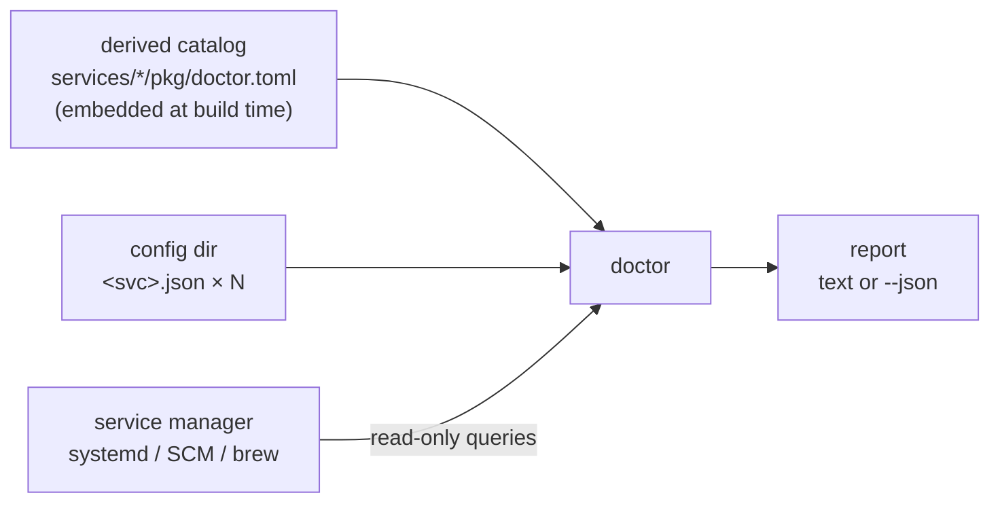

# doctor — Service Design

## Overview

`doctor` is the standalone diagnosis-and-repair tool for a multi-service
rusty-photon install: packages put bytes on disk, services self-create their
default configs, and doctor makes the result coherent. It audits **service
facts** — ports, TLS, auth, service-to-service references, unit wiring — and
never learns device usage (which camera is the guide cam belongs to `rp`).
[ADR-016](../decisions/016-service-config-ownership-and-doctor.md) is the
decision record; [`docs/plans/service-config-doctor.md`](../plans/service-config-doctor.md)
tracks the phases.

This document specifies the **D2 + D3 scope (diagnosis and repair) plus the
D6a scope (TLS + credential provisioning)**. A default run examines the
config directory and the platform's service manager, prints a report, and
writes nothing; `--fix` (D3) additionally applies the machine-applicable
fixes, runs the provisioning pass (D6a), and re-diagnoses; the `tls`/`auth`
subcommands (D6a) expose provisioning à la carte. Hardware checks (D4/D5)
and cert renewal (D6b) extend this binary later; their contracts are
recorded in the plan and folded in here as they land.

Doctor is a one-shot CLI, not a long-running service: no server, no config
file of its own, no unit. It lives at `services/doctor` (cargo binary
`doctor`) and is installed as `rusty-photon-doctor` when packaging arrives
(D7, riding in sentinel's package).

## Architecture



Three inputs, one output. A default run is read-only: config files are
parsed but never written, and every service-manager interaction is a query
(`list-unit-files`, `show`), never a verb. Only `--fix` and the `tls`/`auth`
subcommands write — config files through `rusty_photon_config::save`'s
atomic path, plus the pki tree (D6a) — and nothing ever runs a
service-manager verb.

### The derived catalog

Doctor's catalog — which services exist, their class, and their default port —
is **derived from the packaging tree, not typed into doctor**
(ADR-016 decision 11). Each packaged service carries a metadata file,
`services/<svc>/pkg/doctor.toml`:

```toml
# Catalog metadata for rusty-photon-doctor (docs/services/doctor.md).
# This service's own unit tests assert these values match its config defaults.
class = "alpaca"  # "alpaca" | "core" — which shared server shape its config uses
port = 11113      # default port when the config file or server block is absent
```

Everything else is derived from the directory name: the config file is
`<svc>.json`, the systemd unit is `rusty-photon-<svc>.service`, the Windows
service and brew formula are `rusty-photon-<svc>`.

Three guards keep the catalog honest:

1. **Each service tests its own file.** A unit test in each service crate
   (`include_str!("../pkg/doctor.toml")`) asserts the declared port equals its
   own `Config::default()` server port and the class matches the shape it
   embeds (`AlpacaServerConfig` vs `ServerConfig`). A drifted copy fails that
   service's tests, not doctor's.
2. **Doctor embeds the files at build time** and a doctor unit test asserts
   the embedded set parses, ports are unique, and the table matches the files.
3. **A CI completeness check** asserts every `services/*/pkg` directory
   contains a `doctor.toml`, so a newly packaged service cannot silently stay
   out of the catalog.

The catalog today (17 packaged services; `session-runner` has no `pkg/` and
joins the catalog when it is packaged):

| Service | Class | Default port |
|---|---|---|
| filemonitor | alpaca | 11111 |
| ppba-driver | alpaca | 11112 |
| qhy-focuser | alpaca | 11113 |
| sentinel | core | 11114 |
| rp | core | 11115 |
| sky-survey-camera | alpaca | 11116 |
| star-adventurer-gti | alpaca | 11117 |
| pa-falcon-rotator | alpaca | 11118 |
| dsd-fp2 | alpaca | 11119 |
| ui-htmx | core | 11120 |
| qhy-camera | alpaca | 11121 |
| zwo-camera | alpaca | 11122 |
| pa-scops-oag | alpaca | 11123 |
| zwo-focuser | alpaca | 11124 |
| phd2-guider | core | 11130 |
| plate-solver | core | 11131 |
| calibrator-flats | core | 11170 |

Doctor itself never appears in the catalog: it is a one-shot binary with no
unit and no port, and when D7 gives it a `pkg/` directory the packaging
scripts and the completeness check gain a carve-out for unit-less packages.

### Config-root resolution

Doctor diagnoses one config directory per run, resolved in order:

1. `--config-dir <path>` — explicit, always wins.
2. `/etc/rusty-photon`, if it exists (Unix). Packaging ships this symlink
   pointing at the service user's tree
   (`/var/lib/rusty-photon/.config/rusty-photon`), so an operator running
   doctor as root diagnoses the **service user's** configs, not their own
   empty home. A packaged tree that exists but is **unreadable by the
   invoking user is a hard error** (exit 2, "run with sudo"), never a
   fall-through: the tree is 0750-owned by `rusty-photon`, and silently
   diagnosing the operator's own empty config directory instead would report
   seventeen missing configs on a healthy rig — and scan polkit rule
   directories it cannot read. A dangling symlink (packages removed) falls
   through to step 3.
3. The platform default the services themselves use —
   `rusty_photon_config`'s resolution (`~/.config/rusty-photon` on Linux,
   `~/Library/Application Support/rusty-photon` on macOS,
   `%ProgramData%\rusty-photon` on Windows).

Step 3 is what makes doctor useful on a dev checkout with no packages
installed.

### Platform inspectors

All service-manager knowledge sits behind one trait with a per-platform
implementation:

- **systemd** (Linux) — `systemctl list-unit-files 'rusty-photon-*'` for the
  inventory and enablement, `systemctl cat <unit>` for the
  `ConditionPathExists=` gate. Polkit facts come from a heuristic scan of
  `/etc/polkit-1/rules.d` and `/usr/share/polkit-1/rules.d` (the vendor dir
  the sentinel packages ship their rule to) for the manage-units action, the
  `rusty-photon-` unit prefix, and the `"rusty-photon"` user literal.
- **SCM** (Windows) — PowerShell `Get-Service rusty-photon-*` / `sc.exe qc`
  for the inventory and start type.
- **brew services** (macOS) — `brew services list` filtered to
  `rusty-photon-*` formulas.

The inspector reports a platform-neutral inventory (unit name, enabled,
active, plus platform-specific facts where they exist); checks that depend on
a fact one platform lacks (systemd conditions, polkit) simply do not run on
the other platforms.

For hermetic tests, the `mock` feature (the same convention drivers use)
enables a `--platform-facts <file>` flag: the file deserializes into the
inspector's output type and replaces the host queries, so BDD scenarios can
stage any host state on any OS. The flag does not exist in release builds.

### Packaged host vs dev checkout

If the inspector finds **zero** `rusty-photon-*` units, the host is treated as
a dev checkout: doctor runs the config-only checks (parse, shapes, ports,
joins, TLS paths) against whatever config files exist, skips the unit-joined
checks, and says so in the report (`mode: "config-only"`). Inventory
mismatch checks (orphan configs, unit-without-config) only make sense against
a package inventory and run only in `mode: "packaged"`.

## Diagnosis — the D2 checks

Every check yields `ok`, `warn`, or `fail` plus a human-readable detail and,
where doctor can suggest one, a concrete remedy (as text — machine-applicable
fixes arrive with D3). Checks are service-scoped where applicable so the
report groups naturally.

### Inventory (packaged mode only)

| Check | Status | Trigger |
|---|---|---|
| `inventory.unit-without-config` | warn | A `rusty-photon-*` unit is installed but `<svc>.json` does not exist. The service has never started (it self-creates config on first run) — or its state directory is wrong. |
| `inventory.config-without-unit` | warn | `<svc>.json` exists for a catalog service whose unit is not installed. Leftover from a removed package, or a hand-copied file. |
| `inventory.unknown-config` | warn | A `*.json` in the config dir matches no catalog service and no known non-service file (`acme.json`; the `pki/` tree is ignored). Catches typo'd filenames that a service will silently never read. |
| `inventory.unit-and-config` | ok | Unit installed and config present — the healthy pairing, reported so an empty report is never mistaken for a clean one. |

### Config parsing

| Check | Status | Trigger |
|---|---|---|
| `config.unreadable` | fail | `<svc>.json` exists but could not be read (permissions, I/O) — a different operator problem than bad JSON, diagnosed under its own name. |
| `config.json-syntax` | fail | `<svc>.json` is not valid JSON. The service will refuse to start (by design — corrupt config never silently resets), and doctor says so before the next night does. |
| `config.server-shape` | fail | The top-level `server` block does not parse under the catalog-declared shape (`ServerConfig` for core, `AlpacaServerConfig` for Alpaca): unknown keys (`deny_unknown_fields`), missing `port` when the block is present, `discovery_port` on a core service, malformed `bind_address`. An absent `server` block is `ok` — the service applies its defaults. |
| `config.known-blocks` | fail | One of the cross-reference blocks doctor joins across fails to parse: ui-htmx's `drivers` map / `sentinel` target, sentinel's `operation_watchdog`, rp's `equipment` array / `session` block. Everything else in every file is opaque `serde_json::Value` doctor steps around. |
| `config.retired-keys` | fail | A config still carries a key its service retired with D3s and now refuses to start over (`deny_unknown_fields`): sentinel's `services` map (supervision is discovered, not configured) or a ui-htmx driver's `sentinel_service` (the restart name is always the driver's own map key). The remedy is deletion — no replacement config exists. |

Full-config typo detection (a misspelled key in, say, qhy-camera's
`device_overrides`) is **out of D2's reach by design**: doctor knows only the
shared blocks. It arrives with D5, where each service's own binary — which has
the typed shape — validates its own file and doctor aggregates.

### Ports

| Check | Status | Trigger |
|---|---|---|
| `ports.collision` | fail | Two services resolve to the same **effective** port. Effective = the configured `server.port`, else the catalog default. A service is in the collision set when its unit is installed or its config file exists. |
| `ports.discovery-collision` | fail | Two or more Alpaca configs set the same `discovery_port`. The responder is a per-host opt-in for single-driver deployments precisely because N responders collide; two enabled is always a mistake. |

### Units and privileges (systemd facts; run where the platform has them)

| Check | Status | Trigger |
|---|---|---|
| `units.config-gated` | fail | A unit is enabled but its `ConditionPathExists=` file is missing: installed, enabled, and silently inert. Today that is sky-survey-camera, plate-solver, calibrator-flats, and phd2-guider, all of which hard-require a config file. |
| `sentinel.privilege-path` | fail | Sentinel's unit is installed and no rule under `/etc/polkit-1/rules.d/` or `/usr/share/polkit-1/rules.d/` (where the sentinel packages ship theirs) grants the `rusty-photon` user `org.freedesktop.systemd1.manage-units` for `rusty-photon-*` units — the packaged unit runs unprivileged with `NoNewPrivileges=yes`, so every restart sentinel attempts will be denied at the privilege boundary. Points at the scoped rule from [#523](https://github.com/ivonnyssen/rusty-photon/issues/523). Detection is a heuristic (scan for the action id, unit prefix, and user literal in the rules files) and the detail says so. |

### Name joins

Since D3s sentinel discovers its services from the platform service manager,
so the service-name joins that survive resolve against the **installed
`rusty-photon-*` units** (packaged mode only — the joins have nothing to
resolve against on a dev checkout): the watchdog's
`operations.<family>.service` and ui-htmx's `drivers` keys, matched by
convention and validated by nothing at runtime until the 2am 404.

| Check | Status | Trigger |
|---|---|---|
| `joins.watchdog-service` | fail | An `operation_watchdog.operations.<family>.service` names a service with no installed `rusty-photon-<service>` unit — sentinel's discovery will never resolve it, so the watchdog's ladder degrades to notify-only. |
| `joins.ui-htmx-restart` | warn | ui-htmx has a `sentinel` target configured, and a `drivers` key matches no installed unit — its Restart-via-Sentinel button will 404. A warning, not a failure: a third-party device sentinel cannot restart is a legitimate override entry. |
| `joins.ui-htmx-driver-port` | fail | A ui-htmx `drivers` entry is keyed by a catalog service name and its `base_url` points at localhost, but the URL's port is not that service's effective port. The 2am 404 in a UI banner, caught at noon. Non-localhost URLs are out of scope (remote host — doctor sees one machine). |

### URL conventions

| Check | Status | Trigger |
|---|---|---|
| `urls.spurious-suffix` | warn | An rp `equipment[].alpaca_url` or ui-htmx `drivers[].base_url` ends in `/api/v1`. Those clients append it themselves; doubling it 404s. (Doctor reads `alpaca_url` out of rp's equipment entries and steps around the rest of the block — checking the URL is service wiring, owning the entry is device usage.) Sentinel's URLs are all derived since D3s, so no sentinel-side convention is left to check. |

### TLS and auth

| Check | Status | Trigger |
|---|---|---|
| `tls.paths` | fail | A `server.tls` block is present but the cert or key is not an existing **file**, after resolving the path the way the service itself will (`TlsConfig::resolved_*_path`, which expands `~`; a relative remainder anchors at the config dir; empty paths and directories are absent). Readability by the unit's user is not checked in D2 — doctor runs privileged on packaged hosts, so an ownership heuristic needs the passwd machinery D4's hardware checks bring. |
| `tls.auth-without-tls` | warn | `server.auth` is set while `server.tls` is absent: HTTP Basic credentials in cleartext on the wire. Legal, but worth a nag — ADR-003's scheme is Basic **over TLS**. Fixed by the provisioning pass turning TLS on. |
| `tls.absent` (D6a) | warn | An installed service has no `server.tls` block: it serves plain HTTP. Legal (absent still means off — ADR-016 decision 10(d)), and fixable: the provisioning pass issues a cert and writes the block. |
| `auth.absent` (D6a) | warn | An installed service has no `server.auth` block: it answers unauthenticated. Same legality and fix as `tls.absent`. |
| `auth.mismatch` (D6a) | warn | A client auth block's plaintext password does not verify (Argon2id) against the target service's `server.auth` hash — the client will get 401s. Suggestion-only: hand-set credentials are operator intent, so doctor reports the pair and suggests `doctor auth rotate` to re-align everything to the observatory credential. |

### Platform defaults

| Check | Status | Trigger |
|---|---|---|
| `rp.data-directory` | fail | rp's `session.data_directory` does not exist. Catches the Linux-path-on-macOS default documented in `docs/packaging-macos.md`. (Writability-by-service-user follows the same D4 deferral as `tls.paths`; doctor writes no probe files.) |

## Repair — `--fix` (D3)

`doctor --fix` runs the same diagnosis, applies every **machine-applicable
fix** the checks planned, then re-runs the diagnosis and reports the
post-fix state. The loop an operator runs after installing packages is:
services self-create their defaults, `doctor --fix` makes the install
coherent, done.

A fix is planned only where the correct value is derivable, not a judgment
call:

| Check | Fix `--fix` applies |
|---|---|
| `ports.collision` | Move each colliding service whose configured port differs from its catalog default back to that default — but only when the default itself is free among the effective ports. A collision between judgment-call ports (two services deliberately moved to the same custom port) gets a suggestion, not a fix. |
| `config.retired-keys` | Delete the retired key (sentinel's `services` map; a driver's `sentinel_service`). |
| `joins.ui-htmx-driver-port` | Rewrite the driver `base_url`'s port to the service's effective port. |
| `urls.spurious-suffix` | Strip the `/api/v1` suffix — **ui-htmx `drivers` entries only**. rp's `equipment[].alpaca_url` lives inside the device-usage block doctor checks but does not own (ADR-016 decision 4), so it stays suggestion-only. |

Everything else stays suggestion-only: a `ConditionPathExists` gate needs a
hand-written config, a `discovery_port` collision is operator intent (which
host keeps the responder?), and rp's `session.data_directory` is a placement
decision. Missing TLS material and absent `tls`/`auth` blocks stopped being
suggestion-only with D6a — the provisioning pass (next section) conjures
them.
`--fix` also never *generates* config — a stock rig's ui-htmx `drivers` map
stays empty (rp's roster is the source of truth; see
[ui-htmx.md](ui-htmx.md)).

Write mechanics:

- Fixes are grouped per file and applied as one read-modify-write through
  `rusty_photon_config::save` — the same atomic
  temp→fsync→rename→fsync-dir path the services' own `config.apply` uses,
  so a crash mid-fix never corrupts a config. Every field doctor does not
  touch is preserved — the mutation is on the raw JSON value, not a typed
  round-trip — though `save` normalizes formatting to the same
  pretty-printed shape `config.apply` writes.
- Doctor reads files directly and holds no override layers, so a fix can
  never bake a transient value into a file (the plan's layer-aware persist
  rule is satisfied by construction).
- **Services may be running while `--fix` writes** — that is the canonical
  install flow, so doctor warns rather than refuses: atomic renames make
  corruption impossible, and the residual race (a driver's own
  `config.apply` landing between doctor's read and write loses one of the
  two writes) is called out on stderr in packaged mode with the advice to
  re-run doctor afterwards. Services read config at startup, so applied
  fixes take effect on each service's next restart.
- `--fix` is **idempotent**: the post-fix diagnosis plans no further fixes,
  and a second `--fix` run applies nothing.

## Provisioning — TLS and the observatory credential (D6a)

Doctor owns the TLS and credential lifecycle (ADR-016 decision 10; the
settled sub-decisions are in the plan's D6 section). The provisioning code —
self-signed issuance, ACME, DNS-01 — lives inside doctor as modules; the
serving half every service links is the `rusty-photon-tls` crate (renamed
from `rp-tls`), which carries none of the `cloudflare`/`instant-acme`
dependency tree. `rp init-tls` and `rp hash-password` are removed; their
functionality lives here.

### The pki tree

All TLS material and the credential live under **`<config-root>/pki`** —
the same resolved config root as the service configs (`--config-dir` >
`/etc/rusty-photon` symlink > platform default), so a scratch `--config-dir`
scopes provisioning the same way it scopes diagnosis, and on a packaged
Linux host the tree is `/var/lib/rusty-photon/.config/rusty-photon/pki`.
One tree, one symlink, one thing to back up. (`~/.rusty-photon/pki` is
retired; pre-1.0, no migration shim — a config still pointing at old
material keeps working, since `tls.paths` checks the configured paths,
wherever they point.)

```
<config-root>/
  pki/
    ca.pem            # self-signed CA, 10-year validity, create-if-absent
    ca-key.pem        # 0600
    <svc>.pem         # per-service cert, 10-year, SANs: hostname + localhost + extras
    <svc>-key.pem     # 0600
    credential        # observatory credential plaintext, 0600 — the canonical copy
  acme.json           # ACME account/config state (0600), alongside the configs
```

Key files and `credential` are `0600` and owned by the service user on
packaged hosts (doctor runs privileged there and chowns what it writes).
The CA is **never regenerated** while `ca.pem` exists — replacing it
invalidates every distributed trust anchor, so that is an explicit operator
act (delete the file, re-run).

### The observatory credential

One credential for the whole observatory (ADR-016 decision 10(e)):
username **`observatory`**, password minted with ≥128 bits of entropy. The
canonical plaintext copy is `pki/credential`; because doctor mints it, it
can write **both forms everywhere they belong**:

- the **Argon2id hash** into each installed service's `server.auth`;
- the **plaintext** into each client auth block — rp's `equipment[].auth`
  entries, sentinel's service-probe `auth`, ui-htmx's `rp`/`dashboard`/
  `drivers[].auth` targets — alongside the CA path each client trusts.

`doctor auth rotate` overwrites `pki/credential` with a fresh mint and
re-runs the same distribution; services pick the new `server.auth` up at
their next restart (rotation is operator-initiated and rare — no reload
machinery). A forgotten credential is recovered by reading
`pki/credential`, or by rotating.

### What `--fix` adds

After the config fixes, `--fix` runs the provisioning pass over every
installed service:

1. **Certs** — create the CA if absent; issue a cert for each installed
   service whose `<svc>.pem`/`<svc>-key.pem` pair is missing. Existing
   material is never touched.
2. **Credential** — reuse `pki/credential` if present, else mint and write
   it. A service installed after the first `--fix` run is wired with the
   *same* credential on the next run.
3. **Config writes** — where a service's `server.tls` is absent, write the
   block pointing at the issued pair; where `server.auth` is absent, write
   `observatory` + the hash. Client blocks that are absent get the
   plaintext + CA path. **Present blocks are never overwritten** — a
   hand-set credential or hand-placed cert path is operator intent;
   incoherence surfaces as `auth.mismatch`/`tls.paths`, suggestion-only.

The same "absent means off" contract from decision 10(d) is what makes this
safe: packages start services before any doctor run, and BDD/ConformU
configs that omit `tls`/`auth` keep meaning plain HTTP. After one `--fix`,
every wired service is TLS-on and auth-on, and services pick both up at
their next restart (the existing `--fix` restart advice covers it).

### Subcommands

- **`doctor tls issue`** — the cert step alone (CA-if-absent + missing
  service certs), without touching configs. `--services <name>...`
  restricts to named services; `--extra-san <host-or-ip>...` adds SANs;
  `--force` re-issues service certs from the existing CA (never the CA
  itself). The service set defaults to the installed set, derived from the
  catalog — `rp_tls::cert::DEFAULT_SERVICES` (five hand-typed names of
  eighteen) is retired.
- **`doctor tls issue --acme --domain <d> --dns-provider <p> --dns-token <t>
  --email <e> [--staging]`** — the ACME path, unchanged in mechanism from
  `rp init-tls --acme` (DNS-01, wildcard cert, account state persisted to
  `acme.json`). Publicly-trusted certs need no CA distribution to clients.
- **`doctor auth rotate`** — mint + distribute, as above.
- **`doctor auth hash-password [--stdin]`** — hash one password for
  hand-written configs (the third-party-driver escape hatch); prompt with
  confirmation, or read stdin.
- **`doctor tls renew`** arrives with D6b (one-shot renewal for a platform
  scheduler, plus the in-process cert hot-reload in `rusty-photon-tls`).

Subcommands report through the same report schema (`--json` works on all
of them); provisioning actions appear in `fixes_applied` as non-pointer
operations (`generate-ca`, `generate-cert`, `mint-credential`) next to the
config-pointer ops, which the permissive parse lets older consumers skip.

## Report

One schema, shared by the text renderer and `--json`, and — from D5 on — by
the per-service `doctor` subcommands central doctor aggregates. It therefore
versions and parses **permissively** (`#[serde(default)]`, unknown fields
tolerated) — the inverse of the config convention, so a doctor and a service
from different nightlies degrade to a partial report instead of refusing to
run (ADR-016 decision 7).

```json
{
  "schema_version": 1,
  "doctor_version": "0.1.0",
  "mode": "packaged",
  "config_dir": "/var/lib/rusty-photon/.config/rusty-photon",
  "checks": [
    {
      "name": "ports.collision",
      "service": "qhy-focuser",
      "status": "fail",
      "detail": "qhy-focuser and dsd-fp2 both resolve to port 11113 (qhy-focuser: configured; dsd-fp2: configured)",
      "suggestion": "set a distinct server.port in dsd-fp2.json (default 11119)",
      "fixes": [
        { "op": "set-number", "service": "dsd-fp2", "pointer": "/server/port", "value": 11119 }
      ]
    }
  ]
}
```

- `fixes` (per check, empty and omitted when none) carries the
  machine-applicable fix plan as primitive JSON-pointer operations —
  `set-number`, `set-string`, `set-object` (D6a, for whole
  `server.tls`/`server.auth`/client blocks), `remove-key` — against one
  service's config file. Primitive ops keep the schema forward-parseable:
  an aggregating doctor that does not recognize a newer op simply cannot
  apply it, and says so, instead of misparsing the check.
- `fixes_applied` (top level, populated by `--fix` runs) records what was
  actually written, one entry per applied fix: the originating check name
  and the operation (which carries the service). Like `fixes`, it is
  omitted when empty — a consumer must treat the missing field as an empty
  list, which the permissive parse does by construction. On a `--fix` run
  the `checks` array is the **post-fix** diagnosis — the exit code and the
  report describe the state the operator is left with.

`ok` checks are included (an empty report is indistinguishable from a doctor
that skipped everything); the text renderer summarizes them, prints
`warn`/`fail` in full, and lists applied fixes.

## CLI contract

```
doctor [--config-dir <path>] [--json] [--fix]
doctor tls issue [--acme --domain <d> --dns-provider <p> --dns-token <t> --email <e> [--staging]]
                 [--services <name>...] [--extra-san <host-or-ip>...] [--force]
doctor auth rotate
doctor auth hash-password [--stdin]
```

- Default run (no subcommand) diagnoses and prints the human-readable
  report to stdout; it writes nothing.
- `--fix` applies the machine-applicable fixes (see §Repair) and the
  provisioning pass (see §Provisioning), re-diagnoses, and reports the
  post-fix state.
- `--json` prints the report JSON instead, on every subcommand.
- `--config-dir` scopes subcommands too — the pki tree anchors at the
  resolved config root.
- `--platform-facts <file>` exists only under the `mock` feature (tests).
- Logging goes to stderr via `tracing` (`debug!` throughout; the report is
  the product, not the log).

Exit codes:

| Code | Meaning |
|---|---|
| 0 | Diagnosis ran; no `fail`-status checks (warnings allowed). After `--fix`: the post-fix state is clean. |
| 1 | Diagnosis ran; at least one check failed (after fixes, on a `--fix` run). |
| 2 | Doctor itself could not run (unresolvable config dir, inspector error, or a fix write failed). |

Scripts and CI can gate on "the rig is coherent" without parsing JSON.

## Configuration

Doctor has **no config file**. Its inputs are the flags above. This is
deliberate: a config-repair tool with its own config file would need a
doctor. (`acme.json` is provisioning *state* doctor writes and reads back —
account URL, domain, DNS provider — not configuration of doctor's own
behavior; every knob in it was a CLI flag first.)

## Verification

- **Unit** — catalog parsing/uniqueness and the per-service `doctor.toml`
  parity tests; per-check tests against tempdir fixtures; report schema
  round-trip including a forward-compatibility case (unknown fields, unknown
  status value from a newer service).
- **BDD** (`services/doctor/tests`, built with the `mock` feature) — seed a
  scratch config dir and a platform-facts file with known-broken states (port
  collision, dangling watchdog service, retired D3s keys, unparseable JSON,
  missing `ConditionPathExists` target, absent polkit rule), run the real
  binary, assert the diagnosis, the exit code, and the `--json` schema. For
  `--fix`: assert the rewritten file contents (untouched fields preserved),
  post-fix convergence, idempotence of a second run, that a default run
  writes nothing, and that unfixable checks stay reported without a write.
- **On-host** (D2 gate, per the plan's all-platforms requirement) — the real
  inspectors validated against a packaged Linux host, the Windows VM (SCM),
  and macOS (brew services).
- **D6a** — unit: cert/ACME module tests move with the code; credential
  mint → Argon2id hash → verify round-trip; pki paths anchor at the
  resolved config root. BDD: against a scratch `--config-dir`, `--fix`
  creates the CA/certs/credential and writes `tls`/`auth` + client blocks
  (hash server-side, plaintext client-side); a second run applies nothing
  and reuses the credential for a newly-appearing service; hand-set blocks
  survive untouched; `auth.mismatch` fires on an incoherent pair;
  `doctor tls issue --force` re-issues service certs but never the CA;
  `doctor auth rotate` re-aligns a mismatched pair. rp's
  `tls_setup.feature`/`acme_setup.feature` and `bdd-infra`'s one-shot
  command tests move here with the commands. On-host: a packaged install
  goes TLS-on/auth-on with one `--fix` and every service answers
  authenticated HTTPS after restart.

## MVP scope

**In D2 + D3:** derived catalog, config-root resolution, platform
inspectors, the check list, the report schema, text + `--json` rendering,
exit codes, and `--fix`. No network I/O; writes happen only under `--fix`,
only to config files.

**In D6a (this document's §Provisioning):** the TLS + credential lifecycle —
self-signed issuance and ACME moved from `rp` (which loses `init-tls` and
`hash-password`), the pki tree under the config root, the minted observatory
credential and its distribution, `tls`/`auth`-on written by `--fix`, and the
`tls`/`auth` subcommands. Writes now also cover the pki tree; ACME is the
one place doctor does network I/O, and only when asked.

**Deferred, tracked in the plan:**
- `rusty-photon-doctor-checks` crate + hardware checks that need no SDK
  (device nodes, udev, plugdev, VID:PID, firmware helper) — D4.
- Per-service `doctor` subcommands (full-config validation, SDK-side
  hardware checks) + aggregation over the report schema — D5.
- Cert renewal: `doctor tls renew` + platform timers, in-process cert
  hot-reload in `rusty-photon-tls`
  ([#541](https://github.com/ivonnyssen/rusty-photon/issues/541)) — D6b.
- Packaging (doctor ships in sentinel's package) and install-flow docs — D7.
