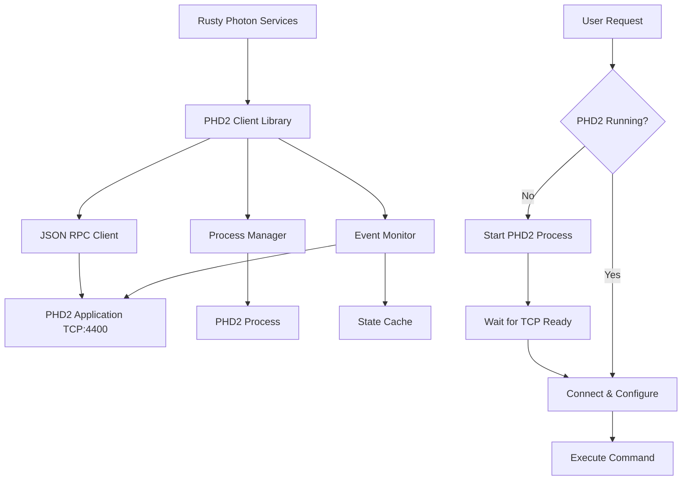

# PHD2 Guider Service Design

## Overview

The PHD2 guider service provides a Rust client library and service for interacting with Open PHD Guiding 2 (PHD2). It enables programmatic control of PHD2 including starting/stopping the application, managing equipment profiles, and controlling guiding operations.

**Cross-Platform Support:** The service runs natively on Linux, macOS, and Windows, matching PHD2's platform support.

## Architecture Overview



## Module Structure

The library is organized into focused modules for maintainability:

```
services/phd2-guider/src/
├── lib.rs          # Crate root with re-exports
├── client.rs       # Phd2Client with all RPC methods
├── config.rs       # Config, Phd2Config, SettleParams, load_config
├── connection.rs   # Internal connection management and auto-reconnect
├── error.rs        # Phd2Error enum and Result type alias
├── events.rs       # AppState, GuideStepStats, Phd2Event
├── fits.rs         # FITS file utilities for saving images
├── process.rs      # Phd2ProcessManager, get_default_phd2_path
├── rpc.rs          # RpcRequest, RpcResponse, RpcErrorObject
└── types.rs        # Rect, Profile, Equipment (shared types)
```

| Module | Description | Key Types |
|--------|-------------|-----------|
| `client` | PHD2 client with RPC methods | `Phd2Client` |
| `config` | Configuration | `Config`, `Phd2Config`, `SettleParams`, `ReconnectConfig` |
| `connection` | Connection management (internal) | `SharedConnectionState`, `ConnectionConfig` |
| `error` | Error handling | `Phd2Error`, `Result<T>` |
| `events` | PHD2 events and state | `Phd2Event`, `AppState`, `GuideStepStats` |
| `fits` | FITS file utilities | `decode_base64_u16`, `write_grayscale_u16_fits` |
| `process` | Process management | `Phd2ProcessManager`, `get_default_phd2_path` |
| `rpc` | JSON RPC 2.0 protocol | `RpcRequest`, `RpcResponse`, `RpcErrorObject` |
| `types` | Common types | `Rect`, `Profile`, `Equipment`, `EquipmentDevice`, `CalibrationData`, `CalibrationTarget`, `GuideAxis`, `CoolerStatus`, `StarImage` |

All commonly used types are re-exported at the crate root for convenience. The `connection` module is internal (`pub(crate)`) and handles TCP connection establishment, message reading, and auto-reconnection logic.

## PHD2 API Overview

PHD2 provides two network interfaces:

### 1. Socket Server Interface (Port 4300)
- Legacy single-byte command protocol
- Commands: pause, resume, dither, start guiding, stop, etc.
- **Not recommended for new implementations**

### 2. Event Monitoring / JSON RPC Interface (Port 4400) ⭐ **Recommended**
- Modern JSON RPC 2.0 protocol
- Full bidirectional communication
- Event notifications and method invocation
- Multiple simultaneous client connections supported

## Complete PHD2 JSON RPC API Reference

### Guiding Control

| Method | Parameters | Description | Status |
|--------|------------|-------------|--------|
| `guide` | `settle: {pixels, time, timeout}`, `recalibrate: bool`, `roi: [x,y,w,h]` | Start guiding with settling parameters; optional recalibration and region of interest | ✅ |
| `dither` | `amount: float`, `raOnly: bool`, `settle: object` | Shift lock position by specified pixels for dithering between exposures | ✅ |
| `loop` | none | Start capturing exposures, or if guiding, stop guiding but continue capturing | ✅ |
| `stop_capture` | none | Stop all capture and guiding operations | ✅ |

### Pause Control

| Method | Parameters | Description | Status |
|--------|------------|-------------|--------|
| `get_paused` | none | Check if guiding is currently paused | ✅ |
| `set_paused` | `paused: bool`, `full: string` | Pause or resume guiding; "full" pauses looping entirely | ✅ |

### Equipment Connection

| Method | Parameters | Description | Status |
|--------|------------|-------------|--------|
| `set_connected` | `connected: bool` | Connect or disconnect all equipment in current profile | ✅ |
| `get_connected` | none | Check if equipment is connected | ✅ |
| `get_current_equipment` | none | Retrieve list of selected devices in active profile | ✅ |

### Profile Management

| Method | Parameters | Description | Status |
|--------|------------|-------------|--------|
| `get_profile` | none | Return current profile ID and name | ✅ |
| `get_profiles` | none | List all available equipment profiles | ✅ |
| `set_profile` | `id: int` | Switch active profile; equipment must be disconnected first | ✅ |

### Calibration

| Method | Parameters | Description | Status |
|--------|------------|-------------|--------|
| `get_calibrated` | none | Check if mount is calibrated | ✅ |
| `get_calibration_data` | `which: string` | Obtain calibration parameters and angles ("Mount" or "AO") | ✅ |
| `clear_calibration` | `which: string` | Reset calibration data for "mount", "ao", or "both" | ✅ |
| `flip_calibration` | none | Invert existing calibration for meridian flip without recalibrating | ✅ |

### Camera Operations

| Method | Parameters | Description | Status |
|--------|------------|-------------|--------|
| `capture_single_frame` | `exposure: int`, `subframe: [x,y,w,h]` | Acquire one frame with optional exposure (ms) and subframe | ✅ |
| `set_exposure` | `exposure: int` | Set exposure duration in milliseconds | ✅ |
| `get_exposure` | none | Get current exposure time in milliseconds | ✅ |
| `get_exposure_durations` | none | List all valid exposure duration options | ✅ |
| `get_camera_frame_size` | none | Return camera image dimensions (width, height) | ✅ |
| `get_use_subframes` | none | Check if subframing is enabled | ✅ |

### Camera Cooling

| Method | Parameters | Description | Status |
|--------|------------|-------------|--------|
| `get_ccd_temperature` | none | Read current sensor temperature | ✅ |
| `get_cooler_status` | none | Get cooler temperature and power percentage | ✅ |
| `set_cooler_state` | `enabled: bool`, `temperature: float` | Enable/disable cooling and set target temperature | ✅ |

### Guide Star & Lock Position

| Method | Parameters | Description | Status |
|--------|------------|-------------|--------|
| `find_star` | `roi: [x,y,w,h]` | Auto-select a guide star, optionally within specified region | ✅ |
| `get_lock_position` | none | Get current lock position coordinates (x, y) | ✅ |
| `set_lock_position` | `x: float`, `y: float`, `exact: bool` | Set lock position; exact=false allows PHD2 to find nearby star | ✅ |
| `get_lock_shift_enabled` | none | Check if lock position shift is enabled | ❌ |
| `set_lock_shift_enabled` | `enabled: bool` | Enable or disable lock position shifting | ❌ |
| `get_lock_shift_params` | none | Get shift rate and axis configuration | ❌ |
| `set_lock_shift_params` | `rate: [ra,dec]`, `units: string`, `axes: string` | Configure shift parameters | ❌ |

### Guide Algorithm Parameters

| Method | Parameters | Description | Status |
|--------|------------|-------------|--------|
| `get_algo_param_names` | `axis: string` | List algorithm parameter names for "ra" or "dec" axis | ✅ |
| `get_algo_param` | `axis: string`, `name: string` | Read individual algorithm parameter value | ✅ |
| `set_algo_param` | `axis: string`, `name: string`, `value: float` | Modify individual algorithm parameter value | ✅ |

### Guide Output Control

| Method | Parameters | Description | Status |
|--------|------------|-------------|--------|
| `get_guide_output_enabled` | none | Check if guide corrections are being sent to mount | ❌ |
| `set_guide_output_enabled` | `enabled: bool` | Enable or disable sending guide corrections | ❌ |
| `guide_pulse` | `amount: int`, `direction: string`, `which: string` | Send manual pulse; direction: N/S/E/W, which: "mount" or "ao" | ❌ |
| `get_dec_guide_mode` | none | Get declination guide mode (Off/Auto/North/South) | ❌ |
| `set_dec_guide_mode` | `mode: string` | Set declination guide mode | ❌ |

### State & Status

| Method | Parameters | Description | Status |
|--------|------------|-------------|--------|
| `get_app_state` | none | Get current app state: Stopped, Selected, Calibrating, Guiding, LostLock, Paused, Looping | ✅ |
| `get_pixel_scale` | none | Get image scale in arc-seconds per pixel | ❌ |
| `get_search_region` | none | Get star search radius in pixels | ❌ |

### Image Operations

| Method | Parameters | Description | Status |
|--------|------------|-------------|--------|
| `get_star_image` | `size: int` | Get current guide star image data as base64-encoded FITS | ✅ |
| `save_image` | none | Save current frame to FITS file in PHD2's default location | ✅ |

### Timing Configuration

| Method | Parameters | Description | Status |
|--------|------------|-------------|--------|
| `get_variable_delay_settings` | none | Get delay configuration between exposures | ❌ |
| `set_variable_delay_settings` | `enabled: bool`, `shortDelay: int`, `longDelay: int` | Configure exposure delays | ❌ |

### Application Control

| Method | Parameters | Description | Status |
|--------|------------|-------------|--------|
| `shutdown` | none | Close PHD2 application | ✅ |

## PHD2 Event Notifications

PHD2 sends asynchronous event notifications over the same TCP connection:

| Event | Description |
|-------|-------------|
| `Version` | Sent on connect; contains PHD2 version and protocol version |
| `AppState` | Application state changed (Stopped, Guiding, etc.) |
| `GuideStep` | Sent after each guide correction with detailed statistics |
| `GuidingDithered` | Dither operation completed |
| `SettleDone` | Settling after guide/dither completed |
| `StarSelected` | Guide star was selected |
| `StarLost` | Guide star was lost |
| `LockPositionSet` | Lock position was established |
| `LockPositionShiftLimitReached` | Lock shift hit its limit |
| `Calibrating` | Calibration in progress |
| `CalibrationComplete` | Calibration finished |
| `CalibrationFailed` | Calibration failed |
| `CalibrationDataFlipped` | Calibration was flipped |
| `LoopingExposures` | Looping exposures started |
| `LoopingExposuresStopped` | Looping stopped |
| `Paused` | Guiding was paused |
| `Resumed` | Guiding was resumed |
| `GuideParamChange` | Guide algorithm parameter changed |
| `ConfigurationChange` | Configuration was modified |
| `Alert` | Alert message for user |

## Service API Design

The service exposes a high-level Rust API:

### Connection Management

```rust
/// Connect to a running PHD2 instance (uses host/port from config)
async fn connect(&self) -> Result<()>;

/// Disconnect from PHD2
async fn disconnect(&self) -> Result<()>;

/// Check if connected to PHD2
async fn is_connected(&self) -> bool;

/// Get the PHD2 version (available after connection)
async fn get_phd2_version(&self) -> Option<String>;
```

### Process Management

```rust
/// Start PHD2 application (uses executable_path from config or default)
async fn start_phd2(&self) -> Result<()>;

/// Stop PHD2 application gracefully
/// If client is provided, attempts graceful RPC shutdown first
async fn stop_phd2(&self, client: Option<&Phd2Client>) -> Result<()>;

/// Check if PHD2 process is running (by attempting TCP connect)
async fn is_phd2_running(&self) -> bool;

/// Check if we are managing a PHD2 process
async fn has_managed_process(&self) -> bool;
```

### Profile Management

```rust
/// Get list of available equipment profiles
async fn get_profiles(&self) -> Result<Vec<Profile>>;

/// Get current active profile
async fn get_current_profile(&self) -> Result<Profile>;

/// Set active profile (equipment must be disconnected)
async fn set_profile(&self, profile_id: i32) -> Result<()>;
```

### Equipment Control

```rust
/// Connect all equipment in current profile
async fn connect_equipment(&self) -> Result<()>;

/// Disconnect all equipment
async fn disconnect_equipment(&self) -> Result<()>;

/// Check if equipment is connected
async fn is_equipment_connected(&self) -> Result<bool>;

/// Get current equipment configuration
async fn get_current_equipment(&self) -> Result<Equipment>;
```

### Guiding Control

```rust
/// Start guiding with settling parameters
/// roi: Optional region of interest for star selection
async fn start_guiding(&self, settle: &SettleParams, recalibrate: bool, roi: Option<Rect>) -> Result<()>;

/// Stop guiding (continues looping)
async fn stop_guiding(&self) -> Result<()>;

/// Stop all capture and guiding
async fn stop_capture(&self) -> Result<()>;

/// Start looping exposures without guiding
async fn start_loop(&self) -> Result<()>;

/// Pause guiding
/// full: If true, pause looping entirely. If false, continue looping but don't send corrections.
async fn pause(&self, full: bool) -> Result<()>;

/// Resume guiding
async fn resume(&self) -> Result<()>;

/// Check if guiding is paused
async fn is_paused(&self) -> Result<bool>;

/// Get current application state
async fn get_app_state(&self) -> Result<AppState>;

/// Get cached application state (from events, no RPC call)
async fn get_cached_app_state(&self) -> Option<AppState>;

/// Dither the guide position
async fn dither(&self, amount: f64, ra_only: bool, settle: &SettleParams) -> Result<()>;
```

### Star Selection

```rust
/// Auto-select a guide star
async fn find_star(&self, roi: Option<Rect>) -> Result<()>;

/// Get current lock position
async fn get_lock_position(&self) -> Result<(f64, f64)>;

/// Set lock position
/// exact: If true, use exact position. If false, PHD2 will search for a nearby star.
async fn set_lock_position(&self, x: f64, y: f64, exact: bool) -> Result<()>;
```

### Calibration

```rust
/// Check if calibrated
async fn is_calibrated(&self) -> Result<bool>;

/// Get calibration data
/// which: Mount or AO (Both is not valid for get, defaults to Mount)
async fn get_calibration_data(&self, which: CalibrationTarget) -> Result<CalibrationData>;

/// Clear calibration
/// which: Mount, AO, or Both
async fn clear_calibration(&self, which: CalibrationTarget) -> Result<()>;

/// Flip calibration for meridian flip
async fn flip_calibration(&self) -> Result<()>;
```

### Camera Exposure

```rust
/// Get the current exposure duration in milliseconds
async fn get_exposure(&self) -> Result<u32>;

/// Set the exposure duration in milliseconds
async fn set_exposure(&self, exposure_ms: u32) -> Result<()>;

/// Get the list of valid exposure durations in milliseconds
async fn get_exposure_durations(&self) -> Result<Vec<u32>>;

/// Get the camera frame size (width, height) in pixels
async fn get_camera_frame_size(&self) -> Result<(u32, u32)>;

/// Check if subframe mode is enabled
async fn get_use_subframes(&self) -> Result<bool>;

/// Capture a single frame
async fn capture_single_frame(&self, exposure_ms: Option<u32>, subframe: Option<Rect>) -> Result<()>;
```

### Camera Cooling

```rust
/// Get the current CCD sensor temperature in degrees Celsius
async fn get_ccd_temperature(&self) -> Result<f64>;

/// Get the cooler status including temperature and power
async fn get_cooler_status(&self) -> Result<CoolerStatus>;

/// Set the cooler state
/// temperature: Required when enabling the cooler
async fn set_cooler_state(&self, enabled: bool, temperature: Option<f64>) -> Result<()>;
```

### Guide Algorithm Parameters

```rust
/// Get the list of algorithm parameter names for the specified axis
async fn get_algo_param_names(&self, axis: GuideAxis) -> Result<Vec<String>>;

/// Get the value of a guide algorithm parameter
async fn get_algo_param(&self, axis: GuideAxis, name: &str) -> Result<f64>;

/// Set the value of a guide algorithm parameter
async fn set_algo_param(&self, axis: GuideAxis, name: &str, value: f64) -> Result<()>;
```

### Image Operations

```rust
/// Get the current guide star image
/// size: Size of the image in pixels (width and height will be 2*size+1)
async fn get_star_image(&self, size: u32) -> Result<StarImage>;

/// Save the current camera frame to a file
/// Returns the path to the saved file
async fn save_image(&self) -> Result<String>;
```

### FITS Utilities

```rust
/// Decode base64-encoded image data to u16 pixel values
fn decode_base64_u16(base64_data: &str) -> Result<Vec<u16>>;

/// Write a 16-bit grayscale image to a FITS file
async fn write_grayscale_u16_fits(
    path: impl AsRef<Path>,
    pixels: &[u16],
    width: u32,
    height: u32,
    headers: Option<&[(&str, &str)]>,
) -> Result<()>;
```

**Example usage:**
```rust
use phd2_guider::{Phd2Client, decode_base64_u16, write_grayscale_u16_fits};

let image = client.get_star_image(15).await?;
let pixels = decode_base64_u16(&image.pixels)?;
write_grayscale_u16_fits(
    "guide_star.fits",
    &pixels,
    image.width,
    image.height,
    Some(&[("FRAME", &image.frame.to_string()), ("ORIGIN", "PHD2")]),
).await?;
```

### Application Control

```rust
/// Shutdown PHD2 application
async fn shutdown_phd2(&self) -> Result<()>;
```

### Event Subscription

```rust
/// Subscribe to PHD2 events
fn subscribe(&self) -> broadcast::Receiver<Phd2Event>;
```

### Auto-Reconnect Control

```rust
/// Check if auto-reconnect is enabled
fn is_auto_reconnect_enabled(&self) -> bool;

/// Enable or disable auto-reconnect
fn set_auto_reconnect_enabled(&self, enabled: bool);

/// Check if currently reconnecting
async fn is_reconnecting(&self) -> bool;

/// Stop ongoing reconnection attempts
async fn stop_reconnection(&self);
```

## Configuration

```json
{
  "phd2": {
    "host": "localhost",
    "port": 4400,
    "executable_path": null,
    "connection_timeout_seconds": 10,
    "command_timeout_seconds": 30,
    "auto_start": false,
    "auto_connect_equipment": false,
    "reconnect": {
      "enabled": true,
      "interval_seconds": 5,
      "max_retries": null
    }
  },
  "settling": {
    "pixels": 0.5,
    "time": 10,
    "timeout": 60
  }
}
```

Configuration sections:

- **phd2**: PHD2 connection and process settings
  - `host`: PHD2 host address (default: localhost)
  - `port`: JSON RPC port (default: 4400)
  - `executable_path`: Path to PHD2 executable (null for system default)
  - `connection_timeout_seconds`: TCP connection timeout
  - `command_timeout_seconds`: RPC command timeout
  - `auto_start`: Automatically start PHD2 if not running
  - `auto_connect_equipment`: Automatically connect equipment after PHD2 starts
  - `reconnect`: Auto-reconnect settings
    - `enabled`: Enable automatic reconnection (default: true)
    - `interval_seconds`: Delay between reconnection attempts (default: 5)
    - `max_retries`: Maximum reconnection attempts, null for unlimited (default: null)
- **settling**: Default settling parameters for guiding operations

## PHD2 Process Management

### Starting PHD2

**Platform-specific executable locations:**
- **Linux**: `phd2` (in PATH) or `/usr/bin/phd2`
- **macOS**: `/Applications/PHD2.app/Contents/MacOS/PHD2`
- **Windows**: `C:\Program Files (x86)\PHDGuiding2\phd2.exe`

**Startup sequence:**
1. Check if PHD2 is already running (attempt TCP connect)
2. If not running, spawn PHD2 process
3. Wait for TCP port 4400 to become available (with timeout)
4. Connect and receive initial Version event
5. Optionally set profile and connect equipment

### Stopping PHD2

**Clean shutdown sequence:**
1. Stop any active guiding (`stop_capture`)
2. Disconnect equipment (`set_connected(false)`)
3. Send `shutdown` RPC command
4. Wait for process to exit (with timeout)
5. Force kill if graceful shutdown fails

## Auto-Reconnect

The client automatically attempts to reconnect when the connection to PHD2 is lost (e.g., PHD2 crashes or is restarted). This behavior is enabled by default but can be configured or controlled at runtime.

### Connection Events

The following events are broadcast when connection state changes:

| Event | Description |
|-------|-------------|
| `ConnectionLost` | Connection was lost (includes reason) |
| `Reconnecting` | Attempting to reconnect (includes attempt number) |
| `Reconnected` | Successfully reconnected |
| `ReconnectFailed` | Reconnection failed (max retries or cancelled) |

### Reconnection Behavior

1. When the TCP connection is lost, `ConnectionLost` event is broadcast
2. If auto-reconnect is enabled, reconnection attempts begin immediately
3. Each attempt broadcasts a `Reconnecting` event
4. Between attempts, waits for the configured interval
5. On success, `Reconnected` event is broadcast and normal operation resumes
6. On failure (max retries or disabled), `ReconnectFailed` event is broadcast

### Runtime Control

Auto-reconnect can be controlled at runtime:
- `set_auto_reconnect_enabled(false)` - Disables auto-reconnect; stops any ongoing reconnection
- `stop_reconnection()` - Stops current reconnection attempt without disabling future reconnects
- `disconnect()` - Cleanly disconnects and stops any reconnection attempts

## Implementation Phases

### Phase 1: Core Connection and JSON RPC Client (MVP) ✅
- [x] Implement TCP connection to PHD2 port 4400
- [x] Implement JSON RPC 2.0 request/response handling
- [x] Parse PHD2 event stream (Version, AppState)
- [x] Implement connection management (`connect`, `disconnect`)
- [x] Implement `get_app_state` method
- [x] Basic error handling for connection failures
- [x] Unit tests for JSON RPC message parsing

### Phase 2: Guiding Control ✅
- [x] Implement `guide` (start guiding)
- [x] Implement `stop_capture`
- [x] Implement `loop`
- [x] Implement `set_paused` / `get_paused`
- [x] Implement settling parameter handling
- [x] Handle GuideStep and SettleDone events
- [x] Unit tests for guiding state machine
- [x] Implement `dither`

### Phase 3: Equipment and Profile Management ✅
- [x] Implement `get_profiles` / `set_profile`
- [x] Implement `set_connected` / `get_connected`
- [x] Implement `get_current_equipment`
- [x] Unit tests for profile switching

### Phase 4: Process Management ✅
- [x] Implement PHD2 process spawning (cross-platform)
- [x] Implement process health monitoring
- [x] Implement graceful shutdown with `shutdown` RPC
- [x] Implement auto-reconnect on PHD2 restart
- [x] Integration tests with PHD2 process

### Phase 5: Star Selection and Calibration ✅
- [x] Implement `find_star`
- [x] Implement lock position get/set
- [x] Implement calibration status and data retrieval
- [x] Implement `clear_calibration` / `flip_calibration`

### Phase 6: Advanced Features ✅
- [x] Implement dithering support
- [x] Event subscription and broadcasting
- [x] Implement guide algorithm parameter get/set
- [x] Implement camera exposure control
- [x] Implement camera cooling control
- [x] Handle calibration events

### Phase 7: Testing and Validation (Partial)
- [x] Comprehensive unit tests
- [ ] Integration tests with PHD2 simulator
- [x] Integration tests with real PHD2 instance
- [ ] Cross-platform testing (Linux, Windows, macOS)
- [ ] Documentation and examples

## Dependencies

```toml
[dependencies]
tokio = { version = "1", features = ["full", "process"] }
serde = { version = "1", features = ["derive"] }
serde_json = "1"
tracing = "0.1"
thiserror = "2"
base64 = "0.22"
fitsio = "0.21"
```

## Testing Strategy

### Unit Tests
- JSON RPC 2.0 message serialization/deserialization
- Event parsing for all event types
- State machine transitions
- Error handling

### Integration Tests
- Connect to PHD2 and verify version event
- Start/stop guiding cycle
- Profile switching
- Equipment connect/disconnect
- Process start/stop

### Manual Testing
- Test with real guiding session
- Verify dithering works with imaging software
- Test auto-reconnect after PHD2 crash

## Error Handling

The service uses typed errors:

```rust
#[derive(Debug, thiserror::Error)]
pub enum Phd2Error {
    #[error("Not connected to PHD2")]
    NotConnected,

    #[error("Connection failed: {0}")]
    ConnectionFailed(String),

    #[error("PHD2 not running")]
    Phd2NotRunning,

    #[error("Equipment not connected")]
    EquipmentNotConnected,

    #[error("Not calibrated")]
    NotCalibrated,

    #[error("Invalid state for operation: {0}")]
    InvalidState(String),

    #[error("RPC error: {code} - {message}")]
    RpcError { code: i32, message: String },

    #[error("Timeout: {0}")]
    Timeout(String),

    #[error("IO error: {0}")]
    Io(#[from] std::io::Error),

    #[error("JSON error: {0}")]
    Json(#[from] serde_json::Error),

    #[error("Failed to send message: {0}")]
    SendError(String),

    #[error("Failed to receive response")]
    ReceiveError,

    #[error("Failed to start PHD2 process: {0}")]
    ProcessStartFailed(String),

    #[error("PHD2 executable not found: {0}")]
    ExecutableNotFound(String),

    #[error("Process already running")]
    ProcessAlreadyRunning,

    #[error("Reconnection failed: {0}")]
    ReconnectFailed(String),
}
```

## References

- [Open PHD Guiding](https://openphdguiding.org/)
- [PHD2 Event Monitoring Documentation](https://github.com/OpenPHDGuiding/phd2/wiki/EventMonitoring)
- [PHD2 Socket Server Interface](https://github.com/OpenPHDGuiding/phd2/wiki/SocketServerInterface)
- [PHD2 Source Code](https://github.com/OpenPHDGuiding/phd2)
