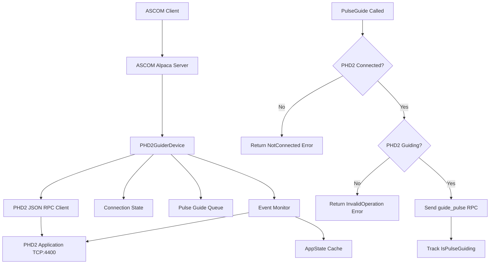

# PHD2 Guider ASCOM Alpaca Driver Design

## Overview

The PHD2 guider service implements an ASCOM Alpaca compatible Telescope device that acts as a bridge between ASCOM clients and Open PHD Guiding 2 (PHD2). It translates ASCOM Telescope guiding commands (specifically PulseGuide) into PHD2 JSON RPC API calls.

**Cross-Platform Support:** The service runs natively on Linux, macOS, and Windows, matching PHD2's platform support.

## Architecture Overview



## PHD2 API Overview

PHD2 provides two network interfaces:

### 1. Socket Server Interface (Port 4300)
- Legacy single-byte command protocol
- Commands: pause, resume, dither, start guiding, stop, etc.
- **Not recommended for new implementations**

### 2. Event Monitoring / JSON RPC Interface (Port 4400) ⭐ **Recommended**
- Modern JSON RPC 2.0 protocol
- Full bidirectional communication
- Event notifications and method invocation
- Multiple simultaneous client connections supported

## Implementation Framework

The service will use:

1. **`ascom-alpaca` crate** [https://crates.io/crates/ascom-alpaca](https://crates.io/crates/ascom-alpaca)
   - `Telescope` trait for ASCOM Telescope interface
   - `Device` trait for common ASCOM functionality
   - `Server` struct for ASCOM Alpaca protocol handling
   - Built on async/await with tokio runtime

2. **JSON RPC Client** for PHD2 communication
   - Connect to TCP port 4400
   - Send method calls (JSON RPC 2.0 format)
   - Receive event notifications
   - Handle async responses

## ASCOM Alpaca Telescope Methods Required

### Core Guiding Methods

#### PulseGuide
```rust
async fn pulse_guide(&self, direction: GuideDirection, duration: u32) -> ASCOMResult<()>
```
- **Parameters:**
  - `direction`: North, South, East, West (GuideDirection enum)
  - `duration`: Milliseconds (u32)
- **Behavior:**
  - Must be asynchronous (non-blocking)
  - Maps to PHD2 `guide_pulse` JSON RPC method
  - Updates `IsPulseGuiding` property
- **Exceptions:**
  - `PropertyNotImplementedException`: If `CanPulseGuide` is false
  - `InvalidValueException`: Invalid direction or duration
  - `InvalidOperationException`: PHD2 not guiding or operation conflicts
  - `NotConnectedException`: PHD2 not connected

#### IsPulseGuiding
```rust
async fn is_pulse_guiding(&self) -> ASCOMResult<bool>
```
- Returns `true` if a PulseGuide operation is in progress
- Must track completion of async pulse guide operations
- Requires monitoring PHD2's response to guide_pulse commands

#### CanPulseGuide
```rust
async fn can_pulse_guide(&self) -> ASCOMResult<bool>
```
- Returns `true` if PHD2 is available and connected
- Should verify PHD2 server is reachable

### Guide Rate Properties

#### GuideRateRightAscension
```rust
async fn guide_rate_right_ascension(&self) -> ASCOMResult<f64>
async fn set_guide_rate_right_ascension(&self, rate: f64) -> ASCOMResult<()>
```
- Maps to PHD2's `get_algo_param` / `set_algo_param` for RA axis
- May be tied to GuideRateDeclination depending on PHD2 configuration

#### GuideRateDeclination
```rust
async fn guide_rate_declination(&self) -> ASCOMResult<f64>
async fn set_guide_rate_declination(&self, rate: f64) -> ASCOMResult<()>
```
- Maps to PHD2's `get_algo_param` / `set_algo_param` for Dec axis

#### CanSetGuideRates
```rust
async fn can_set_guide_rates(&self) -> ASCOMResult<bool>
```
- Returns whether guide rates can be modified via PHD2

### Device Management

#### Connected
```rust
async fn connected(&self) -> ASCOMResult<bool>
async fn set_connected(&self, connected: bool) -> ASCOMResult<()>
```
- **When set to `true`:**
  - Establishes TCP connection to PHD2 on port 4400
  - Verifies PHD2 is running and responsive
  - Subscribes to PHD2 event stream
  - Caches initial PHD2 state (Version, AppState events)
- **When set to `false`:**
  - Closes TCP connection to PHD2
  - Clears cached state

## PHD2 JSON RPC API Mapping

### Connection Sequence

1. **Client connects to PHD2 (TCP port 4400)**
   - PHD2 sends initial events:
     - `Version`: Protocol version and PHD version
     - `LockPositionSet` / `StarSelected` (if applicable)
     - `CalibrationComplete` (if calibrated)
     - `AppState`: Current operational state

2. **Monitor AppState events**
   - Track PHD2 state: `Stopped`, `Selected`, `Calibrating`, `Guiding`, `LostLock`, `Paused`, `Looping`

### Key JSON RPC Methods to Implement

| ASCOM Method | PHD2 RPC Method | Notes |
|--------------|-----------------|-------|
| `PulseGuide` | `guide_pulse` | Send RA/Dec pulse commands |
| `Connected` (get) | `get_app_state` | Check PHD2 availability |
| `GuideRate*` (get) | `get_algo_param` | Query guide algorithm parameters |
| `GuideRate*` (set) | `set_algo_param` | Modify guide algorithm parameters |
| N/A | Event stream | Monitor `AppState`, `GuideStep`, `StarLost` events |

### guide_pulse Method Details

```json
{
  "method": "guide_pulse",
  "params": {
    "amount": 1000,
    "direction": "N",
    "which": "mount"
  },
  "id": 42
}
```

**Parameters:**
- `amount`: Duration in milliseconds
- `direction`: "N", "S", "E", "W"
- `which`: "mount" (for mount guiding) or "ao" (for adaptive optics)

**Response:**
```json
{
  "jsonrpc": "2.0",
  "result": 0,
  "id": 42
}
```

### Important PHD2 Methods for Status

| Method | Purpose |
|--------|---------|
| `get_app_state` | Current PHD2 state (Stopped, Guiding, etc.) |
| `get_connected` | Equipment connection status |
| `get_calibrated` | Whether PHD2 is calibrated |
| `loop` | Start/stop exposure loop |
| `stop_capture` | Stop all capturing and guiding |

## Configuration

```json
{
  "device": {
    "name": "PHD2 Guider Bridge",
    "unique_id": "phd2-guider-001",
    "description": "ASCOM Alpaca Telescope driver for PHD2 guiding"
  },
  "phd2": {
    "host": "localhost",
    "port": 4400,
    "connection_timeout_seconds": 10,
    "command_timeout_seconds": 30
  },
  "server": {
    "port": 11112,
    "device_number": 0
  },
  "telescope": {
    "can_set_guide_rates": true,
    "default_guide_rate_ra": 0.5,
    "default_guide_rate_dec": 0.5
  }
}
```

Configuration sections:

- **device**: ASCOM device metadata
- **phd2**: PHD2 connection settings (host, port, timeouts)
- **server**: ASCOM Alpaca server configuration
- **telescope**: Telescope-specific capabilities and defaults

## PHD2 Startup and Shutdown

### Starting PHD2

**Manual Start (Recommended for Initial Implementation):**
- User manually starts PHD2 application
- User connects equipment in PHD2
- User configures guide camera and mount in PHD2
- Driver connects to already-running PHD2 instance

**Automated Start (Future Enhancement):**
- Driver could launch PHD2 as subprocess
- Command line options: `phd2` (no special flags needed)
- Use `set_connected` RPC to connect equipment
- Use `set_profile` RPC to select equipment profile
- More complex; requires process management

### Stopping PHD2

**Clean Shutdown:**
1. Driver calls `stop_capture` RPC to stop guiding
2. Driver disconnects TCP connection
3. User manually closes PHD2 (or driver sends shutdown signal in future)

**Important Notes:**
- PHD2 should be running **before** ASCOM client connects to driver
- Driver should gracefully handle PHD2 restarts/crashes
- Driver should reconnect if PHD2 becomes unavailable

## Implementation Phases

### Phase 1: Core Connection and Status (MVP)
- [ ] Implement TCP connection to PHD2 port 4400
- [ ] Parse JSON RPC 2.0 messages
- [ ] Handle PHD2 event stream (Version, AppState)
- [ ] Implement `Connected` property
- [ ] Implement `CanPulseGuide` property (returns true if connected)
- [ ] Basic error handling for connection failures

### Phase 2: Pulse Guiding
- [ ] Implement `PulseGuide` method
- [ ] Map ASCOM directions to PHD2 directions (N/S/E/W)
- [ ] Implement `IsPulseGuiding` property
- [ ] Track async pulse guide completion
- [ ] Handle overlapping pulse guide operations
- [ ] Proper exception handling (InvalidOperation, NotConnected, etc.)

### Phase 3: Guide Rates
- [ ] Implement `GuideRateRightAscension` get/set
- [ ] Implement `GuideRateDeclination` get/set
- [ ] Map to PHD2 `get_algo_param` / `set_algo_param`
- [ ] Implement `CanSetGuideRates` property
- [ ] Query PHD2 for supported algorithm parameters

### Phase 4: Advanced Features (Future)
- [ ] Monitor `GuideStep` events for telemetry
- [ ] Handle `StarLost` events gracefully
- [ ] Implement dithering support (if needed)
- [ ] Auto-reconnect on PHD2 restart
- [ ] Process management (start/stop PHD2)
- [ ] Equipment profile selection

### Phase 5: Testing and Validation
- [ ] Unit tests for JSON RPC client
- [ ] Integration tests with PHD2
- [ ] ASCOM Conformance testing
- [ ] Cross-platform testing (Linux, Windows, macOS)

## Dependencies

```toml
[dependencies]
ascom-alpaca = "0.1"  # ASCOM Alpaca framework
tokio = { version = "1", features = ["full"] }
serde = { version = "1", features = ["derive"] }
serde_json = "1"
tracing = "0.1"  # Logging
anyhow = "1"  # Error handling
```

## Testing Strategy

### Unit Tests
- JSON RPC message parsing
- Direction mapping (ASCOM → PHD2)
- State machine logic

### Integration Tests
- Connect to PHD2 simulator or real PHD2 instance
- Send pulse guide commands
- Verify IsPulseGuiding property behavior
- Test error conditions (PHD2 not running, not guiding, etc.)

### Manual Testing
- Use ASCOM Alpaca clients (N.I.N.A., APT, etc.)
- Test with real guiding session
- Verify pulse guide corrections appear in PHD2 graph

## Open Questions

1. **Should the driver automatically start guiding in PHD2?**
   - Option A: Require user to manually start guiding in PHD2 first (simpler)
   - Option B: Driver calls `guide` RPC method when client connects (more complex)
   - **Recommendation:** Option A for MVP, Option B for future enhancement

2. **How to handle PHD2 not in "Guiding" state?**
   - Return `InvalidOperationException` from `PulseGuide`
   - Log warning and document requirement in driver description
   - **Recommendation:** Return proper error and document clearly

3. **Should guide rates be per-axis or synchronized?**
   - Check PHD2 algorithm capabilities
   - Some algorithms may tie RA and Dec rates together
   - **Recommendation:** Query PHD2 capabilities and adapt

4. **Do we need to implement other Telescope interface methods?**
   - ASCOM Telescope interface has ~50+ properties/methods
   - Most can return `PropertyNotImplementedException`
   - Only implement guiding-related subset
   - **Recommendation:** Minimal implementation focused on guiding only

5. **How to handle simultaneous pulse guide requests?**
   - ASCOM spec allows simultaneous RA and Dec pulses
   - PHD2 may or may not support this
   - **Recommendation:** Queue operations or return `InvalidOperationException` if unsupported

## References

- [Open PHD Guiding](https://openphdguiding.org/)
- [PHD2 Event Monitoring Documentation](https://github.com/OpenPHDGuiding/phd2/wiki/EventMonitoring)
- [PHD2 Socket Server Interface](https://github.com/OpenPHDGuiding/phd2/wiki/SocketServerInterface)
- [ASCOM Telescope Interface](https://ascom-standards.org/Help/Developer/html/M_ASCOM_DriverAccess_Telescope_PulseGuide.htm)
- [ASCOM Alpaca API](https://ascom-standards.org/api/)
- [ascom-alpaca Rust crate](https://crates.io/crates/ascom-alpaca)
