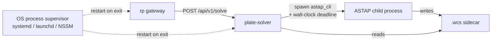

# plate-solver — Service Design

## Overview

`plate-solver` is an **rp-managed service** that wraps an
operator-supplied ASTAP CLI install and exposes a narrow HTTP solve
API to `rp`. It exists so plate solving — a hang-prone, crash-prone
external binary — runs in its own supervised process where its
failure modes cannot threaten `rp`'s liveness.

The service is **stateless across requests**: every solve spawns a
fresh `astap_cli` subprocess, waits for it under a wall-clock
deadline, parses the resulting `.wcs` sidecar, and returns. There is
no solve cache, no warm process pool, and no shared mutable state
between requests. Restart is always cheap and never costs more than
one in-flight request — which is what makes the supervision posture
described below safe.

Operators install ASTAP themselves (BYO per ADR-005). `plate-solver`
ships no ASTAP binary, no index database, and no install script;
operators point it at their install via two required config fields.

**Cross-platform support:** Linux x64, Linux aarch64 (Pi 5), macOS
Apple Silicon, Windows x64 — matching ADR-005's hard constraints.

## Architecture



Three independent processes, three independent failure domains.
The operator's OS process supervisor restarts the wrapper and rp
on exit; the wrapper supervises the ASTAP child via per-request
deadlines. See [Supervision and recovery](#supervision-and-recovery)
below for the detail and the path to future Sentinel-driven
restart.

### Inputs and Outputs

- **Input:** an absolute filesystem path to a FITS file (rp and the
  service share a filesystem per `docs/services/rp.md` §"File
  Accessibility"), plus optional pointing and FOV hints.
- **Output:** a WCS solution (RA/Dec at image center, pixel scale,
  rotation) parsed from the `.wcs` sidecar ASTAP writes alongside
  the FITS, or a structured error.

No pixel bytes traverse HTTP. `rp` and the service trust each other
to read from a shared filesystem; this is the same trust assumption
`rp` already makes about its plugins (see `rp.md` §"File
Accessibility").

## Alignment with rp's Tenets

- **Tenet 1 — Robustness above all else.** The service exists *only*
  to honor this tenet. Wrapping ASTAP in its own process means an
  ASTAP SIGSEGV, hang, or deadlock cannot threaten `rp`'s session
  state. This rationale is the load-bearing argument for choosing
  rp-managed-service over plugin shape; see
  `docs/plans/archive/plate-solver.md` §"Stability and supervision" for
  the full discriminator.
- **Tenet 4 — Remote interfaces only.** HTTP between rp and the
  service. The service-to-ASTAP boundary is a CLI subprocess, not an
  in-process FFI link — same shape that ADR-005 evaluates and ADR-001's
  predecessor explicitly rejected for sep-sys.
- **Tenet 5 — Minimal footprint.** No long-running ASTAP processes,
  no warm caches, no embedded star database. The service holds only
  the request currently in flight.

## Behavioral Contracts

### HTTP API

The service exposes exactly two endpoints. The contract is frozen by
`docs/plans/archive/plate-solver.md` §"HTTP contract"; this section
states the behavior, not the wire format details.

#### `POST /api/v1/solve`

**Happy path:**

1. Service deserializes the request body. `fits_path` must be an
   absolute path; `timeout` must parse as humantime; hint fields are
   optional.
2. Service confirms `fits_path` exists, is a regular file (not a
   directory), and is readable.
3. Service acquires the single-flight semaphore (default
   concurrency = 1). Overlapping requests queue; they do not error.
4. Service spawns `astap_cli` with argv mapped from the request body
   (see [hint mapping](#hint-mapping) below).
5. Service waits for the child under the request's `timeout`
   (defaulting to `default_solve_timeout` from config).
6. On clean exit with zero status, the service reads the `.wcs`
   sidecar ASTAP wrote next to the FITS via `fitsrs` (the workspace's
   existing FITS library), deserializes the header into
   `wcs::params::WCSParams` (cds-astro/wcs-rs, already a transitive
   dep of `fitsrs`), and extracts the response fields: `ra_center`
   (CRVAL1), `dec_center` (CRVAL2), `pixel_scale_arcsec` (`|CDELT1|`
   × 3600, falling back to `√(CD1_1² + CD2_1²)` × 3600 when CDELT1 is
   absent and the CD matrix is present), `rotation_deg` (CROTA2,
   falling back to `atan2(CD2_1, CD1_1)` and defaulting to 0 when
   neither representation is present), plus a `solver` banner string
   read from the file's HISTORY / COMMENT cards (falls back to
   `"astap-cli"` when no banner is found). A defensive 2880-byte
   block padder in `runner/wcs.rs` accepts test fixtures whose card
   stream stops exactly at the END card without trailing FITS-block
   padding; it does **not** lower the WCS-keyword bar — the parser
   still requires a complete primary HDU header (`SIMPLE`, `BITPIX`,
   `NAXIS`, `CTYPE1`/`CTYPE2`) before the WCS solution. The wrapper
   does not hand-roll FITS-header parsing.
7. Service releases the semaphore.

**Error paths** all return the structured error envelope frozen in
the plan. Each error code corresponds to one failure scenario:

| Code | Trigger |
|------|---------|
| `invalid_request` | Schema-invalid body, non-absolute `fits_path`, unparseable `timeout`. Rejected before any subprocess work. |
| `fits_not_found` | `fits_path` does not exist or is not readable. Rejected before any subprocess work. |
| `solve_failed` | ASTAP exited non-zero, OR exited zero but did not write a `.wcs`, OR wrote a `.wcs` missing required keys. The error message names which sub-condition triggered. |
| `solve_timeout` | Wall-clock deadline expired. Service signaled the child (see [supervision](#subprocess-supervision)) and returned this error after the child exited (clean or forced). |
| `internal` | Unexpected wrapper failure: broken pipe, `.wcs` parse panic, file-system error reading the sidecar. Should be rare; surfacing as a distinct code keeps it visible in monitoring. |

`rp` always sees one of these five codes on failure. ASTAP's stderr
tail is included in the `details` field for `solve_failed` so the
operator can diagnose without console access to the wrapper.

#### `GET /health`

Returns `200 OK` with `{"status": "ok"}` when **all** of:

- Startup config validation passed.
- The configured `astap_binary_path` is still a regular file and
  still executable by the wrapper process at probe time.
- The configured `astap_db_directory` still exists and is still a
  directory at probe time.

Returns `503 Service Unavailable` if any of those checks fail. Both
runtime checks must pass: a binary present without its database
cannot solve, and a database without an executable binary cannot
either. The probe set matches the startup-validation set so
"healthy at probe time" means "still capable of solving."

The probe is intentionally cheap: two filesystem stats, no
subprocess spawn. Sentinel (or any operational tooling) may probe
at high frequency without costing wrapper performance.

How Sentinel uses this endpoint — vs. relying purely on event-stream
signals and the operator-configured restart command — is a
Sentinel-side design question. The currently-documented Sentinel
watchdog flow in `rp.md` only describes Alpaca service health
probes; whether to extend it to non-Alpaca rp-managed services is
addressed by the implementation plan's Phase 5.

### Subprocess Supervision

Every solve request is bounded by a wall-clock deadline. The
escalation sequence on deadline expiry is:

1. **t = deadline (graceful stage):**
   - Unix: `SIGTERM` to the child.
   - Windows: `CTRL_BREAK_EVENT` delivered via
     `GenerateConsoleCtrlEvent` to the child's process group. The
     child is spawned with `CREATE_NEW_PROCESS_GROUP` so the event
     reaches it without affecting the wrapper. Pattern follows
     `crates/bdd-infra/src/lib.rs`.

   ASTAP normally responds cleanly within ~100 ms.
2. **t = deadline + 2 s (force-kill stage):** if the child has not
   exited, escalate:
   - Unix: `SIGKILL`.
   - Windows: `TerminateProcess`.

   The 2 s grace is a fixed constant, not configurable — chosen to
   dominate any signal-handling latency ASTAP might exhibit while
   staying short enough that a wedged child doesn't tie up the
   single-flight semaphore.
3. The service waits for the child to fully exit (via `wait()`)
   before returning the `solve_timeout` error. The semaphore is
   released only after exit. This guarantees that a `solve_timeout`
   response is always followed by a free slot for the next request.

The service does not leak child processes. The explicit `wait()` is
the **correctness contract** — it guarantees no leak on the normal
deadline path. The wrapper additionally spawns every child with
`Command::kill_on_drop(true)` (and, on Windows, places the child in
a job object that auto-terminates members on handle close) as the
**safety net** for unexpected wrapper-side failures: a panic before
`wait()`, a future-cancellation that abandons the child, or any
other code path that drops the `Child` without explicit termination.
Tokio's default `Child` drop *detaches* the process, which is why
`kill_on_drop(true)` is required for the safety-net guarantee to
hold.

### Single-Flight Concurrency

ASTAP is CPU-bound on a single core during a solve. The service
serializes overlapping requests behind a `tokio::sync::Semaphore`
with capacity equal to `max_concurrency` (default 1).

Overlapping requests **queue, not error**. The HTTP request stays
open while waiting on the semaphore. Each request's `timeout`
applies to its solve only — time spent waiting in the queue is not
counted against the deadline. Operators who need to bound queue
depth do so at rp's HTTP-client layer (`plate_solver.timeout_secs`
in rp config), not here.

### Hint Mapping

Optional pointing and FOV hints map directly to ASTAP CLI flags:

| Request field | ASTAP flag | Notes |
|---------------|-----------|-------|
| `ra_hint` | `-ra <decimal hours>` | Wire format is decimal degrees (0–360) for consistency with `ra_center`; wrapper converts to hours (`degrees / 15`) before passing to ASTAP. |
| `dec_hint` | `-spd <degrees>` | Wire format is decimal degrees (−90–90); wrapper converts to south-pole-distance (`90 + dec`) before passing to ASTAP. |
| `fov_hint_deg` | `-fov <degrees>` | Pass-through (image height, per ASTAP CLI documentation). |
| `search_radius_deg` | `-r <degrees>` | Pass-through. Defaults to ASTAP's own default when omitted. |

Omitted fields produce no flag — ASTAP falls back to blind solve.
The wrapper does not synthesize hints; it never invents data the
caller did not provide.

### Hint sources and search-radius defaults

The wrapper itself receives hints in the HTTP request body — it
neither queries the mount nor maintains a default. Hint sources are
the caller's concern; for `rp` (the canonical caller), the hint
chain is:

1. **`ra_hint` / `dec_hint`** come from the caller. `rp`'s
   `plate_solve` MCP tool is **explicit by default** — it does not
   silently auto-source from the mount. Two ways to provide them:
   - Pass an explicit `pointing_hint: { ra_deg, dec_deg }` object
     on the MCP call. Both values are decimal degrees on the wire
     (the `_deg` suffix in the field names is intentional — it
     preempts the Alpaca-hours / wrapper-degrees confusion at the
     call site). The nested-object shape makes the both-or-neither
     contract structural.
   - Pass `use_mount_hints: true` as a convenience opt-in. rp reads
     the mount's current pointing via ASCOM Alpaca Telescope
     properties:
     - `RightAscension` is returned in **decimal hours** per the
       Alpaca spec — rp multiplies by 15 to convert to the
       wrapper's degrees-on-the-wire contract.
     - `Declination` is already in decimal degrees and passes
       through unchanged.
     Mount absent / not connected / Alpaca read failure ⇒ error to
     the caller (the caller explicitly opted in, so failures are
     surfaced rather than silently dropping to blind solve).

   The two modes are mutually exclusive — supplying both is a
   caller error. Neither supplied ⇒ wrapper falls back to blind
   solve. (MCP directionality: clients call rp; rp calls the
   wrapper.) See `docs/services/rp.md` §"`plate_solve` Contract"
   for the full input shape and validation rules.
2. **`fov_hint_deg`** comes from the caller as an MCP parameter in
   v1. The eventually-right home is per-camera config — FOV is a
   fixed property of camera + optics and doesn't change between
   sessions — but that requires extending `CameraConfig` and a
   "which camera produced this image" lookup. Tracked by
   [issue #153](https://github.com/ivonnyssen/rusty-photon/issues/153);
   defer until a workflow is blocked without it.
3. **`search_radius_deg`** is the harder field. **The ASCOM Alpaca
   Telescope spec does not standardize a "pointing uncertainty"
   property.** Mount drivers may expose vendor-specific accuracy
   estimates, but there is no portable way to ask "how confident
   are you in your pointing?" Operators provide this number via
   their rp config (`plate_solver.default_search_radius_deg`) for
   fresh captures on the configured rig; per-call MCP
   `search_radius_deg` overrides for loaded-from-disk images where
   the configured default may not match the originating rig.

Recommended `search_radius_deg` defaults — operators tune per their
rig:

| Mount state | Recommended radius |
|-------------|--------------------|
| Synced to a recent solve, GoTo mount with pointing model | 1°–2° |
| Synced, no model | 2°–5° |
| Unsynced cold start | 5°–10° |
| No reliable mount input (manual pointing) | omit hint — blind solve |

Smaller radius means faster solve. ASTAP's documented sweet spot is
~3° for typical amateur GoTo setups.

ADR-005 §"Open questions" item 6 is retired by this section: the
ASCOM gap is documented, the operator-supplied default is
recommended, and `rp`'s `plate_solve` MCP tool sources
`search_radius_deg` from rp config (or a per-call override) rather
than from a nonexistent ASCOM property.

#### Operator perf comparison (manual)

To verify the hint speed advantage on a real rig, run the wrapper
with a real ASTAP install + a known-solvable FITS, then time two
requests via `curl`:

```sh
# With hints (M 101 example — matches the committed
# tests/fixtures/m101_known.fits)
time curl -s -X POST http://localhost:11131/api/v1/solve \
  -H 'content-type: application/json' \
  -d '{
    "fits_path": "/path/to/m101_known.fits",
    "ra_hint": 210.8099,
    "dec_hint": 54.3469,
    "fov_hint_deg": 0.42,
    "search_radius_deg": 3.0,
    "timeout": "30s"
  }'

# Same FITS, no hints (blind solve)
time curl -s -X POST http://localhost:11131/api/v1/solve \
  -H 'content-type: application/json' \
  -d '{"fits_path": "/path/to/m101_known.fits", "timeout": "120s"}'
```

Reference measurements on the committed `m101_known.fits` fixture
(Linux x64 reference box, ASTAP CLI 2026.05.18, D05 database):

- Hinted: **~63 ms**
- Blind: **~48 s** (~770× slower)

The committed fixture has its FITS pointing breadcrumbs (`RA`,
`DEC`, `OBJCTRA`, `OBJCTDEC`, `OBJECT`) stripped — see issue #236 —
so the "blind" measurement above truly walks ASTAP's search
spiral. Operator-captured FITS that retain those header keys will
behave very differently in blind mode: ASTAP reads the cards as a
free hint and finishes in milliseconds, masking any hint-pipeline
regression. To reproduce the spread above on your own captures,
either supply the wrong start position via `ra_hint`/`dec_hint`
or strip the pointing keys from a fixture copy.

If the spread disappears entirely (hinted is not materially faster
than blind on a header-less fixture), the wrapper isn't being
invoked correctly or ASTAP's index database is mismatched to the
FOV. The nightly `plate-solver-smoke` workflow trends both numbers
automatically per OS — see issue #236 and the per-run
`plate-solver-perf-<os>` CSV artifacts.

The workflow's "Assert solve-time budget" step then guards those
numbers (issue #234). Per OS it requires the blind solve to stay at
least 10× slower than the hinted solve — a dropped hint flag in
`runner/astap.rs` collapses that ratio — and enforces coarse absolute
ceilings (hinted ≤ 5 s, blind ≤ 180 s) to catch a uniform slowdown.
A breach fails the smoke run, which on a scheduled run opens or
updates the `plate-solver-nightly` tracking issue. The thresholds are
deliberately loose (phase-1); pinning tighter per-OS budgets is
forward work pending several weeks of scheduled-run baseline.

### Configuration Validation at Startup

The service validates its config before binding the HTTP listener.
On any validation failure, it logs a structured error naming the
field and exits non-zero. Sentinel's restart loop then surfaces the
misconfiguration to the operator rather than masking it with a
silent retry.

Validation rules:

- `astap_binary_path` must exist, be a regular file, and be executable
  by the current user.
- `astap_db_directory` must exist and be a directory.
- `bind_address` must parse as an IP address.
- `default_solve_timeout` must be ≤ `max_solve_timeout` (otherwise
  the request-supplied timeout could exceed `max_solve_timeout`,
  defeating the bound).
- `max_concurrency` must be ≥ 1 (a zero-capacity semaphore would
  permanently stall every request).

The `astap_binary_path` validation runs again on every `/health`
probe, so a binary removed after startup is detected.

## Configuration

The service reads a single JSON config file. `--config` names it
explicitly; when omitted, the path resolves to the platform default
(`~/.config/rusty-photon/plate-solver.json` on Linux,
`%PROGRAMDATA%\rusty-photon\plate-solver.json` on Windows) via
`rusty-photon-config`. There is no built-in default config — the
file must exist (`astap_binary_path` / `astap_db_directory` are
mandatory), so the packaged systemd unit gates on it with
`ConditionPathExists` instead of crash-looping on a fresh install.

```json
{
  "bind_address": "127.0.0.1",
  "port": 11131,
  "astap_binary_path": "/opt/astap/astap_cli",
  "astap_db_directory": "/opt/astap/d05",
  "max_concurrency": 1,
  "default_solve_timeout": "30s",
  "max_solve_timeout": "120s",
  "astap_extra_env": {}
}
```

| Field | Required | Default | Notes |
|-------|----------|---------|-------|
| `bind_address` | no | `127.0.0.1` | Bind to `0.0.0.0` only when rp runs on a different machine. |
| `port` | no | `11131` | Matches the placeholder rp config in `rp.md` §"Configuration". |
| `astap_binary_path` | **yes** | — | No default. Wrapper must be told where ASTAP is. |
| `astap_db_directory` | **yes** | — | No default. ASTAP needs an index database to solve; the operator picks D05 / D80 / etc. for their FOV. |
| `max_concurrency` | no | `1` | Capacity of the single-flight semaphore. v1 ships at 1; tuning above 1 is operator-driven and unsupported by the v1 budget assertions. |
| `default_solve_timeout` | no | `30s` | Applies when the request body omits `timeout`. |
| `max_solve_timeout` | no | `120s` | Caps any caller-supplied `timeout`. |
| `astap_extra_env` | no | `{}` | Map of environment variables set on every spawned `astap_cli` child. Use for operator-controlled tunables (locale, library paths) and for BDD tests that drive `mock_astap`'s `MOCK_ASTAP_MODE` per scenario without process-wide `env::set_var` races. |

Required fields exit the process on absence (no implicit defaults
for "where is ASTAP" — see [Configuration Validation](#configuration-validation-at-startup)).

## Subprocess Test Doubles

The service ships an in-tree `mock_astap` `[[bin]]` that mimics the
ASTAP CLI surface and is used in BDD and supervision unit tests. The
pattern mirrors `services/phd2-guider/src/bin/mock_phd2.rs`.

Behavior is selected via the `MOCK_ASTAP_MODE` environment variable
the test sets before spawning the wrapper:

| Mode | Behavior | Drives |
|------|----------|--------|
| `normal` | Read `-f <path>`, write a canned `.wcs` next to it, exit 0 | Happy path |
| `exit_failure` | Write to stderr, exit 1 (no `.wcs`) | `solve_failed` (non-zero exit branch) |
| `hang` | Sleep indefinitely; respond cleanly to the platform's graceful signal (Unix `SIGTERM`; Windows `CTRL_BREAK_EVENT`) | `solve_timeout` (terminated) |
| `ignore_sigterm` | Trap and ignore the graceful signal; sleep anyway. Mode name kept for stability — semantics are platform-neutral. | `solve_timeout` (killed via the platform's force-kill) |
| `malformed_wcs` | Write a `.wcs` missing `CRVAL2`, exit 0 | `solve_failed` (parser-detected branch) |
| `no_wcs` | Exit 0 without writing any `.wcs` | `solve_failed` (sidecar-missing branch) |

Setting `MOCK_ASTAP_ARGV_OUT=<file>` (any mode) writes the received
argv to the named file, used for end-to-end argv-flow assertions.
Setting `MOCK_ASTAP_SPAWN_DIR=<dir>` (any mode) writes each invocation's
spawn time (ns since the Unix epoch) to its own uniquely-named file in
`<dir>`. The single-flight BDD scenario reads the directory to assert
serialization from the children's actual spawn ordering, rather than
from client-side HTTP-completion timing (which was jitter-prone on
loaded CI runners). Per-child files avoid a shared handle — cross-process
appends to one file dropped writes on Windows.

This binary is **not feature-gated** — it builds with every
`cargo build --all-targets`. BDD and supervision integration tests
discover it in this order: explicit `MOCK_ASTAP_BINARY` env var
(set by Bazel test targets) → `option_env!("CARGO_BIN_EXE_mock_astap")`
(set by Cargo for `[[test]]` crates). Both fallbacks let the suite
run under Cargo and Bazel without divergent code paths. Pure
`env!()` is intentionally avoided because `CARGO_BIN_EXE_*` is
unset under Bazel and unset for `#[cfg(test)] mod tests` inside
`src/`. Same lookup `services/phd2-guider/tests/test_integration.rs`
uses for `mock_phd2`.

### Real-ASTAP Coverage Cadence

A small set of `@requires-astap`-tagged BDD scenarios runs against
the real ASTAP binary, gated by a runtime check on the
`ASTAP_BINARY` environment variable. Scenarios skip silently when
the env var is unset (the PR-required path). They fire when the env
var is set, which is the dedicated nightly cross-platform smoke
workflow's job. See `docs/plans/archive/plate-solver.md` §"Real-ASTAP
coverage: cadence and gating" for the rationale and the `bdd.rs`
filter snippet.

## Supervision and recovery

The wrapper sits inside a layered supervision design with three
distinct failure domains. **Today, the wrapper-and-rp domains are
restarted by the operator's OS-level process supervisor** (systemd /
launchd / NSSM); see the [README's per-OS recipes](../../services/plate-solver/README.md#process-supervisor-recipes).
Automated Sentinel-driven restart of rp-managed services is a future
design item — the current Sentinel
([`docs/services/sentinel.md`](sentinel.md)) is an Alpaca
SafetyMonitor poller and notifier, not a generic HTTP service
supervisor. The "Sentinel Watchdog Integration" section in `rp.md` is
a forward-looking design.

### Failure Domains

| Domain | Today's supervisor | Detection | Action |
|--------|--------------------|-----------|--------|
| `rp` (gateway) | Operator's process supervisor (systemd / launchd / NSSM) | Process exit (panic, OOM, etc.) | Supervisor restarts per its policy (`Restart=on-failure`, `KeepAlive`, etc.) |
| `plate-solver` (this service) | Operator's process supervisor | Process exit; or external `/health` probe | Same as above. The wrapper exits non-zero on config-validation failure and on internal panic; the supervisor restarts it. |
| `astap_cli` (child) | This service | Per-request wall-clock deadline | Graceful signal → 2 s grace → force-kill. Unix: `SIGTERM` → `SIGKILL`. Windows: `CTRL_BREAK_EVENT` (with `CREATE_NEW_PROCESS_GROUP` at spawn) → `TerminateProcess`. |

### Belt-and-Suspenders Outer Timeout

`rp`'s HTTP client to this service has its own outer timeout
(`plate_solver.timeout_secs` in rp config). Even if the wrapper's
internal timeout regresses, `rp` does not hang on a `plate_solve`
call. The wrapper's deadline is the primary control; rp's is the
backstop.

### What restart recovers from

Stateless-across-requests is the property that makes restart safe.
Restarting the wrapper costs the in-flight request (which gets a
transient error and may be retried by the orchestrator) and nothing
else — no session state, no warm caches, no in-memory artifacts the
operator cares about.

### Forward work: Sentinel extension

When Sentinel grows generic HTTP service supervision — periodic
`GET /health` probes, configurable restart commands per service —
this wrapper's `/health` endpoint and graceful-shutdown semantics are
already shaped to fit. Until then, the operator's process supervisor
is the sanctioned recovery mechanism, and `/health` is exposed for
operational tooling (Prometheus blackbox exporter, Nagios, etc.).

## MVP Scope

### In scope for v1

- One solve endpoint, one health endpoint, one config file.
- Single ASTAP runner. Architecturally swappable for `solve-field`
  (per ADR-005), but only ASTAP is implemented.
- Single-flight default; queueing is built in but unused at default.
- BYO ASTAP per ADR-005. No bundled binary, no install scripts.

### Out of scope for v1

- `solve-field` runner. Trait shape exists; impl deferred.
- Background solving by subscribing to rp's `exposure_complete`
  events. The wrapper is request/response only.
- Solve cache or warm process pool. Explicitly excluded by
  stateless-across-requests.
- An MCP server surface. The wrapper speaks HTTP only; rp owns the
  `plate_solve` MCP tool name.
- Pixel transport over HTTP. File path only, per ADR-005.

## References

- ADR-005 — `docs/decisions/005-plate-solver.md`
- Implementation plan — `docs/plans/archive/plate-solver.md`
- rp design doc, §"Plate Solver" — `docs/services/rp.md`
- rp design doc, §"Sentinel Watchdog Integration" — `docs/services/rp.md`
- rp design doc, §"File Accessibility" — `docs/services/rp.md`
- Reference service shape — `docs/services/phd2-guider.md`
- Mock-binary precedent — `services/phd2-guider/src/bin/mock_phd2.rs`
