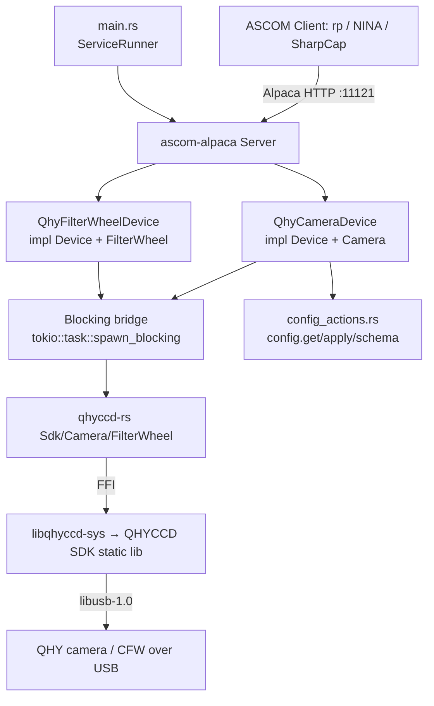

# Qhy-Camera Service Design

> **Status:** Implemented (v0). The driver lives in
> [`services/qhy-camera`](../../services/qhy-camera). All 8 BDD feature suites
> (56 scenarios) and the unit tests are green against the `qhyccd-rs`
> `simulation` backend; ConformU runs in CI. This document remains the
> behavioural specification — the handful of implementation deviations from the
> original design are called out inline (search "*Implementation note*"). The
> *Delivery phasing* § Phase 0–6 tracked the SDK-de-risk → full-driver rollout.

## Overview

The `qhy-camera` service is an ASCOM Alpaca **Camera** (and optional
**FilterWheel**) driver for real QHYCCD hardware. It exposes a connected QHY
camera — exposures, ROI/binning, gain/offset, cooling, readout modes — over
ASCOM Alpaca on a fixed port so the `rp` orchestrator (and any Alpaca client:
NINA, SGPro, SharpCap) can drive it like any other device.

It is the **first hardware imaging camera** in rusty-photon, complementing the
existing [`sky-survey-camera`](sky-survey-camera.md) *simulator* (which it reuses
for scaffolding) and the same-vendor [`qhy-focuser`](qhy-focuser.md) driver.

**Provenance.** The behaviour is derived from the author's standalone
[`ivonnyssen/qhyccd-alpaca`](https://github.com/ivonnyssen/qhyccd-alpaca) driver
(MIT OR Apache-2.0, same author). Rather than vendoring that ~1,350-LOC monolith,
this service is **written natively against rusty-photon conventions on top of the
published [`qhyccd-rs`](https://crates.io/crates/qhyccd-rs) crate** (the durable,
reusable FFI layer), using `qhyccd-alpaca`'s device-trait code only as the
behavioural reference. See *Delivery phasing* and
[ADR — to be written] for why.

**Requires a proprietary native SDK.** Unlike `filemonitor` /
`sky-survey-camera`, this service links a **proprietary native SDK** that must be
provisioned before it will link, so a developer without the SDK cannot build
`-p qhy-camera`. The SDK *is* cross-platform on x86 (Linux/macOS/Windows via the
install action; linux-arm64 via the Pi), so CI builds it on all GitHub-hosted
OSes — but the SDK requirement is still the dominant design constraint. See
*Native dependency & build gating*.

---

## Native dependency & build gating (the crux)

This is the single most consequential fact about this service and the reason it
is delivered in two tracks.

- The imaging path is `qhy-camera → qhyccd-rs (0.1.9) → libqhyccd-sys (0.1.4,
  git-patched — see below) →` the **proprietary QHYCCD SDK** (a closed-source
  static lib) **+ libusb-1.0**.
- `libqhyccd-sys` declares `links = "qhyccd"` and its `build.rs` emits
  `cargo:rustc-link-lib=static=qhyccd` + `dylib=usb-1.0` **unconditionally** —
  there is **no feature/cfg gate** on the link.
- **macOS link fix (`[patch.crates-io]`):** the *published* crates.io
  `libqhyccd-sys 0.1.4` was cut before the macOS link fix landed — on macOS its
  `build.rs` emits only `static=qhyccd` + `dylib=c++` and **never links
  `libusb-1.0`**, so the workspace fails to link on macOS with
  `Undefined symbols … _libusb_*`. The workspace `[patch.crates-io]` (root
  `Cargo.toml`) pins `libqhyccd-sys` to the upstream **GitHub `main`** commit
  (`d84f867…`, still crate version `0.1.4`, so it satisfies what `qhyccd-rs
  0.1.9` requires), which adds the `/opt/homebrew/lib` search path + the
  `dylib=usb-1.0` directive. Linux/Windows behaviour is unchanged. Drop the
  patch once a fixed `libqhyccd-sys` is published to crates.io.
- **Consequence:** *every machine that compiles this package* — dev laptops, CI
  runners, Bazel actions — needs the QHYCCD SDK installed and discoverable, plus
  `libusb-1.0` dev headers. Not just machines with a camera attached.
- The `qhyccd-rs` **`simulation` feature** (which this service forwards as its own
  `simulation` feature) makes the build **camera-free, NOT SDK-free**: it only
  fabricates fake frames at runtime (via `rand`/`rayon`). The static `qhyccd` lib
  is still required at link time. *(Verified against `libqhyccd-sys/build.rs` and
  upstream CI, which installs the SDK even for `--features simulation` ConformU
  runs.)*

### Why this matters for rusty-photon specifically

The workspace is **currently 100% pure-Rust at the link layer — zero
native/system-lib dependencies**. The old `cfitsio`/`fitsio-sys` requirement was
**purged** in [ADR-001 Amendment A](../decisions/001-fits-file-support.md) (FITS
is now pure-Rust `fitsrs` via `rp-fits`). So `qhyccd-rs` **reintroduces the first
native build dependency** since that purge. It does not match an existing
precedent — it creates a new one. The doc below specifies how it is gated so it
does not break the SDK-less default build.

### Gating plan

| Concern | Mechanism |
|---|---|
| `cargo build --all` / local dev without SDK | The package is a normal workspace member, but **`cargo build -p qhy-camera` is expected to fail to link without the SDK**. Devs without the SDK use the rest of the workspace normally; `cargo rail`'s `merge_base=true` (affected-packages-only) means the package is only built when *its* files change. Documented in this design doc and the service README. |
| CI | Every job that compiles qhy-camera installs the SDK via the author's published [`ivonnyssen/qhyccd-sdk-install@v2`](https://github.com/ivonnyssen/qhyccd-sdk-install) action (`version: "25.09.29"`), which provisions it on **Linux, macOS, and Windows** — exactly as the upstream `qhyccd-rs` CI does. Per-OS libusb: `libusb-1.0-0-dev` (cached apt) on Linux, `brew install libusb` on macOS, none on Windows (the WinMix SDK bundles it). `test.yml` builds + tests qhy-camera on the ubuntu / macOS / windows jobs and the windows-bdd matrix; `conformu.yml` runs its ConformU suite on all three OSes; `scheduled.yml` (nightly/beta) builds it. The SDK is publicly downloadable from qhyccd.com (no secret/auth). **Exception:** `safety.yml` (ASan/LSan) **excludes** qhy-camera (`--exclude qhy-camera`) — its proprietary static lib is built without sanitizer instrumentation and would emit unactionable leak reports. |
| Raspberry Pi nightly runner | `scripts/setup-pi-runner.sh` installs the SDK (25.09.29) + `libusb` from qhyccd.com into `/usr/local/lib`. **aarch64 confirmed available and linking** — `qhy-camera` builds on the Pi5 arm64 nightly (the published action covers x86_64/Windows/macOS, not linux-arm64, hence the Pi-side install; the arm64 tarball name differs from `sdk_linux64_*` — set `QHY_SDK_FILE`). |
| Bazel (shadow build) | Tag the target `requires-cargo` initially (kept out of `bazel test //...` by `.bazelrc`'s default `-requires-cargo`). Later replace with a hand-written `crate.annotation` for `libqhyccd-sys` (link-search to the installed SDK, `static=qhyccd`, `dylib=usb-1.0`). Run `CARGO_BAZEL_REPIN=1 bazel mod tidy && bazel mod tidy` after adding `qhyccd-rs` (Rule 10). |

### Resolved facts (decided)

- **SDK version: 25.09.29** — pin the install action to the version `qhyccd-rs`
  0.1.9 targets. (The `24.12.26` in the older `qhyccd-alpaca` doc is stale.)
- **arm64: supported and linking** on the Pi5 runner — `qhy-camera` is in the
  arm64 nightly matrix.
- **SDK distribution: public, via the published action.** *(Decision revised to
  match the reference CI.)* The QHYCCD SDK is **publicly downloadable from
  qhyccd.com** (`.../publish/SDK/25.09.29/sdk_linux64_25.09.29.tgz`); the author's
  `ivonnyssen/qhyccd-sdk-install@v2` action wraps the download and caches it on
  **Linux, macOS, and Windows**. On Linux it runs the SDK's own `install.sh`
  (→ `/usr/local/lib` + `ldconfig`); on macOS/Windows it extracts into
  `$GITHUB_WORKSPACE` where `libqhyccd-sys`'s `build.rs` looks (and adds
  `pkg_win\x64` to `PATH` on Windows). So **no
  authenticated tier, secret, or SHA pin is needed** — the earlier
  "authenticated/internal cache tier pending the redistribution-terms question"
  plan was superseded once the reference's CI confirmed the SDK is fetched
  publicly. (A self-hosted cache could still front it for hermeticity, but is not
  required.)

### Open questions still to resolve before Track A lands

1. **`qhyccd-rs` churn.** Single-maintainer, pre-1.0 (0.1.7/0.1.8/0.1.9 all
   shipped within days). Pin exactly (`=0.1.9`) and track upstream closely.
2. **Shutter actuation API** *(resolved).* `qhyccd-rs` 0.1.9 exposes only shutter
   *presence* (`CamMechanicalShutter`), no open/close actuation. Per the E4
   degradation clause, v0 rejects all dark frames with `NOT_IMPLEMENTED`;
   shutter-actuated darks are Future Work.

---

## Architecture



**Key components**

- **`main.rs`** — plain `fn main`, parses clap args, inits `tracing`, runs under
  `ServiceRunner::new("qhy-camera").with_reload().run_with_reload(...)` per
  [`service-lifecycle.md`](../skills/service-lifecycle.md). No hand-rolled signal
  handling, no `materialize_identity` (identities are hardware-derived).
- **`lib.rs`** — `ServerBuilder` that, on `build()`, opens the SDK and
  **enumerates every connected camera** (and CFW when `filterwheel.enabled`),
  registering each as an ASCOM device (index 0, 1, 2, …) with its serial-derived
  UniqueID. The eager per-device connect handshake (cache CCD info, valid binning
  modes, exposure/gain/offset min-max-step) happens on `set_connected(true)`.
  Returns a `BoundServer`.
- **`camera.rs`** — `QhyCameraDevice` (one instance per discovered camera)
  implementing `Device` + `Camera` against `qhyccd-rs`. **Every blocking SDK call
  runs inside `tokio::task::spawn_blocking`** (the same blocking-bridge discipline
  the legacy serial drivers use) so the async runtime is never stalled.
- **`filterwheel.rs`** — `QhyFilterWheelDevice` (one per discovered CFW)
  implementing `Device` + `FilterWheel` (registered when `filterwheel.enabled`).
- **`config.rs`** — typed `Config` with parse-don't-validate newtypes.
- **`config_actions.rs`** — `ConfigurableDriver` impl + the `dispatch` the devices
  delegate to (`config.get`/`config.apply`/`config.schema`).
- **`mock.rs`** (feature `simulation`/`mock`) — the hardware-free test backend
  (the `qhyccd-rs` `simulation` camera + a tiny in-crate trait seam over the SDK
  for unit tests).

**Concurrency.** The QHY SDK is blocking C FFI and is **not** safe to call from
arbitrary threads concurrently for a single device. Device state (current ROI,
binning, gain, target temp, exposure state machine) is held under
`parking_lot::RwLock`; all SDK calls funnel through `spawn_blocking` and a single
logical owner per device.

---

## MVP scope

The MVP boundary drives BDD scenario selection (Phase 2). Grounded in what
`qhyccd-rs` / `qhyccd-alpaca` actually support today.

**In scope (v0)**

- ASCOM Camera ICameraV3 for **every enumerated QHY camera** (each registered as
  a device on the one port), 16-bit monochrome **and** one-shot-colour (Bayer)
  sensors.
- Startup enumeration registers all discovered cameras (+ CFWs when enabled);
  per-device connect/disconnect lifecycle: open → single-frame mode → init →
  16-bit transfer → cache geometry/limits.
- Sensor geometry (`CameraXSize`/`YSize`, `PixelSizeX`/`Y`) from cached CCD info.
- **Binning** — symmetric only (`CanAsymmetricBin = false`); `MaxBinX/Y` from the
  SDK's valid binning modes; ROI rescaled on bin change.
- **ROI** — `StartX/Y`/`NumX/Y` setters accept any `u32`; geometry validated at
  `StartExposure` (ConformU "Reject Bad…" semantics).
- **Exposure** — `ExposureMin/Max/Resolution` from the SDK; single-frame
  `StartExposure`; `ImageReady`/`ImageArray`/`ImageArrayVariant`; `CameraState`
  (`Idle`/`Exposing`/`Error`); `PercentCompleted` from remaining-exposure µs.
- **Abort** — `CanAbortExposure = true` via the SDK abort path.
- **Gain / Offset** — current value + `Min`/`Max` from the SDK; `NOT_IMPLEMENTED`
  when the control is unavailable on the model.
- **Readout modes** — `ReadoutMode(s)` named from the SDK; switching updates
  cached resolution.
- **Cooling** — `CoolerOn`, `CCDTemperature`, `SetCCDTemperature`, `CoolerPower`,
  `CanSetCCDTemperature`, `CanGetCoolerPower` — all gated on the `Cooler` control.
- **Sensor type** — `Monochrome` vs `RGGB`/colour + `BayerOffsetX/Y`.
- **`MaxADU`** = `(2^OutputDataActualBits) - 1` (e.g. 65535 for a 16-bit
  sensor); `SensorName` from the device id.
- **FilterWheel** as a second ASCOM device on the same port (when present):
  `Names`, `Position` (with moving state), `set_position`, `FocusOffsets`.
- **Dark frames** — `Light = false` returns `NOT_IMPLEMENTED` on all models in
  v0 (qhyccd-rs 0.1.9 has no shutter actuation; see E4). `HasShutter` still
  reports `CamMechanicalShutter` presence.
- `config.get`/`config.apply`/`config.schema` actions; hardware-derived
  `UniqueID` (camera/CFW SDK serial); in-process reload.
- ConformU integration test driven against the `qhyccd-rs` `simulation` backend
  (SDK installed in CI, no physical camera).

**Deferred (see *Future Work*)**

- **Dark/bias frames.** v0 rejects all `Light = false` exposures with
  `NOT_IMPLEMENTED` (qhyccd-rs 0.1.9 has no shutter open/close actuation; see
  E4). Shutter-actuated darks on mechanical-shutter models (e.g. QHY600M) and a
  cap-on operator workflow for shutterless darks are deferred to Future Work.
- `StopExposure` (graceful stop) — upstream returns `NOT_IMPLEMENTED`; only
  `AbortExposure` works.
- `FastReadout` — upstream untested; ship as `CanFastReadout` reflecting the
  `Speed` control but mark untested.
- `PulseGuide` (`CanPulseGuide = false`), LiveMode, multi-frame/video.
- Per-serial connect-time tuning (gain/offset/target-temperature defaults).
- `ElectronsPerADU` / `FullWellCapacity` (upstream `NOT_IMPLEMENTED`; supply
  placeholders only if ConformU requires them).
- TLS / HTTP Basic Auth (compose `rp-tls` / `rp-auth` later).

---

## Configuration

The service **enumerates every connected QHY camera** (and CFW, when enabled) at
startup and registers each as an ASCOM device (camera / filter-wheel index
0, 1, 2, …) on the one port. The hardware is the source of truth — there is no
per-camera *binding* in config. Each device's UniqueID comes from its SDK serial;
config carries only optional per-serial display overrides plus a global CFW
toggle and the port.

```jsonc
{
  // Optional per-device overrides, keyed by SDK serial. A device with no
  // entry uses SDK-derived defaults (name from model+serial; CFW filter names
  // "Filter0".."FilterN"). Named `devices` (not `overrides`) to avoid colliding
  // with the config.get response's own `overrides[]` (CLI-pinned paths) field.
  "devices": {
    "QHY600M-0123456789": {
      "name": "Main Imaging",
      "description": "QHY600M @ 1000mm"
    },
    "CFW3L-SR-9876543210": {
      "filter_names": ["L", "R", "G", "B", "Ha", "OIII", "SII"]
    }
  },
  "filterwheel": {
    "enabled": true                  // register discovered CFWs as FilterWheel devices
  },
  "server": {
    "port": 11121
  }
}
```

Sections:

- **devices** — Optional per-device override map keyed by **SDK serial**. Lets an
  operator give a friendly `name`/`description` to a specific camera and human
  `filter_names` to a specific CFW. Any device without an entry uses SDK-derived
  defaults. v0 does
  **not** carry per-camera connect-time tuning (gain/offset/target temperature) —
  with heterogeneous cameras those are per-serial concerns and clients set them
  over ASCOM; per-serial defaults are deferred (see *Future Work*).
- **filterwheel.enabled** — Global toggle: when `true`, discovered CFWs are
  registered as FilterWheel devices alongside the cameras. Hard read-only
  (toggling adds/removes endpoints → restart-required, not a live apply).
- **server.port** — Listening port (**11121**, next free in the 1112x family;
  11111–11120 and 11131 are taken). One port hosts all enumerated devices. Hard
  read-only (self-lockout: a port change would make the BFF lose the devices).

### Config actions

Standard cross-driver protocol ([`config-actions.md`](config-actions.md)),
implemented generically in `rusty_photon_config::actions` + the ASCOM adapter in
[`rusty-photon-driver`](../../crates/rusty-photon-driver). `config_actions.rs`
supplies `ConfigurableDriver for QhyCameraDriver`:

- **Secrets redacted/carried forward:** none in v0 (no auth yet).
- **Locked (identity) fields:** none — UniqueIDs are hardware-derived and not
  stored in config, so there is no identity field to lock (a deliberate
  divergence from the `materialize_identity` convention; see *Device identity*).
- **Hard read-only fields:** `/server/port`, `/filterwheel/enabled` (enabling
  /disabling adds/removes registered endpoints → restart-required, not a live
  apply).
- **Editable fields:** the `devices` map (per-serial `name` / `description` /
  `filter_names`).
- **Validation** at load (parse-don't-validate): `filter_names` entries are
  non-empty strings; `devices` keys are free-form serial strings.

`config.apply` persists atomically, returns `status:"applying"` when a field
changed, and fires the in-process reload (`main.rs` runs under
`with_reload().run_with_reload(...)`).

### Device identity (UniqueID)

ASCOM requires a globally-unique, never-changing `UniqueID`. **This service
derives the UniqueID from the camera's hardware serial** (the QHYCCD SDK id,
available from `Sdk::cameras()` at enumeration, *before* the device is opened),
and the FilterWheel's UniqueID from the CFW's SDK id — the same scheme upstream
`qhyccd-alpaca` uses.

This is a **deliberate divergence** from the rusty-photon
`materialize_identity` / minted-UUID convention used by the other six drivers,
chosen because a camera exposes a genuinely stable, globally-unique hardware
serial. The serial is a *better* ASCOM identity than a per-install minted UUID:
it is tied to the physical camera, so it survives an OS reinstall and moving the
camera between machines, and swapping the camera correctly yields a new id.

Consequences: there is **no `unique_id` field in config**, **no
`materialize_identity` call** in `main.rs`, and **no locked identity field** in
the config-actions tiers. Because the service enumerates *all* cameras, there is
no selector — every discovered camera and CFW is exposed, each carrying its own
serial-derived UniqueID, so two identical-model cameras are naturally
distinguished by their serials.

---

## Behavioral contracts

Named, testable behaviours mapping 1:1 to BDD scenarios in `tests/features/`.
ASCOM error names per [`docs/references/ascom-alpaca.md`](../references/ascom-alpaca.md).
Values are grounded in the `qhyccd-rs`-backed implementation.

### Enumeration & connection lifecycle

- **C0.** At startup `build()` enumerates all connected QHY cameras (and CFWs when
  `filterwheel.enabled`) and registers each as an ASCOM device with its
  serial-derived UniqueID. Zero discovered cameras is **not** a hard failure — the
  service starts with no Camera devices, logged at `warn!`; a later reload
  re-enumerates.
- **C1.** `set_connected(true)` on a device opens *that* camera, sets single-frame
  mode, readout mode 0, `init()`, 16-bit transfer, and caches CCD info, effective
  area, valid binning modes, and exposure/gain/offset/speed min-max-step. On
  success `Connected = true`.
- **C2.** `set_connected(true)` with the device's camera unreachable / SDK open
  failure returns the mapped driver error and `Connected` stays `false`.
- **C3.** `set_connected(false)` closes that device and returns `NOT_CONNECTED`
  for subsequent operations; an in-flight exposure on it is aborted.
- **C4.** Connect is per-device and independent: connecting/disconnecting one
  camera does not affect the others enumerated on the same service.

### Geometry, binning, ROI

- **G1.** `CameraXSize`/`CameraYSize`/`PixelSizeX`/`PixelSizeY` reflect the cached
  CCD info.
- **B1.** `set_bin_x`/`set_bin_y` validate against the SDK's valid binning modes
  and set symmetric binning; an unsupported bin returns `INVALID_VALUE`.
- **B2.** `CanAsymmetricBin = false`; `MaxBinX`/`MaxBinY` come from the valid
  modes (typically 1–4, up to 8).
- **B3.** A bin change rescales the cached ROI by the bin ratio.
- **R1.** `StartX/Y`/`NumX/Y` setters accept any `u32`; geometry is validated at
  `StartExposure` (R2), not at the setter.
- **R2.** `StartExposure` with `StartX + NumX > CameraXSize / BinX` (or the Y
  analogue), or `NumX/NumY = 0`, returns `INVALID_VALUE`; otherwise the ROI is
  applied to the SDK before exposing.

### Exposure

- **E1.** `StartExposure` while disconnected returns `NOT_CONNECTED`.
- **E2.** `StartExposure` while exposing returns `INVALID_OPERATION`.
- **E3.** `StartExposure` `Duration` outside `[ExposureMin, ExposureMax]` returns
  `INVALID_VALUE`.
- **E4.** `StartExposure` with `Light = false` (dark/bias) returns
  `NOT_IMPLEMENTED`. *Implementation note:* `qhyccd-rs` 0.1.9 exposes shutter
  *presence* (`CamMechanicalShutter`) but no shutter open/close *actuation* call,
  so v0 cannot capture a true dark on any model — the design's "close shutter +
  capture on shutter-equipped models" degrades (as foreseen below) to reject on
  all models. `has_shutter()` still reports presence; shutter-actuated darks move
  to Future Work. The simulated QHY178M-Simulated is shutterless.
- **E5.** A successful light `StartExposure` sets exposure µs, runs the SDK
  single-frame capture on the blocking bridge, and on completion produces an
  `ImageArray` of the binned sub-frame, `ImageReady = true`,
  `LastExposureStartTime`/`LastExposureDuration` set, `CameraState = Idle`.
- **E6.** `CameraState` is `Exposing` during capture; `PercentCompleted` is
  derived from remaining-exposure µs (clamped to ≤ 100), `100` once ready.
- **E7.** `AbortExposure` during capture cancels via the SDK abort path and leaves
  `ImageReady = false`; `CanAbortExposure = true`.
- **E8.** `StopExposure` returns `NOT_IMPLEMENTED`; `CanStopExposure = false`.
- **E9.** A mid-exposure SDK error transitions `CameraState = Error`, sets
  `last_error`, leaves `ImageReady = false`, logged at `warn!`.

### Gain / offset / readout

- **GO1.** `Gain`/`Offset` return the current SDK value, or `NOT_IMPLEMENTED` if
  the control is unavailable on the model.
- **GO2.** `set_gain`/`set_offset` validate against cached `[min, max]` and apply
  via the SDK; out-of-range returns `INVALID_VALUE`.
- **GO3.** `GainMin/Max`, `OffsetMin/Max` reflect the cached SDK min-max.
- **RM1.** `ReadoutModes` is the SDK's named mode list; `set_readout_mode`
  validates the index and updates cached resolution; an invalid index returns
  `INVALID_VALUE`.

### Cooling

- **K1.** `CanSetCCDTemperature` / `CanGetCoolerPower` are `true` iff the `Cooler`
  control is available; otherwise the related getters return `NOT_IMPLEMENTED`.
- **K2.** `CCDTemperature` returns the current sensor temperature when cooling is
  supported.
- **K3.** `set_set_ccd_temperature` validates `[-273.15, 80]` and sets the target;
  `SetCCDTemperature` reads it back.
- **K4.** `CoolerOn`/`set_cooler_on` map to the SDK PWM controls; `CoolerPower`
  is the normalized PWM percent.

### Sensor type

- **ST1.** `SensorType` is `RGGB` (colour) when the colour control is present,
  else `Monochrome`; `BayerOffsetX/Y` follow the SDK's reported Bayer pattern.

### FilterWheel (when `filterwheel.enabled = true`)

- **FW1.** `Names` lists `filter_names` (or generated `Filter0..N`); `Position`
  returns the current slot, or the "moving" sentinel (`-1`/`None` → ASCOM moving)
  while target ≠ actual.
- **FW2.** `set_position` validates `index < filter_count` and commands the SDK;
  out-of-range returns `INVALID_VALUE`.
- **FW3.** `FocusOffsets` returns zeros per filter in v0.

---

## ASCOM Camera surface — v0 behaviour

| Property / Method | v0 behaviour (backed by `qhyccd-rs`) |
|---|---|
| `CameraXSize` / `CameraYSize` | Cached `get_ccd_info()` width/height |
| `PixelSizeX` / `PixelSizeY` | Cached `get_ccd_info()` pixel width/height |
| `BinX` / `BinY` / `MaxBinX` / `MaxBinY` | Symmetric; max from valid binning modes |
| `CanAsymmetricBin` | `false` |
| `NumX` / `NumY` / `StartX` / `StartY` | Setters relaxed; validated at `StartExposure` |
| `MaxADU` | `(2^OutputDataActualBits) - 1` (65535 for 16-bit) |
| `ElectronsPerADU` / `FullWellCapacity` | `NOT_IMPLEMENTED` (placeholder only if ConformU demands) |
| `ExposureMin` / `Max` / `Resolution` | From SDK `get_parameter_min_max_step(Exposure)` |
| `Gain` / `GainMin` / `GainMax` | SDK `Gain` control; `NOT_IMPLEMENTED` if absent |
| `Offset` / `OffsetMin` / `OffsetMax` | SDK `Offset` control; `NOT_IMPLEMENTED` if absent |
| `ReadoutMode` / `ReadoutModes` | SDK named modes |
| `SensorType` / `BayerOffsetX/Y` | Mono vs RGGB from colour control |
| `CoolerOn` / `CCDTemperature` / `SetCCDTemperature` / `CoolerPower` | Gated on `Cooler` control |
| `CanSetCCDTemperature` / `CanGetCoolerPower` | `true` iff `Cooler` control present |
| `CanFastReadout` / `FastReadout` | Reflects `Speed` control (untested — see *Future Work*) |
| `HasShutter` | `true` iff `CamMechanicalShutter` control present |
| `CameraState` | `Idle` / `Exposing` / `Error` |
| `PercentCompleted` | From remaining-exposure µs, clamped ≤ 100 |
| `CanAbortExposure` / `CanStopExposure` | `true` / `false` |
| `CanPulseGuide` | `false` |
| `StartExposure` (`Light=false`) | `NOT_IMPLEMENTED` (no shutter actuation in qhyccd-rs 0.1.9; see E4) |
| `StartExposure` / `AbortExposure` / `ImageReady` / `ImageArray` / `ImageArrayVariant` | Per *Exposure* contracts; `ImageArray` axes `[X, Y]` |
| `StopExposure` | `NOT_IMPLEMENTED` |

---

## Service lifecycle (`main.rs`)

Standard shape per [`service-lifecycle.md`](../skills/service-lifecycle.md):

```rust
fn main() -> Result<(), Box<dyn std::error::Error>> {
    let args = Args::parse();
    tracing_subscriber::fmt().with_max_level(args.log_level).init();

    let config_path = rusty_photon_config::resolve_config_path("qhy-camera", args.config);
    // No materialize_identity: ASCOM UniqueIDs are derived from the camera/CFW
    // SDK serials at enumeration (see "Device identity"), not minted into config.

    ServiceRunner::new("qhy-camera")
        .with_reload()
        .run_with_reload(|shutdown, reload| async move {
            loop {
                let bound = ServerBuilder::new()
                    .with_config_source(&config_path, CliOverrides { port: args.port })
                    .with_reload_signal(reload.clone())
                    .build()
                    .await?;           // eager SDK open + enumerate/register devices
                tokio::select! {
                    r = bound.start(shutdown.cancelled()) => return r,
                    () = reload.recv() => continue,
                }
            }
        })
}
```

`info!("Service started successfully …")` only after the bind succeeds; everything
else is `debug!` (CLAUDE.md Rule 9).

---

## Testing

Layered per [`testing.md`](../skills/testing.md).

- **Unit** — config parse/newtype validation, ROI/binning geometry math, the
  `Camera` state machine (Idle/Exposing/Error, `ImageReady`, percent-completed),
  gain/offset range checks, cooling gating, Bayer-offset mapping — against an
  in-crate trait seam over the SDK (mockall doubles), so unit tests need **neither
  hardware nor the SDK linked** where possible.
- **BDD** (`bdd-infra::ServiceHandle`) — connection lifecycle (C1–C4), ROI/bin
  validation (R1–R2, B1–B3), exposure happy-path + error paths (E1–E9),
  gain/offset/readout (GO1–RM1), cooling (K1–K4), and FilterWheel (FW1–FW3 when
  enabled), driven against the `qhyccd-rs` `simulation` backend.
- **ConformU** (`tests/conformu_integration.rs`, gated by the `conformu` feature)
  — launches the production binary (built `--features conformu`, which pulls in
  `simulation`) via `bdd_infra::ServiceHandle::try_start` and drives the official
  validator with `bdd_infra::run_conformu("camera", …)` and
  `run_conformu("filterwheel", …)` over HTTP. *Implementation note:* this matches
  the `sky-survey-camera` / `dsd-fp2` ConformU shape (launch the real binary),
  not a `run_conformu_tests::<dyn Camera>()` generic. `CONFORMU_PATH` unset ⇒ the
  run is skipped (so the test passes without ConformU installed); CI sets it.

> **CI caveat (critical):** the `simulation` feature removes the *camera*
> requirement, **not the SDK**. All build/test/ConformU jobs for this package
> still link `static=qhyccd`, so CI must install the SDK first (see *Gating
> plan*). Only `cargo check`/clippy jobs (which don't invoke the linker) can skip
> the SDK.

---

## Delivery phasing (E→C)

This service is built in two tracks to isolate the genuinely novel risk (the
proprietary system dependency) from the mechanical-but-large risk (the device
driver itself).

- **Phase 0 — decision gate** *(done)*. First-class managed device confirmed;
  enumerate-all device model; SDK pinned to **25.09.29**; arm64 confirmed.
- **Phase 1 — `ascom-alpaca` branch reconcile.** Land
  `fix/macos-trait-recursion-overflow` onto `integration` and repin upstream
  `qhyccd-alpaca` to `integration`, giving the fork one shared branch (fork
  hygiene — chosen even though it is not a compile-time prerequisite for this
  service under Option C, since `qhyccd-rs` carries no `ascom-alpaca` dep). A
  separate-repo operation on the `ascom-alpaca-rs` fork.
- **Phase 2 — Track A: isolate the system-dep risk.** Add `qhyccd-rs = "=0.1.9"`
  to `[workspace.dependencies]`. Stand up SDK (25.09.29) + `libusb` provisioning
  (CI step, `setup-pi-runner.sh` incl. arm64, Bazel `requires-cargo` tag, repin
  twice). Create a **bare `qhy-camera` exposing an ASCOM Camera in `simulation`
  mode on :11121** — proving build/link, CI, Pi5 arm64, and repin end-to-end
  **before** any device-trait work. *If the Bazel sys-crate path proves
  intractable, fall back to the `requires-cargo` carve-out (Cargo remains
  canonical); the camera still builds and runs under Cargo.*
- **Phase 3 — this design doc** *(done)* + the `docs/workspace.md` row.
- **Phase 4 — Track B: full driver (Option C, confirmed)** *(done)*. Implemented
  `Device + Camera` **and `+ FilterWheel`** natively against `qhyccd-rs`, using
  `qhyccd-alpaca`'s `main.rs` as the behavioural spec only (no vendored fork); a
  thin in-crate SDK seam (`backend.rs`) wraps the blocking `qhyccd-rs` handles so
  the device logic is unit-testable without hardware. Lifecycle, hardware-derived
  identity, and config-actions wired.
- **Phase 5 — test + gate** *(done)*. 8 BDD feature suites (56 scenarios) + unit
  tests green against the `simulation` backend; ConformU wired (skips without
  `CONFORMU_PATH`); `cargo rail run --profile commit -q` + `cargo fmt` + clippy
  green.
- **Phase 6 — consumer + Bazel finish** *(partial)*. CI/Pi SDK provisioning +
  `requires-cargo`-tagged `BUILD.bazel` landed. Still pending: the `rp`
  `CameraConfig { alpaca_url: http://localhost:11121, device_number }` consumer
  and replacing the `requires-cargo` tag with a proper `libqhyccd-sys`
  `crate.annotation`.

---

## Implementation notes (v0 deviations from the original design)

Behaviour the implementation pins down or diverges from the design above. The
behavioural contracts and the BDD feature files remain the authority; these are
the "how" decisions made while building.

- **SDK seam (`backend.rs`).** The device structs hold an `Arc<dyn CameraHandle>`
  / `Arc<dyn FilterWheelHandle>` over a thin trait that wraps the blocking
  `qhyccd-rs` handles and collapses its `eyre::Report` into one typed error. A
  production wrapper drives the real SDK; a test mock lets the unit tests — incl.
  the E9 `Error`-state path and colour/shutter models the mono sim can't show —
  run with neither hardware nor the SDK runtime.
- **MaxADU.** `2^bits − 1` where `bits` is `OutputDataActualBits`, **falling back
  to the cached `ccd_info.bits_per_pixel`** when that control is unavailable
  (both give 16 ⇒ 65535 on the sim).
- **Dark frames** → `NOT_IMPLEMENTED` on all models (E4) — no shutter actuation
  in `qhyccd-rs` 0.1.9.
- **FilterWheel `UniqueID`** is `CFW-<sdk-id>` (prefixed), because a `qhyccd-rs`
  `FilterWheel` delegates `id()` to its underlying camera and would otherwise
  collide with the camera's `UniqueID` on single-handle models.
- **Empty simulation backend** (the C0 zero-camera scenario) is selected by a
  hidden, `simulation`-feature-gated `--simulation-empty` CLI flag that makes
  `build()` use `Sdk::new_simulated()` (empty) instead of `Sdk::new()`.
- **Transport.** v0 binds with plain `axum::serve` on `server.port` (config
  carries only the port; `discovery_port` is disabled), like `sky-survey-camera`.
  TLS / Basic Auth (`rp-tls` / `rp-auth`) are Future Work.
- **SDK call serialization.** The single in-flight capture is the one logical
  owner of the device's blocking SDK calls: `start_exposure` claims an
  `exposure_in_flight` slot via CAS, and `cancel_exposure` (abort/disconnect)
  bumps a generation + signals the SDK cancel but does **not** clear the slot —
  the capture task clears it only after its blocking chain has fully drained, so
  a new exposure cannot start and race the still-running SDK calls. A short
  `result_lock` makes the task's "check generation + commit result" atomic
  against an abort, so a just-completing capture can never resurrect an aborted
  frame.
- **Camera + CFW share one physical handle (known real-hardware consideration).**
  `qhyccd-rs` derives the CFW from the *same* camera id as the enumerated camera
  (a QHY CFW is driven over the camera's USB, not a separate device), so the
  Camera and FilterWheel ASCOM devices open/close the same physical camera
  through independent SDK handles — as the reference `qhyccd-alpaca` does. The
  simulation gives each an independent in-memory `is_open`, so this is untested
  here; ref-counting the open/close across both devices is Future Work once real
  hardware is available to validate.
- **Cooling model.** `set_cooler_on(true)` engages a nominal 1% *manual* PWM
  (matching the reference), which on real hardware is distinct from the automatic
  target-temperature regulation `SetCCDTemperature` drives. Unifying the two
  (re-asserting the stored target on `CoolerOn = true`) is Future Work.

## Future Work

- **Dark/bias frames** — v0 rejects all darks (`NOT_IMPLEMENTED`) because
  `qhyccd-rs` 0.1.9 exposes no shutter actuation. Add shutter open/close support
  (plus a cap-on / explicit-override workflow for shutterless models, e.g. the
  5III series) so `calibrator-flats` darks/bias work.
- **`StopExposure`** (graceful stop with readout) — currently `NOT_IMPLEMENTED`.
- **FastReadout** validation on real hardware.
- **PulseGuide** / `CanPulseGuide`.
- **Focuser consolidation.** `qhyccd-rs` also covers QHY focusers; a future
  evaluation could let this SDK supersede the serial [`qhy-focuser`](qhy-focuser.md).
- **TLS / Basic Auth** via `rp-tls` / `rp-auth`.
- **`ElectronsPerADU` / `FullWellCapacity`** real values if a signal model is
  added.

## References

- Upstream driver (behavioural spec): https://github.com/ivonnyssen/qhyccd-alpaca
- FFI crate: https://crates.io/crates/qhyccd-rs · https://github.com/ivonnyssen/qhyccd-rs
- [`sky-survey-camera.md`](sky-survey-camera.md) — Camera scaffolding template
- [`qhy-focuser.md`](qhy-focuser.md) — same-vendor hardware-driver template
- [`config-actions.md`](config-actions.md) · [`service-lifecycle.md`](../skills/service-lifecycle.md) · [`development-workflow.md`](../skills/development-workflow.md)
- [ADR-001 Amendment A](../decisions/001-fits-file-support.md) — the pure-Rust /
  no-system-dep posture this service is the first exception to
