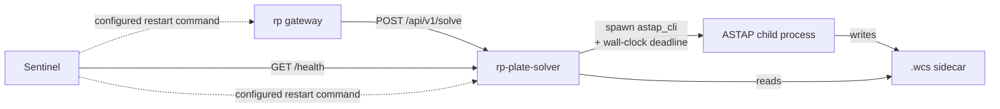

# rp-plate-solver — Service Design

## Overview

`rp-plate-solver` is an **rp-managed service** that wraps an
operator-supplied ASTAP CLI install and exposes a narrow HTTP solve
API to `rp`. It exists so plate solving — a hang-prone, crash-prone
external binary — runs in its own supervised process where its
failure modes cannot threaten `rp`'s liveness.

The service is **stateless across requests**: every solve spawns a
fresh `astap_cli` subprocess, waits for it under a wall-clock
deadline, parses the resulting `.wcs` sidecar, and returns. There is
no solve cache, no warm process pool, and no shared mutable state
between requests. Restart is always cheap and never costs more than
one in-flight request — which is what makes the supervision posture
described below safe.

Operators install ASTAP themselves (BYO per ADR-005). `rp-plate-solver`
ships no ASTAP binary, no index database, and no install script;
operators point it at their install via two required config fields.

**Cross-platform support:** Linux x64, Linux aarch64 (Pi 5), macOS
Apple Silicon, Windows x64 — matching ADR-005's hard constraints.

## Architecture



Three independent processes, three independent failure domains,
three independent supervisors. See [Sentinel
Integration](#sentinel-integration) below for the detail.

### Inputs and Outputs

- **Input:** an absolute filesystem path to a FITS file (rp and the
  service share a filesystem per `docs/services/rp.md` §"File
  Accessibility"), plus optional pointing and FOV hints.
- **Output:** a WCS solution (RA/Dec at image center, pixel scale,
  rotation) parsed from the `.wcs` sidecar ASTAP writes alongside
  the FITS, or a structured error.

No pixel bytes traverse HTTP. `rp` and the service trust each other
to read from a shared filesystem; this is the same trust assumption
`rp` already makes about its plugins (see `rp.md` §"File
Accessibility").

## Alignment with rp's Tenets

- **Tenet 1 — Robustness above all else.** The service exists *only*
  to honor this tenet. Wrapping ASTAP in its own process means an
  ASTAP SIGSEGV, hang, or deadlock cannot threaten `rp`'s session
  state. This rationale is the load-bearing argument for choosing
  rp-managed-service over plugin shape; see
  `docs/plans/rp-plate-solver.md` §"Stability and supervision" for
  the full discriminator.
- **Tenet 4 — Remote interfaces only.** HTTP between rp and the
  service. The service-to-ASTAP boundary is a CLI subprocess, not an
  in-process FFI link — same shape that ADR-005 evaluates and ADR-001's
  predecessor explicitly rejected for sep-sys.
- **Tenet 5 — Minimal footprint.** No long-running ASTAP processes,
  no warm caches, no embedded star database. The service holds only
  the request currently in flight.

## Behavioral Contracts

### HTTP API

The service exposes exactly two endpoints. The contract is frozen by
`docs/plans/rp-plate-solver.md` §"HTTP contract"; this section
states the behavior, not the wire format details.

#### `POST /api/v1/solve`

**Happy path:**

1. Service deserializes the request body. `fits_path` must be an
   absolute path; `timeout` must parse as humantime; hint fields are
   optional.
2. Service confirms `fits_path` exists and is readable.
3. Service acquires the single-flight semaphore (default
   concurrency = 1). Overlapping requests queue; they do not error.
4. Service spawns `astap_cli` with argv mapped from the request body
   (see [hint mapping](#hint-mapping) below).
5. Service waits for the child under the request's `timeout`
   (defaulting to `default_solve_timeout` from config).
6. On clean exit with zero status, service reads the `.wcs` sidecar
   ASTAP wrote next to the FITS, parses the four required fields,
   and returns them.
7. Service releases the semaphore.

**Error paths** all return the structured error envelope frozen in
the plan. Each error code corresponds to one failure scenario:

| Code | Trigger |
|------|---------|
| `invalid_request` | Schema-invalid body, non-absolute `fits_path`, unparseable `timeout`. Rejected before any subprocess work. |
| `fits_not_found` | `fits_path` does not exist or is not readable. Rejected before any subprocess work. |
| `solve_failed` | ASTAP exited non-zero, OR exited zero but did not write a `.wcs`, OR wrote a `.wcs` missing required keys. The error message names which sub-condition triggered. |
| `solve_timeout` | Wall-clock deadline expired. Service signaled the child (see [supervision](#subprocess-supervision)) and returned this error after the child exited (clean or forced). |
| `internal` | Unexpected wrapper failure: broken pipe, `.wcs` parse panic, file-system error reading the sidecar. Should be rare; surfacing as a distinct code keeps it visible in monitoring. |

`rp` always sees one of these five codes on failure. ASTAP's stderr
tail is included in the `details` field for `solve_failed` so the
operator can diagnose without console access to the wrapper.

#### `GET /health`

Returns `200 OK` with `{"status": "ok"}` when **all** of:

- Startup config validation passed.
- The configured `astap_binary_path` is still a regular file and
  still executable by the wrapper process at probe time.
- The configured `astap_db_directory` still exists and is still a
  directory at probe time.

Returns `503 Service Unavailable` if any of those checks fail. Both
runtime checks must pass: a binary present without its database
cannot solve, and a database without an executable binary cannot
either. The probe set matches the startup-validation set so
"healthy at probe time" means "still capable of solving."

The probe is intentionally cheap: two filesystem stats, no
subprocess spawn. Sentinel (or any operational tooling) may probe
at high frequency without costing wrapper performance.

How Sentinel uses this endpoint — vs. relying purely on event-stream
signals and the operator-configured restart command — is a
Sentinel-side design question. The currently-documented Sentinel
watchdog flow in `rp.md` only describes Alpaca service health
probes; whether to extend it to non-Alpaca rp-managed services is
addressed by the implementation plan's Phase 5.

### Subprocess Supervision

Every solve request is bounded by a wall-clock deadline. The
escalation sequence on deadline expiry is:

1. **t = deadline (graceful stage):**
   - Unix: `SIGTERM` to the child.
   - Windows: `CTRL_BREAK_EVENT` delivered via
     `GenerateConsoleCtrlEvent` to the child's process group. The
     child is spawned with `CREATE_NEW_PROCESS_GROUP` so the event
     reaches it without affecting the wrapper. Pattern follows
     `crates/bdd-infra/src/lib.rs`.

   ASTAP normally responds cleanly within ~100 ms.
2. **t = deadline + 2 s (force-kill stage):** if the child has not
   exited, escalate:
   - Unix: `SIGKILL`.
   - Windows: `TerminateProcess`.

   The 2 s grace is a fixed constant, not configurable — chosen to
   dominate any signal-handling latency ASTAP might exhibit while
   staying short enough that a wedged child doesn't tie up the
   single-flight semaphore.
3. The service waits for the child to fully exit (via `wait()`)
   before returning the `solve_timeout` error. The semaphore is
   released only after exit. This guarantees that a `solve_timeout`
   response is always followed by a free slot for the next request.

The service does not leak child processes. The explicit `wait()` is
the **correctness contract** — it guarantees no leak on the normal
deadline path. The wrapper additionally spawns every child with
`Command::kill_on_drop(true)` (and, on Windows, places the child in
a job object that auto-terminates members on handle close) as the
**safety net** for unexpected wrapper-side failures: a panic before
`wait()`, a future-cancellation that abandons the child, or any
other code path that drops the `Child` without explicit termination.
Tokio's default `Child` drop *detaches* the process, which is why
`kill_on_drop(true)` is required for the safety-net guarantee to
hold.

### Single-Flight Concurrency

ASTAP is CPU-bound on a single core during a solve. The service
serializes overlapping requests behind a `tokio::sync::Semaphore`
with capacity equal to `max_concurrency` (default 1).

Overlapping requests **queue, not error**. The HTTP request stays
open while waiting on the semaphore. Each request's `timeout`
applies to its solve only — time spent waiting in the queue is not
counted against the deadline. Operators who need to bound queue
depth do so at rp's HTTP-client layer (`plate_solver.timeout_secs`
in rp config), not here.

### Hint Mapping

Optional pointing and FOV hints map directly to ASTAP CLI flags:

| Request field | ASTAP flag | Notes |
|---------------|-----------|-------|
| `ra_hint` | `-ra <decimal hours>` | Wire format is decimal degrees (0–360) for consistency with `ra_center`; wrapper converts to hours (`degrees / 15`) before passing to ASTAP. |
| `dec_hint` | `-spd <degrees>` | Wire format is decimal degrees (−90–90); wrapper converts to south-pole-distance (`90 + dec`) before passing to ASTAP. |
| `fov_hint_deg` | `-fov <degrees>` | Pass-through (image height, per ASTAP CLI documentation). |
| `search_radius_deg` | `-r <degrees>` | Pass-through. Defaults to ASTAP's own default when omitted. |

Omitted fields produce no flag — ASTAP falls back to blind solve.
The wrapper does not synthesize hints; it never invents data the
caller did not provide.

### Configuration Validation at Startup

The service validates its config before binding the HTTP listener.
On any validation failure, it logs a structured error naming the
field and exits non-zero. Sentinel's restart loop then surfaces the
misconfiguration to the operator rather than masking it with a
silent retry.

Validation rules:

- `astap_binary_path` must exist, be a regular file, and be executable
  by the current user.
- `astap_db_directory` must exist and be a directory.
- `bind_address` must parse as an IP address.
- `default_solve_timeout` must be ≤ `max_solve_timeout` (otherwise
  the request-supplied timeout could exceed `max_solve_timeout`,
  defeating the bound).

The `astap_binary_path` validation runs again on every `/health`
probe, so a binary removed after startup is detected.

## Configuration

The service reads a single JSON config file passed via `--config`.

```json
{
  "bind_address": "127.0.0.1",
  "port": 11131,
  "astap_binary_path": "/opt/astap/astap_cli",
  "astap_db_directory": "/opt/astap/d05",
  "max_concurrency": 1,
  "default_solve_timeout": "30s",
  "max_solve_timeout": "120s"
}
```

| Field | Required | Default | Notes |
|-------|----------|---------|-------|
| `bind_address` | no | `127.0.0.1` | Bind to `0.0.0.0` only when rp runs on a different machine. |
| `port` | no | `11131` | Matches the placeholder rp config in `rp.md` §"Configuration". |
| `astap_binary_path` | **yes** | — | No default. Wrapper must be told where ASTAP is. |
| `astap_db_directory` | **yes** | — | No default. ASTAP needs an index database to solve; the operator picks D05 / D80 / etc. for their FOV. |
| `max_concurrency` | no | `1` | Capacity of the single-flight semaphore. v1 ships at 1; tuning above 1 is operator-driven and unsupported by the v1 budget assertions. |
| `default_solve_timeout` | no | `30s` | Applies when the request body omits `timeout`. |
| `max_solve_timeout` | no | `120s` | Caps any caller-supplied `timeout`. |

Required fields exit the process on absence (no implicit defaults
for "where is ASTAP" — see [Configuration Validation](#configuration-validation-at-startup)).

## Subprocess Test Doubles

The service ships an in-tree `mock_astap` `[[bin]]` that mimics the
ASTAP CLI surface and is used in BDD and supervision unit tests. The
pattern mirrors `services/phd2-guider/src/bin/mock_phd2.rs`.

Behavior is selected via the `MOCK_ASTAP_MODE` environment variable
the test sets before spawning the wrapper:

| Mode | Behavior | Drives |
|------|----------|--------|
| `normal` | Read `-f <path>`, write a canned `.wcs` next to it, exit 0 | Happy path |
| `exit_failure` | Write to stderr, exit 1 (no `.wcs`) | `solve_failed` (non-zero exit branch) |
| `hang` | Sleep indefinitely; respond to SIGTERM cleanly | `solve_timeout` (terminated) |
| `ignore_sigterm` | Trap SIGTERM, sleep anyway | `solve_timeout` (killed via SIGKILL) |
| `malformed_wcs` | Write a `.wcs` missing `CRVAL2`, exit 0 | `solve_failed` (parser-detected branch) |
| `no_wcs` | Exit 0 without writing any `.wcs` | `solve_failed` (sidecar-missing branch) |

Setting `MOCK_ASTAP_ARGV_OUT=<file>` (any mode) writes the received
argv to the named file, used for end-to-end argv-flow assertions.

This binary is **not feature-gated** — it builds with every
`cargo build --all-targets`. BDD discovers it via
`env!("CARGO_BIN_EXE_mock_astap")`.

### Real-ASTAP Coverage Cadence

A small set of `@requires-astap`-tagged BDD scenarios runs against
the real ASTAP binary, gated by a runtime check on the
`ASTAP_BINARY` environment variable. Scenarios skip silently when
the env var is unset (the PR-required path). They fire when the env
var is set, which is the dedicated nightly cross-platform smoke
workflow's job. See `docs/plans/rp-plate-solver.md` §"Real-ASTAP
coverage: cadence and gating" for the rationale and the `bdd.rs`
filter snippet.

## Sentinel Integration

The service is supervised by Sentinel via the standard
rp-managed-service supervision flow described in `rp.md`
§"Sentinel Watchdog Integration".

### Failure Domains

| Domain | Supervisor | Detection | Action |
|--------|-----------|-----------|--------|
| `rp` (gateway) | Sentinel | event-stream disconnect | Operator-configured restart command |
| `rp-plate-solver` (this service) | Sentinel | `GET /health` non-200 or no response within Sentinel's HTTP timeout | Operator-configured restart command (e.g., `systemctl restart rp-plate-solver`) |
| `astap_cli` (child) | This service | per-request wall-clock deadline | SIGTERM → 2 s grace → SIGKILL |

### Belt-and-Suspenders Outer Timeout

`rp`'s HTTP client to this service has its own outer timeout
(`plate_solver.timeout_secs` in rp config). Even if the wrapper's
internal timeout regresses, `rp` does not hang on a `plate_solve`
call. The wrapper's deadline is the primary control; rp's is the
backstop.

### What Sentinel Restart Recovers From

Stateless-across-requests is the property that makes restart safe.
Restarting the wrapper costs the in-flight request (which gets a
transient error and may be retried by the orchestrator) and nothing
else — no session state, no warm caches, no in-memory artifacts the
operator cares about.

## MVP Scope

### In scope for v1

- One solve endpoint, one health endpoint, one config file.
- Single ASTAP runner. Architecturally swappable for `solve-field`
  (per ADR-005), but only ASTAP is implemented.
- Single-flight default; queueing is built in but unused at default.
- BYO ASTAP per ADR-005. No bundled binary, no install scripts.

### Out of scope for v1

- `solve-field` runner. Trait shape exists; impl deferred.
- Background solving by subscribing to rp's `exposure_complete`
  events. The wrapper is request/response only.
- Solve cache or warm process pool. Explicitly excluded by
  stateless-across-requests.
- An MCP server surface. The wrapper speaks HTTP only; rp owns the
  `plate_solve` MCP tool name.
- Pixel transport over HTTP. File path only, per ADR-005.

## References

- ADR-005 — `docs/decisions/005-plate-solver.md`
- Implementation plan — `docs/plans/rp-plate-solver.md`
- rp design doc, §"Plate Solver" — `docs/services/rp.md`
- rp design doc, §"Sentinel Watchdog Integration" — `docs/services/rp.md`
- rp design doc, §"File Accessibility" — `docs/services/rp.md`
- Reference service shape — `docs/services/phd2-guider.md`
- Mock-binary precedent — `services/phd2-guider/src/bin/mock_phd2.rs`
