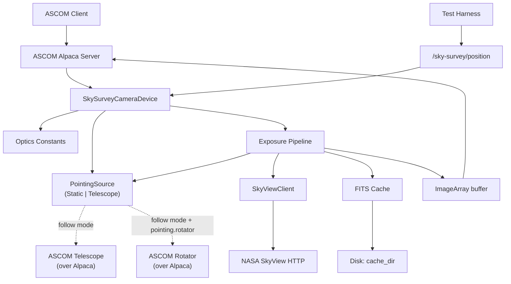

# Sky-Survey-Camera Service Design

## Overview

The `sky-survey-camera` service is an ASCOM Alpaca **Camera** simulator that
synthesises exposures from NASA SkyView cutouts. Given a fixed simulated
optical system (focal length, sensor pixel count, pixel size) and a sky
position (RA/Dec, optionally rotation), it produces an `ImageArray` whose
pixel grid corresponds to the field of view the equivalent real telescope
would see.

The service is a development and testing aid:

- Drives ASCOM clients (NINA, SGPro, calibrator-flats, the rp orchestrator)
  end-to-end without hardware.
- Lets the rest of the rusty-photon stack rehearse pointing/centering/plate
  solving against real sky data.
- Is deterministic: the same position + optics yield the same frame.

**Cross-platform:** Linux, macOS, Windows. No platform-specific
dependencies — same posture as `filemonitor`.

## MVP Scope

**In scope (v0).** This is the boundary that drives BDD scenario
selection in `tests/features/`. Anything outside this list is deferred
to *Future Work*.

- ASCOM Alpaca Camera ICameraV3 implementation, monochrome,
  16-bit-equivalent ADU range.
- Single survey/band per device instance, fixed at startup by config.
- Fixed simulated optics from config: focal length, pixel size,
  sensor pixel count.
- Initial pointing from config; runtime updates via
  `POST /sky-survey/position`.
- `StartExposure` pipeline: derive cutout geometry → fetch from
  SkyView → cache FITS on disk → expose as `ImageArray`.
- Sub-frame and binning honoured at readout (`NumX`/`NumY`/`StartX`/
  `StartY`/`BinX`/`BinY`).
- `Light = false` produces a zero-filled frame of the requested
  binned sub-frame dimensions (no SkyView fetch).
- ASCOM connect/disconnect lifecycle, `ImageReady` semantics,
  `AbortExposure` / `StopExposure` cancellation.
- ConformU integration test driven against a stubbed survey backend
  (no real network in CI).

**Deferred (see *Future Work*).**

- Local resampling / rotation independent of SkyView's sampler.
- Signal model: exposure-time scaling, Poisson + Gaussian noise,
  bias offset, dark current, hot pixels.
- Multiple bands selected via an attached ASCOM FilterWheel.
- Additional survey backends (CDS `hips2fits`, local HiPS tiles).
- Bayer / one-shot colour, cooling, pulse guiding, fast readout.
- TLS and HTTP Basic Auth (would compose `rp-tls` / `rp-auth`).
- Cache eviction.

## Implementation Framework

The service uses the `ascom-alpaca` crate already pinned in the workspace.
The `Camera` trait covers the standard ASCOM Camera surface; this service
implements the V3 interface (`InterfaceVersion = 3`).

For the survey backend the service uses **NASA SkyView** at
`https://skyview.gsfc.nasa.gov/current/cgi/runquery.pl`. SkyView accepts an
exact pixel grid and angular size, returning a FITS cutout with WCS
headers. v0 ships with a single concrete `SkyViewClient` (in `src/
survey.rs`) — a `SurveyClient` trait abstraction is deferred until a
second backend (e.g. CDS `hips2fits`) is added; see *Future Work*.

## Configuration

```json
{
  "device": {
    "name": "Sky Survey Camera",
    "unique_id": "sky-survey-camera-001",
    "description": "ASCOM Alpaca Camera simulator backed by NASA SkyView"
  },
  "optics": {
    "focal_length_mm": 1000.0,
    "pixel_size_x_um": 3.76,
    "pixel_size_y_um": 3.76,
    "sensor_width_px": 6248,
    "sensor_height_px": 4176
  },
  "pointing": {
    "initial_ra_deg": 83.8221,
    "initial_dec_deg": -5.3911,
    "initial_rotation_deg": 0.0,
    "telescope": null,
    "rotator": null
  },
  "survey": {
    "name": "DSS2 Red",
    "request_timeout": "30s",
    "cache_dir": "/var/cache/sky-survey-camera"
  },
  "server": {
    "port": 11116
  }
}
```

Every block above (`Config` and each nested config struct) rejects unknown
keys at deserialize (`deny_unknown_fields`), so a typo or a key removed by a
schema change fails loudly at load instead of being silently ignored.

Configuration sections:

- **device** — ASCOM device metadata.
- **optics** — Fixed simulated optical system. `focal_length_mm` plus
  `pixel_size_*_um` derive the plate scale; `sensor_*_px` set
  `CameraXSize` / `CameraYSize`.
- **pointing** — Initial RA/Dec/rotation used until the runtime API
  overrides them. Stored as plain `f64` degrees in J2000. The optional
  `telescope` sub-block (next bullet) switches the camera into
  *telescope-following mode*; when absent, the camera operates in
  *static-pointing mode* (the v0 behaviour).
- **pointing.telescope** *(optional)* — When present, switches the
  camera into telescope-following mode: `StartExposure` reads RA/Dec
  from the configured ASCOM Telescope (over Alpaca) instead of from
  the cached `PointingState`, then adds a fixed angular offset to
  simulate cone error / pointing-model residuals (see
  *Pointing Offset Simulation*).

  ```jsonc
  "telescope": {
    "alpaca_url": "http://127.0.0.1:32323",
    "device_number": 0,                  // index of the Telescope on the Alpaca server
    "offset_ra_arcsec": 0.0,             // signed; added to mount RA before SkyView request
    "offset_dec_arcsec": 0.0,            // signed; added to mount Dec before SkyView request
    "request_timeout": "2s",             // humantime; bound on each Telescope read
    "auth": null                         // optional rp_auth ClientAuthConfig
  }
  ```

  Field rules:

  - `alpaca_url` + `device_number` resolve a single ASCOM Telescope.
    The camera does **not** call `set_connected(true)` on the mount —
    whoever owns the mount (typically `rp`) is responsible for
    connecting it. A read against a disconnected Telescope surfaces
    the standard ASCOM error via F2.
  - `offset_*_arcsec` default to `0.0`. Non-finite values are rejected
    at config load. The offset is applied as a constant in topocentric
    RA/Dec; large RA offsets wrap modulo 360°, large Dec offsets are
    clamped to ±90° with a `warn!` log (a clamp indicates a config
    error worth surfacing).
  - `request_timeout` defaults to `2s`, validated `> 0`. Bounds the
    extra latency a wedged mount can add to `StartExposure`.
  - `auth` reuses `rp_auth::config::ClientAuthConfig` for symmetry
    with `rp`'s mount config.
- **pointing.rotator** *(optional)* — When present, sources
  `rotation_deg` from a connected ASCOM Rotator's position angle on
  every light `StartExposure` instead of the static
  `initial_rotation_deg` (see *Telescope follow mode* F8). Parallel to
  `pointing.telescope` but with no offset fields — the rotator's
  `position` is read straight through.

  ```jsonc
  "rotator": {
    "alpaca_url": "http://127.0.0.1:32323",
    "device_number": 0,                  // index of the Rotator on the Alpaca server
    "request_timeout": "2s",             // humantime; bound on each Rotator read
    "auth": null                         // optional rp_auth ClientAuthConfig
  }
  ```

  Field rules:

  - **Only valid in follow mode.** `pointing.rotator` requires
    `pointing.telescope`; a config that sets the rotator without the
    telescope is rejected at load (static mode has no `rotation_deg`
    source to override — rotation comes from the static value /
    `POST`). There is no "static mode + rotator," the same way there is
    no "static mode + offset."
  - `alpaca_url` + `device_number` resolve a single ASCOM Rotator. As
    with the mount, the camera does **not** call `set_connected(true)`
    on the rotator — whoever owns it (`rp`, a guiding stack) connects
    it. A read against a disconnected rotator surfaces the standard
    ASCOM error via F8 (same path as F2).
  - `request_timeout` defaults to `2s`, validated `> 0`. Bounds the
    extra latency a wedged rotator can add to `StartExposure`.
  - The ASCOM `Position` property is read — the synced sky position
    angle of the field, the orientation the simulator renders.
- **survey** — Backend selector + request timeout (humantime per the
  `Duration` convention) + on-disk cache directory.
- **server** — Listening port. TLS and Basic Auth are added later via
  `rp-tls` / `rp-auth` if needed; out of scope for v0.

### Device identity (UniqueID)

ASCOM Alpaca requires every device's `UniqueID` to be **globally
unique** and to **never change**, but the protocol enforces neither —
uniqueness must come from how the id is generated. The camera mints
its own spec-compliant identity on first run rather than relying on
the operator to hand-write a unique string.

- **`device.unique_id` is optional in the config file.** It is loaded
  with `#[serde(default)]`, so a file that omits it (or leaves it
  empty) deserializes to an empty string.
- **On startup, before loading the config, `run` calls
  `rusty_photon_config::materialize_identity` on the config file**
  with the single identity pointer `/device/unique_id`. If that
  pointer is absent or empty, a fresh **UUIDv4** is minted and the
  file is rewritten atomically (staged temp file → fsync → rename).
  The operation is **idempotent**: an id that already exists is never
  overwritten, and a run that fills nothing performs no write. The
  next load then reads the stable, persisted id.
- **A missing config file remains a hard error.** Unlike services that
  have a `Config::default()`, this camera has none — the `optics`
  fields (focal length, pixel size, sensor dimensions) are mandatory
  and have no sensible default. Identity materialization therefore
  runs **only when the config file already exists**; it never
  scaffolds an identity-only file, because `load_config` would then
  immediately fail on the missing `optics` section anyway. Operators
  must supply a config file with at least the `optics` (and the other
  required) sections; the `device.unique_id` is the one field they may
  safely leave out and let the service generate.

This is shared behaviour provided by the `rusty-photon-config` crate,
identical across the rusty-photon drivers.

> **`--config` default change.** The `--config` flag previously
> defaulted to the CWD-relative string `config.json`. It is now an
> optional argument: when omitted, the path is resolved via
> `rusty_photon_config::resolve_config_path("sky-survey-camera", …)`
> to the platform config directory
> (`~/.config/rusty-photon/sky-survey-camera.json` on Linux,
> `%PROGRAMDATA%\rusty-photon\sky-survey-camera.json` on Windows). **Operators who relied on a
> CWD-local `config.json` must now pass `--config config.json`
> explicitly.**

### Derived Quantities

```
plate_scale_x_arcsec_per_px = 206.265 * pixel_size_x_um / focal_length_mm
plate_scale_y_arcsec_per_px = 206.265 * pixel_size_y_um / focal_length_mm

fov_x_deg = plate_scale_x_arcsec_per_px * sensor_width_px  / 3600
fov_y_deg = plate_scale_y_arcsec_per_px * sensor_height_px / 3600
```

These are computed once at construction and exposed via debug logging.

### Config actions

The camera exposes its configuration over HTTP as the vendor ASCOM actions
`config.get` / `config.apply` / `config.schema` — the cross-driver protocol in
[`config-actions.md`](config-actions.md), implemented generically in
`rusty_photon_config::actions`. `config_actions.rs` supplies the driver-specific
half (`ConfigurableDriver for SkySurveyCameraDriver`, `Overrides = ()` — the
binary has no CLI overrides) plus the `dispatch` the camera device delegates to.

- **Secrets redacted / carried forward:** the follow-mode client passwords
  `/pointing/telescope/auth/password` and `/pointing/rotator/auth/password`.
- **Locked (identity) field:** `device.unique_id`.
- **Hard read-only field:** `server.port`.
- **Validation** mirrors load-time `config::validate` (telescope offsets finite,
  request timeouts > 0, rotator-requires-telescope) as field-level errors.

Because the config has mandatory `optics` fields and no `Config::default()`, the
shared `config_apply` seeds its file-read fallback from the running config rather
than a default. A `config.apply` that changes a field persists atomically,
returns `status:"applying"`, and fires the in-process reload: `main.rs` runs
under `ServiceRunner::with_reload().run_with_reload(...)`, whose loop
(`run_reloadable`) rebuilds the server from the freshly-persisted file.

## Operation

### Pointing State

`PointingState { ra_deg, dec_deg, rotation_deg }` is the snapshot the
exposure pipeline consumes. Where that snapshot comes from is decided
once at construction (by `build_device` in `src/lib.rs`) by the `PointingSource`
enum:

```rust
enum PointingSource {
    Static(Arc<SharedPointing>),   // pointing.telescope absent (v0 default)
    Telescope(TelescopeFollow),    // pointing.telescope present
}
```

- **`Static`** — Holds an `Arc<SharedPointing>` whose inner
  `RwLock<PointingState>` is shared with `DeviceState::last_snapshot`,
  so `POST /sky-survey/position` writes are immediately visible to
  the exposure pipeline and to `GET /sky-survey/position`. It starts
  from `pointing.initial_*`. `StartExposure` reads the current value
  at the moment the exposure begins. This is the v0 behaviour and
  the default when `pointing.telescope` is absent.
- **`Telescope`** — Wraps a `TelescopeFollow` whose `reader: Arc<dyn
  MountReader>` is the production `AlpacaMountReader` in deployed
  builds and a `mockall`-generated double in unit tests.
  `MountReader` is a narrow in-crate trait around just the two ASCOM
  reads we need (`right_ascension`, `declination`); it intentionally
  hides the full `ascom_alpaca::api::Telescope` surface from this
  module so unit tests don't have to mock 50+ unrelated methods.
  `StartExposure` reads RA/Dec on every exposure (no client-side
  cache — see F4), applies the configured offset, and uses the
  result as the snapshot's RA/Dec. After a successful read the
  exposure pipeline writes the result back into `last_snapshot` so
  `GET /sky-survey/position` reflects the most recent snapshot
  (F6). `rotation_deg` is sourced from the configured ASCOM Rotator's
  position angle when `pointing.rotator` is set (F8), read on every
  light exposure alongside RA/Dec; otherwise it stays at the static
  `pointing.initial_rotation_deg` (ASCOM Telescope itself has no
  rotation property). `POST /sky-survey/position` is rejected
  with `409 Conflict` in this mode (F6) — any write would be
  silently overwritten by the next mount read.

The mode is fixed for the life of the device. Switching at runtime
would require teaching `POST /sky-survey/position` to "fall back" or
"override," which is feature creep without a driving use case.

### `StartExposure` Pipeline

1. Validate parameters against the rules in *Behavioral Contracts*.
2. Read `Duration`, `Light`, `BinX/Y`, `NumX/Y`, `StartX/Y` and
   snapshot the current `PointingState`.
3. If `Light = false`, synthesise a zero-filled `i32` array of size
   `NumX * NumY` and skip to step 7.
4. Compute the SkyView request geometry for the **full sensor at the
   requested binning**, not just the requested sub-frame:
   - `pixels = (sensor_width_px / BinX, sensor_height_px / BinY)`
   - `size_deg = (plate_scale_x_arcsec * sensor_width_px / 3600,
                  plate_scale_y_arcsec * sensor_height_px / 3600)`
   `StartX/Y` and `NumX/Y` do **not** influence the SkyView request —
   they are applied later as a local crop. Requesting the full binned
   frame keeps cache hits useful across sub-frame variations at the
   same pointing.
5. Look up `(survey, ra, dec, rotation, pixels, size)` in the on-disk
   cache using those full-frame binned parameters. On miss, request
   SkyView with them, parse the response, and (only on successful
   parse) store the FITS bytes in the cache.
6. Parse the FITS primary HDU into `(width, height, Vec<i32>)`,
   without scaling, noise, or bias (decision #4 in the design
   discussion: raw survey data passes through). Apply the sub-frame
   crop using `(StartX, StartY, NumX, NumY)` to produce the final
   `NumX × NumY` array.
7. Update `LastExposureStartTime` and `LastExposureDuration`, mark
   `ImageReady = true`, surface the array via `ImageArray` /
   `ImageArrayVariant`.

The exposure `Duration` parameter is accepted and logged but does not
scale the signal in v0. We can add linear scaling and noise later when
the simulator needs to feed downstream tools (e.g. flat calibration)
that depend on signal-vs-time behaviour.

### Connection Management

- `set_connected(true)` — validates the survey backend is reachable
  (HEAD request to SkyView), warms the optics-derived constants, and
  arms the device. In telescope-following mode, this does **not**
  probe the configured Telescope: a wedged or briefly-unreachable
  mount must not block the camera from coming up (the same C3
  reasoning that keeps SkyView's TLS handshake out of the Connect
  path). The first `StartExposure` will surface a mount-read error
  via F2.
- `set_connected(false)` — drops any in-flight exposure future and
  returns `NotConnected` for subsequent operations.

### Pointing Offset Simulation

In telescope-following mode the camera adds a fixed angular offset to
the mount-reported RA/Dec before forming the SkyView request:

```text
cutout_ra_deg  = (mount_ra_deg + offset_ra_arcsec  / 3600).rem_euclid(360)
cutout_dec_deg = clamp(mount_dec_deg + offset_dec_arcsec / 3600, -90, +90)
```

**Why this exists.** OmniSim's Telescope is mechanically perfect: a
slew to `(RA, Dec)` produces a mount that reports exactly `(RA, Dec)`.
Without injected error, a centering loop (`slew → expose → plate-solve
→ sync_mount`) has nothing to converge from — every iteration solves
to the same coordinates the mount already reports. The offset is the
simulator analog of cone error / a stale pointing model, the very
thing centering corrects in production.

**Sign convention.** Offsets are in topocentric RA/Dec arcseconds, the
same units `sync_mount` corrects against. Positive `offset_ra_arcsec`
shifts the rendered cutout east of where the mount thinks it's
pointing; positive `offset_dec_arcsec` shifts it north. After the
first `sync_mount` the mount's reported RA/Dec lines up with the
solved center, so the offset's effect on subsequent iterations
collapses and the loop converges in one corrective step (matching the
"sync on first iteration only" invariant of `center_on_target`).

**Static mode is unaffected.** When `pointing.telescope` is absent,
the offset fields don't exist and `StartExposure` snapshots
`PointingState` directly from the cached static value. There is no
"static mode + offset" — it would just be a different static
position.

## Custom HTTP Endpoints (Runtime Pointing API)

Beyond the standard ASCOM Alpaca surface, the service exposes additional
HTTP endpoints under a distinct `/sky-survey/` prefix on the same port,
so they cannot be mistaken for ASCOM methods by strict clients:

| Method | Path | Body | Response | Purpose |
|--------|------|------|----------|---------|
| `GET`  | `/sky-survey/position` | — | `{ "ra_deg": f64, "dec_deg": f64, "rotation_deg": f64 }` | Read current pointing |
| `POST` | `/sky-survey/position` | `{ "ra_deg": f64, "dec_deg": f64, "rotation_deg"?: f64 }` | `204 No Content` | Update pointing; missing `rotation_deg` keeps the current value |

Validation:

- `ra_deg` ∈ [0, 360); values outside the range are 400.
- `dec_deg` ∈ [-90, +90]; out-of-range values are 400.
- `rotation_deg` is wrapped into [0, 360) before storage.
- `POST` while disconnected returns 409 (the device must be connected
  to accept new pointing, mirroring ASCOM's `NotConnected` semantics).
- `POST` while in telescope-following mode arms a one-shot
  override (F6 + F7) consumed by the next light exposure. `GET`
  continues to work in both modes and returns the most recently
  snapshotted pointing.

Updates take effect on the **next** `StartExposure`; an in-flight
exposure is not interrupted.

These endpoints are added by composing the `ascom-alpaca` server's
axum router with our own router, the same pattern `rp` uses to mount
`/mcp` alongside its REST surface (see `docs/workspace.md` →
"HTTP gateway services"). If composition turns out to be impractical
with the current `ascom-alpaca` API, the fallback is to expose the
same operation via ASCOM's standard `Action` mechanism
(`PUT /api/v1/camera/0/action` with `Action=setposition`); the JSON
shape stays the same.

### Static mode and follow mode coexist

Both modes are first-class:

- **Static mode** (`pointing.telescope` absent) is the v0 default. It
  keeps the camera decoupled from any mount, lets test harnesses set
  position deterministically via `POST /sky-survey/position`, and
  keeps the simulator usable in setups without a Telescope at all
  (e.g. flat-frame rehearsal, pure ConformU runs).
- **Telescope-following mode** (`pointing.telescope` present) is the
  realistic-rig mode: the camera follows whatever the mount reports,
  with an optional injected offset. This is what `center_on_target`
  exercises end-to-end in BDD — the loop closes through real
  `slew_to_coordinates_async` / `sync_to_coordinates` calls on the
  same Telescope the camera reads from.

The custom endpoint stays useful in both modes: in static mode for
runtime pointing updates, in follow mode for read-back of the
most-recently-snapshotted state via `GET`.

## Behavioral Contracts

Each bullet is a named, testable behaviour. These map one-to-one to BDD
scenarios in `tests/features/`. ASCOM error codes use the names from
`docs/references/ascom-alpaca.md`.

### Connection lifecycle

- **C1.** `set_connected(true)` validates the configured `cache_dir`
  is writable and probes the survey endpoint with a short capped HEAD
  request. On success, `Connected` becomes `true`.
- **C2.** `set_connected(true)` while `cache_dir` cannot be
  created or is not writable returns `UNSPECIFIED_ERROR` and
  `Connected` stays `false`.
- **C3.** A failed HEAD probe (timeout, DNS failure, non-2xx) is
  logged at `warn!` and **does not** block Connect — `Connected`
  becomes `true` regardless. Tying ASCOM Connect latency to NASA's
  TLS handshake makes the simulator flaky on slow links and in CI;
  the next `StartExposure` will surface a hard failure via S4 if
  the endpoint is genuinely down.
- **C4.** `set_connected(false)` cancels any in-flight exposure and
  resets `LastExposureStartTime` / `LastExposureDuration` to the
  unset state; subsequent ASCOM operations return `NOT_CONNECTED`.

### Pointing API

- **P1.** `GET /sky-survey/position` returns the current pointing
  state regardless of connection state.
- **P2.** `POST /sky-survey/position` with `ra_deg ∈ [0, 360)` and
  `dec_deg ∈ [-90, +90]` and the device connected returns
  `204 No Content` and updates the pointing state atomically.
- **P3.** A `POST` payload with `rotation_deg` omitted preserves the
  current rotation.
- **P4.** A `POST` payload with `ra_deg` outside `[0, 360)` or
  `dec_deg` outside `[-90, +90]` returns `400 Bad Request` and the
  pointing state is unchanged.
- **P5.** A malformed JSON body or a missing required field returns
  `400 Bad Request`.
- **P6.** `POST /sky-survey/position` while disconnected returns
  `409 Conflict` and the pointing state is unchanged. (Follow-mode
  produces a separate 409; see F6.)
- **P7.** A pointing update issued during an in-flight exposure does
  not affect the in-flight exposure's snapshotted pointing; it takes
  effect on the next `StartExposure`.

### `StartExposure` parameter validation

Per ASCOM convention, the `NumX` / `NumY` / `StartX` / `StartY` setters
accept any `u32` value. Geometry validation is enforced at
`StartExposure`, not at the property setter — this is what ConformU's
"Reject Bad …" tests exercise. `BinX` / `BinY` are validated at the
setter because the spec defines a hard `[1, MaxBin]` range.

- **E1.** `StartExposure` while disconnected returns `NOT_CONNECTED`.
- **E2.** `StartExposure` while another exposure is in flight
  (`ImageReady = false` and not yet aborted) returns
  `INVALID_OPERATION`.
- **E3.** `BinX` or `BinY` outside `[1, MaxBinX/Y]` is rejected at
  the property setter with `INVALID_VALUE`.
- **E4.** `StartExposure` with `NumX = 0` or `NumY = 0` returns
  `INVALID_VALUE`.
- **E5.** `StartExposure` with `StartX + NumX > CameraXSize / BinX`,
  or the analogous Y-axis condition, returns `INVALID_VALUE`.
- **E6.** `StartExposure` with `Duration` outside
  `[ExposureMin, ExposureMax]` returns `INVALID_VALUE`.

### `StartExposure` survey path

- **S1.** A successful SkyView fetch produces an `ImageArray` with
  dimensions `NumX × NumY` (post sub-frame, post binning), 32-bit
  signed integer values, `ImageReady = true`,
  `LastExposureStartTime` and `LastExposureDuration` set.
- **S2.** `Light = false` skips the SkyView fetch and produces a
  zero-filled array of size `NumX × NumY`.
- **S3.** A cache hit on `(survey, ra, dec, rotation, pixels, size)`
  serves the array without an outbound HTTP request.
- **S4.** SkyView unreachable, an HTTP 5xx response, or a request
  that exceeds `survey.request_timeout` returns
  `UNSPECIFIED_ERROR`; `ImageReady` stays `false` and the next
  `StartExposure` may retry.
- **S5.** A non-FITS body or a malformed FITS payload from SkyView
  returns `UNSPECIFIED_ERROR`; the bad bytes are not cached.
- **S6.** A failure to write the cache entry on the response path
  is logged at `warn!` but does not fail the exposure — the
  `ImageArray` is still returned.

### Cancellation

- **A1.** `AbortExposure` and `StopExposure` during an in-flight
  SkyView fetch cancel the request and leave `ImageReady = false`.
- **A2.** `AbortExposure` or `StopExposure` with no exposure in
  progress returns `INVALID_OPERATION`.

### Telescope follow mode

Active only when `pointing.telescope` is present in config. F-contracts
do not apply in static mode.

- **F1.** With `pointing.telescope` set, every light `StartExposure`
  (`Light = true`) reads `right_ascension` and `declination` fresh
  from the configured ASCOM Telescope and snapshots
  `PointingState { ra_deg: (mount_ra + offset_ra).rem_euclid(360),
   dec_deg: clamp(mount_dec + offset_dec, -90, +90),
   rotation_deg: <rotator position angle if pointing.rotator set,
   else pointing.initial_rotation_deg> }`.
  Rotation is sourced from the configured ASCOM Rotator when
  `pointing.rotator` is present (F8); the ASCOM Telescope itself has
  no rotation property, so without a rotator the static value is used.
  Dark exposures (`Light = false`) skip the mount read entirely —
  they produce a zero-filled frame per S2 and have no sky to render,
  so the read would only add latency. `last_snapshot` is therefore
  not refreshed by a dark frame.
- **F2.** A failed Telescope read (transport error, ASCOM error, or a
  read that exceeds `pointing.telescope.request_timeout`) returns
  `UNSPECIFIED_ERROR`, sets `last_error`, and leaves
  `image_ready = false`. Logged at `warn!`. The next `StartExposure`
  retries with a fresh read.
- **F3.** `set_connected(true)` succeeds even if the mount is
  unreachable. The mount is read fresh on the *next* `StartExposure`,
  where any error surfaces via F2. (Same posture as C3 for SkyView:
  ASCOM Connect must not block on slow upstream handshakes.)
- **F4.** Mount RA/Dec are read fresh on every light `StartExposure`
  (see F1 on dark exposures). There is no client-side cache —
  caching would mask `slew` events that other Alpaca clients
  (notably `rp`) issued between exposures, defeating follow-mode's
  purpose.
- **F5.** The configured offset is applied as
  `(mount_ra_deg + offset_ra_arcsec/3600).rem_euclid(360)` for RA and
  `clamp(mount_dec_deg + offset_dec_arcsec/3600, -90, +90)` for Dec.
  A clamp on Dec produces a `warn!` log (it indicates a config error
  worth surfacing). Non-finite offsets are rejected at config load,
  not at snapshot time.
- **F6.** `POST /sky-survey/position` while `pointing.telescope` is
  set arms a one-shot pointing override (see F7); the live snapshot
  source (`PointingSource::Telescope`) is unchanged. `GET
  /sky-survey/position` continues to work in follow mode and
  returns the most recently snapshotted pointing (mount-reported +
  offset, or the override if it was just consumed).
- **F7.** A one-shot pointing override armed by `POST
  /sky-survey/position` in follow mode is consumed at the next
  `StartExposure` call (`Light = true`) — captured *before* the
  spawned exposure task runs, so a POST issued while an exposure is
  mid-flight only takes effect on the *following* exposure (P7).
  The exposure pipeline uses the override as that exposure's
  `PointingState` (missing `rotation_deg` keeps the most-recently-
  snapshotted rotation, matching P3), writes it to `last_snapshot`
  so `GET` reflects it, and clears the override. Subsequent
  exposures resume reading the mount per F1. Dark exposures (`Light
  = false`) do NOT consume the override (per F1, dark frames skip
  the snapshot/mount-read path entirely). The override is intended
  as a test affordance for injecting "the camera saw something
  different from where the mount thinks it is" on a single capture;
  production deployments rarely use it.
- **F8.** With `pointing.rotator` set (which requires
  `pointing.telescope` — see *Configuration*), every light
  `StartExposure` reads the ASCOM Rotator's `position` (its synced
  sky position angle, in degrees) fresh alongside the mount RA/Dec
  and uses it, wrapped into `[0, 360)`, as `PointingState::rotation`.
  Without `pointing.rotator`, rotation stays at the static
  `pointing.initial_rotation_deg` and today's behaviour is preserved
  verbatim. A failed rotator read (transport error, ASCOM error, or a
  read exceeding `pointing.rotator.request_timeout`) aborts the
  snapshot and surfaces via the same `UNSPECIFIED_ERROR` path as F2:
  `last_error` is set, `image_ready` stays `false`, logged at
  `warn!`, and the next `StartExposure` retries with a fresh read.
  Like the mount (F3/F4), the rotator is read on every light exposure
  with no client-side cache, and `set_connected(true)` does not probe
  it. Dark exposures skip the rotator read (per F1, they skip the
  snapshot path entirely).

## Architecture



## ASCOM Camera Surface — v0 Behaviour

| Property / Method | Behaviour |
|---|---|
| `CameraXSize` / `CameraYSize` | From `optics.sensor_width_px` / `sensor_height_px` |
| `PixelSizeX` / `PixelSizeY` | From `optics.pixel_size_*_um` |
| `BinX` / `BinY` | Settable, integer, capped by `MaxBinX` / `MaxBinY` at the setter |
| `MaxBinX` / `MaxBinY` | `4` (configurable later) |
| `CanAsymmetricBin` | `false` |
| `NumX` / `NumY` / `StartX` / `StartY` | Setters accept any `u32`; geometry checked at `StartExposure` (E4/E5) |
| `MaxADU` | `65535` (16-bit equivalent) |
| `ElectronsPerADU` | `1.0` placeholder (no signal model in v0) |
| `FullWellCapacity` | `65535.0` (= `MaxADU * ElectronsPerADU`) |
| `ExposureMin` / `ExposureMax` / `ExposureResolution` | `1µs` / `3600s` / `1µs`; the spawned exposure task sleeps for `min(Duration, 5s)` so clients can observe `CameraState = Exposing` |
| `Gain` / `GainMin` / `GainMax` | Single fixed value `0`; setter rejects non-zero with `INVALID_VALUE` |
| `Offset` family | Reports `PROPERTY_NOT_IMPLEMENTED` (no signal model) |
| `ReadoutMode` / `ReadoutModes` | Single mode `"Default"` at index `0`; setter rejects non-zero |
| `SensorName` / `SensorType` | `"SkyView Virtual Sensor"` / `Monochrome` |
| `CameraState` | `Idle` / `Exposing` / `Error` based on internal state |
| `PercentCompleted` | Binary: `0` while in flight, `100` once `ImageReady` |
| `CanAbortExposure` / `CanStopExposure` | `true`, both cancel the in-flight survey fetch |
| `CoolerOn`, `CCDTemperature`, `CanGetCoolerPower`, `CanSetCCDTemperature`, `CanPulseGuide`, `CanFastReadout`, `HasShutter`, `BayerOffsetX/Y` | All `false` / `PROPERTY_NOT_IMPLEMENTED` |
| `StartExposure` / `AbortExposure` / `StopExposure` / `ImageReady` / `ImageArray` / `ImageArrayVariant` | Implemented per pipeline above; `ImageArray` returns the cropped subframe with axes `[X, Y]` |

ConformU is the canonical ASCOM correctness check. The
`tests/conformu_integration.rs` target (gated by the `conformu`
feature) drives ConformU against the simulator with a stub HTTP
backend so CI doesn't depend on real SkyView availability:

```bash
bazel test //services/sky-survey-camera:conformu_integration
```

The stub serves a synthetic FITS payload via
[`mock::synthetic_fits`] (gated by the `mock` feature) so
`StartExposure` / `ImageArray` exercise the full pipeline end-to-end.

## Caching

Cache key: a 16-character hex digest from `std::collections::hash_map::
DefaultHasher` over
`survey_name | ra_deg | dec_deg | rotation_deg | pixels_x | pixels_y | size_x_deg | size_y_deg`
with floating-point fields rounded (RA/Dec to 1e-4 deg, sizes to
1e-6 deg) so that minor drift hits the same entry. Stored as
`<cache_dir>/<hex>.fits`. The cache is local-only and the operator
clears `cache_dir` manually — `DefaultHasher` is non-cryptographic and
not stable across Rust versions, but neither property is needed here.
No sidecar metadata in v0. No eviction; manual cleanup.

## Module Sketch (informative)

A suggested module breakdown — *informative, not normative*. The
behavioural contracts above are the spec; the actual code may merge,
split, or rename modules so long as the BDD scenarios pass.

1. **`config.rs`** — `Config { device, optics, pointing, survey, server }`
   with `humantime_serde` on the `Duration` field.
2. **`error.rs`** — `SkySurveyCameraError` enum (config, survey HTTP,
   FITS parse, cache I/O, invalid request).
3. **`optics.rs`** — `Optics` struct: derived plate scales, FOV, helpers
   for cutout geometry.
4. **`pointing.rs`** — `PointingState`, `SharedPointing` (the
   `RwLock` cache used as the static-mode source *and* the
   most-recent-snapshot cache for follow mode), the narrow in-crate
   `MountReader` trait around the two ASCOM reads we need
   (`right_ascension`, `declination`), the equally-narrow
   `RotatorReader` trait around the one rotator read (`position`),
   and the `PointingSource` enum
   (`Static(Arc<SharedPointing>)` / `Telescope(TelescopeFollow)`).
   `TelescopeFollow` owns an `Arc<dyn MountReader>`, an optional
   `Arc<dyn RotatorReader>`, and the configured offset, and
   implements the F1/F5/F8 read path.
5. **`mount.rs`** — `AlpacaMountReader`, the production
   `MountReader` impl. Builds the `ascom_alpaca::Client` at
   construction (cheap, no network) and resolves the Telescope
   device lazily on first read; the resolved `Arc<dyn Telescope>` is
   cached on success and re-resolved after failure so a transient
   outage doesn't poison the client. Per F3, this never calls
   `set_connected(true)` on the mount.
   - **`rotator.rs`** — `AlpacaRotatorReader`, the production
     `RotatorReader` impl. The exact mirror of `mount.rs` (lazy
     device resolution, cache-on-success, never connects), reading
     the ASCOM `Position` property per F8.
   - **`alpaca.rs`** — `build_alpaca_client`, the shared Alpaca
     client constructor (plain or `Basic`-auth) used by both readers
     so auth handling can't drift between device classes.
6. **`survey.rs`** — `SurveyClient` trait
   (`health_check`, `fetch`), `SkyViewClient` HTTP backend, and
   the disk cache helpers (`try_cache_load` / `try_cache_store`).
7. **`mock.rs`** (gated by the `mock` feature) — `MockSurveyClient`
   plus the `synthetic_fits` helper used by the ConformU
   integration test's stub backend.
8. **`fits.rs`** — Thin shim over `rp_fits::reader::read_primary_as_i32`.
   Returns `(Vec<i32>, width, height)` for SkyView responses. The
   workspace's FITS surface lives in `crates/rp-fits` per ADR-001
   Amendment A.
9. **`camera.rs`** — `Device` + `Camera` trait impl.
10. **`routes.rs`** — Axum router for the `/sky-survey/*` endpoints,
    composed with the ASCOM server's router.
11. **`lib.rs`** — `run` / `run_with_client` entry points and the
    `SurveyClient` re-export. `build_device` selects
    `PointingSource::Static` or `PointingSource::Telescope` from
    config and returns `Result` so follow-mode setup can fail
    cleanly. The static-only `SkySurveyCamera::new_static` exists
    for tests that don't exercise follow mode.
12. **`main.rs`** — Entry point.

## Testing

Layered per `docs/skills/testing.md`:

- **Unit** — optics calculations, config parsing, pointing API
  validation, cache key determinism, FITS parse on canned bytes,
  `Camera` trait method behaviour (camera state machine, gain/readout
  fixed-value semantics, setter relaxation, `StartExposure`
  geometry checks).
- **BDD** (`bdd-infra::ServiceHandle`) — `/sky-survey/position` round
  trips, `StartExposure` returns a non-empty array of the configured
  dimensions when the survey backend is stubbed, the C1–C4 connection
  contracts including the warn-only behaviour for an unreachable
  endpoint, the S1–S6 survey-error paths against a stub HTTP server,
  and the F1/F2/F5/F6/F8 follow-mode contracts against tiny in-test
  axum stubs serving the two ASCOM Telescope reads (`right_ascension`,
  `declination`) and the one ASCOM Rotator read (`position`). The
  end-to-end `slew → expose → plate-solve →
  sync_mount` integration lives in `services/rp/tests/features/` so
  it can drive the real `center_on_target` MCP tool; this crate's
  BDD covers the camera-side contracts in isolation.
- **ConformU integration** (`tests/conformu_integration.rs`, gated by
  the `conformu` feature) — launches the production binary pointed
  at an in-process axum stub that serves
  [`mock::synthetic_fits`] for any GET, and runs the official
  ConformU validator end-to-end. The `mock` feature gates the
  synthetic-FITS helper used by the stub. The binary itself always
  uses [`SurveyClient = SkyViewClient`] so that the BDD scenarios
  exercising real HTTP error paths are not bypassed under
  `--all-features`.

## Future Work

- **Telescope-following mode.** *(Done — see Configuration §
  `pointing.telescope`, *Pointing Offset Simulation*, and the F1–F6
  Behavioral Contracts.)*
- **Rotator-driven `rotation_deg`.** *(Done — see Configuration §
  `pointing.rotator` and the F8 Behavioral Contract.)* When
  `pointing.rotator` is set, `TelescopeFollow` sources `rotation_deg`
  from the ASCOM Rotator's `Position` (read on every light exposure)
  instead of the static `pointing.initial_rotation_deg`.
- **Non-linear pointing models.** Az/alt-dependent pointing residuals,
  polar misalignment, atmospheric refraction. The constant offset of
  *Pointing Offset Simulation* is enough to make the centering loop
  non-vacuous; richer error models stress-test convergence under
  realistic conditions.
- **Sidereal drift during exposure.** Snapshot mount position at start
  *and* end, interpolate. Today's pipeline snapshots only at start.
- **Local resampling.** Request a slightly oversized cutout and
  resample with the requested rotation, removing the dependency on
  SkyView's resampler.
- **Signal model.** Linear exposure scaling, Poisson + Gaussian noise,
  bias offset; configurable per-device.
- **Filter wheel coupling.** Multiple survey/band entries selectable
  by an attached ASCOM FilterWheel.
- **Additional backends.** `hips2fits` for faster cutouts, local
  HiPS tiles for fully offline operation.
- **Workspace FITS consolidation.** *(Done — ADR-001 Amendment A.)*
  sky-survey-camera now delegates to `rp_fits::reader::read_primary_as_i32`,
  which applies `BSCALE`/`BZERO` correctly and accepts a
  `Cursor<&[u8]>` so the HTTP-bytes path doesn't need a tempfile.
