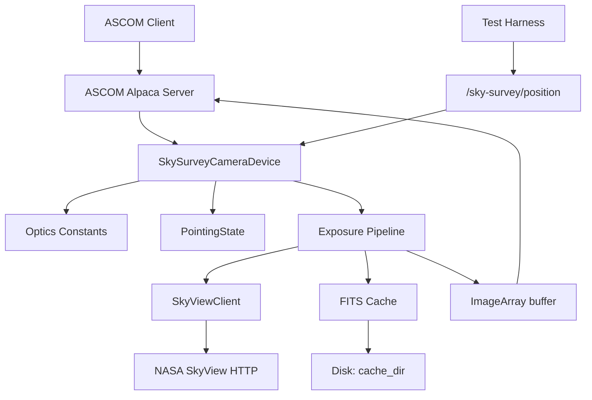

# Sky-Survey-Camera Service Design

## Overview

The `sky-survey-camera` service is an ASCOM Alpaca **Camera** simulator that
synthesises exposures from NASA SkyView cutouts. Given a fixed simulated
optical system (focal length, sensor pixel count, pixel size) and a sky
position (RA/Dec, optionally rotation), it produces an `ImageArray` whose
pixel grid corresponds to the field of view the equivalent real telescope
would see.

The service is a development and testing aid:

- Drives ASCOM clients (NINA, SGPro, calibrator-flats, the rp orchestrator)
  end-to-end without hardware.
- Lets the rest of the rusty-photon stack rehearse pointing/centering/plate
  solving against real sky data.
- Is deterministic: the same position + optics yield the same frame.

**Cross-platform:** Linux, macOS, Windows. No platform-specific
dependencies — same posture as `filemonitor`.

## MVP Scope

**In scope (v0).** This is the boundary that drives BDD scenario
selection in `tests/features/`. Anything outside this list is deferred
to *Future Work*.

- ASCOM Alpaca Camera ICameraV3 implementation, monochrome,
  16-bit-equivalent ADU range.
- Single survey/band per device instance, fixed at startup by config.
- Fixed simulated optics from config: focal length, pixel size,
  sensor pixel count.
- Initial pointing from config; runtime updates via
  `POST /sky-survey/position`.
- `StartExposure` pipeline: derive cutout geometry → fetch from
  SkyView → cache FITS on disk → expose as `ImageArray`.
- Sub-frame and binning honoured at readout (`NumX`/`NumY`/`StartX`/
  `StartY`/`BinX`/`BinY`).
- `Light = false` produces a zero-filled frame of the requested
  binned sub-frame dimensions (no SkyView fetch).
- ASCOM connect/disconnect lifecycle, `ImageReady` semantics,
  `AbortExposure` / `StopExposure` cancellation.
- ConformU integration test driven against a stubbed survey backend
  (no real network in CI).

**Deferred (see *Future Work*).**

- Telescope-following mode (camera querying an attached ASCOM
  Telescope at exposure time).
- Local resampling / rotation independent of SkyView's sampler.
- Signal model: exposure-time scaling, Poisson + Gaussian noise,
  bias offset, dark current, hot pixels.
- Multiple bands selected via an attached ASCOM FilterWheel.
- Additional survey backends (CDS `hips2fits`, local HiPS tiles).
- Bayer / one-shot colour, cooling, pulse guiding, fast readout.
- TLS and HTTP Basic Auth (would compose `rp-tls` / `rp-auth`).
- Cache eviction.

## Implementation Framework

The service uses the `ascom-alpaca` crate already pinned in the workspace.
The `Camera` trait covers the standard ASCOM Camera surface; this service
implements the V3 interface (`InterfaceVersion = 3`).

For the survey backend the service uses **NASA SkyView** at
`https://skyview.gsfc.nasa.gov/current/cgi/runquery.pl`. SkyView accepts an
exact pixel grid and angular size, returning a FITS cutout with WCS
headers. v0 ships with a single concrete `SkyViewClient` (in `src/
survey.rs`) — a `SurveyClient` trait abstraction is deferred until a
second backend (e.g. CDS `hips2fits`) is added; see *Future Work*.

## Configuration

```json
{
  "device": {
    "name": "Sky Survey Camera",
    "unique_id": "sky-survey-camera-001",
    "description": "ASCOM Alpaca Camera simulator backed by NASA SkyView"
  },
  "optics": {
    "focal_length_mm": 1000.0,
    "pixel_size_x_um": 3.76,
    "pixel_size_y_um": 3.76,
    "sensor_width_px": 6248,
    "sensor_height_px": 4176
  },
  "pointing": {
    "initial_ra_deg": 83.8221,
    "initial_dec_deg": -5.3911,
    "initial_rotation_deg": 0.0
  },
  "survey": {
    "name": "DSS2 Red",
    "request_timeout": "30s",
    "cache_dir": "/var/cache/sky-survey-camera"
  },
  "server": {
    "port": 11116
  }
}
```

Configuration sections:

- **device** — ASCOM device metadata.
- **optics** — Fixed simulated optical system. `focal_length_mm` plus
  `pixel_size_*_um` derive the plate scale; `sensor_*_px` set
  `CameraXSize` / `CameraYSize`.
- **pointing** — Initial RA/Dec/rotation used until the runtime API
  overrides them. Stored as plain `f64` degrees in J2000.
- **survey** — Backend selector + request timeout (humantime per the
  `Duration` convention) + on-disk cache directory.
- **server** — Listening port. TLS and Basic Auth are added later via
  `rp-tls` / `rp-auth` if needed; out of scope for v0.

### Derived Quantities

```
plate_scale_x_arcsec_per_px = 206.265 * pixel_size_x_um / focal_length_mm
plate_scale_y_arcsec_per_px = 206.265 * pixel_size_y_um / focal_length_mm

fov_x_deg = plate_scale_x_arcsec_per_px * sensor_width_px  / 3600
fov_y_deg = plate_scale_y_arcsec_per_px * sensor_height_px / 3600
```

These are computed once at construction and exposed via debug logging.

## Operation

### Pointing State

`PointingState { ra_deg, dec_deg, rotation_deg }` is held in an
`ArcSwap<PointingState>` (or `RwLock`) inside the device. It starts from
`pointing.initial_*` and is updated by the runtime API (next section).
`StartExposure` snapshots the current pointing at the moment the exposure
begins.

### `StartExposure` Pipeline

1. Validate parameters against the rules in *Behavioral Contracts*.
2. Read `Duration`, `Light`, `BinX/Y`, `NumX/Y`, `StartX/Y` and
   snapshot the current `PointingState`.
3. If `Light = false`, synthesise a zero-filled `i32` array of size
   `NumX * NumY` and skip to step 7.
4. Compute the SkyView request geometry for the **full sensor at the
   requested binning**, not just the requested sub-frame:
   - `pixels = (sensor_width_px / BinX, sensor_height_px / BinY)`
   - `size_deg = (plate_scale_x_arcsec * sensor_width_px / 3600,
                  plate_scale_y_arcsec * sensor_height_px / 3600)`
   `StartX/Y` and `NumX/Y` do **not** influence the SkyView request —
   they are applied later as a local crop. Requesting the full binned
   frame keeps cache hits useful across sub-frame variations at the
   same pointing.
5. Look up `(survey, ra, dec, rotation, pixels, size)` in the on-disk
   cache using those full-frame binned parameters. On miss, request
   SkyView with them, parse the response, and (only on successful
   parse) store the FITS bytes in the cache.
6. Parse the FITS primary HDU into `(width, height, Vec<i32>)`,
   without scaling, noise, or bias (decision #4 in the design
   discussion: raw survey data passes through). Apply the sub-frame
   crop using `(StartX, StartY, NumX, NumY)` to produce the final
   `NumX × NumY` array.
7. Update `LastExposureStartTime` and `LastExposureDuration`, mark
   `ImageReady = true`, surface the array via `ImageArray` /
   `ImageArrayVariant`.

The exposure `Duration` parameter is accepted and logged but does not
scale the signal in v0. We can add linear scaling and noise later when
the simulator needs to feed downstream tools (e.g. flat calibration)
that depend on signal-vs-time behaviour.

### Connection Management

- `set_connected(true)` — validates the survey backend is reachable
  (HEAD request to SkyView), warms the optics-derived constants, and
  arms the device.
- `set_connected(false)` — drops any in-flight exposure future and
  returns `NotConnected` for subsequent operations.

## Custom HTTP Endpoints (Runtime Pointing API)

Beyond the standard ASCOM Alpaca surface, the service exposes additional
HTTP endpoints under a distinct `/sky-survey/` prefix on the same port,
so they cannot be mistaken for ASCOM methods by strict clients:

| Method | Path | Body | Response | Purpose |
|--------|------|------|----------|---------|
| `GET`  | `/sky-survey/position` | — | `{ "ra_deg": f64, "dec_deg": f64, "rotation_deg": f64 }` | Read current pointing |
| `POST` | `/sky-survey/position` | `{ "ra_deg": f64, "dec_deg": f64, "rotation_deg"?: f64 }` | `204 No Content` | Update pointing; missing `rotation_deg` keeps the current value |

Validation:

- `ra_deg` ∈ [0, 360); values outside the range are 400.
- `dec_deg` ∈ [-90, +90]; out-of-range values are 400.
- `rotation_deg` is wrapped into [0, 360) before storage.
- `POST` while disconnected returns 409 (the device must be connected
  to accept new pointing, mirroring ASCOM's `NotConnected` semantics).

Updates take effect on the **next** `StartExposure`; an in-flight
exposure is not interrupted.

These endpoints are added by composing the `ascom-alpaca` server's
axum router with our own router, the same pattern `rp` uses to mount
`/mcp` alongside its REST surface (see `docs/workspace.md` →
"HTTP gateway services"). If composition turns out to be impractical
with the current `ascom-alpaca` API, the fallback is to expose the
same operation via ASCOM's standard `Action` mechanism
(`PUT /api/v1/camera/0/action` with `Action=setposition`); the JSON
shape stays the same.

### Why a custom endpoint instead of a connected ASCOM Telescope

A "real" simulator would query a connected ASCOM Telescope at exposure
time. That doubles the scope (the service becomes both an Alpaca server
and an Alpaca client) and couples test setups to a running mount
service. The runtime pointing endpoint keeps the camera decoupled and
lets test harnesses set position deterministically; a future
`telescope_url` config option can be added for the realistic mode
without breaking either path.

## Behavioral Contracts

Each bullet is a named, testable behaviour. These map one-to-one to BDD
scenarios in `tests/features/`. ASCOM error codes use the names from
`docs/references/ascom-alpaca.md`.

### Connection lifecycle

- **C1.** `set_connected(true)` validates the configured `cache_dir`
  is writable and probes the survey endpoint with a short capped HEAD
  request. On success, `Connected` becomes `true`.
- **C2.** `set_connected(true)` while `cache_dir` cannot be
  created or is not writable returns `UNSPECIFIED_ERROR` and
  `Connected` stays `false`.
- **C3.** A failed HEAD probe (timeout, DNS failure, non-2xx) is
  logged at `warn!` and **does not** block Connect — `Connected`
  becomes `true` regardless. Tying ASCOM Connect latency to NASA's
  TLS handshake makes the simulator flaky on slow links and in CI;
  the next `StartExposure` will surface a hard failure via S4 if
  the endpoint is genuinely down.
- **C4.** `set_connected(false)` cancels any in-flight exposure and
  resets `LastExposureStartTime` / `LastExposureDuration` to the
  unset state; subsequent ASCOM operations return `NOT_CONNECTED`.

### Pointing API

- **P1.** `GET /sky-survey/position` returns the current pointing
  state regardless of connection state.
- **P2.** `POST /sky-survey/position` with `ra_deg ∈ [0, 360)` and
  `dec_deg ∈ [-90, +90]` and the device connected returns
  `204 No Content` and updates the pointing state atomically.
- **P3.** A `POST` payload with `rotation_deg` omitted preserves the
  current rotation.
- **P4.** A `POST` payload with `ra_deg` outside `[0, 360)` or
  `dec_deg` outside `[-90, +90]` returns `400 Bad Request` and the
  pointing state is unchanged.
- **P5.** A malformed JSON body or a missing required field returns
  `400 Bad Request`.
- **P6.** `POST /sky-survey/position` while disconnected returns
  `409 Conflict` and the pointing state is unchanged.
- **P7.** A pointing update issued during an in-flight exposure does
  not affect the in-flight exposure's snapshotted pointing; it takes
  effect on the next `StartExposure`.

### `StartExposure` parameter validation

Per ASCOM convention, the `NumX` / `NumY` / `StartX` / `StartY` setters
accept any `u32` value. Geometry validation is enforced at
`StartExposure`, not at the property setter — this is what ConformU's
"Reject Bad …" tests exercise. `BinX` / `BinY` are validated at the
setter because the spec defines a hard `[1, MaxBin]` range.

- **E1.** `StartExposure` while disconnected returns `NOT_CONNECTED`.
- **E2.** `StartExposure` while another exposure is in flight
  (`ImageReady = false` and not yet aborted) returns
  `INVALID_OPERATION`.
- **E3.** `BinX` or `BinY` outside `[1, MaxBinX/Y]` is rejected at
  the property setter with `INVALID_VALUE`.
- **E4.** `StartExposure` with `NumX = 0` or `NumY = 0` returns
  `INVALID_VALUE`.
- **E5.** `StartExposure` with `StartX + NumX > CameraXSize / BinX`,
  or the analogous Y-axis condition, returns `INVALID_VALUE`.
- **E6.** `StartExposure` with `Duration` outside
  `[ExposureMin, ExposureMax]` returns `INVALID_VALUE`.

### `StartExposure` survey path

- **S1.** A successful SkyView fetch produces an `ImageArray` with
  dimensions `NumX × NumY` (post sub-frame, post binning), 32-bit
  signed integer values, `ImageReady = true`,
  `LastExposureStartTime` and `LastExposureDuration` set.
- **S2.** `Light = false` skips the SkyView fetch and produces a
  zero-filled array of size `NumX × NumY`.
- **S3.** A cache hit on `(survey, ra, dec, rotation, pixels, size)`
  serves the array without an outbound HTTP request.
- **S4.** SkyView unreachable, an HTTP 5xx response, or a request
  that exceeds `survey.request_timeout` returns
  `UNSPECIFIED_ERROR`; `ImageReady` stays `false` and the next
  `StartExposure` may retry.
- **S5.** A non-FITS body or a malformed FITS payload from SkyView
  returns `UNSPECIFIED_ERROR`; the bad bytes are not cached.
- **S6.** A failure to write the cache entry on the response path
  is logged at `warn!` but does not fail the exposure — the
  `ImageArray` is still returned.

### Cancellation

- **A1.** `AbortExposure` and `StopExposure` during an in-flight
  SkyView fetch cancel the request and leave `ImageReady = false`.
- **A2.** `AbortExposure` or `StopExposure` with no exposure in
  progress returns `INVALID_OPERATION`.

## Architecture



## ASCOM Camera Surface — v0 Behaviour

| Property / Method | Behaviour |
|---|---|
| `CameraXSize` / `CameraYSize` | From `optics.sensor_width_px` / `sensor_height_px` |
| `PixelSizeX` / `PixelSizeY` | From `optics.pixel_size_*_um` |
| `BinX` / `BinY` | Settable, integer, capped by `MaxBinX` / `MaxBinY` at the setter |
| `MaxBinX` / `MaxBinY` | `4` (configurable later) |
| `CanAsymmetricBin` | `false` |
| `NumX` / `NumY` / `StartX` / `StartY` | Setters accept any `u32`; geometry checked at `StartExposure` (E4/E5) |
| `MaxADU` | `65535` (16-bit equivalent) |
| `ElectronsPerADU` | `1.0` placeholder (no signal model in v0) |
| `FullWellCapacity` | `65535.0` (= `MaxADU * ElectronsPerADU`) |
| `ExposureMin` / `ExposureMax` / `ExposureResolution` | `1µs` / `3600s` / `1µs`; the spawned exposure task sleeps for `min(Duration, 5s)` so clients can observe `CameraState = Exposing` |
| `Gain` / `GainMin` / `GainMax` | Single fixed value `0`; setter rejects non-zero with `INVALID_VALUE` |
| `Offset` family | Reports `PROPERTY_NOT_IMPLEMENTED` (no signal model) |
| `ReadoutMode` / `ReadoutModes` | Single mode `"Default"` at index `0`; setter rejects non-zero |
| `SensorName` / `SensorType` | `"SkyView Virtual Sensor"` / `Monochrome` |
| `CameraState` | `Idle` / `Exposing` / `Error` based on internal state |
| `PercentCompleted` | Binary: `0` while in flight, `100` once `ImageReady` |
| `CanAbortExposure` / `CanStopExposure` | `true`, both cancel the in-flight survey fetch |
| `CoolerOn`, `CCDTemperature`, `CanGetCoolerPower`, `CanSetCCDTemperature`, `CanPulseGuide`, `CanFastReadout`, `HasShutter`, `BayerOffsetX/Y` | All `false` / `PROPERTY_NOT_IMPLEMENTED` |
| `StartExposure` / `AbortExposure` / `StopExposure` / `ImageReady` / `ImageArray` / `ImageArrayVariant` | Implemented per pipeline above; `ImageArray` returns the cropped subframe with axes `[X, Y]` |

ConformU is the canonical ASCOM correctness check. The
`tests/conformu_integration.rs` target (gated by the `conformu`
feature) drives ConformU against the simulator with a stub HTTP
backend so CI doesn't depend on real SkyView availability:

```bash
cargo test -p sky-survey-camera --features mock,conformu \
    --test conformu_integration -- --ignored --nocapture
```

The stub serves a synthetic FITS payload via
[`mock::synthetic_fits`] (gated by the `mock` feature) so
`StartExposure` / `ImageArray` exercise the full pipeline end-to-end.

## Caching

Cache key: a 16-character hex digest from `std::collections::hash_map::
DefaultHasher` over
`survey_name | ra_deg | dec_deg | rotation_deg | pixels_x | pixels_y | size_x_deg | size_y_deg`
with floating-point fields rounded (RA/Dec to 1e-4 deg, sizes to
1e-6 deg) so that minor drift hits the same entry. Stored as
`<cache_dir>/<hex>.fits`. The cache is local-only and the operator
clears `cache_dir` manually — `DefaultHasher` is non-cryptographic and
not stable across Rust versions, but neither property is needed here.
No sidecar metadata in v0. No eviction; manual cleanup.

## Module Sketch (informative)

A suggested module breakdown — *informative, not normative*. The
behavioural contracts above are the spec; the actual code may merge,
split, or rename modules so long as the BDD scenarios pass.

1. **`config.rs`** — `Config { device, optics, pointing, survey, server }`
   with `humantime_serde` on the `Duration` field.
2. **`error.rs`** — `SkySurveyCameraError` enum (config, survey HTTP,
   FITS parse, cache I/O, invalid request).
3. **`optics.rs`** — `Optics` struct: derived plate scales, FOV, helpers
   for cutout geometry.
4. **`pointing.rs`** — `PointingState` + concurrency primitive.
5. **`survey.rs`** — `SurveyClient` trait
   (`health_check`, `fetch`), `SkyViewClient` HTTP backend, and
   the disk cache helpers (`try_cache_load` / `try_cache_store`).
6. **`mock.rs`** (gated by the `mock` feature) — `MockSurveyClient`
   plus the `synthetic_fits` helper used by the ConformU
   integration test's stub backend.
7. **`fits.rs`** — Thin shim over `rp_fits::reader::read_primary_as_i32`.
   Returns `(Vec<i32>, width, height)` for SkyView responses. The
   workspace's FITS surface lives in `crates/rp-fits` per ADR-001
   Amendment A.
8. **`camera.rs`** — `Device` + `Camera` trait impl.
9. **`routes.rs`** — Axum router for the `/sky-survey/*` endpoints,
   composed with the ASCOM server's router.
10. **`lib.rs`** — `run` / `run_with_client` entry points and the
    `SurveyClient` re-export.
11. **`main.rs`** — Entry point.

## Testing

Layered per `docs/skills/testing.md`:

- **Unit** — optics calculations, config parsing, pointing API
  validation, cache key determinism, FITS parse on canned bytes,
  `Camera` trait method behaviour (camera state machine, gain/readout
  fixed-value semantics, setter relaxation, `StartExposure`
  geometry checks).
- **BDD** (`bdd-infra::ServiceHandle`) — `/sky-survey/position` round
  trips, `StartExposure` returns a non-empty array of the configured
  dimensions when the survey backend is stubbed, the C1–C4 connection
  contracts including the warn-only behaviour for an unreachable
  endpoint, and the S1–S6 survey-error paths against a stub HTTP
  server.
- **ConformU integration** (`tests/conformu_integration.rs`, gated by
  the `conformu` feature) — launches the production binary pointed
  at an in-process axum stub that serves
  [`mock::synthetic_fits`] for any GET, and runs the official
  ConformU validator end-to-end. The `mock` feature gates the
  synthetic-FITS helper used by the stub. The binary itself always
  uses [`SurveyClient = SkyViewClient`] so that the BDD scenarios
  exercising real HTTP error paths are not bypassed under
  `--all-features`.

## Future Work

- **Telescope-following mode.** Add `pointing.telescope_url` so the
  camera queries a connected ASCOM Telescope at exposure time instead
  of the fixed pointing.
- **Local resampling.** Request a slightly oversized cutout and
  resample with the requested rotation, removing the dependency on
  SkyView's resampler.
- **Signal model.** Linear exposure scaling, Poisson + Gaussian noise,
  bias offset; configurable per-device.
- **Filter wheel coupling.** Multiple survey/band entries selectable
  by an attached ASCOM FilterWheel.
- **Additional backends.** `hips2fits` for faster cutouts, local
  HiPS tiles for fully offline operation.
- **Workspace FITS consolidation.** *(Done — ADR-001 Amendment A.)*
  sky-survey-camera now delegates to `rp_fits::reader::read_primary_as_i32`,
  which applies `BSCALE`/`BZERO` correctly and accepts a
  `Cursor<&[u8]>` so the HTTP-bytes path doesn't need a tempfile.
