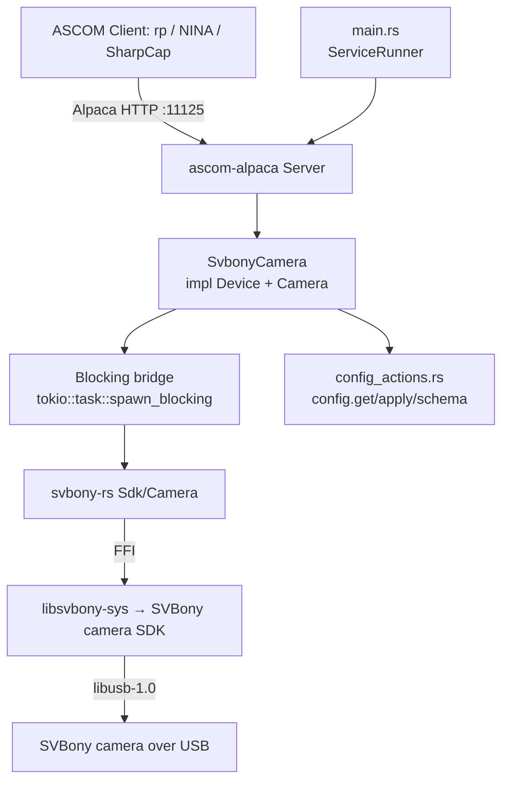

# Svbony-Camera Service Design

> **Status:** **Phase C/D landed (2026-07-21): bare service skeleton +
> design doc + ADR + `@wip` BDD scaffolding.** `services/svbony-camera`
> builds, binds the Alpaca listener on port **11125**, and serves
> `/management/*` correctly with zero or one registered device;
> `--config`/`--port`/`--log-level` and the `doctor` subcommand all work.
> [`SvbonyCamera`](../../services/svbony-camera/src/camera.rs) implements
> `ascom_alpaca::api::Device` for real — `Name`/`Description`/
> `DriverInfo`/`DriverVersion`/`Connected`/`UniqueID`, plus the
> `config.get`/`apply`/`schema` action dispatch — and connect/disconnect
> drive the real `svbony-rs` backend seam. Every
> `ascom_alpaca::api::Camera` method is present, compiles, and returns an
> honest `NOT_IMPLEMENTED`: this is the design surface Phase E replaces one
> behavioural area at a time. With the `simulation` feature the server
> registers `svbony-rs`'s one fabricated `SV605CC-Simulated` camera as
> "camera device 0" so BDD scenarios have a real device to address; the
> production (real-SDK) build registers **zero** devices by default in this
> phase — see "Configuration → Device registration boundary". Four feature
> files (`enumeration_connection`, `config_actions`, `auth`, `doctor`) are
> genuinely green today; the five behavioural feature files
> (`exposure`, `binning_and_roi`, `cooling`, `gain_offset_readout`,
> `sensor_properties`) are tagged `@wip` pending Phase E.

## Overview

The `svbony-camera` service is an ASCOM Alpaca **Camera** driver for SVBony
cooled cameras (first hardware target: the SV605CC, a Sony IMX533-based OSC
camera). It exposes exposures, ROI/binning, gain/offset, cooling, and
readout over ASCOM Alpaca on a fixed port so `rp` and any Alpaca client
(NINA, SharpCap) can drive it like the existing `qhy-camera` / `zwo-camera`
services. SVBony ships no Alpaca driver of its own (Windows ASCOM binary
only); this driver is written against the native SVBony camera SDK
(`libSVBCameraSDK`) via the vendored [`svbony-rs`](../../crates/svbony-rs/)
crate.

It is the SVBony analogue of [`zwo-camera`](zwo-camera.md) — the API is
closely modeled on ZWO's ASI SDK, so `zwo-camera`'s device-trait shape ports
with mostly renames — **except for the exposure path**, SVBony's one
genuinely new design problem (see "Behavioral contracts → Exposure").

**Provenance.** Behaviour is derived from `indi_svbony_ccd` (indi-3rdparty)
as a *behavioural reference only* — GPL/LGPL-family — **no code is copied**,
the same clean-room discipline `qhy-camera` and `zwo-camera` take toward
their own INDI references.

**Not cross-platform.** Like `qhy-camera`/`zwo-camera`, this service links a
**native vendor SDK** at compile time and is gated out of the default
workspace build by SDK availability. See *Native dependency & build gating*.

**How it differs from `zwo-camera` (the two axes that matter).**

| Concern | ZWO (the mechanical precedent) | SVBony (this service) |
|---|---|---|
| **SDK license** | MIT → redistribute in-package | **No license text at all** → treat like QHY: never redistribute, download-on-target (new [ADR-018](../decisions/018-svbony-sdk-no-license-payload-policy.md)) |
| **Identity** | `ASIGetSerialNumber` requires an *open* camera → enumeration opens-then-closes each camera | `SVB_CAMERA_INFO.CameraSN` arrives **pre-open**, at enumeration (`SVBGetCameraInfo`) → identity is minted directly from enumeration, no open/close dance |
| **Exposure model** | Snap API (`ASIStartExposure`) | **Video-only**: no snap API; every exposure rides `SVBStartVideoCapture` + soft trigger + `SVBGetVideoData` |
| **Rust FFI layer** | `zwo-rs`, `bindgen`-generated | `svbony-rs`, **hand-transcribed** (SVBony's header carries no license, so it is not vendored/bindgen'd — see `crates/svbony-rs`) |

Net: mechanically SVBony is ZWO-shaped (we own the FFI crate; a cleaner C
API ports closely), legally it is QHY-shaped (no redistribution grant). See
[`docs/plans/svbony-camera.md`](../plans/svbony-camera.md) for the full
decision record.

---

## Native dependency & build gating (the crux)

- The imaging path is `svbony-camera → svbony-rs → libsvbony-sys → ` the
  **SVBony camera SDK** (`libSVBCameraSDK`, a source-less native binary,
  SDK version 1.13.4) **+ libusb-1.0**.
- `libsvbony-sys`'s `build.rs` emits `cargo:rustc-link-lib` for the one SDK
  library — SVBony has only one device (camera) and one SDK, so unlike
  `zwo-rs`/`libzwo-sys` there is no per-device link-feature union (ADR-014
  doesn't apply here: a single-device-type SDK has nothing to split).
- **Consequence:** every machine that compiles this package needs the
  SVBony camera SDK installed and discoverable, plus `libusb-1.0` dev
  headers — not just machines with a camera attached.
- The `svbony-rs` **`simulation` feature** (forwarded here as this
  service's own `simulation` feature) makes the build **camera-free, NOT
  SDK-free**: it fabricates a fake `SV605CC-Simulated` camera at runtime,
  including the soft-trigger video-capture flow and a poll-based cooling
  ramp. The native SDK is still required at link time — *unless*
  `SVBONY_SKIP_NATIVE_LINK=1` is set (see below).

### This phase's link-gating shortcut

Unlike `zwo-camera`/`qhy-camera`, **no `install-svbony-sdk` CI provisioning
action exists yet** (Phase G packaging work). `crates/svbony-rs/libsvbony-sys/BUILD.bazel`
therefore bakes `SVBONY_SKIP_NATIVE_LINK=1` into its `cargo_build_script`
*unconditionally* — the default Bazel build (and this service's Bazel
targets) need **zero SVBony SDK provisioning** today. Cargo builds outside
Bazel follow the same env-var gate (unset the variable, with the SDK
installed and `ldconfig`'d, to exercise the real link locally). This is a
deliberate, temporary simplification recorded in
[`docs/plans/svbony-camera.md`](../plans/svbony-camera.md)'s Status section
— revisit once CI provisioning + real hardware validation (Phase G) land.

### Gating plan (steady state, once Phase G lands)

Mirrors `zwo-camera`'s table exactly, once an `install-svbony-sdk` action
exists: local dev needs the SDK installed to link; CI provisions it before
building/testing; the simulation-only legs build SDK-free via
`SVBONY_SKIP_NATIVE_LINK=1`; Bazel provisions the SDK for its `//...`
targets the same way `install-zwo-sdk`/`qhyccd-sdk-install` do today.

### udev / USB

SVBony devices need a udev rule (VID `f266`). Per
[ADR-013 §3](../decisions/013-native-sdk-payload-policy.md), rules are
**group-scoped** (`GROUP="rusty-photon", MODE="0660"`), never a
world-writable `MODE="0666"` rule — `pkg/90-rusty-photon-svbony.rules`.

---

## Architecture



**Key components**

- **`main.rs`** — plain `fn main`, parses clap args, inits `tracing`, runs
  under `ServiceRunner::new("svbony-camera").with_reload().run_with_reload(...)`
  per [`service-lifecycle.md`](../skills/service-lifecycle.md). Config
  bootstrap via `rusty_photon_config::resolve_and_init` with an **empty
  identity-pointer list** (identities are hardware-derived).
- **`lib.rs`** — `ServerBuilder` that, on `build()`, enumerates connected
  SVBony cameras and registers each as an ASCOM device with its
  serial-derived UniqueID. Because `CameraSN` arrives at enumeration time
  (`SVBGetCameraInfo`, no open required — see "Device identity"),
  enumeration never opens a camera just to mint identity, unlike
  `zwo-camera`. Returns a `BoundServer`.
- **`camera.rs`** — `SvbonyCamera` (one instance per discovered camera)
  implementing `Device` + `Camera` against the `backend::CameraHandle` seam.
  As of Phase C/D, `Device` is real and every `Camera` method is an honest
  `NOT_IMPLEMENTED` stub (see the Status banner).
- **`backend.rs`** — the SDK seam (mirrors `zwo-camera`'s `backend.rs`):
  a `CameraHandle` trait plus a production `SvbonyCameraHandle` wrapping
  `svbony_rs::Sdk`/`Camera` behind a `parking_lot::Mutex` (the RAII `Camera`
  handle is `Send + !Sync`), and an in-crate `MockCameraHandle` for unit
  tests. Phase C/D wires only the connection-lifecycle surface
  (open/close/is_open/info/unique_id); the exposure/ROI/gain/cooling seam
  methods land in Phase E.
- **`config.rs`** — typed `Config` with parse-don't-validate newtypes.
- **`config_actions.rs`** — `ConfigurableDriver` impl (real as of Phase
  C/D) + the `dispatch` the device delegates to.
- **`doctor.rs`** — the `doctor` subcommand (real as of Phase C/D): config
  parse + `svbony_rs::Sdk::cameras()` enumeration, gated the same way as
  `zwo-camera`'s doctor.

**Concurrency.** The SVBony SDK's thread-safety is undocumented — treated
as unsafe for concurrent calls on one handle, the same posture
`qhyccd-rs`/`zwo-rs` take. Every SDK call funnels through `spawn_blocking`
with a single logical owner per device (Phase E: a generation-counter guard
so an aborted/disconnected exposure can't publish a late frame, mirroring
`zwo-camera`'s `run_exposure`/`result_lock` pattern).

---

## MVP scope

**In scope (v0, target for Phase E)**

- ASCOM Camera `ICameraV3` for every enumerated SVBony camera, 8/16-bit RAW
  and mono/OSC (Bayer) sensors, derived at runtime from
  `SVB_CAMERA_PROPERTY` — never hardcoded to the SV605CC's own pattern.
- Startup enumeration registers all discovered cameras; per-device
  connect/disconnect (Phase C/D: real); on connect, select
  `SVB_MODE_TRIG_SOFT` when `IsTriggerCam` and start video capture once
  (Phase E).
- Sensor geometry from cached `SVB_CAMERA_PROPERTY` (`MaxWidth`/`MaxHeight`,
  `SVBGetSensorPixelSize`); `PixelSizeX == PixelSizeY` (a single SDK
  pixel-size call).
- **Binning** — symmetric only (`CanAsymmetricBin = false`); `MaxBinX/Y`
  from `SupportedBins`.
- **ROI** — `SVBSetROIFormat` constraints: `width % 8 == 0`,
  `height % 2 == 0`, byte-for-byte the same rule `zwo-camera` enforces for
  ASI. Whether `CameraXSize`/`CameraYSize` need `zwo-camera`'s R4-style
  "report aligned down so every binned full frame is a valid ROI" treatment
  is a Phase E decision (not yet asserted here).
- **Exposure** — the soft-trigger video-capture state machine (see
  "Behavioral contracts → Exposure" below); `CanStopExposure = false`,
  `CanAbortExposure = true` (to confirm/revise after real-hardware
  validation).
- **Gain / Offset** — `SVB_GAIN` / `SVB_BLACK_LEVEL` (SVBony's ASCOM
  *Offset*-equivalent control); current value + `Min`/`Max` from
  `SVBGetControlCaps`; `NOT_IMPLEMENTED` if the control is absent.
- **Readout modes** — driver-named list (exact names a Phase E decision).
- **Cooling** — `CoolerOn`, `SetCCDTemperature`, `CoolerPower`,
  `CanSetCCDTemperature`, `CanGetCoolerPower` gated on
  `SVB_CAMERA_PROPERTY_EX.bSupportControlTemp`. Cooler set-point / current
  temperature are 0.1 °C SDK units (÷10 for ASCOM's °C). **Tenet 3 (no
  actuation on connect) explicitly covers the cooler**: connect, reconnect,
  and `config.apply` must never touch `SVB_COOLER_ENABLE` or
  `SVB_TARGET_TEMPERATURE` — the TEC engages only on an explicit operator
  `CoolerOn` command.
- **Sensor type** — `Monochrome` vs `RGGB` from `IsColorCam` / `BayerPattern`.
- **`MaxADU`** = `(2^MaxBitDepth) - 1` from `SVB_CAMERA_PROPERTY.MaxBitDepth`.
- **`ElectronsPerADU`** — **`NOT_IMPLEMENTED` placeholder**: unlike ZWO's
  `ASI_CAMERA_INFO.ElecPerADU`, `SVB_CAMERA_PROPERTY` carries no native
  electrons-per-ADU field. Confirm at Phase G hardware validation whether
  the SDK exposes this some other way (a control, a separate query) before
  ruling it out permanently.
- **Bad-pixel correction** — the SDK's on-camera hot-pixel correction
  (`SVB_BAD_PIXEL_CORRECTION_ENABLE`) defaults **off** for calibrated
  astrophotography, set explicitly at connect (a read-modify-write of an
  image-pipeline flag, not actuation — distinct from the cooler/tenet-3
  carve-out above). Deferred to Phase E; verify the control exists on the
  605CC.
- `config.get`/`config.apply`/`config.schema` actions (Phase C/D: real);
  hardware-derived `UniqueID`; in-process reload.

**Deferred (see *Future Work*)**

- ST4 pulse guiding — capability-driven (`SVBCanPulseGuide`), but the
  SV605CC has no ST4 port, so the simulation always reports it absent;
  wiring `SVBPulseGuide` is Phase E, exercised on a future ST4-capable
  model.
- Per-serial connect-time tuning (gain/offset/target-temperature defaults).
- SV605MC / other SVBony cooled cameras — same driver, capability-driven.
- SVBony filter wheel (SV226) — a separate service on its own SDK, per the
  ADR-014 one-service-per-device-family shape, if ever in scope.

---

## Configuration

The service enumerates every connected SVBony camera at startup and
registers each as an ASCOM device (camera index 0, 1, 2, …) on the one
port. The hardware is the source of truth — there is no per-camera
*binding* in config.

```jsonc
{
  // Optional per-device overrides, keyed by SDK serial. A device with no
  // entry uses SDK-derived defaults (name from the friendly name).
  "devices": {
    "SVB0123456789AB": {
      "name": "Main Imaging",
      "description": "SV605CC @ 1000mm"
    }
  },
  "server": {
    "port": 11125,
    "bind_address": "0.0.0.0",
    "tls": null,
    "auth": null
  }
}
```

The `server` block is the shared `AlpacaServerConfig` from
`crates/rusty-photon-server-config` (see ADR-016). Absent `tls`/`auth`
means plain, unauthenticated HTTP.

- **devices** — Optional per-device override map keyed by **SDK serial**
  (`SVB_CAMERA_INFO.CameraSN`). Any device without an entry uses
  SDK-derived defaults. No per-camera connect-time tuning (gain/offset/
  target temperature) in v0 — deferred (see *Future Work*).
- **server.port** — Listening port (**11125**; 11111–11124 are already
  allocated, see `docs/workspace.md`'s Services table). Hard read-only
  (self-lockout: a port change would make the BFF lose the devices).

### Config actions

Standard cross-driver protocol ([`config-actions.md`](config-actions.md)),
implemented generically in `rusty_photon_config::actions` + the ASCOM
adapter in [`rusty-photon-driver`](../../crates/rusty-photon-driver).
`config_actions.rs` supplies `ConfigurableDriver for SvbonyCameraDriver`
(real as of Phase C/D):

- **Secrets redacted/carried forward:** `server.auth.password_hash`.
- **Locked (identity) fields:** none — UniqueIDs are hardware-derived.
- **Hard read-only fields:** `/server/port`.
- **Editable fields:** the `devices` map (per-serial `name` /
  `description`).
- **Validation** at load (parse-don't-validate): unknown keys are rejected
  at deserialize (`deny_unknown_fields`).

### Device identity (UniqueID)

**SVBony's identity is pre-open** — the headline win over `zwo-camera`.
`SVBGetCameraInfo` returns `CameraSN` at **enumeration time**, before any
camera is opened, so unlike ZWO's `ASIGetSerialNumber` (which requires an
*open* camera), `svbony-camera`'s enumeration never opens a camera just to
mint an identity. `enumerate_cameras()` mints each device's UniqueID
directly from `Sdk::cameras()`'s output:

```
SVBONY:{friendly_name with spaces → '-'}:{serial}
```

A camera that reports an **empty** serial falls back to a stable
position-based identity, mirroring `zwo-camera`'s `mint_identity`:

```
SVBONY:{friendly_name}:noserial-{index}
```

logged at `warn!`. Consequences (same as `zwo-camera`/`qhy-camera`): **no
`unique_id` field in config**, an **empty identity-pointer list** passed to
`resolve_and_init` in `main.rs`, and **no locked identity field** in the
config-actions tiers.

### Device registration boundary (Phase C/D only)

`enumerate_cameras()` behaves differently depending on the `simulation`
feature, a **deliberate, temporary phase boundary** (not a technical
constraint — real-SDK enumeration is trivial for SVBony, no open
required):

- **With `simulation`:** enumerates `svbony-rs`'s one fabricated
  `SV605CC-Simulated` camera and registers it, so BDD scenarios have
  "camera device 0" to address.
- **Without `simulation`** (the production real-SDK build): returns **zero**
  cameras unconditionally. `SvbonyCamera`'s `Camera` trait surface is still
  `NOT_IMPLEMENTED` stubs, and wiring real enumeration to production device
  registration is Phase E work — this avoids front-running that with a
  registered-but-inert real device.

`ServerBuilder::with_empty(bool)` additionally forces zero cameras
regardless of the feature (mirrors `zwo-camera`'s `--simulation-empty`
test-only path, contract C0), used by the BDD suite's empty-backend
scenario.

---

## Behavioral contracts

Named, testable behaviours. ASCOM error names per
[`docs/references/ascom-alpaca.md`](../references/ascom-alpaca.md). Phase
C/D implements only the connection-lifecycle (C-prefixed) and config-action
contracts for real; every other contract below is the **target** Phase E
implements — the `@wip`-tagged BDD scenarios encode them today as design
artifacts, not yet-passing tests.

### Enumeration & connection lifecycle (Phase C/D: real)

- **C0.** At startup `build()` enumerates connected SVBony cameras and
  registers each as an ASCOM device with its serial-derived UniqueID — no
  open required (see *Device identity*). Zero discovered cameras is **not**
  a hard failure — the service starts with no Camera devices, logged at
  `warn!`; a later reload re-enumerates. In this phase, this only happens
  under the `simulation` feature (see *Device registration boundary*).
- **C1.** `set_connected(true)` opens the camera via the SDK. On success
  `Connected = true`. A second `set_connected(true)` on an already-open
  device is a no-op.
- **C2.** `set_connected(true)` with the camera unreachable / SDK open
  failure returns the mapped driver error and `Connected` stays `false`.
- **C3.** `set_connected(false)` closes the device.
- **C5 (Phase E).** No code path in this service pushes cooler state or
  any other actuation on startup, connect, or `config.apply` (workspace
  tenet [*no actuation on connect*](../workspace.md#project-tenets));
  `SVB_COOLER_ENABLE`/`SVB_TARGET_TEMPERATURE` are touched only by an
  explicit ASCOM `CoolerOn`/`SetCCDTemperature` call.

### Exposure (Phase E target — the soft-trigger video-capture state machine)

This is this plan's one genuinely new design problem: SVBony's SDK has no
snap-exposure API. Every exposure rides video capture
(`SVBStartVideoCapture` / `SVBSendSoftTrigger` / `SVBGetVideoData`). The
design follows `indi_svbony_ccd`'s shape (behavioural reference only, see
*References*), to be verified step-by-step against real hardware.

**State machine (MVP design):**

1. **Mode selection, at connect.** When the camera reports `IsTriggerCam`
   (`SVB_CAMERA_PROPERTY.IsTriggerCam`), the driver calls
   `SVBSetCameraMode(SVB_MODE_TRIG_SOFT)` once, during the connect
   handshake — not per-exposure. *Why at connect, not at first exposure:*
   mode selection is a one-time camera-state change, not per-frame; doing
   it once at connect keeps `StartExposure` on the hot path free of a
   first-call special case, and matches `indi_svbony_ccd`'s behaviour. This
   is a **read of camera mode capability + a mode-select call**, not
   actuation of the imaging chain (no cooler, no motion, no shutter) — it
   does not implicate tenet 3's actuation ban, which the workspace tenet
   list scopes to physical actuation (motion, cooler setpoints, cover/lamp,
   power toggles, filter moves, guide pulses).
2. **Video capture starts once**, also at connect, via
   `SVBStartVideoCapture` — not restarted per exposure (trigger mode
   frames are gated by the soft trigger, so free-running capture is safe
   to leave armed).
3. **Each ASCOM `StartExposure`:**
   a. Sets `SVB_EXPOSURE` to the requested duration. **Unit assumption:**
      the ground truth does not state the control's unit explicitly;
      `svbony-rs`'s `ControlType::Exposure` doc comment models it as
      **microseconds (µs)**, matching ZWO's `ASI_EXPOSURE` convention —
      this needs confirmation against real hardware (Phase G).
   b. Calls `SVBSendSoftTrigger` to request one frame.
   c. Polls/awaits `SVBGetVideoData` with a timeout of
      **`exposure_us * 2 + 500ms`** — the SDK's own documented
      recommendation (captured in `docs/plans/svbony-camera.md`'s
      "Verified SDK facts"). Exceeding the deadline is a failure (see E9
      below).
4. **Stale-frame flush.** A buffered frame from before a ROI/exposure
   change must be drained before the first post-change frame is trusted —
   the `indi_svbony_ccd` reference documents this workaround; Phase E must
   verify against real hardware whether `svbony-rs`'s
   `SVBGetVideoData`/soft-trigger pairing already avoids this or needs an
   explicit flush.
5. **`StopExposure`/`AbortExposure` both map to stopping video capture** —
   there is no data-preserving stop at the SDK level (`SVBStopVideoCapture`
   discards whatever is in flight). Consequently:
   - `CanStopExposure = false`; `StopExposure` returns `NOT_IMPLEMENTED`
     unconditionally rather than pretending to gracefully preserve data it
     cannot preserve.
   - `CanAbortExposure = true`; `AbortExposure` stops capture and discards
     the frame.
   - **To be confirmed/revised after real-hardware validation** (Phase G)
     — if the SDK turns out to support a genuine data-preserving stop, this
     flips to match `zwo-camera`'s `CanStopExposure = true`.
6. **Non-trigger cameras** (`IsTriggerCam = false`): fall back to
   `SVB_MODE_NORMAL` (free-running video capture) with a per-exposure
   capture restart (no soft trigger available) — the SV605CC is
   trigger-capable, so this path is untested by the simulation and is a
   Phase E design note, not yet BDD-covered.
7. **Dark frames.** No mechanical shutter exists in video mode (same
   posture as `zwo-camera`'s shutterless ASI sensors): `Light = false` is
   accepted and captures identically; `HasShutter = false`.
8. **Mid-exposure SDK error or an exceeded `SVBGetVideoData` deadline**
   transitions `CameraState = Error`, sets `last_error`, leaves
   `ImageReady = false` — covered by unit tests against the mock backend
   seam (mirrors `zwo-camera`'s E9), not BDD (the simulation cannot force
   an SDK error).

### ROI / binning (Phase E target)

- **B1.** `set_bin_x`/`set_bin_y` validate against `SupportedBins`;
  unsupported → `INVALID_VALUE`.
- **B2.** `CanAsymmetricBin = false`.
- **B3.** A bin change rescales the cached ROI by the bin ratio.
- **R1.** ROI setters accept any `u32`; geometry validated at
  `StartExposure`.
- **R2.** Out-of-bounds/zero sub-frame → `INVALID_VALUE`.
- **R3.** `SVBSetROIFormat`'s alignment rule — `width % 8 != 0` or
  `height % 2 != 0` — → `INVALID_VALUE`; identical to `zwo-camera`'s ASI
  rule.

### Gain / offset / readout (Phase E target)

- **GO1.** `Gain`/`Offset` (`SVB_GAIN`/`SVB_BLACK_LEVEL`) return the
  current SDK value, or `NOT_IMPLEMENTED` if the control is absent.
- **GO2.** Setters validate against cached `[min, max]`; out-of-range →
  `INVALID_VALUE`.
- **GO3.** `GainMin/Max`, `OffsetMin/Max` reflect the cached SDK min-max.
- **RM1.** `ReadoutModes` is the driver's named list; `set_readout_mode`
  validates the index; invalid → `INVALID_VALUE`.

### Cooling (Phase E target)

- **K1.** `CanSetCCDTemperature`/`CanGetCoolerPower` are `true` iff
  `SVB_CAMERA_PROPERTY_EX.bSupportControlTemp`; otherwise the related
  getters return `NOT_IMPLEMENTED`.
- **K2.** `CCDTemperature` reads `SVB_CURRENT_TEMPERATURE` (÷10 for °C),
  reported independently of whether cooling is on, mirroring
  `zwo-camera`'s decoupled-temperature decision.
- **K3.** `set_set_ccd_temperature` validates `[-273.15, 80]` and encodes
  to `SVB_TARGET_TEMPERATURE` (×10, tenths of °C); `SetCCDTemperature`
  reads it back (÷10).
- **K4.** `CoolerOn`/`set_cooler_on` map to `SVB_COOLER_ENABLE`;
  `CoolerPower` is the raw `SVB_COOLER_POWER` percent (already 0–100, no
  normalization needed).
- **K5 (tenet 3).** No code path reachable from connect, reconnect, or
  `config.apply` calls `set_cooler_enable`/`set_target_temperature_celsius`
  — the cooler engages only on an explicit operator `CoolerOn` ASCOM call.
  Review this explicitly at the Phase E connect-path PR, per the workspace
  tenet list's explicit callout of cooler setpoints as actuation.

### Sensor type & signal (Phase E target)

- **ST1.** `SensorType` is `RGGB` (colour) when `IsColorCam`, else
  `Monochrome`; `BayerOffsetX/Y` follow `BayerPattern` — read at runtime,
  never hardcoded to the SV605CC's own pattern (a future mono/other-pattern
  model must report correctly).
- **ST2.** `ElectronsPerADU` is a **`NOT_IMPLEMENTED` placeholder** —
  `SVB_CAMERA_PROPERTY` has no native electrons-per-ADU field (unlike
  ZWO's `ElecPerADU`). Confirm at Phase G whether the SDK exposes this
  another way before treating this as permanent.
- **ST3.** `MaxADU` = `(2^MaxBitDepth) - 1` from
  `SVB_CAMERA_PROPERTY.MaxBitDepth` (16383 for the SV605CC's 14-bit ADC).

### Pulse guiding (Phase E target, capability-driven)

- **PG1.** `CanPulseGuide` is `true` iff
  `SVB_CAMERA_PROPERTY_EX.bSupportPulseGuide` — capability-driven, not
  model-driven (a future ST4-capable model reports `true`). The SV605CC
  has no ST4 port, so the simulation always reports `false`.
- **PG2.** `PulseGuide` on a camera without ST4 returns `NOT_IMPLEMENTED`;
  on a camera with ST4, `SVBPulseGuide` blocks at the SDK level for the
  pulse duration (unlike `zwo-camera`'s asynchronous ST4 — confirm at
  Phase E whether the same async-wrapper treatment `zwo-camera` gave
  `PulseGuide` (returns immediately, `IsPulseGuiding` tracks a deadline) is
  warranted here too, to avoid exceeding ConformU's 1s response target).

---

## ASCOM Camera surface — v0 behaviour (Phase E target)

| Property / Method | v0 target behaviour (backed by `svbony-rs`) | Phase C/D today |
|---|---|---|
| `CameraXSize` / `CameraYSize` | Cached `SVB_CAMERA_PROPERTY` `MaxWidth`/`MaxHeight` | `NOT_IMPLEMENTED` |
| `PixelSizeX` / `PixelSizeY` | `SVBGetSensorPixelSize` (X == Y) | `NOT_IMPLEMENTED` |
| `BinX` / `BinY` / `MaxBinX` / `MaxBinY` | Symmetric; max from `SupportedBins` | `NOT_IMPLEMENTED` |
| `CanAsymmetricBin` | `false` | `NOT_IMPLEMENTED` |
| `NumX` / `NumY` / `StartX` / `StartY` | Setters relaxed; validated at `StartExposure` (incl. %8 / %2) | `NOT_IMPLEMENTED` |
| `MaxADU` | `(2^MaxBitDepth) - 1` | `NOT_IMPLEMENTED` |
| `ElectronsPerADU` | `NOT_IMPLEMENTED` placeholder (no native field) | `NOT_IMPLEMENTED` |
| `ExposureMin` / `Max` / `Resolution` | From `SVBGetControlCaps(SVB_EXPOSURE)` (µs, assumed) | `NOT_IMPLEMENTED` |
| `Gain` / `GainMin` / `GainMax` | `SVB_GAIN` control | `NOT_IMPLEMENTED` |
| `Offset` / `OffsetMin` / `OffsetMax` | `SVB_BLACK_LEVEL` control | `NOT_IMPLEMENTED` |
| `ReadoutMode` / `ReadoutModes` | Driver-named list | `NOT_IMPLEMENTED` |
| `SensorType` / `BayerOffsetX/Y` | Mono vs RGGB from `IsColorCam` / `BayerPattern` | `NOT_IMPLEMENTED` |
| `CoolerOn` / `CCDTemperature` / `SetCCDTemperature` / `CoolerPower` | Gated on `bSupportControlTemp` | `NOT_IMPLEMENTED` |
| `CanSetCCDTemperature` / `CanGetCoolerPower` | `true` iff `bSupportControlTemp` | `NOT_IMPLEMENTED` |
| `HasShutter` | `false` (no mechanical shutter in video mode) | `NOT_IMPLEMENTED` |
| `CameraState` | `Idle` / `Exposing` / `Error` | `NOT_IMPLEMENTED` |
| `PercentCompleted` | From remaining-exposure µs, clamped ≤ 100 | `NOT_IMPLEMENTED` |
| `CanAbortExposure` / `CanStopExposure` | `true` / **`false`** (no data-preserving stop) | `NOT_IMPLEMENTED` |
| `CanPulseGuide` | `true` iff ST4 port present (SV605CC: `false`) | `NOT_IMPLEMENTED` |
| `PulseGuide` / `IsPulseGuiding` | `SVBPulseGuide`, gated on ST4 capability | `NOT_IMPLEMENTED` |
| `StartExposure` (`Light=false`) | Accepted; captured normally (no shutter) | `NOT_IMPLEMENTED` |
| `StartExposure` / `AbortExposure` / `StopExposure` / `ImageReady` / `ImageArray` | Per the soft-trigger video-capture state machine above | `NOT_IMPLEMENTED` |
| `Name` / `Description` / `DriverInfo` / `DriverVersion` / `Connected` / `UniqueID` | — | **Real** |

---

## Service lifecycle (`main.rs`)

Standard shape per [`service-lifecycle.md`](../skills/service-lifecycle.md),
identical structure to `zwo-camera`'s:

```rust
use rusty_photon_service_lifecycle::{ServiceResult, ServiceRunner};

fn main() -> ServiceResult {
    let args = Args::parse();
    let _tracing_guard = rusty_photon_service_lifecycle::init_service_tracing(
        "svbony-camera", args.log_level, args.service,
    );

    let config_path = rusty_photon_config::resolve_and_init(
        "svbony-camera",
        args.config,
        &serde_json::to_value(Config::default())?,
        &[],
    )?;

    ServiceRunner::new("svbony-camera")
        .with_reload()
        .scm_mode(args.service)
        .run_with_reload(|shutdown, reload| async move {
            loop {
                let bound = ServerBuilder::new()
                    .with_config_source(config_path.clone(), CliOverrides { port: args.port })
                    .with_reload_signal(reload.clone())
                    .build()
                    .await?;
                tokio::select! {
                    r = bound.start(shutdown.cancelled()) => return r,
                    () = reload.recv() => continue,
                }
            }
        })
}
```

`info!("Service started successfully …")` only after the bind succeeds;
everything else is `debug!` (CLAUDE.md Rule 9).

---

## Testing

Layered per [`testing.md`](../skills/testing.md).

- **Unit** (`src/*.rs` `#[cfg(test)]`) — config parse/newtype validation,
  identity minting (`mint_identity`'s hardware-serial and
  `noserial-{index}`-fallback branches), the connection-lifecycle `Device`
  behaviour (connect/disconnect/reconnect/open-failure) against the
  in-crate `backend.rs` mock seam, and config-actions editability tiers.
- **BDD** (`bdd-infra::ServiceHandle`, nine feature files) — four are
  genuinely green today (`enumeration_connection` minus its one `@wip`
  scenario, `config_actions`, `auth`, `doctor`); five are `@wip` pending
  Phase E (`exposure`, `binning_and_roi`, `cooling`,
  `gain_offset_readout`, `sensor_properties`) — see each file's header
  comment for the specific contracts it encodes.
- **ConformU** — Phase F work (`docs/plans/svbony-camera.md`); no
  `tests/conformu_integration.rs` exists yet.

---

## Delivery phasing

Mirrors [`docs/plans/svbony-camera.md`](../plans/svbony-camera.md)'s
phases A–G:

- **Phase A — `libsvbony-sys`:** ✅ *landed.* Hand-written FFI bindings
  (no bindgen — no license to vendor a header under), `SVBONY_SKIP_NATIVE_LINK`
  gate.
- **Phase B — `svbony-rs`:** ✅ *landed.* Safe handles/enums/error mapping,
  `simulation` backend incl. the soft-trigger video-capture flow and a
  poll-based cooling ramp. 25 unit tests.
- **Phase C — bare service:** ✅ *landed (this document's Status banner).*
  `svbony-camera` serving zero (production) or one (simulation) device on
  `:11125`; `doctor` works; packaging stubs (udev rule, systemd unit,
  `doctor.toml`) exist; the SDK-download helper itself is Phase G.
- **Phase D — design doc + ADR + BDD:** ✅ *landed (this document, the new
  ADR-018, the `docs/workspace.md` rows, and the nine feature files).*
- **Phase E — full Camera:** `Device` (already real) + `Camera` over
  `svbony-rs` — the soft-trigger exposure state machine, ROI/bin,
  gain/offset (`SVB_BLACK_LEVEL`), cooling, `backend.rs` seam expansion,
  `spawn_blocking` bridge with a generation counter, config actions
  (already real), serial identity (already real). Removes `@wip` from the
  five behavioural feature files as each area lands.
- **Phase F — gates:** ConformU on the sim backend; nightly real-link
  build; full local quality gate.
- **Phase G — packaging + real hardware:** the `rusty-photon-svbony-sdk-install`
  downloader helper per [ADR-018](../decisions/018-svbony-sdk-no-license-payload-policy.md);
  `install-svbony-sdk` CI provisioning action (dropping this phase's
  `SVBONY_SKIP_NATIVE_LINK=1` Bazel shortcut); SV605CC validation —
  dark-frame banding check (revision confirmation), gain/offset sweep,
  cooler ramp/overshoot behaviour, long-exposure + abort timing,
  stale-frame flush verification, the `SVB_EXPOSURE` unit assumption, and
  whether `CanStopExposure` should flip to `true`.

---

## Future Work

- ST4 pulse guiding on a future ST4-capable SVBony model.
- Per-serial connect-time tuning; bad-pixel-correction threshold exposure.
- SV605MC / other SVBony cooled cameras — same driver, capability-driven.
- SVBony filter wheel (SV226) — a separate service on its own SDK, if ever
  in scope (ADR-014 shape).
- `rp` `CameraConfig` consumer — shared tail item with `zwo-camera`.
- Vendor redistribution grant — an emailed one-liner from SVBony would
  collapse the Phase G packaging to `zwo-camera`'s in-package bucket.

## Packaging

Packaged as `rusty-photon-svbony-camera` (`.deb`/`.rpm`) per
[ADR-012](../decisions/012-service-packaging-architecture.md) /
[ADR-013](../decisions/013-native-sdk-payload-policy.md)'s new third bucket
([ADR-018](../decisions/018-svbony-sdk-no-license-payload-policy.md)) and
[`docs/plans/service-packaging.md`](../plans/service-packaging.md): binary
at `/usr/bin/rusty-photon-svbony-camera`, hardened
`rusty-photon-svbony-camera.service`, and a udev rule
`90-rusty-photon-svbony.rules` assigning enumerated SVBony devices (VID
`f266`) to the `rusty-photon` service group (never world-writable) plus the
usbfs memory bump.

Unlike `zwo-camera`, SVBony's SDK carries **no license grant at all** — not
even QHY's ambiguous "proprietary, unresolved" status, but a header and
blobs with no copyright notice whatsoever. Per ADR-018 this service never
bundles the SDK library; a root-only download-on-target helper
(`rusty-photon-svbony-sdk-install`, analogous to
`rusty-photon-qhy-firmware-install`) is **Phase G** work — not shipped by
this phase. `libSVBCameraSDK.so.1` carries a proper versioned SONAME
(unlike ZWO's SONAME-less blobs), so standard dynamic linking may not need
ZWO's RUNPATH trick — **to be confirmed at Phase G packaging time**, not
asserted as settled here.

## References

- Decision record: [`docs/plans/svbony-camera.md`](../plans/svbony-camera.md) ·
  [ADR-018](../decisions/018-svbony-sdk-no-license-payload-policy.md)
- FFI crate: [`svbony-rs`](../../crates/svbony-rs/) (this repo's author;
  siblings to `qhyccd-rs` / `zwo-rs`)
- Same-vendor-class precedent: [`zwo-camera.md`](zwo-camera.md) (mechanical
  template) · [`qhy-camera.md`](qhy-camera.md) (packaging/licensing
  template)
- [`config-actions.md`](config-actions.md) ·
  [`service-lifecycle.md`](../skills/service-lifecycle.md) ·
  [`development-workflow.md`](../skills/development-workflow.md) ·
  [`testing.md`](../skills/testing.md)
- Behavioural reference (read-only, clean-room): indi-3rdparty
  `indi_svbony_ccd` (GPL/LGPL-family)
- SDK ground truth: `docs/plans/svbony-camera.md`'s "Verified SDK facts"
  (from `SVBCameraSDK.h` + indi-3rdparty `libsvbony` packaging, SDK 1.13.4)
- [ADR-001 Amendment A](../decisions/001-fits-file-support.md) — the
  pure-Rust / no-system-dep posture this service is a further exception to
