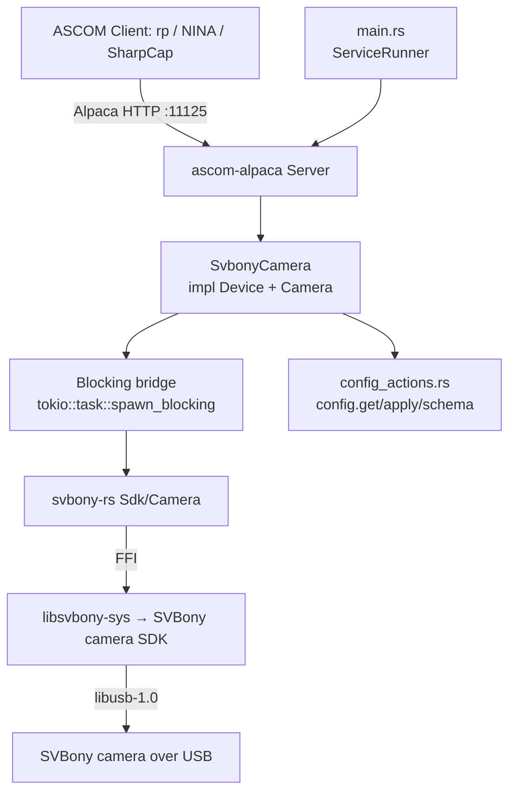

# Svbony-Camera Service Design

> **Follow-up landed (issue #679, 2026-07-22): `scripts/build-packages.sh`
> now has the `needs_svbony` SDK-staging leg this Status section's Phase G
> entry (below) originally deferred.** `nightly-packages` was failing on
> the `linux / arm64`, `linux / amd64`, and `macos / arm64 tarballs` legs
> with `unable to find library -lSVBCameraSDK`: the script discovered
> `svbony-camera` via its `pkg/` directory (like every other packaged
> service) but staged no SDK for it to link against. Fixed by staging the
> pinned indi-3rdparty blob into `SVBONY_SDK_LIB_DIR` for the link only —
> unlike QHY/ZWO, nothing is copied into `services/svbony-camera/pkg/lib/`
> or bundled in the package (ADR-018: no license grant at all), so the
> RUNPATH `build-packages.sh` already bakes in for `zwo-camera` is what
> lets the operator-installed copy (`rusty-photon-svbony-sdk-install`)
> resolve at runtime, exactly as this document's Packaging section always
> said it would once wired up. `scripts/build-tarballs.sh` (macOS) and
> `scripts/generate-brew-formulas.sh` now both explicitly exclude
> `svbony-camera`: indi-3rdparty ships no confirmed `mac_arm64` blob, and
> that script is arm64-only, so there is no real SDK to link there —
> shipping a `SVBONY_SKIP_NATIVE_LINK=1` (simulation-only) binary as the
> "real" nightly tarball would silently hand users a driver that can never
> see a physical camera. The Bazel-side SDK-fetch rule (`:svbony-camera`'s
> `manual` tag) remains separately deferred, unchanged by this fix — see
> "This phase's link-gating shortcut" below.
>
> **Status:** **Phase G landed (2026-07-21, this is the final planned
> phase): packaging + real-hardware validation marked pending.**
> `svbony-camera` is now **v0-complete pending real-hardware validation**
> against a physical SV605CC (on order, not yet arrived in this
> environment) — see "Real-hardware validation" below for the specific open
> items. Packaging landed: a new
> [`rusty-photon-svbony-sdk-install`](../../services/svbony-camera/pkg/rusty-photon-svbony-sdk-install)
> root-only helper (mirroring
> [`rusty-photon-qhy-firmware-install`](../../services/qhy-camera/pkg/rusty-photon-qhy-firmware-install))
> downloads the pinned SDK blob from the same indi-3rdparty commit
> `install-svbony-sdk` (CI) uses, verifies a real (curled + sha256-summed,
> not fabricated) pinned sha256 per architecture (amd64/armv8), and installs
> `libSVBCameraSDK.so` to `/usr/lib/rusty-photon/` — **this phase's one open
> technical decision, now resolved: RUNPATH, matching `zwo-camera`'s
> mechanism.** See "Packaging" below for the reasoning (in short: the SDK
> blob has no embedded SONAME either way, per Phase F's byte-inspection, but
> `/usr/lib/rusty-photon/` is a private package-owned directory outside
> `ldconfig`'s default scan path, so the packaged binary needs
> `-Wl,-rpath,/usr/lib/rusty-photon` baked in at build time — the exact
> mechanism `scripts/build-packages.sh` already applies for `zwo-camera`'s
> bundled, also-SONAME-less blob). `pkg/postinst`/`pkg/postrm` now exist
> (new this phase, following `qhy-camera`'s download-on-target shape, not
> `zwo-camera`'s bundled shape), and the `Cargo.toml` `[package.metadata.deb]`/
> `[package.metadata.generate-rpm]` sections' `TODO Phase G` markers are
> filled in (asset entries for the new helper, explicit `depends`/`requires`
> instead of `$auto`/rpm auto-detection — the operator-installed SONAME-less
> blob has exactly zwo-camera's dpkg-shlibdeps/rpm-auto-req problem even
> though this package never bundles it). **Deliberately NOT done this
> phase** (out of the explicit scope handed down for this phase, tracked as
> follow-up): a Bazel-side SDK-fetch repository rule (the `manual` tag on
> `:svbony-camera` and `libsvbony-sys/BUILD.bazel`'s unconditional
> `SVBONY_SKIP_NATIVE_LINK=1` stay exactly as Phase F left them — packaging
> here is purely a Cargo/`cargo-deb`/`cargo-generate-rpm` concern, verified
> by reading `zwo-camera`'s/`qhy-camera`'s `BUILD.bazel` files: neither has
> any packaging-related Bazel wiring beyond the plain `rust_library`/
> `rust_binary`/`rust_test` targets already present), and
> `scripts/build-packages.sh` staging/RUNPATH-injection support for
> `svbony-camera` specifically (today that script would still fail to
> produce a real `rusty-photon-svbony-camera` package — it has no
> `needs_svbony` SDK-staging leg the way it does for QHY/ZWO — since it
> already discovers `svbony-camera` via its `pkg/` directory but has no
> SVBony-specific staging block; adding one is mechanical follow-up in the
> same bucket as the Bazel SDK-fetch rule, not attempted here since it
> cannot be tested without the real SDK either). **The `build-packages.sh`
> half of this landed separately as issue #679** (see the banner at the top
> of this document) — the Bazel-side SDK-fetch rule remains deferred.
>
> **Phase F landed (2026-07-21): ConformU + CI gates.**
> `tests/conformu_integration.rs` now exists (mirrors `zwo-camera`'s: starts
> the production binary built with `--features conformu`, which pulls in the
> `simulation` backend so the SDK yields one `SV605CC-Simulated` camera, and
> runs ASCOM ConformU against it — self-skipping when `CONFORMU_PATH` is
> unset), with the matching `[package.metadata.conformu]` in `Cargo.toml` and
> a Bazel `conformu_integration` target (`tags = ["conformu"]`, excluded from
> the default `bazel test //...` gate; run with `bazel test --config=conformu
> //services/svbony-camera:conformu_integration`). A new
> [`.github/actions/install-svbony-sdk`](../../.github/actions/install-svbony-sdk/action.yml)
> composite action (mirroring `install-zwo-sdk`) provisions the real SVBony
> SDK from a pinned indi-3rdparty commit, wired into `conformu.yml` (Linux +
> macOS x86_64; excluded from the Windows per-service matrix — indi-3rdparty
> declares Windows unsupported) and `native.yml` (the nightly real-link
> build + a Linux `svbony-rs` FFI smoke test). See "Native dependency & build
> gating" below for what did and did not change under Bazel, and "Delivery
> phasing" for the full rundown incl. two bonus findings (no embedded SONAME
> in the vendored blob despite the CMakeLists' `SOVERSION` property; a
> pre-existing `SVBONY_SKIP_NATIVE_LINK` gap in four nightly Cargo
> safety-net workflows, fixed alongside this phase).
>
> **Phase E landed (2026-07-21): full `Camera` implementation.**
> `services/svbony-camera` builds, binds the Alpaca listener on port
> **11125**, and serves `/management/*` correctly with zero or one
> registered device; `--config`/`--port`/`--log-level` and the `doctor`
> subcommand all work.
> [`SvbonyCamera`](../../services/svbony-camera/src/camera.rs) implements
> both `ascom_alpaca::api::Device` and `ascom_alpaca::api::Camera` for real:
> connection lifecycle, config actions, sensor geometry/type, gain/offset/
> readout, binning/ROI, cooling, and the soft-trigger video-capture exposure
> state machine (incl. abort and pulse-guide) are all backed by
> [`backend::CameraHandle`](../../services/svbony-camera/src/backend.rs)
> over `svbony-rs`. The one permanent stub is `ElectronsPerADU`
> (`NOT_IMPLEMENTED`, ST2 — no native SDK field). With the `simulation`
> feature the server registers `svbony-rs`'s one fabricated
> `SV605CC-Simulated` camera as "camera device 0" so BDD scenarios have a
> real device to address; the production (real-SDK) build registers **zero**
> devices by default in this phase — see "Configuration → Device
> registration boundary". All nine BDD feature files are genuinely green
> (60 scenarios, 242 steps); E9 (mid-exposure SDK failure / exceeded
> `SVBGetVideoData` deadline) and the generation-counter abort-race are
> covered by mock-backend unit tests instead, per the design's own call
> (the simulation cannot force an SDK error). See "Delivery phasing" for
> what Phase E resolved vs. left open for Phase G hardware validation.
>
> **Correction (PR #658 review, 2026-07-21): "Windows unsupported" was
> wrong.** Phase F's "excluded from the Windows per-service matrix —
> indi-3rdparty declares Windows unsupported" (below) conflated
> indi-3rdparty's own Linux/macOS-only packaging with SVBony's SDK itself.
> SVBony does publish a Windows SDK directly, and `libsvbony-sys/build.rs`
> now has real, byte-verified Windows link directives — see "Native
> dependency & build gating → Windows" below for what's actually true (real
> code support; CI automation still blocked by a CAPTCHA-gated download).

## Overview

The `svbony-camera` service is an ASCOM Alpaca **Camera** driver for SVBony
cooled cameras (first hardware target: the SV605CC, a Sony IMX533-based OSC
camera). It exposes exposures, ROI/binning, gain/offset, cooling, and
readout over ASCOM Alpaca on a fixed port so `rp` and any Alpaca client
(NINA, SharpCap) can drive it like the existing `qhy-camera` / `zwo-camera`
services. SVBony ships no Alpaca driver of its own (Windows ASCOM binary
only); this driver is written against the native SVBony camera SDK
(`libSVBCameraSDK`) via the vendored [`svbony-rs`](../../crates/svbony-rs/)
crate.

It is the SVBony analogue of [`zwo-camera`](zwo-camera.md) — the API is
closely modeled on ZWO's ASI SDK, so `zwo-camera`'s device-trait shape ports
with mostly renames — **except for the exposure path**, SVBony's one
genuinely new design problem (see "Behavioral contracts → Exposure").

**Provenance.** Behaviour is derived from `indi_svbony_ccd` (indi-3rdparty)
as a *behavioural reference only* — GPL/LGPL-family — **no code is copied**,
the same clean-room discipline `qhy-camera` and `zwo-camera` take toward
their own INDI references.

**Not cross-platform.** Like `qhy-camera`/`zwo-camera`, this service links a
**native vendor SDK** at compile time and is gated out of the default
workspace build by SDK availability. See *Native dependency & build gating*.

**How it differs from `zwo-camera` (the two axes that matter).**

| Concern | ZWO (the mechanical precedent) | SVBony (this service) |
|---|---|---|
| **SDK license** | MIT → redistribute in-package | **No license text at all** → treat like QHY: never redistribute, download-on-target (new [ADR-018](../decisions/018-svbony-sdk-no-license-payload-policy.md)) |
| **Identity** | `ASIGetSerialNumber` requires an *open* camera → enumeration opens-then-closes each camera | `SVB_CAMERA_INFO.CameraSN` arrives **pre-open**, at enumeration (`SVBGetCameraInfo`) → identity is minted directly from enumeration, no open/close dance |
| **Exposure model** | Snap API (`ASIStartExposure`) | **Video-only**: no snap API; every exposure rides `SVBStartVideoCapture` + soft trigger + `SVBGetVideoData` |
| **Rust FFI layer** | `zwo-rs`, `bindgen`-generated | `svbony-rs`, **hand-transcribed** (SVBony's header carries no license, so it is not vendored/bindgen'd — see `crates/svbony-rs`) |

Net: mechanically SVBony is ZWO-shaped (we own the FFI crate; a cleaner C
API ports closely), legally it is QHY-shaped (no redistribution grant). See
[`docs/plans/svbony-camera.md`](../plans/svbony-camera.md) for the full
decision record.

---

## Native dependency & build gating (the crux)

- The imaging path is `svbony-camera → svbony-rs → libsvbony-sys → ` the
  **SVBony camera SDK** (`libSVBCameraSDK`, a source-less native binary,
  SDK version 1.13.4) **+ libusb-1.0**.
- `libsvbony-sys`'s `build.rs` emits `cargo:rustc-link-lib` for the one SDK
  library — SVBony has only one device (camera) and one SDK, so unlike
  `zwo-rs`/`libzwo-sys` there is no per-device link-feature union (ADR-014
  doesn't apply here: a single-device-type SDK has nothing to split).
- **Consequence:** every machine that compiles this package needs the
  SVBony camera SDK installed and discoverable, plus `libusb-1.0` dev
  headers — not just machines with a camera attached.
- The `svbony-rs` **`simulation` feature** (forwarded here as this
  service's own `simulation` feature) makes the build **camera-free, NOT
  SDK-free**: it fabricates a fake `SV605CC-Simulated` camera at runtime,
  including the soft-trigger video-capture flow and a poll-based cooling
  ramp. The native SDK is still required at link time — *unless*
  `SVBONY_SKIP_NATIVE_LINK=1` is set (see below).
- **`libusb-1.0` needs a keep-alive reference, not just a link-lib
  directive (issue #681).** The vendored `libSVBCameraSDK.so`/`.dylib` blob
  references `libusb_*` symbols internally without declaring libusb in its
  own `DT_NEEDED` (byte-verified via `readelf -d`), and `svbony-rs`'s own
  code never calls a `libusb_*` symbol directly — so a plain
  `cargo:rustc-link-lib=dylib=usb-1.0` gets dropped by the linker's default
  `--as-needed` behavior, producing a runtime `symbol lookup error:
  undefined symbol: libusb_init` on first camera-SDK call.
  `libsvbony-sys/lib.rs`'s `svbony_keep_libusb`-gated `libusb_keepalive`
  module (mirroring `libzwo-sys`'s `zwo_keep_udev`) fixes this with a
  `#[used]` function-pointer static that gives the linker a real
  regular-object reference to `libusb_init`, forcing `libusb-1.0` into
  `DT_NEEDED`. A `-Wl,--no-as-needed`/`-Wl,--as-needed` bracket around the
  link-lib line was tried first and does **not** work: Cargo only applies a
  build script's `cargo:rustc-link-arg` to the *build script's own
  package's* bin/cdylib/test/example targets, not transitively to
  downstream binaries like `svbony-camera` — verified empirically (the flag
  never appeared on the final linker command line).

### This phase's link-gating shortcut (Bazel — unchanged by Phase F)

Phase F (docs/plans/svbony-camera.md) added
[`.github/actions/install-svbony-sdk`](../../.github/actions/install-svbony-sdk/action.yml)
and wired it into the plain-Cargo `conformu.yml` + `native.yml` workflows
(`scheduled.yml`'s full-workspace legs joined them in #680, mirroring the
pre-existing `install-zwo-sdk` step there; `pi-nightly.yml`'s sudo-free
full-workspace leg joined them in #669, in the action's `sudo: "false"` mode
mirroring `install-zwo-sdk`'s sudo-free step there) — but that action is a
GitHub-Actions composite (shell steps against `apt`/
`brew`/`curl`+`ldconfig`), not something Bazel's hermetic build graph
consumes. Bazel would need its own repository rule (e.g. an `http_file`
fetch plus a non-skipping `cargo_build_script` variant) to provision the
same SDK, and nothing in this workspace's Bazel setup does that yet —
`crates/svbony-rs/libsvbony-sys/BUILD.bazel` therefore still bakes
`SVBONY_SKIP_NATIVE_LINK=1` into its `cargo_build_script` *unconditionally*,
exactly as before this phase. The *library* targets (no final link) build
with **zero SVBony SDK provisioning**. The **real** (non-`simulation`)
`//services/svbony-camera:svbony-camera` binary still cannot link under this
setup — verified locally: `bazel build //services/svbony-camera:svbony-camera`
fails with undefined `SVBOpenCamera`/`SVBCloseCamera`/etc. symbols — so it
stays tagged `tags = ["manual"]` in `BUILD.bazel`, unlike `zwo-camera`'s and
`qhy-camera`'s real binaries, which link cleanly under Bazel because their
BUILD.bazel files provision the real SDK unconditionally (this workspace's
Bazel CI/dev hosts have QHYCCD/ZWO pre-provisioned by other means). Only the
library and the `svbony-rs_sim`-backed binary/BDD/unit-test/`conformu_integration`
targets are first-class (non-`manual`) `//...` targets. A Bazel-side
`conformu_integration` target *does* exist as of Phase F (`tags =
["conformu"]`, excluded from the default gate like `zwo-camera`'s — run with
`bazel test --config=conformu //services/svbony-camera:conformu_integration`),
but because it links the SIM SDK variant like every other Bazel target here,
it only proves ASCOM protocol conformance, not the real link — that real-link
proof is Cargo-only (`conformu.yml`'s `install-svbony-sdk` step).

Cargo builds outside Bazel follow the same env-var gate (unset the variable,
with the SDK installed and `ldconfig`'d, to exercise the real link locally)
— this is exactly what `native.yml`'s `install-svbony-sdk` step does per-run.
This split (Cargo-CI real-link-provisioned, Bazel still skip-link-only) is a
deliberate, temporary simplification recorded in
[`docs/plans/svbony-camera.md`](../plans/svbony-camera.md)'s Status section
— revisit (drop `manual`, add a Bazel-side SDK-fetch rule) as follow-up work,
alongside real-hardware validation (see "Real-hardware validation" below);
Phase G's packaging work landed without either (see the Status banner above
for why).

### Gating plan (steady state, once the Bazel-side SDK-fetch rule lands)

Mirrors `zwo-camera`'s table exactly, once a Bazel-side SDK-fetch rule
exists (the Cargo-CI half already landed in Phase F via
`install-svbony-sdk`): local dev needs the SDK installed to link; CI
provisions it before building/testing; the simulation-only legs build
SDK-free via `SVBONY_SKIP_NATIVE_LINK=1`; Bazel provisions the SDK for its
`//...` targets the same way `install-zwo-sdk`/`qhyccd-sdk-install` do
today.

### Windows (PR #658 review, 2026-07-21)

`libsvbony-sys/build.rs` now has real Windows link directives — this is a
narrower claim than "Windows is provisioned by CI," so read carefully:

- **What's verified.** SVBony publishes a Windows `SVBCameraSDK` build
  directly (svbony.com/downloads/software-driver,
  `windows-SVBCameraSDK-v1.13.4.zip` — the same SDK version already pinned
  for Linux), separately from indi-3rdparty (whose `libsvbony` packaging is
  Linux/macOS-only — that packaging repo's own Windows refusal was
  previously, incorrectly, read as "SVBony has no Windows SDK"). Byte-
  verified against the real package: the header's exported function set is
  identical to what `lib.rs` already binds; the `.lib`/`.dll` (x86 + x64)
  export tables show plain, undecorated `cdecl` names (no `__stdcall`/`@N`
  decoration); no `libusb` dependency anywhere (the DLL's internal
  `CWinUsbCamera` symbol shows it uses Windows' in-box WinUSB driver
  instead); no license/EULA text anywhere in the package, extending
  [ADR-018](../decisions/018-svbony-sdk-no-license-payload-policy.md)'s "no
  license grant at all" finding to Windows too. `cargo check -p svbony-rs
  --target x86_64-pc-windows-msvc` (with `SVBONY_SDK_LIB_DIR` pointed at a
  manually-provisioned copy) passes.
- **What's still missing: CI automation.** Unlike the Linux/macOS blobs
  (indi-3rdparty's plain GitHub-raw mirror) or ZWO's Windows SDK
  (`install-zwo-sdk`'s plain CDN URL), SVBony's Windows download is gated
  behind `data-fileRestricted="true"` + a `recaptcha-v3.js`/
  `unified-captcha.js` consent flow — not a fetchable URL, so
  `install-svbony-sdk` has **no Windows step**, and `bazel/windows-latest`
  (a required check) still only exercises `SVBONY_SKIP_NATIVE_LINK=1` (the
  library targets build; the real binary link is untested on Windows in
  CI, same posture as before — see "Gating plan" above, mirrored for
  Windows specifically). A human must manually download the SDK once and
  set `SVBONY_SDK_LIB_DIR` to build the real Windows link — there is no
  path to automating that download without solving a CAPTCHA, which is out
  of scope on principle, not just effort.

### udev / USB

SVBony devices need a udev rule (VID `f266`). Per
[ADR-013 §3](../decisions/013-native-sdk-payload-policy.md), rules are
**group-scoped** (`GROUP="rusty-photon", MODE="0660"`), never a
world-writable `MODE="0666"` rule — `pkg/90-rusty-photon-svbony.rules`.

---

## Architecture



**Key components**

- **`main.rs`** — plain `fn main`, parses clap args, inits `tracing`, runs
  under `ServiceRunner::new("svbony-camera").with_reload().run_with_reload(...)`
  per [`service-lifecycle.md`](../skills/service-lifecycle.md). Config
  bootstrap via `rusty_photon_config::resolve_and_init` with an **empty
  identity-pointer list** (identities are hardware-derived).
- **`lib.rs`** — `ServerBuilder` that, on `build()`, enumerates connected
  SVBony cameras and registers each as an ASCOM device with its
  serial-derived UniqueID. Because `CameraSN` arrives at enumeration time
  (`SVBGetCameraInfo`, no open required — see "Device identity"),
  enumeration never opens a camera just to mint identity, unlike
  `zwo-camera`. Returns a `BoundServer`.
- **`camera.rs`** — `SvbonyCamera` (one instance per discovered camera)
  implementing both `Device` and `Camera` against the `backend::CameraHandle`
  seam — the full exposure state machine, ROI/binning, gain/offset,
  cooling, sensor geometry/type, and pulse-guide, per the Behavioral
  contracts below (Phase E, landed).
- **`backend.rs`** — the SDK seam (mirrors `zwo-camera`'s `backend.rs`):
  a `CameraHandle` trait plus a production `SvbonyCameraHandle` wrapping
  `svbony_rs::Sdk`/`Camera` behind a `parking_lot::Mutex` (the RAII `Camera`
  handle is `Send + !Sync`), and an in-crate `MockCameraHandle` for unit
  tests. Covers the full blocking SDK surface `Camera` needs: property/
  property-ex fetch, control get/set, camera-mode select + video-capture
  start/stop, the soft-trigger `capture` composite (ROI + output format +
  exposure control + trigger + the `exposure*2+500ms` `SVBGetVideoData`
  deadline), and pulse-guide. `is_open` is backed by its own atomic,
  independent of the mutex `capture` holds, so connection-state reads stay
  responsive during an in-flight exposure — the mutex is released between
  `capture`'s ROI/control setup and its trigger + `SVBGetVideoData` call,
  mirroring `zwo-camera`'s release-during-integration pattern.
- **`config.rs`** — typed `Config` with parse-don't-validate newtypes.
- **`config_actions.rs`** — `ConfigurableDriver` impl (real as of Phase
  C/D) + the `dispatch` the device delegates to.
- **`doctor.rs`** — the `doctor` subcommand (real as of Phase C/D): config
  parse + `svbony_rs::Sdk::cameras()` enumeration, gated the same way as
  `zwo-camera`'s doctor.

**Concurrency.** The SVBony SDK's thread-safety is undocumented — treated
as unsafe for concurrent calls on one handle, the same posture
`qhyccd-rs`/`zwo-rs` take. Every SDK call funnels through `spawn_blocking`
with a single logical owner per device, with a generation-counter guard so
an aborted/disconnected exposure can't publish a late frame, mirroring
`zwo-camera`'s `run_exposure`/`result_lock` pattern. `svbony-rs`'s `Sdk`
additionally serializes on a process-wide lock around every call into the
SDK's *global* (non-per-handle) entry points (`SVBGetNumOfConnectedCameras`/
`SVBGetCameraInfo`/`SVBGetSDKVersion`/`SVBOpenCamera`) — `Sdk` is a cheap,
freely-instantiated value (one per discovered camera), so without this lock
two `Sdk` instances opening different cameras concurrently would race
against the SDK's process-global camera/handle table with no synchronization
at all; see `svbony-rs::SDK_CALL_LOCK`'s doc comment.

Unlike `zwo-camera`, `AbortExposure` never signals the SDK (there is no
data-preserving or interruptible stop — see the Exposure contract below): it
only bumps the generation counter, so a capture already running against
`SVBGetVideoData` runs to completion (up to its `exposure*2+500ms` deadline)
before its (discarded) result is checked. `CameraState`/`PercentCompleted`
do not wait for that drain, though: an `aborted` flag (cleared on the next
`StartExposure`/reconnect) makes them report idle/`0` immediately once
`AbortExposure`/`Disconnect` is called, rather than continuing to report
`Exposing`/a climbing percentage for the rest of that deadline.

A consequence worth flagging explicitly: property/control reads that need
the open `Camera` handle (gain, offset, temperature, …) can still block
behind the same mutex `capture` holds for its `SVBGetVideoData` wait — this
is a hardware-forced consequence of SVBony having no separate "start" and
"poll status" pair the way ASI does, not an oversight — but `capture` bounds
that stall to at most one poll slice (`backend::VIDEO_DATA_POLL_MS`, 250ms):
it polls `SVBGetVideoData` in short slices instead of one blocking call for
the whole deadline, releasing the mutex between polls (a `SvbError::Timeout`
from a short slice just means "no frame yet," not a real failure). `is_open`/
`Connected` do not share even that bounded stall — they are backed by an
independent atomic specifically so basic connection-state polling stays
responsive during an in-flight exposure.

---

## MVP scope

**In scope (v0, landed Phase E)**

- ASCOM Camera `ICameraV3` for every enumerated SVBony camera, 8/16-bit RAW
  and mono/OSC (Bayer) sensors, derived at runtime from
  `SVB_CAMERA_PROPERTY` — never hardcoded to the SV605CC's own pattern.
- Startup enumeration registers all discovered cameras; per-device
  connect/disconnect (real since Phase C/D); on connect, select
  `SVB_MODE_TRIG_SOFT` when `IsTriggerCam` and start video capture once.
- Sensor geometry from cached `SVB_CAMERA_PROPERTY` (`MaxWidth`/`MaxHeight`,
  `SVBGetSensorPixelSize`); `PixelSizeX == PixelSizeY` (a single SDK
  pixel-size call). `CameraXSize`/`CameraYSize` report the **raw** sensor
  extent — Phase E's resolution of the "R4-style aligned-down reporting"
  open question above: unlike `zwo-camera`, this driver does **not** reduce
  the reported size so every binned full frame satisfies the width%8/
  height%2 rule, chosen to keep `CameraXSize`/`CameraYSize` exact simulated
  values (3008×3008) rather than a derived, harder-to-eyeball number; a
  binned full-frame `StartExposure` may therefore be rejected at some bins
  (e.g. 3008/3 is not an integer at all). Revisit once ConformU coverage
  exists (Phase F) if this proves too strict in practice.
- **Binning** — symmetric only (`CanAsymmetricBin = false`); `MaxBinX/Y`
  from `SupportedBins`.
- **ROI** — `SVBSetROIFormat` constraints: `width % 8 == 0`,
  `height % 2 == 0`, byte-for-byte the same rule `zwo-camera` enforces for
  ASI.
- **Exposure** — the soft-trigger video-capture state machine (see
  "Behavioral contracts → Exposure" below); `CanStopExposure = false`,
  `CanAbortExposure = true` (to confirm/revise after real-hardware
  validation).
- **Gain / Offset** — `SVB_GAIN` / `SVB_BLACK_LEVEL` (SVBony's ASCOM
  *Offset*-equivalent control); current value + `Min`/`Max` from
  `SVBGetControlCaps`; `NOT_IMPLEMENTED` if the control is absent.
- **Readout modes** — driver-named list: `["SoftTrigger", "FreeRunning"]`,
  a cosmetic label mirroring the two acquisition modes the exposure state
  machine already uses internally (`SVB_MODE_TRIG_SOFT` vs
  `SVB_MODE_NORMAL`); switching it only updates cached driver state (RM1),
  it does not itself change `SVB_CAMERA_MODE`.
- **Cooling** — `CoolerOn`, `SetCCDTemperature`, `CoolerPower`,
  `CanSetCCDTemperature`, `CanGetCoolerPower` gated on
  `SVB_CAMERA_PROPERTY_EX.bSupportControlTemp`. Cooler set-point / current
  temperature are 0.1 °C SDK units (÷10 for ASCOM's °C). **Tenet 3 (no
  actuation on connect) explicitly covers the cooler**: connect, reconnect,
  and `config.apply` must never touch `SVB_COOLER_ENABLE` or
  `SVB_TARGET_TEMPERATURE` — the TEC engages only on an explicit operator
  `CoolerOn` command. Verified by a unit test (`k5_connecting_never_enables_the_cooler`)
  and by construction: `open_handshake` (the connect path) contains no call
  to `set_control_value(CoolerEnable, …)`/`set_control_value(TargetTemperature, …)`
  anywhere in the file.
- **Sensor type** — `Monochrome` vs `RGGB` from `IsColorCam` / `BayerPattern`.
- **`MaxADU`** = `(2^MaxBitDepth) - 1` from `SVB_CAMERA_PROPERTY.MaxBitDepth`.
- **`ElectronsPerADU`** — **`NOT_IMPLEMENTED` placeholder**, permanently in
  this phase: unlike ZWO's `ASI_CAMERA_INFO.ElecPerADU`, `SVB_CAMERA_PROPERTY`
  carries no native electrons-per-ADU field. Confirm via real-hardware
  validation whether the SDK exposes this some other way (a control, a
  separate query) before ruling it out permanently.
- **Pulse guiding** — `CanPulseGuide` from `bSupportPulseGuide`;
  `PulseGuide` kept a **literal blocking** `SVBPulseGuide` call in v0 (not
  `zwo-camera`'s asynchronous fire-and-forget-with-deadline wrapper) — see
  "Pulse guiding" below for the reasoning; unexercised by the simulation
  (the SV605CC has no ST4 port) beyond mock-backend unit tests.
- `config.get`/`config.apply`/`config.schema` actions (real since Phase
  C/D); hardware-derived `UniqueID`; in-process reload.

**Deferred (see *Future Work*)**

- **Bad-pixel correction** (`SVB_BAD_PIXEL_CORRECTION_ENABLE`) — still not
  implemented. This phase's implementation order (see
  [`docs/plans/svbony-camera.md`](../plans/svbony-camera.md)) did not
  include it; it is not exercised by any BDD scenario or the ASCOM `Camera`
  surface, so it remains future work, not a Phase E gap.
- Per-serial connect-time tuning (gain/offset/target-temperature defaults).
- SV605MC / other SVBony cooled cameras — same driver, capability-driven.
- SVBony filter wheel (SV226) — a separate service on its own SDK, per the
  ADR-014 one-service-per-device-family shape, if ever in scope.

---

## Configuration

The service enumerates every connected SVBony camera at startup and
registers each as an ASCOM device (camera index 0, 1, 2, …) on the one
port. The hardware is the source of truth — there is no per-camera
*binding* in config.

```jsonc
{
  // Optional per-device overrides, keyed by SDK serial. A device with no
  // entry uses SDK-derived defaults (name from the friendly name).
  "devices": {
    "SVB0123456789AB": {
      "name": "Main Imaging",
      "description": "SV605CC @ 1000mm"
    }
  },
  "server": {
    "port": 11125,
    "bind_address": "0.0.0.0",
    "tls": null,
    "auth": null
  }
}
```

The `server` block is the shared `AlpacaServerConfig` from
`crates/rusty-photon-server-config` (see ADR-016). Absent `tls`/`auth`
means plain, unauthenticated HTTP.

- **devices** — Optional per-device override map keyed by **SDK serial**
  (`SVB_CAMERA_INFO.CameraSN`). Any device without an entry uses
  SDK-derived defaults. No per-camera connect-time tuning (gain/offset/
  target temperature) in v0 — deferred (see *Future Work*).
- **server.port** — Listening port (**11125**; 11111–11124 are already
  allocated, see `docs/workspace.md`'s Services table). Hard read-only
  (self-lockout: a port change would make the BFF lose the devices).

### Config actions

Standard cross-driver protocol ([`config-actions.md`](config-actions.md)),
implemented generically in `rusty_photon_config::actions` + the ASCOM
adapter in [`rusty-photon-driver`](../../crates/rusty-photon-driver).
`config_actions.rs` supplies `ConfigurableDriver for SvbonyCameraDriver`
(real as of Phase C/D):

- **Secrets redacted/carried forward:** `server.auth.password_hash`.
- **Locked (identity) fields:** none — UniqueIDs are hardware-derived.
- **Hard read-only fields:** `/server/port`.
- **Editable fields:** the `devices` map (per-serial `name` /
  `description`).
- **Validation** at load (parse-don't-validate): unknown keys are rejected
  at deserialize (`deny_unknown_fields`).

### Device identity (UniqueID)

**SVBony's identity is pre-open** — the headline win over `zwo-camera`.
`SVBGetCameraInfo` returns `CameraSN` at **enumeration time**, before any
camera is opened, so unlike ZWO's `ASIGetSerialNumber` (which requires an
*open* camera), `svbony-camera`'s enumeration never opens a camera just to
mint an identity. `enumerate_cameras()` mints each device's UniqueID
directly from `Sdk::cameras()`'s output:

```
SVBONY:{friendly_name with spaces → '-'}:{serial}
```

A camera that reports an **empty** serial falls back to a stable
position-based identity, mirroring `zwo-camera`'s `mint_identity`:

```
SVBONY:{friendly_name}:noserial-{index}
```

logged at `warn!`. Consequences (same as `zwo-camera`/`qhy-camera`): **no
`unique_id` field in config**, an **empty identity-pointer list** passed to
`resolve_and_init` in `main.rs`, and **no locked identity field** in the
config-actions tiers.

### Device registration boundary (still in effect)

`enumerate_cameras()` behaves differently depending on the `simulation`
feature, a **deliberate, temporary phase boundary** (not a technical
constraint — real-SDK enumeration is trivial for SVBony, no open
required) that Phase E's `Camera` work did not change:

- **With `simulation`:** enumerates `svbony-rs`'s one fabricated
  `SV605CC-Simulated` camera and registers it, so BDD scenarios have
  "camera device 0" to address.
- **Without `simulation`** (the production real-SDK build): returns **zero**
  cameras unconditionally, regardless of `SvbonyCamera`'s `Camera` trait
  surface now being real — wiring real enumeration to production device
  registration is still gated on real-SDK link availability (see "Native
  dependency & build gating"), which remains deferred follow-up work (the
  Bazel-side SDK-fetch rule; see the Status banner above).

`ServerBuilder::with_empty(bool)` additionally forces zero cameras
regardless of the feature (mirrors `zwo-camera`'s `--simulation-empty`
test-only path, contract C0), used by the BDD suite's empty-backend
scenario.

---

## Behavioral contracts

Named, testable behaviours. ASCOM error names per
[`docs/references/ascom-alpaca.md`](../references/ascom-alpaca.md). Every
contract below is real as of Phase E; the BDD feature files under
`tests/features/` (60 scenarios, 242 steps) and the unit tests in
`src/camera.rs`/`src/backend.rs` exercise them — see "Testing" below for
which layer covers which contract (E9's two branches and the
generation-counter abort race are unit-test-only, per the design's own
call that the simulation cannot force an SDK error).

### Enumeration & connection lifecycle

- **C0.** At startup `build()` enumerates connected SVBony cameras and
  registers each as an ASCOM device with its serial-derived UniqueID — no
  open required (see *Device identity*). Zero discovered cameras is **not**
  a hard failure — the service starts with no Camera devices, logged at
  `warn!`; a later reload re-enumerates. In this phase, this only happens
  under the `simulation` feature (see *Device registration boundary*).
- **C1.** `set_connected(true)` opens the camera via the SDK. On success
  `Connected = true`. A second `set_connected(true)` on an already-open
  device is a no-op.
- **C2.** `set_connected(true)` with the camera unreachable / SDK open
  failure returns the mapped driver error and `Connected` stays `false`.
- **C3.** `set_connected(false)` closes the device.
- **C5 (tenet 3, verified).** No code path in this service pushes cooler
  state or any other actuation on startup, connect, or `config.apply`
  (workspace tenet [*no actuation on connect*](../workspace.md#project-tenets));
  `SVB_COOLER_ENABLE`/`SVB_TARGET_TEMPERATURE` are touched only by an
  explicit ASCOM `CoolerOn`/`SetCCDTemperature` call — `camera.rs`'s
  `open_handshake` (the sole connect-path function) contains no call to
  either control, and a unit test
  (`k5_connecting_never_enables_the_cooler`) pins the observable behaviour.

### Exposure (the soft-trigger video-capture state machine)

This was this plan's one genuinely new design problem: SVBony's SDK has no
snap-exposure API. Every exposure rides video capture
(`SVBStartVideoCapture` / `SVBSendSoftTrigger` / `SVBGetVideoData`). The
design follows `indi_svbony_ccd`'s shape (behavioural reference only, see
*References*); real-hardware verification of each step is still pending
(see "Real-hardware validation" below).

**State machine (as implemented):**

1. **Mode selection + video-capture start, at connect — trigger cameras
   only.** When the camera reports `IsTriggerCam`
   (`SVB_CAMERA_PROPERTY.IsTriggerCam`), the driver calls
   `SVBSetCameraMode(SVB_MODE_TRIG_SOFT)` once and then `SVBStartVideoCapture`
   once, during the connect handshake — not per-exposure. *Why at connect,
   not at first exposure:* mode selection is a one-time camera-state change,
   not per-frame; doing it once at connect keeps `StartExposure` on the hot
   path free of a first-call special case, and matches `indi_svbony_ccd`'s
   behaviour. This is tenet-3-safe **only** because trigger-gated video
   capture produces no frames until an operator's soft trigger — a read of
   camera-mode capability plus an armed-but-idle mode-select, not actuation
   of the imaging chain (no cooler, no motion, no shutter).
   **Non-trigger cameras are different and do NOT get this at connect:**
   their only mode is free-running `SVB_MODE_NORMAL`, so starting video
   capture at connect would begin the sensor continuously integrating and
   streaming frames as a side effect of connecting — genuine actuation with
   no operator action, which tenet 3 bans outright. For a non-trigger
   camera, video capture is left unarmed at connect; it is armed for the
   first time by state-machine step 5's per-exposure stop-then-start, which
   only ever runs from an operator-initiated `StartExposure`. (Fixed
   post-Phase-E, per PR #658 review: an earlier revision started video
   capture unconditionally at connect regardless of `IsTriggerCam`.)
2. **Each ASCOM `StartExposure`:**
   a. Sets `SVB_EXPOSURE` to the requested duration. **Unit assumption:**
      the ground truth does not state the control's unit explicitly;
      `svbony-rs`'s `ControlType::Exposure` doc comment models it as
      **microseconds (µs)**, matching ZWO's `ASI_EXPOSURE` convention —
      this needs confirmation against real hardware (pending; see
      "Real-hardware validation" below).
   b. Calls `SVBSendSoftTrigger` to request one frame.
   c. Polls/awaits `SVBGetVideoData` with a timeout of
      **`exposure_us * 2 + 500ms`** — the SDK's own documented
      recommendation (captured in `docs/plans/svbony-camera.md`'s
      "Verified SDK facts"). Exceeding the deadline is a failure (see E9
      below).
3. **Stale-frame flush.** A buffered frame from before a ROI/exposure
   change must be drained before the first post-change frame is trusted —
   the `indi_svbony_ccd` reference documents this workaround; Phase E must
   verify against real hardware whether `svbony-rs`'s
   `SVBGetVideoData`/soft-trigger pairing already avoids this or needs an
   explicit flush.
4. **There is no data-preserving stop at the SDK level**
   (`SVBStopVideoCapture` discards whatever is in flight). Consequently:
   - `CanStopExposure = false`; `StopExposure` returns `NOT_IMPLEMENTED`
     unconditionally rather than pretending to gracefully preserve data it
     cannot preserve.
   - `CanAbortExposure = true`; `AbortExposure` discards the frame — but
     **implementation-wise it never calls `SVBStopVideoCapture`, or any
     other SDK entry point.** It only bumps the exposure generation
     counter, so the in-flight `capture` (already running against
     `SVBGetVideoData` under the backend's SDK lock) is left to run to
     completion; its result is silently discarded once the generation
     mismatch is observed. This is a deliberate divergence from calling
     `SVBStopVideoCapture` concurrently from a second thread while another
     thread's `SVBGetVideoData` is blocked on the same handle — exactly the
     kind of undocumented-thread-safety risk the Concurrency section above
     warns about generally, and calling it would additionally leave video
     capture stopped for a trigger camera, whose step 1 invariant ("started
     once at connect, never restarted") assumes it stays armed — a
     non-trigger camera's step 5 restart already stops/starts it per
     exposure regardless. **To be confirmed/revised after real-hardware
     validation** (still pending, see below): if the SDK turns out to
     tolerate a concurrent `SVBStopVideoCapture` call
     safely (some vendor video APIs are explicitly designed to unblock a
     pending read this way), wiring that in would make `AbortExposure`
     responsive mid-exposure instead of only at the next natural
     `SVBGetVideoData` return; if the SDK instead turns out to support a
     genuine data-preserving stop, `CanStopExposure` flips to `true` to
     match `zwo-camera`. `CameraState`/`PercentCompleted` do not wait for
     this drain either way — see the Concurrency section above.
5. **Non-trigger cameras** (`IsTriggerCam = false`): fall back to
   `SVB_MODE_NORMAL` (free-running video capture) with a per-exposure
   capture restart (no soft trigger available) — armed for the first time
   here, not at connect (step 1) — the SV605CC is trigger-capable, so this
   path is untested by the simulation and is a Phase E design note, not yet
   BDD-covered.
6. **Dark frames.** No mechanical shutter exists in video mode (same
   posture as `zwo-camera`'s shutterless ASI sensors): `Light = false` is
   accepted and captures identically; `HasShutter = false`.
7. **Mid-exposure SDK error or an exceeded `SVBGetVideoData` deadline**
   transitions `CameraState = Error`, sets `last_error`, leaves
   `ImageReady = false` — covered by unit tests against the mock backend
   seam (mirrors `zwo-camera`'s E9), not BDD (the simulation cannot force
   an SDK error).

### ROI / binning

- **B1.** `set_bin_x`/`set_bin_y` validate against `SupportedBins`;
  unsupported → `INVALID_VALUE`.
- **B2.** `CanAsymmetricBin = false`.
- **B3.** A bin change rescales the cached ROI by the bin ratio.
- **R1.** ROI setters accept any `u32`; geometry validated at
  `StartExposure`.
- **R2.** Out-of-bounds/zero sub-frame → `INVALID_VALUE`.
- **R3.** `SVBSetROIFormat`'s alignment rule — `width % 8 != 0` or
  `height % 2 != 0` — → `INVALID_VALUE`; identical to `zwo-camera`'s ASI
  rule.

### Gain / offset / readout

- **GO1.** `Gain`/`Offset` (`SVB_GAIN`/`SVB_BLACK_LEVEL`) return the
  current SDK value, or `NOT_IMPLEMENTED` if the control is absent.
- **GO2.** Setters validate against cached `[min, max]`; out-of-range →
  `INVALID_VALUE`.
- **GO3.** `GainMin/Max`, `OffsetMin/Max` reflect the cached SDK min-max.
- **RM1.** `ReadoutModes` is the driver's named list; `set_readout_mode`
  validates the index; invalid → `INVALID_VALUE`.

### Cooling

- **K1.** `CanSetCCDTemperature`/`CanGetCoolerPower` are `true` iff
  `SVB_CAMERA_PROPERTY_EX.bSupportControlTemp`; otherwise the related
  getters return `NOT_IMPLEMENTED`.
- **K2.** `CCDTemperature` reads `SVB_CURRENT_TEMPERATURE` (÷10 for °C),
  reported independently of whether cooling is on. **Deviation from
  `zwo-camera`'s decoupled-temperature decision:** ASI caches a *separate*
  `temperature_available` flag from `zwo-rs`'s `CameraInfo` (some
  uncooled ASI models still expose a bare temperature sensor), but
  `SVB_CAMERA_PROPERTY_EX` exposes only the single `bSupportControlTemp`
  flag covering both the cooler *and* the readable sensor temperature — so
  `CCDTemperature` is gated on the same flag as `CanSetCCDTemperature`
  here, not a second independently-cached one.
- **K3.** `set_set_ccd_temperature` validates `[-273.15, 80]` and encodes
  to `SVB_TARGET_TEMPERATURE` (×10, tenths of °C); `SetCCDTemperature`
  reads it back (÷10).
- **K4.** `CoolerOn`/`set_cooler_on` map to `SVB_COOLER_ENABLE`;
  `CoolerPower` is the raw `SVB_COOLER_POWER` percent (already 0–100, no
  normalization needed).
- **K5 (tenet 3).** No code path reachable from connect, reconnect, or
  `config.apply` calls `set_cooler_enable`/`set_target_temperature_celsius`
  — the cooler engages only on an explicit operator `CoolerOn` ASCOM call.
  Review this explicitly at the Phase E connect-path PR, per the workspace
  tenet list's explicit callout of cooler setpoints as actuation.

### Sensor type & signal

- **ST1.** `SensorType` is `RGGB` (colour) when `IsColorCam`, else
  `Monochrome`; `BayerOffsetX/Y` follow `BayerPattern` — read at runtime,
  never hardcoded to the SV605CC's own pattern (a future mono/other-pattern
  model must report correctly).
- **ST2.** `ElectronsPerADU` is a **`NOT_IMPLEMENTED` placeholder** —
  `SVB_CAMERA_PROPERTY` has no native electrons-per-ADU field (unlike
  ZWO's `ElecPerADU`). Confirm via real-hardware validation whether the SDK
  exposes this another way before treating this as permanent.
- **ST3.** `MaxADU` = `(2^MaxBitDepth) - 1` from
  `SVB_CAMERA_PROPERTY.MaxBitDepth` (16383 for the SV605CC's 14-bit ADC).

### Pulse guiding (capability-driven)

- **PG1.** `CanPulseGuide` is `true` iff
  `SVB_CAMERA_PROPERTY_EX.bSupportPulseGuide` — capability-driven, not
  model-driven (a future ST4-capable model reports `true`). The SV605CC
  has no ST4 port, so the simulation always reports `false`.
- **PG2.** `PulseGuide` on a camera without ST4 returns `NOT_IMPLEMENTED`;
  on a camera with ST4, `SVBPulseGuide` blocks at the SDK level for the
  pulse duration. **Decision (Phase E): kept a literal blocking call**,
  unlike `zwo-camera`'s asynchronous ST4 wrapper (`PulseGuide` returns
  immediately, `IsPulseGuiding` tracks a deadline). Rationale: no
  ST4-capable SVBony model exists to validate against yet (the SV605CC has
  no ST4 port, so this whole branch is exercised only by mock-backend unit
  tests, never BDD), and a literal call is simpler and faithful to the SDK
  until there is a concrete pulse-duration profile to design the
  async wrapper against. **Caveat carried forward, not resolved:** if a
  future ST4-capable model's guide pulses are long enough to risk
  ConformU's ~1s response budget, revisit with the same
  fire-and-forget-with-deadline pattern `zwo-camera` uses — tracked in
  `camera.rs::pulse_guide`'s doc comment.

---

## ASCOM Camera surface — v0 behaviour

| Property / Method | v0 behaviour (backed by `svbony-rs`) | Status |
|---|---|---|
| `CameraXSize` / `CameraYSize` | Cached `SVB_CAMERA_PROPERTY` `MaxWidth`/`MaxHeight` (raw, not aligned down) | **Real** |
| `PixelSizeX` / `PixelSizeY` | `SVBGetSensorPixelSize` (X == Y) | **Real** |
| `BinX` / `BinY` / `MaxBinX` / `MaxBinY` | Symmetric; max from `SupportedBins` | **Real** |
| `CanAsymmetricBin` | `false` | **Real** |
| `NumX` / `NumY` / `StartX` / `StartY` | Setters relaxed; validated at `StartExposure` (incl. %8 / %2) | **Real** |
| `MaxADU` | `(2^MaxBitDepth) - 1` | **Real** |
| `ElectronsPerADU` | `NOT_IMPLEMENTED` placeholder (no native field) | **Permanent stub (ST2)** |
| `ExposureMin` / `Max` / `Resolution` | From `SVBGetControlCaps(SVB_EXPOSURE)` (µs, assumed) | **Real** |
| `Gain` / `GainMin` / `GainMax` | `SVB_GAIN` control | **Real** |
| `Offset` / `OffsetMin` / `OffsetMax` | `SVB_BLACK_LEVEL` control | **Real** |
| `ReadoutMode` / `ReadoutModes` | Driver-named list (`SoftTrigger`/`FreeRunning`) | **Real** |
| `SensorType` / `BayerOffsetX/Y` | Mono vs RGGB from `IsColorCam` / `BayerPattern` | **Real** |
| `CoolerOn` / `CCDTemperature` / `SetCCDTemperature` / `CoolerPower` | Gated on `bSupportControlTemp` | **Real** |
| `CanSetCCDTemperature` / `CanGetCoolerPower` | `true` iff `bSupportControlTemp` | **Real** |
| `HasShutter` | `false` (no mechanical shutter in video mode) | **Real** |
| `CameraState` | `Idle` / `Exposing` / `Error` | **Real** |
| `PercentCompleted` | From remaining-exposure µs, clamped ≤ 100 | **Real** |
| `CanAbortExposure` / `CanStopExposure` | `true` / **`false`** (no data-preserving stop) | **Real** |
| `CanPulseGuide` | `true` iff ST4 port present (SV605CC: `false`) | **Real** |
| `PulseGuide` / `IsPulseGuiding` | `SVBPulseGuide`, gated on ST4 capability; kept a literal blocking call (PG2) | **Real** |
| `StartExposure` (`Light=false`) | Accepted; captured normally (no shutter) | **Real** |
| `StartExposure` / `AbortExposure` / `StopExposure` / `ImageReady` / `ImageArray` | Per the soft-trigger video-capture state machine above | **Real** |
| `Name` / `Description` / `DriverInfo` / `DriverVersion` / `Connected` / `UniqueID` | — | **Real** |

---

## Service lifecycle (`main.rs`)

Standard shape per [`service-lifecycle.md`](../skills/service-lifecycle.md),
identical structure to `zwo-camera`'s:

```rust
use rusty_photon_service_lifecycle::{ServiceResult, ServiceRunner};

fn main() -> ServiceResult {
    let args = Args::parse();
    let _tracing_guard = rusty_photon_service_lifecycle::init_service_tracing(
        "svbony-camera", args.log_level, args.service,
    );

    let config_path = rusty_photon_config::resolve_and_init(
        "svbony-camera",
        args.config,
        &serde_json::to_value(Config::default())?,
        &[],
    )?;

    ServiceRunner::new("svbony-camera")
        .with_reload()
        .scm_mode(args.service)
        .run_with_reload(|shutdown, reload| async move {
            loop {
                let bound = ServerBuilder::new()
                    .with_config_source(config_path.clone(), CliOverrides { port: args.port })
                    .with_reload_signal(reload.clone())
                    .build()
                    .await?;
                tokio::select! {
                    r = bound.start(shutdown.cancelled()) => return r,
                    () = reload.recv() => continue,
                }
            }
        })
}
```

`info!("Service started successfully …")` only after the bind succeeds;
everything else is `debug!` (CLAUDE.md Rule 9).

---

## Testing

Layered per [`testing.md`](../skills/testing.md).

- **Unit** (`src/*.rs` `#[cfg(test)]`, 65 tests) — config parse/newtype
  validation, identity minting (`mint_identity`'s hardware-serial and
  `noserial-{index}`-fallback branches), config-actions editability tiers,
  the `exposure_timeout_ms` protocol-encoding pure function
  (`backend.rs::pure_fn_tests`), and the full `Camera`/`Device` behaviour
  (connection lifecycle incl. connect-time property caching, sensor
  geometry/type, gain/offset, binning/ROI validation, cooling incl. K5's
  no-actuation-on-connect assertion, the exposure state machine incl. E9's
  two branches — mid-exposure SDK failure and an exceeded
  `SVBGetVideoData` deadline — and the generation-counter abort/disconnect
  race, PG1/PG2) against the in-crate `backend.rs` `MockCameraHandle`
  seam, which the `svbony-rs` simulation cannot exercise (it cannot force
  an SDK error, and never runs a non-trigger camera). The production
  `SvbonyCameraHandle` itself is also unit-tested against the real
  `svbony-rs` simulation backend (`backend::handle_tests`).
- **BDD** (`bdd-infra::ServiceHandle`, nine feature files, 60 scenarios /
  242 steps) — all genuinely green, including `enumeration_connection`'s
  disconnect-cancels-an-in-flight-exposure scenario (C3b) and every
  behavioural feature (`exposure`, `binning_and_roi`, `cooling`,
  `gain_offset_readout`, `sensor_properties`) — see each file's header
  comment for the specific contracts it encodes. E9 and the
  generation-counter abort race are deliberately **not** BDD-covered — the
  design doc calls this out explicitly, since the `svbony-rs` simulation
  cannot force an SDK error — and live in the unit-test layer above
  instead.
- **ConformU** — `tests/conformu_integration.rs` (Phase F), mirroring
  `zwo-camera`'s: starts the `--features conformu` binary (real SDK link
  required, per "Native dependency & build gating" above — `conformu`
  enables `mock`/`simulation`, which removes the *camera*, not the SDK
  *link*) and runs ASCOM ConformU against its one simulated `SV605CC`
  camera, self-skipping when `CONFORMU_PATH` is unset (so the test passes
  locally with no ConformU installed). `[package.metadata.conformu]` in
  `Cargo.toml` drives `conformu.yml`'s dynamic per-service discovery. A
  parallel Bazel `conformu_integration` target exists too (`tags =
  ["conformu"]`) but always links the sim SDK variant (protocol conformance
  only, not the real link — see "Native dependency & build gating").

---

## Delivery phasing

Mirrors [`docs/plans/svbony-camera.md`](../plans/svbony-camera.md)'s
phases A–G:

- **Phase A — `libsvbony-sys`:** ✅ *landed.* Hand-written FFI bindings
  (no bindgen — no license to vendor a header under), `SVBONY_SKIP_NATIVE_LINK`
  gate.
- **Phase B — `svbony-rs`:** ✅ *landed.* Safe handles/enums/error mapping,
  `simulation` backend incl. the soft-trigger video-capture flow and a
  poll-based cooling ramp. 25 unit tests.
- **Phase C — bare service:** ✅ *landed (this document's Status banner).*
  `svbony-camera` serving zero (production) or one (simulation) device on
  `:11125`; `doctor` works; packaging stubs (udev rule, systemd unit,
  `doctor.toml`) exist; the SDK-download helper itself is Phase G.
- **Phase D — design doc + ADR + BDD:** ✅ *landed (this document, the new
  ADR-018, the `docs/workspace.md` rows, and the nine feature files).*
- **Phase E — full Camera:** ✅ *landed (2026-07-21).* `Device` (already
  real) + `Camera` over `svbony-rs` — the soft-trigger exposure state
  machine (incl. connect-time mode-select + video-capture start, E1-E9),
  ROI/bin (B1-B3, R1-R3), gain/offset (`SVB_BLACK_LEVEL`, GO1-GO3, RM1),
  cooling (K1-K5, tenet 3 verified), sensor geometry/type (ST1-ST3),
  pulse-guide (PG1-PG2, kept a literal blocking call), `backend.rs` seam
  expansion (every blocking SDK operation `Camera` needs), `spawn_blocking`
  bridge with a generation counter (mirroring `zwo-camera`'s
  `run_exposure`/`result_lock`, minus an SDK-level interrupt — see the
  Concurrency section), config actions (already real), serial identity
  (already real). Removed `@wip` from all five behavioural feature files
  plus C3b; 60/60 BDD scenarios and 65 unit tests green. **Fixed during
  this phase:** an early revision of `backend.rs::capture` held the SDK
  mutex across the (simulation-only) artificial exposure-duration wait,
  which blocked `is_open`/property reads for the whole exposure and
  surfaced as a genuine BDD failure (`E2`'s "second exposure while one is
  in flight" scenario) — fixed by giving `is_open` its own atomic and
  releasing the SDK mutex between `capture`'s setup and its
  trigger/`SVBGetVideoData` call. **Deliberately left open for Phase G**
  (documented in-place, not resolved): the `SVB_EXPOSURE` unit assumption
  (µs), the stale-frame-flush question, whether `ElectronsPerADU` has a
  non-obvious SDK path, and whether `CanStopExposure` should flip to
  `true` — see the relevant contract sections above for each.
- **Phase F — gates:** ✅ *landed (2026-07-21).* `tests/conformu_integration.rs`
  + `[package.metadata.conformu]` (ConformU on the sim backend, mirroring
  `zwo-camera`), a Bazel `conformu_integration` target (`tags =
  ["conformu"]`), the new
  [`install-svbony-sdk`](../../.github/actions/install-svbony-sdk/action.yml)
  composite action (pinned to indi-3rdparty commit `cd50a3b95032d850cca28d8162513276bc1349ba`,
  resolved as `master`'s HEAD on 2026-07-21), wired into `conformu.yml`
  (Linux + macOS x86_64 real-link; macOS arm64 — `macos-latest` today — falls
  back to `SVBONY_SKIP_NATIVE_LINK=1`, no confirmed arm64 blob; excluded
  entirely from the Windows per-service matrix, no Windows SDK support at
  all) and `native.yml` (nightly real-link build + a Linux `svbony-rs` FFI
  smoke test, matching zwo-rs's). The Bazel `manual` tag on
  `:svbony-camera` and `libsvbony-sys/BUILD.bazel`'s unconditional
  `SVBONY_SKIP_NATIVE_LINK=1` were deliberately **left unchanged** — see
  "Native dependency & build gating" above for why (the new action is a
  Cargo/GitHub-Actions mechanism Bazel's hermetic build graph does not
  consume; Bazel would need its own SDK-fetch repository rule, not built in
  this phase). Two findings recorded along the way: (1) byte-inspection
  (`readelf -d`) of the vendored `.bin` blob shows it carries **no embedded
  DT_SONAME**, despite indi-3rdparty's CMakeLists.txt setting a `SOVERSION 1`
  CMake *install* property — empirically (`ldconfig -C <scratch-cache>`),
  glibc's ldconfig falls back to the on-disk filename as the cache key when
  no SONAME is present, so installing under `libSVBCameraSDK.so.1` (+ a
  `.so` symlink) and running `ldconfig` still resolves `-lSVBCameraSDK` at
  both link and run time with no RUNPATH trick needed — just not for the
  reason the CMake property implied (see `install-svbony-sdk/action.yml`'s
  header comment for the full trace). (2) A pre-existing gap predating this
  phase — `test.yml`, `safety.yml`, `publish-readiness.yml`, and
  `ui-browser-nightly.yml` build/check `--workspace --all-features` without
  ever setting `SVBONY_SKIP_NATIVE_LINK` (unlike their existing
  `ZWO_SKIP_NATIVE_LINK`/`QHYCCD_SKIP_NATIVE_LINK` lines) — was found and
  fixed alongside this phase's work, since it would otherwise break those
  four nightly Cargo safety-net workflows for `svbony-camera`/`svbony-rs`.
- **Phase G — packaging + real hardware validation marked pending:** ✅
  *landed (2026-07-21, this is the final planned phase).* The
  `rusty-photon-svbony-sdk-install` downloader helper per
  [ADR-018](../decisions/018-svbony-sdk-no-license-payload-policy.md) — real
  (curled + `sha256sum`-computed) pinned sha256 hashes for both amd64 and
  armv8, verified end-to-end in a `--root` sandbox install (download,
  sha256 verify, idempotent skip, `--force` reinstall); `pkg/postinst`/
  `pkg/postrm` (new this phase, QHY's download-on-target shape); the
  `Cargo.toml` `TODO Phase G` markers filled in (asset entries, explicit
  `depends`/`requires` instead of `$auto`/rpm auto-detection); the RUNPATH
  decision made and documented (see "Packaging" below) — matching
  `zwo-camera`'s mechanism. Real-hardware validation itself is **not
  performed** (no physical SV605CC in this environment; hardware is on
  order) — see "Real-hardware validation" below for the explicit,
  itemized punch list hardware access must resolve. **Deliberately NOT
  done this phase** (out of the scope handed down for it, tracked as
  follow-up, not attempted since neither can be tested without the real
  SDK/hardware either way): a Bazel-side SDK-fetch repository rule
  (dropping the `manual` tag + `libsvbony-sys/BUILD.bazel`'s unconditional
  `SVBONY_SKIP_NATIVE_LINK=1`, both left exactly as Phase F set them —
  verified by reading `zwo-camera`'s/`qhy-camera`'s `BUILD.bazel`: neither
  has packaging-specific Bazel wiring beyond their plain
  `rust_library`/`rust_binary`/`rust_test` targets, so none is needed here
  either), and `scripts/build-packages.sh` SDK-staging/RUNPATH-injection
  support for `svbony-camera` (no `needs_svbony` leg exists yet, so that
  script cannot yet produce a real-SDK-linked `rusty-photon-svbony-camera`
  package). **The `build-packages.sh` piece landed as issue #679
  (2026-07-22)**, unblocking `nightly-packages`' Linux legs; the Bazel-side
  SDK-fetch rule is still deferred.

---

## Future Work

- ST4 pulse guiding on a future ST4-capable SVBony model.
- Per-serial connect-time tuning; bad-pixel-correction threshold exposure.
- SV605MC / other SVBony cooled cameras — same driver, capability-driven.
- SVBony filter wheel (SV226) — a separate service on its own SDK, if ever
  in scope (ADR-014 shape).
- `rp` `CameraConfig` consumer — shared tail item with `zwo-camera`.
- Vendor redistribution grant — an emailed one-liner from SVBony would
  collapse the packaging to `zwo-camera`'s in-package bucket.
- A Bazel-side SDK-fetch repository rule (drop the `manual` tag +
  `libsvbony-sys/BUILD.bazel`'s unconditional `SVBONY_SKIP_NATIVE_LINK=1`)
  — see "Delivery phasing" Phase G for why it didn't land that phase.
  (`scripts/build-packages.sh` SDK-staging/RUNPATH support landed
  separately as issue #679.)
- A confirmed `mac_arm64` SVBony SDK blob — `scripts/build-tarballs.sh` and
  `scripts/generate-brew-formulas.sh` currently exclude `svbony-camera`
  outright (no macOS tarball/formula) rather than ship a
  `SVBONY_SKIP_NATIVE_LINK=1` simulation-only binary as the "real" release
  artifact; see "Packaging" below.

## Real-hardware validation

**Not yet performed** — no physical SV605CC is available in this
environment; hardware is on order but has not arrived. `svbony-camera` is
therefore **v0-complete pending real-hardware validation**: every
behavioral contract above is implemented and covered by the mock-backend
unit tests / BDD suite / ConformU (simulation-backed), but none of it has
run against the physical SDK + camera. Mirroring
[`zwo-focuser.md`](zwo-focuser.md)'s real-hardware validation precedent,
this section will be replaced with actual results once hardware arrives.
The specific open items already flagged elsewhere in this document that
hardware validation must resolve:

- **The `SVB_EXPOSURE` microseconds-unit assumption** (see "Exposure"
  contract, step 3a) — `svbony-rs`'s `ControlType::Exposure` doc comment
  models the control as µs by analogy with ZWO's `ASI_EXPOSURE`; the SDK
  ground truth does not state the unit explicitly.
- **Whether stale-frame-flush is needed** (see "Exposure" contract, step
  4) — a buffered frame from before a ROI/exposure change may need an
  explicit drain, per `indi_svbony_ccd`'s documented workaround; unverified
  against real hardware.
- **Whether `CanStopExposure` should flip to `true`** (see "Exposure"
  contract, step 5) — contingent on whether the SDK tolerates a concurrent
  `SVBStopVideoCapture` call safely, or exposes a genuine data-preserving
  stop; currently `false` on the conservative assumption that it does not.
- **`ElectronsPerADU`'s permanent-vs-confirmable status** (ST2) — currently
  a permanent `NOT_IMPLEMENTED` stub because `SVB_CAMERA_PROPERTY` has no
  native electrons-per-ADU field; unconfirmed whether the SDK exposes this
  some other way (a control, a separate query).
- **macOS Apple-Silicon SDK availability** — indi-3rdparty's `libsvbony`
  packaging ships no `mac_arm64` blob as of SDK 1.13.4 (confirmed absent;
  see `install-svbony-sdk`'s explicit failure on `macos-latest`/ARM64
  runners); SVBony's own direct SDK download has not been independently
  byte-verified for one.
- **Whether the RUNPATH approach resolves the library at runtime on a real
  install** (new, from Phase G) — `rusty-photon-svbony-sdk-install` itself
  is verified end-to-end (download, sha256 verify, install), but the
  packaged binary's `-Wl,-rpath,/usr/lib/rusty-photon` linking is not yet
  wired into `scripts/build-packages.sh` (see "Packaging" below), so the
  full "package-installed binary finds the operator-installed SDK at
  runtime" path has not been exercised end-to-end on a real target.
- The broader hardware-validation checklist `docs/plans/svbony-camera.md`
  calls out: dark-frame banding (revision confirmation — the SV605CC has a
  known early-revision banding issue SVBony fixed in a later revision),
  gain/offset sweep against advertised e-/ADU curves, cooler ramp/overshoot
  behaviour, and long-exposure + abort timing.

## Packaging

Packaged as `rusty-photon-svbony-camera` (`.deb`/`.rpm`) per
[ADR-012](../decisions/012-service-packaging-architecture.md) /
[ADR-013](../decisions/013-native-sdk-payload-policy.md)'s new third bucket
([ADR-018](../decisions/018-svbony-sdk-no-license-payload-policy.md)) and
[`docs/plans/service-packaging.md`](../plans/service-packaging.md): binary
at `/usr/bin/rusty-photon-svbony-camera`, hardened
`rusty-photon-svbony-camera.service`, and a udev rule
`90-rusty-photon-svbony.rules` assigning enumerated SVBony devices (VID
`f266`) to the `rusty-photon` service group (never world-writable) plus the
usbfs memory bump.

Unlike `zwo-camera`, SVBony's SDK carries **no license grant at all** — not
even QHY's ambiguous "proprietary, unresolved" status, but a header and
blobs with no copyright notice whatsoever. Per ADR-018 this service never
bundles the SDK library; a root-only download-on-target helper,
[`rusty-photon-svbony-sdk-install`](../../services/svbony-camera/pkg/rusty-photon-svbony-sdk-install)
(analogous to `rusty-photon-qhy-firmware-install`, **landed this phase**),
downloads `libSVBCameraSDK_<arch>.bin` from the same indi-3rdparty commit
`install-svbony-sdk` (CI) pins, verifies a **real, independently
curled-and-`sha256sum`-computed** pinned sha256 per architecture (amd64,
armv8 — the two architectures rusty-photon targets; not fabricated
placeholders), and installs it as `/usr/lib/rusty-photon/libSVBCameraSDK.so`.
**Correction from Phase F** (this section previously assumed the
CMakeLists' `SOVERSION 1` *install* property meant the vendored blob itself
carries a proper SONAME): byte-inspection (`readelf -d`) of the vendored
`.bin` shows **no embedded DT_SONAME at all** — like ZWO's blobs, not
unlike them. What Phase F's CI provisioning
([`install-svbony-sdk`](../../.github/actions/install-svbony-sdk/action.yml))
verified empirically is that glibc's `ldconfig` falls back to the on-disk
*filename* as its cache key when a shared object has no SONAME, so
installing under `libSVBCameraSDK.so.1` (+ an unversioned `.so` symlink)
and running `ldconfig` still lets a plain `-lSVBCameraSDK` resolve at both
link and run time via the standard ldconfig-scanned prefix — no RUNPATH
trick needed for CI's *build-time* purposes, but for the opposite reason
the SOVERSION property implied.

**Phase G's RUNPATH decision, made and implemented.** CI's ldconfig-based
trick does not carry over to the packaged runtime install: per ADR-013,
vendor blobs a rusty-photon package installs itself live in the private,
package-owned `/usr/lib/rusty-photon/` directory (the same directory
`zwo-camera`'s bundled `libASICamera2.so` uses) specifically so the package
can cleanly own and remove the file without conflicting with the system
package manager or other packages — and that directory is deliberately
**not** on `ldconfig`'s default scan path (unlike CI's `/usr/local/lib`
provisioning target), regardless of the SONAME finding. So
`rusty-photon-svbony-sdk-install` installs the bare `libSVBCameraSDK.so`
name (no `.so.1` + symlink pair — no SOVERSION dance is needed either way,
since there is no SONAME to honor) and the packaged
`rusty-photon-svbony-camera` binary must be linked with
`-Wl,-rpath,/usr/lib/rusty-photon` for the dynamic linker to find it there
at runtime with no `ldconfig` run required — **exactly** ZWO's mechanism
(`scripts/build-packages.sh`'s `RUSTFLAGS="-C
link-arg=-Wl,-rpath,/usr/lib/rusty-photon"`), applied to QHY's
download-on-target delivery model. **Wired into `scripts/build-packages.sh`
as of issue #679 (2026-07-22)**: a `needs_svbony` SDK-staging leg (mirroring
QHY/ZWO's) stages the pinned indi-3rdparty blob under a cache dir and
exports `SVBONY_SDK_LIB_DIR` for the link — but, unlike QHY/ZWO, nothing is
copied into `services/svbony-camera/pkg/lib/`: per ADR-018 this package
never bundles the blob, so the staged copy exists purely to satisfy the
build-time link, and the RUNPATH baked into `RUSTFLAGS` (already applied
uniformly to every service this script builds, `zwo-camera` included) is
what lets the *operator-installed* copy resolve at runtime. Verified
end-to-end locally: staging the real blob + `cargo build --release -p
svbony-camera` produces a binary whose `readelf -d` shows `NEEDED
libSVBCameraSDK.so` and `RUNPATH /usr/lib/rusty-photon`, exactly as
designed. The Bazel-side SDK-fetch rule remains separately deferred (see
the Status banner above) — that piece still cannot be tested without a
Bazel-side blob-fetch repository rule, a materially different mechanism
from this Cargo-only script.

**macOS: excluded, not simulation-shipped.** `scripts/build-tarballs.sh`
targets only `aarch64-apple-darwin` (Apple Silicon), and indi-3rdparty
ships no confirmed `mac_arm64` `libSVBCameraSDK` blob (see
`install-svbony-sdk/action.yml`'s header comment), so there is no real SDK
this leg could ever link against. Rather than fall back to
`SVBONY_SKIP_NATIVE_LINK=1` (a simulation-only binary — see "Native
dependency & build gating" above) and ship that as the "real" tarball,
`build-tarballs.sh` drops `svbony-camera` from its service list entirely,
with `scripts/generate-brew-formulas.sh` mirroring the same exclusion so no
Homebrew formula ever points at a tarball that doesn't exist (both are
cross-checked by `scripts/check-pkg-assets.sh`). Net effect: no
`rusty-photon-svbony-camera` formula ships on macOS today — same posture as
the Windows exclusion, different platform, same "no SDK for this platform
at all" reason. Revisit once a verified Apple Silicon blob exists (or
SVBony grants a redistribution license, collapsing this to the ZWO bucket).

**Known gap: `apt purge` does not remove the helper-installed SDK blob.**
`pkg/postrm` is `packaging/postrm.common` byte-for-byte — `scripts/
check-pkg-assets.sh` enforces this identically across every packaged
service, with no per-service exception (unlike `pkg/postinst`, which does
allow one) — so it only ever cleans up `/var/lib/rusty-photon/$SVC`, never
`/usr/lib/rusty-photon/libSVBCameraSDK.so`. Since `rusty-photon-svbony-sdk-
install` downloads that file post-install rather than shipping it in the
`.deb`, dpkg never tracks it and purge leaves it (and the now-possibly-empty
directory) behind — contradicting this section's "so the package can
cleanly own and remove the file" rationale. This is not unique to
svbony-camera: `qhy-camera`'s analogous `rusty-photon-qhy-firmware-install`
helper has the identical gap for its firmware/fxload/udev-rule files. Fixing
it properly means teaching the *shared* `postrm.common` template about each
download-on-target service's extra paths (keyed on `$SVC`, mirroring how
`check-pkg-assets.sh` already special-cases `postinst` per service) — a
fleet-wide packaging change, out of scope for this service's own delivery
phasing; tracked here as follow-up rather than silently left undocumented.

## References

- Decision record: [`docs/plans/svbony-camera.md`](../plans/svbony-camera.md) ·
  [ADR-018](../decisions/018-svbony-sdk-no-license-payload-policy.md)
- FFI crate: [`svbony-rs`](../../crates/svbony-rs/) (this repo's author;
  siblings to `qhyccd-rs` / `zwo-rs`)
- Same-vendor-class precedent: [`zwo-camera.md`](zwo-camera.md) (mechanical
  template) · [`qhy-camera.md`](qhy-camera.md) (packaging/licensing
  template)
- [`config-actions.md`](config-actions.md) ·
  [`service-lifecycle.md`](../skills/service-lifecycle.md) ·
  [`development-workflow.md`](../skills/development-workflow.md) ·
  [`testing.md`](../skills/testing.md)
- Behavioural reference (read-only, clean-room): indi-3rdparty
  `indi_svbony_ccd` (GPL/LGPL-family)
- SDK ground truth: `docs/plans/svbony-camera.md`'s "Verified SDK facts"
  (from `SVBCameraSDK.h` + indi-3rdparty `libsvbony` packaging, SDK 1.13.4)
- [ADR-001 Amendment A](../decisions/001-fits-file-support.md) — the
  pure-Rust / no-system-dep posture this service is a further exception to
