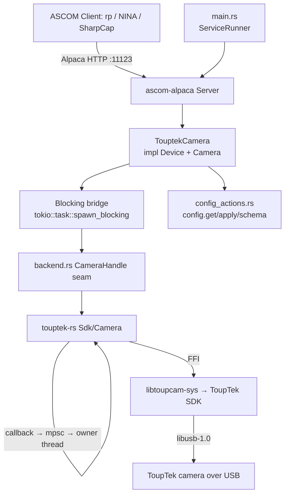

# Touptek-Camera Service Design

> **Status:** **Phase E (full `Camera` implementation) landed.** This document is
> the spec; the eight `tests/features/*.feature` files are the executable contract
> and now run green (the `@wip` tags are removed). The full `Camera` surface — the
> exposure state machine over trigger mode + the callback→pull bridge, digital
> binning, ROI, gain/offset, cooling, RAW16 readout + transpose, sensor type, and
> the asynchronous ST4 `PulseGuide` — is implemented over the `backend.rs`
> `CameraHandle` seam (a production `TouptekCameraHandle` over `touptek-rs` plus a
> unit-test mock that forces the paths the simulation cannot: C2/C4/E9/GO1/K1/PG2).
> `services/touptek-camera` enumerates (real or simulated), registers a `Device` +
> `Camera`, and binds **`:11123`**; the whole simulation Bazel chain is green
> **with no ToupTek SDK present** (the build-gating win below). **Phase F (gate)
> landed:** ConformU (`alpacaprotocol` + `conformance`) validates the simulated
> driver with **0 errors / 0 issues** and is wired into `conformu.yml` (skip-link,
> no SDK provisioned — mirroring qhy-camera). The **real native link** — the
> production `touptek-camera` `rust_binary`, `.github/actions/install-toupcam-sdk`,
> the `native.yml` real-link nightly, and the real-hardware ConformU +
> ROI/binning/CoolerPower validation — remains in **Phase F/G** and needs a
> provisioned SDK + hardware. See
> [`docs/plans/touptek-driver.md`](../plans/touptek-driver.md) for the decision
> record and *Delivery phasing* below.

## Overview

The `touptek-camera` service is an ASCOM Alpaca **Camera** driver for real ToupTek
hardware — and, because the ToupTek ToupCam SDK is OEM-rebranded under ~11 brands
that share **one flat C ABI** with only the `Toupcam_` symbol prefix swapped
(Altair, Omegon, Meade, Bresser, Mallincam, RisingCam/Ogma, SVBony, StarShootG,
Nncam, Tscam), a single driver covers the whole family. It exposes a connected
camera — exposures, ROI/digital-binning, gain/offset, cooling, 16-bit RAW
readout, sensor type, and ST4 pulse-guiding — over ASCOM Alpaca on a fixed port so
the `rp` orchestrator (and any Alpaca client: NINA, SharpCap, PHD2) can drive it
like any other device.

It is the **third** ASCOM Alpaca camera driver in the repo and the **second**
built on a `bindgen` FFI crate, following the now twice-proven template of
[`qhy-camera`](qhy-camera.md) ([`qhyccd-rs`](../plans/vendor-qhyccd-rs.md),
ADR-009) and [`zwo-camera`](zwo-camera.md) ([`zwo-rs`](../plans/vendor-zwo-rs.md),
ADR-010). It reuses the same `ascom-alpaca` server framework and the
[`sky-survey-camera`](sky-survey-camera.md) (simulator) scaffolding.

**Provenance.** The behaviour is derived from open ToupTek drivers as a
*behavioural reference only* — INDI `indi_toupbase` (LGPL-2.0-or-later), INDIGO
`ccd_touptek` (C), and the vendor's closed C# ASCOM driver as an existence proof.
**No code is copied** — the same clean-room discipline `zwo-camera`/`qhy-camera`
took toward `indi-asi`/`qhyccd-alpaca`.

**Licensing is DEFERRED** (per request) and is not an engineering blocker — see
[`docs/plans/touptek-driver.md` "Licensing (deferred)"](../plans/touptek-driver.md#licensing-deferred).

**How it differs from `zwo-camera` (drives every decision).** The `zwo-camera`
precedent assumed a **blocking snap-mode** SDK and a **statically-linked** native
lib. ToupTek inverts **both**, plus several smaller ASCOM-mapping details:

| Concern | ZWO (the precedent) | ToupTek (this service) |
|---|---|---|
| **SDK API model** | Blocking `ASIStartExposure` / `*GetExpStatus` poll loop → maps trivially onto a synchronous handle | **Callback/event-driven *PullMode*** (`StartPullModeWithCallback` → frame-ready event → `PullImageV4`). Discrete ASCOM exposures use **trigger mode** (`OPTION_TRIGGER=1` + `Toupcam_Trigger(h,1)`). **The #1 design pole** — bridge the event model onto the blocking seam. |
| **Native link** | `libASICamera2` is **static** → resolved eagerly; *every* compile needs the SDK | `libtoupcam` is a **dylib** → resolved only at the *final* link → **rlibs build with no SDK**, and the skip-link sim chain links nothing. The default `bazel test //...` needs **nothing provisioned** (see *Native dependency & build gating*). |
| **Binning** | On-sensor (charge-domain) hardware binning | **Digital binning** (`OPTION_BINNING`, sum / average) — usable for `BinX`/`BinY` but **not advertised as hardware binning** |
| **ROI alignment** | Width `%8`, height `%2` | **Offsets *and* sizes must be even, min 8×8** |
| **Gain** | `ASI_GAIN` integer with `[min,max]` | `ExpoAGain` in **percent** (100 = 1.0×); expose the integer, no named `Gains[]` |
| **Offset** | `ASI_OFFSET` control with native `[min,max]` | `OPTION_BLACKLEVEL`; **max scales with bit depth** → driver computes `OffsetMin/Max`, no accessor |
| **`ElectronsPerADU`** | **Native** `ASI_CAMERA_INFO.ElecPerADU` | **`NOT_IMPLEMENTED`** — no native field (QHY-like) |
| **`StopExposure`** | `ASIStopExposure` is a graceful, data-**preserving** stop → `CanStopExposure = true` | Trigger mode produces one whole frame with no partial readout → **`CanStopExposure = false`** (QHY-like); abort discards |
| **Filter wheel / focuser** | EFW + (future) EAF on the same SDK family | **None** — ToupTek ships no wheel/focuser in this SDK; Camera only |
| **FFI input** | Three headers + three libs | **One** header (`toupcam.h`), **one** lib → simpler bindgen |

Net: ToupTek is **mechanically easier than ZWO at the build/link layer** (one
header/lib, a dylib that defers linking, all arches shipped incl. Apple-Silicon-
universal and Pi) but has **one genuinely new design pole** (the callback→blocking
bridge). See [`docs/plans/touptek-driver.md`](../plans/touptek-driver.md) for the
full decision record.

---

## Native dependency & build gating (the crux)

This is the single most consequential fact about this service — and the place it
**most improves on `zwo-camera`**.

- The imaging path is `touptek-camera → touptek-rs → libtoupcam-sys → ` the
  **ToupTek ToupCam SDK** (`libtoupcam`, a source-less native binary) **+
  libusb-1.0 / libudev** on Linux.
- `libtoupcam` is a **dynamic** library (`.so`/`.dylib`/`.dll`). `cargo:rustc-
  link-lib=dylib=toupcam` is resolved **only at the final binary/cdylib link**,
  **not** when building an `rlib`. (This is the decisive difference from
  `libqhyccd`'s `static=` link, which `qhy-camera` cannot even `rlib`-build
  without the SDK.)

### The two-part skip-link strategy

| Layer | Mechanism | Effect |
|---|---|---|
| **Simulation chain** | `libtoupcam-sys` ships a **skip-link `_sim` build-script variant** (`TOUPCAM_SKIP_NATIVE_LINK=1`, set via Bazel `build_script_env`) that emits **no** link directives. `libtoupcam-sys_sim → touptek-rs_sim → touptek-camera_lib_sim → _sim binary / unit test / BDD / ConformU`. The simulated code references **no** `Toupcam_*` symbols. | The whole simulation build **links with no SDK present**. `bazel test //...` (the default sim path), ASan/LSan, and CI's `simulation` legs need **zero** SDK provisioning. |
| **Real library** | `touptek-camera_lib` (and `//crates/touptek-rs`) are **`rlib`s** — they compile the real FFI code paths but **defer** linking. | The real FFI **type-checks and builds with no SDK** (only libclang, for `bindgen`). The crate is covered by `bazel build //...` and the directory-level parity check. |
| **Real binary** | The only target that actually links `libtoupcam` — the production `touptek-camera` `rust_binary` — is **deliberately not defined yet**. | Defining it now would make `bazel build //...` fail to link locally with no SDK. It lands in **Phase F** with `.github/actions/install-toupcam-sdk`. |

**Consequence (the win):** unlike `zwo-camera` (every compile needs the SDK) and
`qhy-camera` (cannot even `rlib`-build without it), `touptek-camera`'s **entire
default build/test is SDK-free**. Only the Phase-F real binary and the
real-hardware ConformU run need a provisioned SDK.

### Why this matters for rusty-photon specifically

The workspace is **100% pure-Rust at the link layer** since the `cfitsio` purge
([ADR-001 Amendment A](../decisions/001-fits-file-support.md)). `qhy-camera` is
the **first** native-SDK exception, `zwo-camera` the **second**, and
`touptek-camera` the **third** — but the first whose *default* build needs no SDK,
because the dylib link defers and the sim chain skip-links. Vendoring the SDK
binary into a cache (public or internal) is **gated on the licensing resolution**
and is **out of scope** for this plan.

### udev / USB (Linux)

ToupTek devices need a udev rule for the ToupTek USB VID (INDI ships
`99-toupcam.rules`) and `libusb-1.0` + `libudev` at link/run time. macOS `.dylib`s
need an `install_name_tool` fixup before linking (INDI automates it). All of this
is **Phase F** (`install-toupcam-sdk`), not the default build.

### Open questions still to resolve before the real link lands (Phase F)

1. **`CoolerPower` 0–100 % mapping** — `OPTION_TEC_VOLTAGE` / `_VOLTAGE_MAX` may
   not yield a clean percent on every model. The simulator reports a clean
   `0..100`; real hardware may force `NotImplemented` or model-specific scaling
   (K4).
2. **Pi 5 aarch64 + macOS arm64 + Windows x64 real link.** The `libtoupcam-sys`
   bindings compile on aarch64 Linux; CI-green real links on each platform are the
   Phase-F long pole (the same shape ZWO/QHY worked through).
3. **Even-ROI vs digital-bin interaction** — confirm the SDK accepts every
   binned full frame (`NumX = CameraXSize / bin`) on real hardware (R4).

---

## Architecture



**Key components**

- **`main.rs`** — plain `fn main`, parses clap args, inits `tracing`, runs under
  `ServiceRunner::new("touptek-camera").with_reload().run_with_reload(...)` per
  [`service-lifecycle.md`](../skills/service-lifecycle.md). No hand-rolled signal
  handling; **no `materialize_identity`** (identities are hardware-derived).
- **`lib.rs`** — `ServerBuilder` that, on `build()`, **enumerates every connected
  ToupTek camera** (`Toupcam_EnumV2` → `CameraInfo`), mints each device's
  id-derived `UniqueID`, registers it as an ASCOM device (index 0, 1, 2, …), and
  binds the dual-stack Alpaca listener. Returns a `BoundServer`. Because
  `Toupcam_EnumV2` returns the stable device `id` **directly**, enumeration needs
  **no per-camera open** (a simplification over ZWO's open-to-read-serial dance).
- **`camera.rs`** — `TouptekCamera` (one per discovered camera) implementing
  `Device` + `Camera` against the `backend.rs` seam. **Every blocking SDK call
  runs inside `tokio::task::spawn_blocking`**, including the exposure capture and
  the CPU-heavy `u16`→`i32` widen+transpose on readout.
- **`backend.rs`** — the SDK seam: `trait CameraHandle` over the blocking
  `touptek-rs` surface, a production `TouptekCameraHandle` (the trigger-mode
  capture against a real-clock deadline), and a unit-test mock that forces paths
  the simulation cannot (an open failure, a model without gain/offset, without
  ST4, without a cooler/temperature, a mid-exposure SDK error).
- **`config.rs`** — typed `Config` (`devices` override map + `server.port`); no
  `filterwheel` (ToupTek has no wheel).
- **`config_actions.rs`** — `ConfigurableDriver` impl backing `config.get` /
  `config.apply` / `config.schema`.

### The callback → blocking bridge (the #1 design pole)

ToupTek delivers frames via a callback on an **internal SDK thread**, and the
header warns that calling `Toupcam_Stop`/`Toupcam_Close` **inside that callback
deadlocks**. The bridge (already built in `touptek-rs`, see
[`docs/plans/touptek-driver.md` "Concurrency"](../plans/touptek-driver.md#concurrency))
keeps the `extern "C"` trampoline trivial — it only forwards the event code over
an `mpsc` channel and **never re-enters the SDK**. The owning thread wakes on the
channel (`wait_for_event`) and does the real work (`pull_image`, `stop`,
teardown). Discrete ASCOM exposures use **trigger mode** (`enable_trigger_mode` +
`trigger_single`) rather than the free-running video stream. The exposure state
machine drives this on `spawn_blocking` (in `backend.rs`'s `capture`): trigger →
integrate against a **real-clock deadline** → wait for the frame-ready event →
pull → widen+transpose.

**Concurrency.** Device state (ROI, binning, target temp, exposure state machine)
is held under atomics + `parking_lot::Mutex`; every SDK call funnels through
`spawn_blocking` and a single logical owner per device; the camera lock is
released during the integration so concurrent property reads (and the
in-flight-exposure check) are not blocked. Every wait loop sleeps against an
`Instant`-based deadline, never a sum of intended naps — the same discipline that
fixed `zwo-camera`'s macOS ConformU timing bug.

---

## MVP scope

The MVP boundary drives BDD scenario selection. Grounded in what the ToupCam C API
exposes and what `touptek-rs` wraps.

**In scope (v0)**

- ASCOM Camera `ICameraV3` for **every enumerated ToupTek camera** (each
  registered as a device on the one port), 16-bit RAW (`PIXELFORMAT_RAW16` via
  `OPTION_RAW=1` + `OPTION_BITDEPTH=1`) monochrome **and** one-shot-colour (Bayer)
  sensors.
- Startup enumeration registers all discovered cameras; per-device
  connect/disconnect lifecycle: `Toupcam_OpenByIndex` → configure RAW16 + trigger
  mode → cache the model capability flags, geometry, and control ranges.
- Sensor geometry (`CameraXSize`/`YSize` from the model `maxres`,
  `PixelSizeX`/`Y` from `xpixsz`/`ypixsz`). **`PixelSizeX == PixelSizeY`** for the
  simulated sensor (the SDK exposes both, usually equal).
- **Exposure via trigger mode** — `ExposureMin/Max/Resolution` from
  `get_ExpTimeRange` (µs); a single `Toupcam_Trigger(h,1)`; the frame-ready
  callback drives `ImageReady`/`ImageArray`/`ImageArrayVariant`; `CameraState`
  (`Idle`/`Exposing`/`Error`); `PercentCompleted` from elapsed-vs-requested µs.
- **Abort** — `AbortExposure` cancels the trigger and **discards** the frame
  (`CanAbortExposure = true`). **`CanStopExposure = false`**: trigger mode yields
  one whole frame with no partial readout, so there is no data-preserving stop
  (a divergence from `zwo-camera`; matches `qhy-camera`).
- **Native ST4 `PulseGuide`** (`Toupcam_ST4PlusGuide`), gated on the ST4
  capability flag → `CanPulseGuide = true`; **asynchronous** (returns immediately,
  `IsPulseGuiding` tracks the pulse to its deadline) so it never exceeds ConformU's
  1 s response target. *(A ToupTek win — `qhy-camera` defers pulse-guiding.)*
- **Digital binning** (`OPTION_BINNING`, sum/average) — symmetric only
  (`CanAsymmetricBin = false`); `MaxBinX/Y` from the supported factors; ROI
  rescaled on bin change. **Reported to ASCOM as binning; not advertised as
  hardware binning.**
- **ROI** — `StartX/Y`/`NumX/NumY` setters accept any `u32`; geometry validated at
  `StartExposure`, **including the ToupTek alignment rules**: offsets and sizes
  must be **even** and at least **8×8** (`Toupcam_put_Roi`).
- **Gain** — `ExpoAGain` in percent (100 = 1.0×); `Gain` returns the integer,
  `GainMin/Max` from `get_ExpoAGainRange`. No named `Gains[]`.
- **Offset** — `OPTION_BLACKLEVEL`; `OffsetMin = 0`, `OffsetMax` **computed per
  bit depth** (the SDK exposes no accessor; the max scales ×4…×256 with depth).
- **Cooling** — `CoolerOn`, `SetCCDTemperature`, `CoolerPower`,
  `CanSetCCDTemperature`, `CanGetCoolerPower` gated on the `FLAG_TEC` capability
  (`OPTION_TEC`, `OPTION_TECTARGET`/`put_Temperature`, `get_Temperature` in
  0.1 °C). **`CCDTemperature` is decoupled from cooling** when the model exposes a
  temperature read.
- **Sensor type** — `Monochrome` vs `RGGB` (+ `BayerOffsetX/Y`) from
  `get_MonoMode` / `get_RawFormat`.
- **`MaxADU`** = `(2^BitDepth) − 1` (65535 for the 16-bit RAW path);
  **`ElectronsPerADU = NOT_IMPLEMENTED`** (no native field; QHY-like) and
  `FullWellCapacity = NOT_IMPLEMENTED`.
- **`ReadoutMode(s)`** — a single driver-named RAW16 mode (ASCOM requires a
  non-empty list); `FastReadout = NOT_IMPLEMENTED`.
- **Dark/bias frames** — ToupTek sensors have **no mechanical shutter**;
  `Light = false` is **accepted** and captured identically. `HasShutter = false`.
- `config.get`/`config.apply`/`config.schema` actions; hardware-derived
  `UniqueID`; in-process reload.
- ConformU integration test driven against the `touptek-rs` `simulation` backend
  (SDK-free; see *Native dependency & build gating*).

**Deferred (see *Future Work*)**

- **Push mode / video** (`StartPushModeV4`, high frame rate) — the high-FPS
  guiding/planetary path; v0 is trigger-mode discrete exposures only.
- **OEM-brand expansion** — the `FP()` symbol-prefix swap makes
  Altair/Omegon/Meade/Bresser/RisingCam/etc. a thin follow-on once Toupcam works.
- **Conversion gain (HCG/LCG)** as named `ReadoutModes`/`Gains[]` (`OPTION_CG`) if
  a model warrants it.
- Vendoring the SDK binary (gated on licensing); per-id connect-time tuning; TLS /
  HTTP Basic Auth (compose `rp-tls` / `rp-auth` later).

---

## Configuration

The service **enumerates every connected ToupTek camera** at startup and registers
each as an ASCOM device (camera index 0, 1, 2, …) on the one port. The hardware is
the source of truth — there is no per-camera *binding* in config. Each device's
UniqueID comes from its SDK device id; config carries only optional per-id display
overrides plus the port. **There is no `filterwheel` section** — ToupTek ships no
filter wheel or focuser in this SDK.

```jsonc
{
  // Optional per-device overrides, keyed by the SDK device id (ToupcamDeviceV2.id).
  // A device with no entry uses SDK-derived defaults (name from displayname/model).
  "devices": {
    "ATR3CMOS26000KPA-12345678": {
      "name": "Main Imaging",
      "description": "ToupTek ATR3CMOS26000 @ 1000mm"
    }
  },
  "server": {
    "port": 11123
  }
}
```

Sections:

- **devices** — Optional per-device override map keyed by the **SDK device id**.
  Lets an operator give a friendly `name`/`description` to a specific camera. Any
  device without an entry uses SDK-derived defaults. v0 does **not** carry
  per-camera connect-time tuning (gain/offset/target temperature) — clients set
  those over ASCOM; per-id defaults are deferred.
- **server.port** — Listening port (**11123**, next free in the `1112x` camera
  family after `qhy-camera` 11121 and `zwo-camera` 11122). One port hosts all
  enumerated devices. Hard read-only (a port change would make a BFF lose the
  devices on rebind).

### Config actions

Standard cross-driver protocol ([`config-actions.md`](config-actions.md)),
implemented generically in `rusty_photon_config::actions` + the ASCOM adapter in
[`rusty-photon-driver`](../../crates/rusty-photon-driver). `config_actions.rs`
supplies `ConfigurableDriver for TouptekCameraDriver`:

- **Secrets redacted/carried forward:** none in v0 (no auth yet).
- **Locked (identity) fields:** **none** — UniqueIDs are hardware-derived and not
  stored in config, so there is no identity field to lock (the same deliberate
  divergence from `materialize_identity` that `zwo-camera`/`qhy-camera` take).
- **Hard read-only fields:** `server.port`.
- **Editable fields:** the `devices` map (per-id `name` / `description`).
- **Validation** at load (parse-don't-validate): a `devices` entry's `name`, when
  present, must be non-empty; the named field is reported on violation
  (`devices.{id}.name`).

`config.apply` persists atomically, returns `status:"applying"` when a field
changed, and fires the in-process reload (`main.rs` runs under
`with_reload().run_with_reload(...)`).

### Device identity (UniqueID)

ASCOM requires a globally-unique, never-changing `UniqueID`. **This service
derives it from the camera's SDK device id** (`ToupcamDeviceV2.id`), which
`Toupcam_EnumV2` returns directly — so, unlike ZWO (which must open the camera to
read its serial), enumeration needs no per-camera open. `mint_identity`:

1. `UniqueID = TOUPTEK:{display-name-with-dashes}:{id}` when the SDK reports an
   id (the canonical identity).
2. A camera that reports a **blank id** (the edge case) falls back to a
   position-based `noserial-{index}` key (`UniqueID
   TOUPTEK:{name}:noserial-{index}`) — unique per enumeration slot and stable
   across reconnects for the common single-camera case (the same fallback ZWO uses
   for the serial-less ASI1600).

The `devices` config-override map is keyed by the **bare** id (matching the
`config.apply` `devices.{id}` paths), **not** the prefixed `TOUPTEK:{name}:{id}`
UniqueID. Consequences (same as `zwo-camera`): **no `unique_id` field in config**,
**no `materialize_identity` call** in `main.rs`, and **no locked identity field**
in the config-actions tiers. Two identical-model cameras are naturally
distinguished by their device ids.

---

## Behavioral contracts

Named, testable behaviours, each mapping to a BDD scenario in `tests/features/`
except where a contract notes a unit-tested branch. ASCOM error names per
[`docs/references/ascom-alpaca.md`](../references/ascom-alpaca.md). The
`simulation` backend presents **one** camera — a **Simulated ToupTek Camera**
(id `sim-0`, model `ToupTek Simulator`): **6248×4176, monochrome, 16-bit RAW**
(`MaxADU` 65535), **3.76 µm** square pixels, **cooled** (`FLAG_TEC`), **ST4
present** (`FLAG_ST4`), **black level present** (`FLAG_BLACKLEVEL`, so the `Offset`
control resolves).

> The simulator's capability set (cooler + ST4 + 16-bit) is chosen so the BDD
> suite exercises the **full** ASCOM surface from a single device. The `touptek-rs`
> simulator (no SDK simulation mode exists) fabricates frames in-Rust; its
> `CameraInfo` carries the sensor `max_width`/`max_height`, bit depth, the
> ST4/MONO/TEC capability flags, and the supported binning factors the contracts
> below reference, and the simulated `Camera` tracks gain/black-level/cooler state
> so the gain/offset/cooling round-trips and ranges resolve.

### Enumeration & connection lifecycle (`enumeration_connection.feature`)

- **C0.** At startup `build()` enumerates every connected ToupTek camera
  (`Toupcam_EnumV2`) and registers each as an ASCOM device with its id-derived
  UniqueID — no per-camera open needed for identity. Zero discovered cameras is
  **not** a hard failure: the service starts with no Camera devices, logged at
  `warn!`; a later reload re-enumerates.
- **C1.** `set_connected(true)` opens *that* camera (`Toupcam_OpenByIndex`),
  selects RAW16 + trigger mode, and caches the model capability flags, geometry,
  and exposure/gain/offset ranges. On success `Connected = true`.
- **C2.** `set_connected(true)` with the camera unreachable / SDK open failure
  returns the mapped driver error and `Connected` stays `false` *(unit-tested
  against the `backend.rs` mock seam — the simulation backend always opens
  successfully, so this is unforceable in BDD)*.
- **C3.** `set_connected(false)` closes that camera (drop → `Toupcam_Stop` +
  `Toupcam_Close`) and returns `NOT_CONNECTED` for subsequent operations; an
  in-flight exposure on it is aborted.
- **C4.** Connect is per-device and independent: connecting/disconnecting one
  camera does not affect the others enumerated on the same service *(deferred:
  the single-camera simulator cannot exercise this; covered by a unit test or a
  future multi-camera fixture)*.

### Geometry, binning, ROI (`sensor_properties.feature` + `binning_and_roi.feature`)

- **G1.** `CameraXSize`/`CameraYSize`/`PixelSizeX`/`PixelSizeY` reflect the cached
  model info; `PixelSizeX == PixelSizeY` for the simulated sensor.
- **B1.** `set_bin_x`/`set_bin_y` validate against the supported digital-binning
  factors and set symmetric binning; an unsupported factor returns `INVALID_VALUE`.
- **B2.** `CanAsymmetricBin = false`; `MaxBinX`/`MaxBinY` come from the supported
  factors (simulated: **4**).
- **B3.** A bin change rescales the cached ROI by the bin ratio *(unit-tested —
  the binning geometry math, exercised against the cached state rather than a
  round-trip through the simulator)*.
- **R1.** `StartX/Y`/`NumX/NumY` setters accept any `u32`; geometry is validated at
  `StartExposure` (R2/R3), not at the setter.
- **R2.** `StartExposure` with `StartX + NumX > CameraXSize / BinX` (or the Y
  analogue), or `NumX/NumY = 0`, returns `INVALID_VALUE`.
- **R3.** `StartExposure` with a sub-frame violating the ToupTek alignment rules —
  any of `StartX`/`StartY`/`NumX`/`NumY` odd, or `NumX < 8` / `NumY < 8` — returns
  `INVALID_VALUE`; otherwise the ROI is applied (`Toupcam_put_Roi`) before exposing.
- **R4.** The full frame at every supported bin **floors** to a valid even,
  in-bounds ROI and must expose: `NumX = floor(CameraXSize / bin)`,
  `NumY = floor(CameraYSize / bin)` (integer division, so a sensor extent that is
  not a clean multiple of the bin simply drops the remainder columns/rows). For the
  simulated sensor (6248×4176) the floored binned full frame is even at every
  supported bin — bin 1 6248×4176, bin 2 3124×2088, **bin 3 2082×1392** (6248/3
  floors to 2082; 4176/3 = 1392), bin 4 1562×1044 — so its **reported** extent is
  left at 6248×4176 (no alignment-down is needed here, a simplification over ZWO's
  R4). A model whose floored binned full frame would be *odd* at some bin would have
  its reported extent aligned down to keep every binned full frame even.

### Exposure (`exposure.feature`)

- **E1.** `StartExposure` while disconnected returns `NOT_CONNECTED`.
- **E2.** `StartExposure` while exposing returns `INVALID_OPERATION`.
- **E3.** `StartExposure` `Duration` outside `[ExposureMin, ExposureMax]` returns
  `INVALID_VALUE`.
- **E4.** `StartExposure` with `Light = false` (dark/bias) is **accepted** on every
  model: ToupTek sensors have no mechanical shutter, so the frame is captured
  identically. `HasShutter = false`.
- **E5.** A successful `StartExposure` sets the exposure µs, enables trigger mode,
  fires `Toupcam_Trigger(h,1)`, waits for the frame-ready event on the bridge,
  pulls the frame, and produces an `ImageArray` of the binned sub-frame (axes
  `[X, Y]`), `ImageReady = true`, `LastExposureStartTime`/`LastExposureDuration`
  set, `CameraState = Idle`.
- **E6.** `CameraState` is `Exposing` during capture; `PercentCompleted` is derived
  from elapsed-vs-requested µs (clamped ≤ 100), `100` once ready.
- **E7.** `AbortExposure` during capture cancels the trigger and **discards** the
  frame, leaving `ImageReady = false`; `CanAbortExposure = true`.
- **E8.** `CanStopExposure = false`: trigger mode produces one whole frame with no
  partial readout, so there is no data-preserving graceful stop (the ToupTek
  divergence from `zwo-camera`; matches `qhy-camera`). `StopExposure` is not
  offered.
- **E9.** A mid-exposure SDK error (an `EVENT_ERROR`/`EVENT_DISCONNECTED` event or
  a failing pull) transitions `CameraState = Error`, sets `last_error`, leaves
  `ImageReady = false`, logged at `warn!` *(covered by a unit test against the
  `backend.rs` mock seam — the simulation backend cannot force a mid-exposure
  failure)*.

### Gain / offset / readout (`gain_offset_readout.feature`)

- **GO1.** `Gain` (the `ExpoAGain` percent integer) / `Offset` (the black level)
  return the current SDK value, or `NOT_IMPLEMENTED` if the control is unavailable
  on the model *(the present-control path is BDD; the `NOT_IMPLEMENTED`-when-absent
  branch is unit-tested against the mock seam, since the simulator always exposes
  both controls)*.
- **GO2.** `set_gain`/`set_offset` validate against the cached `[min, max]` and
  apply via the SDK; out-of-range returns `INVALID_VALUE`.
- **GO3.** `GainMin/Max` reflect `get_ExpoAGainRange`; `OffsetMin = 0` and
  `OffsetMax` is computed per bit depth.
- **RM1.** `ReadoutModes` is a single driver-named RAW16 mode (ASCOM requires a
  non-empty list); `set_readout_mode` validates the index and an unknown index
  returns `INVALID_VALUE`; `FastReadout = NOT_IMPLEMENTED`.

### Cooling (`cooling.feature`)

- **K1.** `CanSetCCDTemperature` / `CanGetCoolerPower` are `true` iff the model
  reports `FLAG_TEC`; otherwise the related getters return `NOT_IMPLEMENTED`
  *(the uncooled `NOT_IMPLEMENTED` branch is unit-tested against the mock seam,
  since the simulated camera is cooled)*.
- **K2.** `CCDTemperature` returns the current sensor temperature
  (`get_Temperature`, 0.1 °C units) when the model exposes a temperature read.
- **K3.** `set_set_ccd_temperature` validates `[-273.15, 80]` and sets the target
  (`OPTION_TECTARGET`/`put_Temperature`); `SetCCDTemperature` reads back the last
  setpoint written this session, or — **before any write** — falls back to the
  model's current `OPTION_TECTARGET` (which has a power-on default) so the getter
  never returns `VALUE_NOT_SET`. *(ConformU flags a `VALUE_NOT_SET` read of a
  writable, supported property as an issue; this fallback is what took the sim
  ConformU run to 0 issues. Mirrors `zwo-camera`.)*
- **K4.** `CoolerOn`/`set_cooler_on` map to `OPTION_TEC`; `CoolerPower` is the
  normalized `OPTION_TEC_VOLTAGE` percent. *(The simulator reports a clean
  `0..100`; on real hardware `CoolerPower` may be `NotImplemented` or
  model-specific — see Open question 1.)*

### Sensor type & signal (`sensor_properties.feature`)

- **ST1.** `SensorType` is `RGGB` (colour) when `get_MonoMode` reports colour, else
  `Monochrome`; `BayerOffsetX/Y` follow `get_RawFormat`. The simulated camera is
  `Monochrome`.
- **ST2.** `ElectronsPerADU` returns **`NOT_IMPLEMENTED`** — the ToupCam SDK
  exposes no native electrons-per-ADU field (the QHY-like divergence from ZWO).
  `FullWellCapacity` is likewise `NOT_IMPLEMENTED`.
- **ST3.** `MaxADU` = `(2^BitDepth) − 1` (65535 for the 16-bit RAW path);
  `SensorName` is the model name and is non-empty.

### Pulse guiding (`pulse_guide.feature`)

- **PG1.** `CanPulseGuide` is `true` iff the model reports the ST4 capability flag;
  the simulated camera reports ST4 present.
- **PG2.** `PulseGuide(direction, duration)` is **asynchronous**: it starts the ST4
  pulse (`Toupcam_ST4PlusGuide`) and returns immediately, with `IsPulseGuiding`
  reporting `true` until the pulse's deadline (`now + duration`); a detached task
  ends it when the deadline passes. While disconnected it returns `NOT_CONNECTED`;
  a model without ST4 returns `NOT_IMPLEMENTED`. *(The disconnected branch is a BDD
  scenario; the no-ST4 `NOT_IMPLEMENTED` branch and the async `IsPulseGuiding`
  timing are covered by unit tests, since the simulation backend always reports
  ST4 present.)*

---

## ASCOM Camera surface — v0 behaviour

| Property / Method | v0 behaviour (backed by `touptek-rs`) |
|---|---|
| `CameraXSize` / `CameraYSize` | Cached model `maxres` (simulated 6248×4176) |
| `PixelSizeX` / `PixelSizeY` | Cached `xpixsz`/`ypixsz` (simulated 3.76 µm, X == Y) |
| `BinX` / `BinY` / `MaxBinX` / `MaxBinY` | Symmetric **digital** binning; max from supported factors (simulated 4) |
| `CanAsymmetricBin` | `false` |
| `NumX` / `NumY` / `StartX` / `StartY` | Setters relaxed; validated at `StartExposure` (even + ≥ 8) |
| `MaxADU` | `(2^BitDepth) − 1` (65535 for 16-bit RAW) |
| `ElectronsPerADU` | **`NOT_IMPLEMENTED`** (no native field) |
| `FullWellCapacity` | `NOT_IMPLEMENTED` |
| `ExposureMin` / `Max` / `Resolution` | From `get_ExpTimeRange` (µs) |
| `Gain` / `GainMin` / `GainMax` | `ExpoAGain` percent (100 = 1.0×); range from `get_ExpoAGainRange`; `NOT_IMPLEMENTED` if absent |
| `Offset` / `OffsetMin` / `OffsetMax` | `OPTION_BLACKLEVEL`; min 0, max computed per bit depth; `NOT_IMPLEMENTED` if absent |
| `ReadoutMode` / `ReadoutModes` | Single driver-named RAW16 mode; `FastReadout` `NOT_IMPLEMENTED` |
| `SensorType` / `BayerOffsetX/Y` | Mono vs RGGB from `get_MonoMode` / `get_RawFormat` |
| `CoolerOn` / `CCDTemperature` / `SetCCDTemperature` / `CoolerPower` | Gated on `FLAG_TEC` |
| `CanSetCCDTemperature` / `CanGetCoolerPower` | `true` iff `FLAG_TEC` |
| `HasShutter` | `false` (ToupTek sensors are shutterless) |
| `CameraState` | `Idle` / `Exposing` / `Error` |
| `PercentCompleted` | From elapsed-vs-requested µs, clamped ≤ 100 |
| `CanAbortExposure` / `CanStopExposure` | `true` / **`false`** (trigger mode: abort discards; no partial readout) |
| `CanPulseGuide` | `true` iff ST4 capability present |
| `PulseGuide` / `IsPulseGuiding` | Asynchronous `Toupcam_ST4PlusGuide` (ST4): returns immediately, `IsPulseGuiding` true until `now + duration` (PG2) |
| `StartExposure` (`Light=false`) | Accepted; captured normally (no shutter) |
| `StartExposure` / `AbortExposure` / `ImageReady` / `ImageArray` / `ImageArrayVariant` | Per *Exposure* contracts; trigger mode + callback→pull bridge; `ImageArray` axes `[X, Y]` |

---

## Service lifecycle (`main.rs`)

Standard shape per [`service-lifecycle.md`](../skills/service-lifecycle.md):
`fn main` → clap `Args` → `init_tracing` → `resolve_config_path("touptek-camera",
…)` → `ServiceRunner::new("touptek-camera").with_reload().run_with_reload(…)` with
an in-process reload loop that re-reads the effective config, re-enumerates, and
rebuilds the server. No `materialize_identity` (identities are hardware-derived).
`info!("Service started successfully …")` only after the bind succeeds; everything
else is `debug!` (CLAUDE.md Rule 9).

---

## Testing

Layered per [`testing.md`](../skills/testing.md).

- **Unit** (`src/*.rs` `#[cfg(test)]`) — config parse/validation, identity minting,
  ROI/binning geometry math (even + ≥ 8 rules; the bin-ratio ROI rescale B3), the
  `Camera` state machine (Idle/Exposing/Error, `ImageReady`, percent-completed),
  gain/offset range checks, cooling gating, Bayer-offset mapping,
  `MaxADU`-from-bit-depth, and the paths the simulation cannot force: an SDK open
  failure (C2), per-device independence beyond the single simulated camera (C4),
  a mid-exposure SDK error (E9), a model without a gain/offset control (GO1), a
  model without ST4 (PG2), and an uncooled model (K1) — against the `backend.rs`
  mock seam. Phase C landed 19 unit tests; Phase E adds the device-trait tests
  (the `camera.rs` state machine + the mock-seam paths above), for ~55 in total.
- **BDD** (`bdd-infra::ServiceHandle`, the eight camera feature files) —
  enumeration/connection (C0–C3; C2 and C4 are unit-tested/deferred per above),
  ROI/bin validation (R1–R4, B1–B2; B3 is unit-tested), exposure happy-path +
  error paths (E1–E8; E9 is unit-tested), gain/offset/readout (GO1–RM1, with GO1's
  control-absent branch unit-tested), cooling (K1–K4), sensor type & signal (G1,
  ST1–ST3), pulse-guiding (PG1–PG2), and config actions, driven against the
  `touptek-rs` `simulation` backend through the typed `ascom-alpaca` Camera
  client. The `@wip` tags were removed in Phase E — all 60 scenarios run green.
  Run explicitly with `bazel test --test_tag_filters=bdd //...` (no OmniSim or SDK
  needed; the `_sim` chain skip-links).
- **ConformU** (`tests/conformu_integration.rs`, gated by the `conformu` feature) —
  launches the production binary with `--features conformu` (which pulls in
  `simulation`) and runs `bdd_infra::run_conformu("camera", …)`. Skipped when
  `CONFORMU_PATH` is unset. **Target: 0 errors / 0 issues** against the simulation
  backend (Phase F), mirroring `zwo-camera`/`qhy-camera`.

> **CI note:** unlike `zwo-camera`/`qhy-camera`, the `touptek-camera` simulation
> build/test/ConformU legs need **no SDK provisioned** — the dylib link defers and
> the `_sim` chain skip-links (see *Native dependency & build gating*). Only the
> Phase-F real binary and real-hardware ConformU run need `install-toupcam-sdk`.

---

## Delivery phasing

Tracks A–G mirror [`docs/plans/touptek-driver.md`](../plans/touptek-driver.md):

- **Phase A — `libtoupcam-sys`** *(landed)*. `bindgen` over `toupcam.h` (plain C),
  per-OS `dylib` link of `toupcam`, the `TOUPCAM_SKIP_NATIVE_LINK` gate +
  skip-link `_sim` build-script variant. Compiling bindings on aarch64 Linux.
- **Phase B — `touptek-rs`** *(landed)*. Safe `Sdk`/`Camera`/`Error` surface + the
  **callback/PullMode → blocking bridge** + the `simulation` backend (fabricated
  frames, ConformU-safe xorshift fill). 9 unit tests.
- **Phase C — bare service** *(landed)*. `touptek-camera` enumerates and serves a
  minimal sim Camera on `:11123`; the skip-link Bazel sim chain builds/tests with
  no SDK; parity (36/36), buildifier, repin-twice green. 19 unit tests.
- **Phase D — design doc + workspace row + BDD feature files** *(this document, the
  `docs/workspace.md` rows, and the eight `@wip` feature files + BDD/ConformU
  harness)*.
- **Phase E — full Camera** *(landed)*. `Device + Camera` over `touptek-rs`
  (ROI/digital-bin, gain/offset, cooling, RAW16 readout + transpose, the
  trigger-mode exposure state machine driven by the frame-ready event, abort, ST4
  `PulseGuide`, sensor type), config-actions wiring, the `backend.rs` mock seam.
  The `@wip` tags are removed; all 60 BDD scenarios + ~55 unit tests run green on
  the simulation backend with no SDK.
- **Phase F — test + gate + ConformU + real link.** *Gate landed:* BDD (60
  scenarios) + ConformU (`alpacaprotocol` + `conformance`) on the sim backend pass
  to **0 errors / 0 issues**, and ConformU is wired into `conformu.yml`
  (`TOUPCAM_SKIP_NATIVE_LINK=1`, no SDK provisioned — the already-present
  `[package.metadata.conformu]` command is now linkable in the nightly). *Remaining
  (needs a provisioned SDK / hardware):* the real `touptek-camera` `rust_binary` +
  `.github/actions/install-toupcam-sdk`, the `native.yml` real-link nightly, and
  Pi5 aarch64 / macOS arm64 / Windows x64 real links.
- **Phase G — consumer + cross-platform sign-off.** The `rp` `CameraConfig`
  consumer (`alpaca_url: http://localhost:11123`); a real-hardware ConformU pass on
  each target platform (the working-driver goal).

---

## Future Work

- **Push mode / video** (`StartPushModeV4`) as a high-FPS guiding/planetary path.
- **OEM-brand expansion** — the `FP()` prefix-swap makes Altair/Omegon/Meade/
  Bresser/RisingCam/etc. a thin follow-on once the Toupcam path works.
- **Conversion gain (HCG/LCG)** as named `ReadoutModes`/`Gains[]` (`OPTION_CG`).
- **Vendoring the SDK binary** into a cache — **gated on the licensing
  resolution**.
- Per-id connect-time tuning; TLS / Basic Auth via `rp-tls` / `rp-auth`.

## References

- Decision record: [`docs/plans/touptek-driver.md`](../plans/touptek-driver.md)
- FFI crates (this repo's author): `touptek-rs` + `libtoupcam-sys` (siblings to
  `zwo-rs`/`libzwo-sys`, `qhyccd-rs`/`libqhyccd-sys`)
- Same-vendor-class precedents: [`zwo-camera.md`](zwo-camera.md) ·
  [`qhy-camera.md`](qhy-camera.md)
- Camera scaffolding template: [`sky-survey-camera.md`](sky-survey-camera.md)
- [`config-actions.md`](config-actions.md) ·
  [`service-lifecycle.md`](../skills/service-lifecycle.md) ·
  [`development-workflow.md`](../skills/development-workflow.md) ·
  [`testing.md`](../skills/testing.md)
- Behavioural references (read-only, clean-room): INDI `indi_toupbase`
  (LGPL-2.0-or-later), INDIGO `ccd_touptek` (C)
- [ADR-001 Amendment A](../decisions/001-fits-file-support.md) — the pure-Rust /
  no-system-dep posture this service is the third exception to
</invoke>
