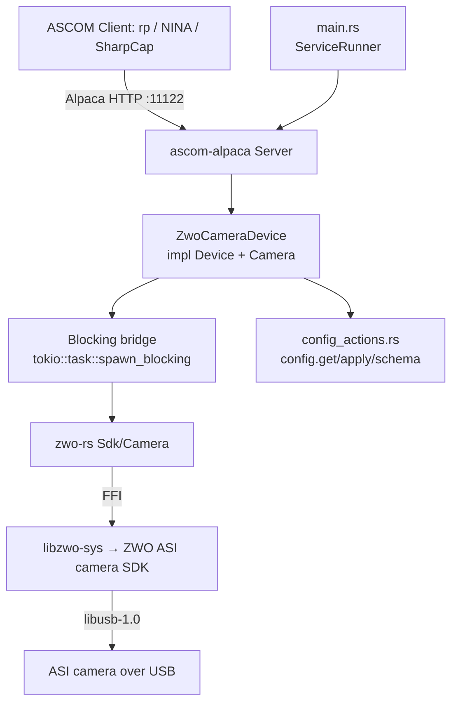

# Zwo-Camera Service Design

> **Status:** **Phase E (Track B full Camera) landed.** The `services/zwo-camera`
> crate now implements the full ASCOM `Device` + `Camera` surface over the
> `zwo-rs` SDK seam (`backend.rs` → production `ZwoCameraHandle` + a unit-test
> mock): connection lifecycle, sensor geometry, symmetric binning, ROI with the
> ASI `%8`/`%2` alignment rules, gain/offset, cooling, readout modes, ST4
> pulse-guiding, and the snap-mode exposure state machine (start, abort
> *discards* / graceful stop *preserves*, `ImageArray`, `CameraState`,
> `PercentCompleted`, mid-exposure `Error`), plus serial-derived identity and the
> `config.get`/`apply`/`schema` actions. The blocking SDK chain runs on
> `spawn_blocking` inside a detached task, with a generation counter +
> `result_lock` so abort/disconnect invalidate a late-completing capture; the
> camera lock is released during the integration so concurrent reads (and the
> in-flight-exposure check) are not blocked. It is gate-green: **45 unit tests**
> (against the mock seam), the **57 BDD scenarios** across the six camera feature
> files (now live), a full
> **ConformU** pass (both suites), clippy
> `--all-features`, and **Bazel** (`lib`/`binary`/
> `unit_test` are first-class `//...` targets verified on Linux; the `bdd` /
> `conformu_integration` suites run under Bazel (tagged `bdd` / `conformu`),
> mirroring qhy-camera; `MODULE.bazel.lock`
> repinned). **EFW filter wheels are out of scope** — re-planned as a future
> separate `zwo-filterwheel` service by
> [ADR-014](../decisions/014-zwo-per-device-services-and-link-features.md)
> (2026-07-10), which also narrowed this binary's native link to the camera
> SDK only (zwo-rs `camera` feature) and removed the `filterwheel.enabled`
> config toggle + `filter_names` override this doc previously specified.
>
> **ConformU — passes.** The `tests/conformu_integration.rs` harness is wired
> (gated on the `conformu` feature; skipped without `CONFORMU_PATH`). Both ConformU
> suites now pass cleanly against the simulation backend — *"no errors, warnings
> or issues found"* and *"all members returned within their target response
> times"*. Getting there took three fixes: (1) the `zwo-rs` sim now models the
> writable `Exposure` control and (2) fills the 52 MB full frame in parallel
> (rayon + bulk `RngCore::fill_bytes`, ≈11 s → ≈0.01 s, clearing the `StartExposure`
> timeout) — both in rev `3c32e59`; and two **driver** fixes surfaced once ConformU
> could finally run: (3a) `CameraXSize`/`CameraYSize` are reported *aligned* so the
> full frame at every bin (`NumX = CameraXSize/bin`) is a valid ASI ROI — the
> ASI2600's 6248 is reported as **6240** (R4), since ConformU exposes the binned
> full frame at each bin and 6248/2 = 3124 is not a multiple of 8; and (3b)
> `PulseGuide` is now **asynchronous** (returns immediately, `IsPulseGuiding`
> tracks the pulse to its deadline) instead of blocking for the pulse duration,
> which exceeded ConformU's 1 s response target. **Now also verified against real
> hardware (2026-06-20):** both suites pass on a Linux x86_64 dev box, driven
> against the production **non-`simulation`** binary (real FFI path), for two
> physical cameras — a cooled **ASI1600MM-Cool** (12-bit, `MaxADU` 4095,
> `noserial` identity fallback) and an uncooled **ASI178MM** (14-bit, `MaxADU`
> 16383, real `ASIGetSerialNumber` identity) — exercising both the cooled/uncooled
> cooler-gating split and both UniqueID paths. See *Testing* and *Delivery
> phasing*.
>
> **CI provisioning (simulation by default; real link verified nightly).** The
> `.github/actions/install-zwo-sdk` composite action provisions the SDK on
> Linux + macOS (INDI mirror) and Windows (ZWO's developer-SDK CDN zips). Because
> the cross-platform CI (`test.yml`, `conformu.yml`, `safety.yml`) all build the
> `--all-features`/`conformu` (`simulation`) path — which `cfg`s out the real FFI
> and references no SDK symbols — they set **`ZWO_SKIP_NATIVE_LINK=1`** so
> `libzwo-sys/build.rs` omits the link directives and the workspace builds with
> **no SDK to provision** (no install step, no Windows ~112 MB download). This
> also lets `safety.yml` (ASan/LSan) sanitize the simulation path instead of
> excluding the zwo crates. The **REAL** native link + FFI (`build.rs` directives,
> bindgen bindings, and the `#[cfg(not(feature = "simulation"))]` code) is built
> and link-checked on Linux/macOS/Windows — plus a Linux runtime FFI smoke — by
> the dedicated **`native.yml`** workflow (nightly + on any zwo-crate change),
> and additionally by the Bazel real variant and the Pi nightly. The aarch64
> Pi-nightly runner provisions the SDK **per run, sudo-free** — `pi-nightly.yml`
> runs `./.github/actions/install-zwo-sdk` with `sudo: "false"` (stages the blobs
> under `$RUNNER_TEMP`, symlinks the system libusb/libudev runtime libs for the
> link names, exports `ZWO_SDK_LIB_DIR` + `LD_LIBRARY_PATH`); `setup-pi-runner.sh`
> only installs the stable host prerequisites (clang/libclang, libusb-1.0
> runtime) and the udev device rule.
> The **Bazel** workflows (`bazel.yml`, `bazel-coverage.yml`) also run
> `install-zwo-sdk` — `zwo-camera` is a normal `//...` target there, like every
> workspace crate; on the Bazel build the install is unconditional (no narrowing
> job). **Remaining Track-A validation** (can't be
> exercised from a Linux dev box): confirm the macOS arm64 + Windows x64 link on
> real runners (both the Cargo *and* Bazel legs — under Bazel, the Windows
> test-runtime DLL discovery is the one unproven piece), re-run the updated
> `setup-pi-runner.sh` on the Pi, and pin the SDK refs / add download caching
> (the Windows camera zip is ~112 MB). See *Gating plan* and *Open questions*.

## Overview

The `zwo-camera` service is an ASCOM Alpaca **Camera** driver for real ZWO ASI
hardware. It exposes a connected ASI camera — exposures, ROI/binning,
gain/offset, cooling, readout, ST4 pulse-guiding — over ASCOM Alpaca on a
fixed port so the `rp` orchestrator (and any Alpaca client: NINA, SGPro,
SharpCap) can drive it like any other device. Other ZWO device families are
separate services (ADR-014): the EAF focuser is
[`zwo-focuser`](zwo-focuser.md), and the EFW filter wheel is a future
`zwo-filterwheel` service.

It is the ZWO analogue of the in-design [`qhy-camera`](qhy-camera.md) service and
reuses the same `ascom-alpaca` server framework and the
[`sky-survey-camera`](sky-survey-camera.md) (simulator) /
[`qhy-focuser`](qhy-focuser.md) (hardware driver) scaffolding.

**Provenance.** The behaviour is derived from open ZWO drivers as a *behavioural
reference only* — INDI `indi-asi`, INDIGO `ccd_asi`/`wheel_asi`, and
[`python-zwoasi`](https://github.com/stevemarple/python-zwoasi). **No code is
copied** (some references are GPL — see *Behavioural reference & licensing*),
the same clean-room discipline `qhy-camera` took toward `qhyccd-alpaca`.

**Not cross-platform.** Like `qhy-camera`, this service links a **native vendor
SDK** at compile time and is therefore gated out of the default workspace build.
See *Native dependency & build gating* — this is the dominant design constraint.

**How it differs from `qhy-camera` (drives every decision).** The `qhy-camera`
precedent assumed two things that are **both inverted** for ZWO, plus one that is
the same:

| Concern | QHY (the precedent) | ZWO (this service) |
|---|---|---|
| **SDK license** | Closed/proprietary; redistribution unresolved → authenticated/internal cache tier | **MIT** ("Copyright 2015, ZWO Company") → blob may be cached/redistributed on the **public** R2 cache mirror |
| **Rust FFI layer** | Published `qhyccd-rs`/`libqhyccd-sys` already exist; driver just writes the device layer | **No usable equivalent** → we also build & maintain `zwo-rs` + `libzwo-sys` |
| **Build/link gating** | Native lib links at compile time on *every* machine | **Same constraint**, per device feature since ADR-014 (`libzwo-sys` `build.rs` links each SDK its feature enables — this service builds with `camera` only; that SDK is required at link time even with `--features simulation`) |

Net: ZWO is **legally much easier** but **mechanically more work up front** (we
build the FFI QHY got for free). The device-trait layer is *easier* than QHY — a
cleaner C API and more ASCOM features map natively (see *ASCOM Camera surface*).
See [ADR-008](../decisions/008-zwo-camera-native-sdk-ffi.md) for the FFI-crate /
caching decision and [`docs/plans/zwo-driver.md`](../plans/zwo-driver.md) for the
full decision record.

---

## Native dependency & build gating (the crux)

This is the single most consequential fact about this service and the reason it
is delivered in two tracks.

- The imaging path is `zwo-camera → zwo-rs → libzwo-sys → ` the **ZWO ASI
  camera SDK** (`libASICamera2`, a source-less native binary) **+ libusb-1.0**.
- `libzwo-sys`'s `build.rs` emits `cargo:rustc-link-lib` per enabled device
  feature (ADR-014); this service builds `zwo-rs` with `camera` only, so the
  link is `ASICamera2` + `dylib=usb-1.0` (plus `stdc++`/`c++`) — the EFW/EAF
  SDKs are linked (and shipped) by their own services.
- **Consequence:** *every machine that compiles this package* — dev laptops, CI
  runners, Bazel actions — needs the ASI camera SDK installed and discoverable,
  plus `libusb-1.0` dev headers. Not just machines with a camera attached.
  (Bazel builds the shared `zwo-rs` targets with the union of device features,
  so Bazel actions provision all the blobs — see the ADR.)
- The `zwo-rs` **`simulation` feature** (which this service forwards as its own
  `simulation` feature) makes the build **camera-free, NOT SDK-free**: it
  fabricates fake frames (and EFW position/moving) at runtime. The native SDK is
  still required at link time. *(The ZWO SDK ships **no** simulation backend —
  unlike `qhyccd-rs` — so the simulator is wholly fabricated inside `zwo-rs`.)*

### Why this matters for rusty-photon specifically

The workspace is **100% pure-Rust at the link layer** since the `cfitsio` purge
([ADR-001 Amendment A](../decisions/001-fits-file-support.md)). `qhy-camera` is
the **first** native-SDK exception; `zwo-camera` is the **second**. The
difference is licensing: ZWO's SDK is **MIT**, so unlike the QHY blob it may live
on the **anonymous-read public** cache mirror (`cache.rustyphoton.space`) rather
than the authenticated/internal tier — the attribution notice must travel with
the cached blob. See [ADR-008](../decisions/008-zwo-camera-native-sdk-ffi.md).

### Gating plan

| Concern | Mechanism |
|---|---|
| local dev (SDK required) | `zwo-camera` is a normal workspace member but **fails to link without the SDK**. The SDK is a required local-dev prerequisite — install it (CI installs it before building); `bazel build //...` then builds the package like any other. Documented here and in the service README. |
| CI | An explicit SDK-provisioning step (`./.github/actions/install-zwo-sdk`) **pulls the pinned ASI/EFW SDK from the INDI mirror** (Linux/macOS, pinned by `ref`) **or ZWO's CDN** (Windows, unpinned "latest") + installs `libusb-1.0-0-dev`, before building/testing this package, as `bazel.yml` / `native.yml` / `scheduled.yml` do before their builds. The Linux/macOS mirror fetch is wrapped in `actions/cache` (keyed on arch + `ref`) so a warm cache skips it — the mirror otherwise rate-limits CI's ephemeral IPs (429s; see the action's own doc comment and issue #476). Required wherever the real link path is exercised; the simulation-only `test.yml` / ConformU legs build SDK-free via `ZWO_SKIP_NATIVE_LINK=1`, and `cargo check`/clippy jobs (no linker) skip it too. |
| Raspberry Pi nightly runner | **Sudo-free per-run** (the runner is sudo-less for public-repo safety): `pi-nightly.yml` runs `./.github/actions/install-zwo-sdk` with `sudo: "false"` — stages the `armv8` blobs under `$RUNNER_TEMP`, symlinks the system libusb/libudev *runtime* libs to satisfy `-lusb-1.0`/`-ludev` (no -dev package), and exports `ZWO_SDK_LIB_DIR` + `LD_LIBRARY_PATH` (the blobs carry no SONAME). `scripts/setup-pi-runner.sh` installs only the stable host prerequisites (clang/libclang-dev, libusb-1.0 runtime) + the udev `99-asi.rules` device rule. Mirrors the QHYCCD per-run model → self-healing for SDK bumps. **aarch64 (Pi 5) confirmed linking.** |
| Bazel | **First-class `//...` targets — no `manual` gating.** `zwo-rs` / `libzwo-sys` are **vendored first-party** ([ADR-010](../decisions/010-vendor-zwo-rs.md)), so the repo owns their `BUILD.bazel`: `libzwo-sys` is the repo's first first-party `cargo_build_script` (runs bindgen in-sandbox; its `data` carries the vendored MIT headers + `wrapper.h`), and `zwo-rs` ships **two variants** — `//crates/zwo-rs:zwo-rs` (real SDK) and `//crates/zwo-rs:zwo-rs_sim` (`testonly`, `simulation`). zwo-camera's production `lib`/`binary` link the **real** variant (the prod binary `NEEDs libASICamera2.so` — the real/sim parity win an external `@cr` crate could not give, since `crate_universe` resolves one feature set per crate); the `unit_test` / `bdd` / `conformu_integration` targets link `zwo-rs_sim`. Every workspace crate builds and tests under Bazel, so a `manual`-excluded crate would silently carry zero CI. The `bdd` / `conformu_integration` suites — which spawn the service binary (linked against `zwo-rs_sim`) and bind a port — run under Bazel, tagged `bdd` / `conformu` (mirroring qhy-camera). The `bazel.yml` / `bazel-coverage.yml` workflows run the `install-zwo-sdk` composite action (like they install OmniSim), so `libzwo-sys` links against the system SDK; `.bazelrc` forwards `LIBCLANG_PATH` (macOS bindgen) / `ZWO_SDK_LIB_DIR` (Windows link) per-OS under `strict_action_env`. zwo-camera keeps a `simulation` dev-dep with a **narrowed** role — it no longer flips a single `@cr` variant; it just keeps `simulation`'s optional deps (`rand`/`rayon`) resolved into `@cr` for the `zwo-rs_sim` target. Verified on Linux: `bazel build //crates/zwo-rs/... + //services/zwo-camera/...` and `bazel test //services/zwo-camera:zwo-camera_unit_test` (PASSED). A future hermetic `crate.annotation` (turning the SDK into a Bazel-managed `cc_import` dep, removing the imperative install) is optional cleanup, not a prerequisite. After changing the vendored crates' **external** deps, run `CARGO_BAZEL_REPIN=1 bazel mod tidy && bazel mod tidy` (Rule 10). |

### udev / USB

ZWO devices need a udev rule (`99-asi.rules`: VID `0x03c3`, `MODE=0666`,
`usbfs_memory_mb=200` for USB3 throughput). The EFW is USB-HID (no kernel
driver) but the SDK still talks libusb. macOS `.dylib`s need `install_name_tool`
fixing before linking (INDI automates this).

### Open questions still to resolve before Track A lands

1. **`zwo-rs` maturity.** The FFI crates are author-maintained and pre-1.0. They
   are now **vendored first-party** (dual-homed) at `crates/zwo-rs/`
   ([ADR-010](../decisions/010-vendor-zwo-rs.md)), so the lockstep git-rev pin is
   retired — edits are in-tree; the crates are still published to crates.io from
   the vendored subdirs for outside consumers.
2. **macOS `EFWGetNum` thread-safety.** Reportedly not thread-safe on macOS →
   enumeration is serialized (see *Concurrency*).
3. **Pi 5 aarch64 + macOS arm64 link.** The `libzwo-sys` skeleton links green on
   Linux x86_64 and locally on aarch64; CI green on Pi 5 + macOS arm64 is the
   remaining long-pole item (see *Delivery phasing* Phase A).

---

## Architecture



**Key components**

- **`main.rs`** — plain `fn main`, parses clap args, inits `tracing`, runs under
  `ServiceRunner::new("zwo-camera").with_reload().run_with_reload(...)` per
  [`service-lifecycle.md`](../skills/service-lifecycle.md). No hand-rolled signal
  handling; config bootstrap via `rusty_photon_config::resolve_and_init` with an
  **empty identity-pointer list** (identities are hardware-derived), which still
  materializes the default config file on first start.
- **`lib.rs`** — `ServerBuilder` that, on `build()`, opens the SDK and
  **enumerates every connected ASI camera**,
  registering each as an ASCOM device (index 0, 1, 2, …) with its serial-derived
  UniqueID. Because `ASIGetSerialNumber` requires an *open* camera (see *Device
  identity*), enumeration reads each camera's serial via `zwo_rs::Sdk::read_serial`
  (`ASIOpenCamera` + `ASIGetSerialNumber`/`ASIGetID` + `ASICloseCamera` — no
  `ASIInitCamera`, so this passive path touches no camera state); the eager
  per-device connect handshake, which does call `ASIInitCamera`, happens on
  `set_connected(true)`. **Identity fallback (`mint_identity`):** older ASI models
  (e.g. the ASI1600) expose *neither* a hardware serial (`ASIGetSerialNumber`) nor
  a programmed flash ID (`ASIGetID`) — that read returns a general SDK error.
  Rather than fail the whole service, the camera falls back to a stable
  position-based identity (`noserial-{index}`, UniqueID
  `ZWO:{name}:noserial-{index}`), so a serial-less camera is still usable; it is
  unique per enumeration slot and stable across reconnects for the common
  single-camera case. Returns a `BoundServer`.
- **`camera.rs`** — `ZwoCameraDevice` (one instance per discovered camera)
  implementing `Device` + `Camera` against `zwo-rs`. **Every blocking SDK call
  runs inside `tokio::task::spawn_blocking`** so the async runtime is never
  stalled — *including* the CPU-heavy `to_image_array` frame transform (a
  ~26-megapixel `u16`→`i32` widen+transpose), which runs in the same
  `spawn_blocking` closure as the SDK download, never on a Tokio worker and never
  while holding `result_lock` (held only for the cheap commit).
- **`config.rs`** — typed `Config` with parse-don't-validate newtypes.
- **`config_actions.rs`** — `ConfigurableDriver` impl + the `dispatch` the
  devices delegate to (`config.get`/`config.apply`/`config.schema`).
- **`mock.rs`** (feature `simulation`/`mock`) — the hardware-free test backend
  (the `zwo-rs` `simulation` camera/EFW + a tiny in-crate trait seam over the SDK
  for unit tests).

**Concurrency.** The ASI/EFW SDKs are blocking C FFI and are **not** safe to call
from arbitrary threads concurrently for a single device. Device state (current
ROI, binning, gain, offset, target temp, exposure state machine, filter position)
is held under `parking_lot::RwLock`; all SDK calls funnel through
`spawn_blocking` and a single logical owner per device. EFW enumeration
(`EFWGetNum`) is serialized for the macOS thread-safety caveat.

The capture's integration wait (`backend.rs`) sleeps against a **real-clock
deadline** (`Instant::now() + duration`), not accumulated intended sleep time.
Under blocking-pool oversubscription — e.g. ConformU firing a storm of concurrent
property reads, each a `spawn_blocking` — individual `thread::sleep` calls
overshoot, and a loop that summed *intended* naps would run the full step count
regardless of real time, ballooning a 2 s exposure to ~10 s of wall-clock on a
contended runner (this tripped ConformU's 10 s async-operation timeout on the
macOS CI runner — a scheduling artifact, not a slow CPU). The deadline bounds the
integration to the requested duration plus at most one overshooting nap. The same
real-clock-deadline discipline is applied to every wait loop in the capture path
(integration, readout-completion poll, and the test backends), so no loop counts
fixed naps or sums *intended* sleep time. Validated under genuine concurrency:
three cameras driven by simultaneous ConformU `conformance` suites all stayed
within their response-time targets (see *Testing*).

---

## MVP scope

The MVP boundary drives BDD scenario selection (Phase 2). Grounded in what the
ASI C API exposes and what `zwo-rs` will wrap.

**In scope (v0)**

- ASCOM Camera ICameraV3 for **every enumerated ASI camera** (each registered as
  a device on the one port), 16-bit (`ASI_IMG_RAW16`) monochrome **and**
  one-shot-colour (Bayer) sensors.
- Startup enumeration registers all discovered cameras;
  per-device connect/disconnect lifecycle: open → `ASIInitCamera` → RAW16
  transfer → snap mode → cache `ASI_CAMERA_INFO` (geometry, pixel size, bit
  depth, cooler/colour/ST4 flags, `ElecPerADU`) and control caps.
- Sensor geometry (`CameraXSize`/`YSize`, `PixelSizeX`/`Y`) from cached info.
  **`PixelSizeX == PixelSizeY`** trivially (ASI exposes a single `PixelSize`).
- **`ElectronsPerADU`** is a **real native value** from `ASI_CAMERA_INFO.ElecPerADU`
  (a ZWO win — QHY ships `NOT_IMPLEMENTED`).
- **Binning** — symmetric only (`CanAsymmetricBin = false`); `MaxBinX/Y` from the
  SDK's `SupportedBins`; ROI rescaled on bin change.
- **ROI** — `StartX/Y`/`NumX/Y` setters accept any `u32`; geometry validated at
  `StartExposure`, **including the ASI alignment rules**: width must be a multiple
  of 8 and height a multiple of 2. (The legacy ASI120 USB2 models additionally
  require `width·height % 1024 == 0`; `check_geometry` does **not** currently
  enforce that older-model rule — such a frame would simply be rejected by the
  SDK at `StartExposure`. Adding it is Future Work if an ASI120 USB2 is used.)
- **Exposure** — `ExposureMin/Max/Resolution` from `ASIGetControlCaps(ASI_EXPOSURE)`
  (µs; min ~32 µs for current ASI sensors — required for bias frames, see
  [`docs/workspace.md` Duration Units](../workspace.md#duration-units)); single
  `ASIStartExposure` (snap mode); `ImageReady`/`ImageArray`/`ImageArrayVariant`;
  `CameraState` (`Idle`/`Exposing`/`Error`); `PercentCompleted` from
  remaining-exposure µs.
- **Graceful stop AND abort** — `ASIStopExposure` is a single graceful,
  **data-preserving** stop ("image can still be read out"), so `CanStopExposure =
  true`; the same call backs `AbortExposure` (discarding data), so
  `CanAbortExposure = true`. *(A ZWO win — QHY ships `CanStopExposure = false`.)*
- **PulseGuide** — native `ASIPulseGuideOn/Off` (ST4), gated on the `ST4Port`
  capability → `CanPulseGuide = true` when present. *(A ZWO win — QHY defers it.)*
- **Gain / Offset** — current value + `Min`/`Max` from `ASIGetControlCaps`
  (`ASI_GAIN`, `ASI_OFFSET`/brightness); `NOT_IMPLEMENTED` if the control is
  absent on the model.
- **Readout modes** — `ReadoutMode(s)` from the ASI speed/bit-depth combinations
  the driver exposes (e.g. "Normal", "High Speed"); switching updates cached
  state.
- **Cooling** — `CoolerOn`, `SetCCDTemperature`, `CoolerPower`,
  `CanSetCCDTemperature`, `CanGetCoolerPower` are gated on
  `ASI_CAMERA_INFO.IsCoolerCam` (these need an actual TEC).
  **`CCDTemperature` is decoupled from cooling**: it reports the sensor
  temperature whenever the camera advertises the `ASI_TEMPERATURE` control
  (cached at the open handshake), cooled or not — most ASI cameras, including
  uncooled ones like the ASI178, expose a readable sensor temperature, and
  throwing it away as `NOT_IMPLEMENTED` would discard a genuinely useful reading.
  A camera without the control reports `NOT_IMPLEMENTED`.
- **Sensor type** — `Monochrome` vs `RGGB` (+ `BayerOffsetX/Y`) from
  `IsColorCam` / `BayerPattern`.
- **`MaxADU`** = `(2^BitDepth) - 1` from `ASI_CAMERA_INFO.BitDepth` (e.g. 65535
  for a 16-bit ADC, 4095 for 12-bit); `SensorName` from the device name.
- **Dark/bias frames** — ASI sensors have **no mechanical shutter**; `Light =
  false` is **accepted** and captures normally (there is no shutter to actuate —
  the frame differs only in metadata). So `HasShutter = false` and darks/bias
  work on every model (a divergence from `qhy-camera`, which rejects darks on
  shutterless models).
- `config.get`/`config.apply`/`config.schema` actions; hardware-derived
  `UniqueID` (camera SDK serial); in-process reload.
- ConformU integration test driven against the `zwo-rs` `simulation` backend
  (SDK installed in CI, no physical camera).

**Deferred (see *Future Work*)**

- **Video mode** (`ASIStartVideoCapture`) — the high-FPS guiding/planetary path;
  v0 is snap-mode only (snap and video are mutually exclusive).
- **EFW filter wheel** and **EAF focuser** — separate services per ADR-014:
  the EAF is [`zwo-focuser`](zwo-focuser.md) (landed); the EFW is a future
  `zwo-filterwheel` service (`docs/plans/zwo-driver.md` Phase F).
- **CAA rotator** (`CAA_API.h`) — only if a ZWO rotator is ever in scope.
- Per-serial connect-time tuning (gain/offset/target-temperature defaults).
- `FullWellCapacity` (no native ASI field; supply a placeholder only if ConformU
  requires it).
- **Vendoring the SDK** into `libzwo-sys` (MIT permits) to drop external
  provisioning — deferred in favour of mirroring `qhyccd-rs`'s external model.

---

## Configuration

The service **enumerates every connected ASI camera** at startup and registers
each as an ASCOM device (camera index 0, 1, 2, …) on the one port. The hardware
is the source of truth — there is no per-camera *binding* in config. Each
device's UniqueID comes from its SDK serial; config carries only optional
per-serial display overrides plus the port.

```jsonc
{
  // Optional per-device overrides, keyed by SDK serial. A device with no entry
  // uses SDK-derived defaults (name from model+serial). Named `devices` (not
  // `overrides`) to avoid colliding with the config.get response's own
  // `overrides[]` (CLI-pinned paths) field.
  "devices": {
    "ASI2600MM-0A1B2C3D4E5F6071": {
      "name": "Main Imaging",
      "description": "ASI2600MM-Pro @ 1000mm"
    }
  },
  "server": {
    "port": 11122,
    "bind_address": "0.0.0.0",
    "tls": null,
    "auth": null
  }
}
```

The `server` block is the shared `AlpacaServerConfig` from
`crates/rusty-photon-server-config` (see ADR-016): `port`, `bind_address`
(default `0.0.0.0`), optional `discovery_port`, and optional `tls`/`auth`.
Absent `tls`/`auth` means plain, unauthenticated HTTP.

Sections:

- **devices** — Optional per-device override map keyed by **SDK serial** (the
  16-hex `ASIGetSerialNumber` value). Lets an operator give a friendly
  `name`/`description` to a specific camera. Any device without an entry uses
  SDK-derived defaults. v0 does **not** carry per-camera connect-time tuning
  (gain/offset/target temperature) — with heterogeneous cameras those are
  per-serial concerns and clients set them over ASCOM; per-serial defaults are
  deferred (see *Future Work*).
- **server.port** — Listening port (**11122**, next free in the 1112x family;
  11121 is `qhy-camera`). One port hosts all enumerated devices. Hard read-only
  (self-lockout: a port change would make the BFF lose the devices).

*(The former `filterwheel.enabled` toggle and per-serial `filter_names`
override left with the EFW re-scope — ADR-014; they will reappear in the
future `zwo-filterwheel` service's own config.)*

### Config actions

Standard cross-driver protocol ([`config-actions.md`](config-actions.md)),
implemented generically in `rusty_photon_config::actions` + the ASCOM adapter in
[`rusty-photon-driver`](../../crates/rusty-photon-driver). `config_actions.rs`
supplies `ConfigurableDriver for ZwoCameraDriver`:

- **Secrets redacted/carried forward:** `server.auth.password_hash` (the one
  secret; `server.tls` stores file *paths*, not key material).
- **Locked (identity) fields:** none — UniqueIDs are hardware-derived and not
  stored in config, so there is no identity field to lock (a deliberate
  divergence from the minted-identity convention; see *Device identity*).
- **Hard read-only fields:** `/server/port` (self-lockout — a BFF could not
  follow the rebind).
- **Editable fields:** the `devices` map (per-serial `name` / `description`).
- **Validation** at load (parse-don't-validate): `devices` keys are free-form
  serial strings and the override values are free-form display strings, so v0
  has nothing semantic to validate — but unknown keys are **rejected at
  deserialize** (`deny_unknown_fields`, as in zwo-focuser), so typos and
  removed keys (notably a pre-ADR-014 `filterwheel` section) fail loudly at
  load instead of being silently ignored.

`config.apply` persists atomically, returns `status:"applying"` when a field
changed, and fires the in-process reload (`main.rs` runs under
`with_reload().run_with_reload(...)`).

### Device identity (UniqueID)

ASCOM requires a globally-unique, never-changing `UniqueID`. **This service
derives the UniqueID from the camera's hardware serial** — the same scheme as
`qhy-camera`.

A **ZWO-specific wrinkle:** `ASIGetSerialNumber` (the stable 8-byte → 16-hex id,
available only since ASI SDK driver V1.14.0227) requires the camera to be
**opened first** — unlike QHY's pre-open read. So enumeration opens each camera
briefly via `zwo_rs::Sdk::read_serial` (`ASIOpenCamera` + `ASIGetSerialNumber` —
never `ASIInitCamera`, see C5) to read its serial, then closes it. The fallback
chain is:

1. `ASIGetSerialNumber` (open briefly → read → close) — the canonical identity.
2. `ASIGetID` (a writable, USB3-only flash id) — a weak fallback for older
   cameras that report no serial.
3. Otherwise (`mint_identity`) a stable position-based identity,
   `noserial-{index}` — see the `lib.rs` component description above.

Consequences (same as
`qhy-camera`): **no `unique_id` field in config**, an **empty identity-pointer
list** passed to `resolve_and_init` in `main.rs` (no minting; the bootstrap
still materializes the default config file on first start), and **no locked
identity field** in the config-actions tiers. Two identical-model cameras are
naturally distinguished by serial.

---

## Behavioral contracts

Named, testable behaviours, each mapping to a BDD scenario in `tests/features/`
except where a contract notes a unit-tested branch (e.g. E9, and PG2's no-ST4
path). ASCOM error names per [`docs/references/ascom-alpaca.md`](../references/ascom-alpaca.md).
Values are grounded in the `zwo-rs`-backed implementation; the `simulation`
backend presents one **ASI2600MM-Pro-Simulated** camera (6248×4176, monochrome,
16-bit, cooled, ST4 present). (`zwo-rs`'s sim also fabricates an EFW and an
EAF; those belong to the other zwo services.)

> The simulator's capability set (cooler + ST4 + 16-bit) is chosen so the BDD
> suite exercises the **full** ASCOM surface from a single device. ST4 on a
> 2600-class body is a simulator convenience, not a shipping-SKU claim; the
> `simulation` backend is wholly fabricated inside `zwo-rs` (the ASI SDK has no
> simulation mode).

### Enumeration & connection lifecycle

- **C0.** At startup `build()` enumerates all connected ASI cameras
  and registers each as an ASCOM device with its
  serial-derived UniqueID (opening each camera briefly via `Sdk::read_serial` to
  read the serial, without initialising it — see C5). Zero
  discovered cameras is **not** a hard failure — the service starts with no Camera
  devices, logged at `warn!`; a later reload re-enumerates.
- **C1.** `set_connected(true)` on a device opens *that* camera, `ASIInitCamera`,
  selects RAW16, snap mode, and caches `ASI_CAMERA_INFO`, supported binning modes,
  and exposure/gain/offset control caps. On success `Connected = true`.
- **C2.** `set_connected(true)` with the device's camera unreachable / SDK open
  failure returns the mapped driver error and `Connected` stays `false`.
- **C3.** `set_connected(false)` closes that device and returns `NOT_CONNECTED`
  for subsequent operations; an in-flight exposure on it is aborted.
- **C4.** Connect is per-device and independent: connecting/disconnecting one
  camera does not affect the others enumerated on the same service.
- **C5.** No code path in this service pushes cooler state or any other
  actuation on startup, connect, or `config.apply` (workspace tenet
  [*no actuation on connect*](../workspace.md#project-tenets)); cooler commands
  are issued only by explicit ASCOM setters, and no cooler setpoint is restored
  on connect. The C0 serial read runs only `ASIOpenCamera` +
  `ASIGetSerialNumber`/`ASIGetID` + `ASICloseCamera` (`zwo_rs::Sdk::read_serial`)
  on every camera at *service start* and on every `config.apply` reload —
  `ASIOpenCamera` is documented by the vendor SDK as not affecting a capturing
  camera. It deliberately never calls `ASIInitCamera` (which resets controls,
  e.g. the cooler, to SDK defaults); that call is reserved for the per-device
  `set_connected(true)` handshake (C1), so startup and reload touch no camera
  state. (Resolved issue #637; previously this path ran `ASIInitCamera` on
  every enumerated camera at startup.)

### Geometry, binning, ROI

- **G1.** `CameraXSize`/`CameraYSize`/`PixelSizeX`/`PixelSizeY` reflect the cached
  `ASI_CAMERA_INFO`; `PixelSizeX == PixelSizeY` (single SDK `PixelSize`).
- **R4.** `CameraXSize`/`CameraYSize` are reported *aligned down* so the full
  frame at every supported bin — `NumX = CameraXSize / bin`, the ROI conformance
  tools and clients expose at each bin — is a valid ASI ROI (binned width a
  multiple of 8, binned height a multiple of 2). The reported extent is the
  largest multiple of `lcm(unit · bin)` (unit = 8 for X, 2 for Y) not exceeding
  the raw sensor; for the ASI2600 (6248×4176, bins 1–4) that is **6240×4176**
  (the raw 6248/2 = 3124 is not a multiple of 8, so the raw width would make the
  bin-2/3/4 full frames unachievable). The cost is a few edge columns at full
  resolution; the bonus is that the bin-ratio ROI rescale (B3) round-trips
  exactly. Bounds checks (R2) use the *reported* extent.
- **B1.** `set_bin_x`/`set_bin_y` validate against the SDK's `SupportedBins` and
  set symmetric binning; an unsupported bin returns `INVALID_VALUE`.
- **B2.** `CanAsymmetricBin = false`; `MaxBinX`/`MaxBinY` come from
  `SupportedBins` (typically 1–4, up to 8).
- **B3.** A bin change rescales the cached ROI by the bin ratio.
- **R1.** `StartX/Y`/`NumX/Y` setters accept any `u32`; geometry is validated at
  `StartExposure` (R2/R3), not at the setter.
- **R2.** `StartExposure` with `StartX + NumX > CameraXSize / BinX` (or the Y
  analogue), or `NumX/NumY = 0`, returns `INVALID_VALUE`.
- **R3.** `StartExposure` with a sub-frame that violates the ASI alignment rules —
  `NumX % 8 != 0` or `NumY % 2 != 0` — returns `INVALID_VALUE`; otherwise the ROI
  is applied to the SDK before exposing.

### Exposure

- **E1.** `StartExposure` while disconnected returns `NOT_CONNECTED`.
- **E2.** `StartExposure` while exposing returns `INVALID_OPERATION`.
- **E3.** `StartExposure` `Duration` outside `[ExposureMin, ExposureMax]` returns
  `INVALID_VALUE`.
- **E4.** `StartExposure` with `Light = false` (dark/bias) is **accepted** on
  every model: ASI cameras have no mechanical shutter, so the frame is captured
  identically and differs only in client-applied metadata. `HasShutter = false`.
- **E5.** A successful `StartExposure` sets exposure µs, runs the ASI single-frame
  capture on the blocking bridge, and on completion produces an `ImageArray` of
  the binned sub-frame, `ImageReady = true`,
  `LastExposureStartTime`/`LastExposureDuration` set, `CameraState = Idle`.
- **E6.** `CameraState` is `Exposing` during capture; `PercentCompleted` is
  derived from remaining-exposure µs (clamped to ≤ 100), `100` once ready.
- **E7.** `AbortExposure` during capture calls `ASIStopExposure` and discards the
  frame, leaving `ImageReady = false`; `CanAbortExposure = true`.
- **E8.** `StopExposure` during capture calls `ASIStopExposure` and **preserves**
  the partially-integrated frame ("can still be read out"); `CanStopExposure =
  true`. *(The ZWO inversion of `qhy-camera` E8.)*
- **E9.** A mid-exposure SDK error transitions `CameraState = Error`, sets
  `last_error`, leaves `ImageReady = false`, logged at `warn!`.

### Gain / offset / readout

- **GO1.** `Gain`/`Offset` return the current SDK value, or `NOT_IMPLEMENTED` if
  the control is unavailable on the model.
- **GO2.** `set_gain`/`set_offset` validate against cached `[min, max]` and apply
  via the SDK; out-of-range returns `INVALID_VALUE`.
- **GO3.** `GainMin/Max`, `OffsetMin/Max` reflect the cached SDK min-max.
- **RM1.** `ReadoutModes` is the driver's named speed/bit-depth list;
  `set_readout_mode` validates the index and updates cached state; an invalid
  index returns `INVALID_VALUE`.

### Cooling

- **K1.** `CanSetCCDTemperature` / `CanGetCoolerPower` are `true` iff
  `ASI_CAMERA_INFO.IsCoolerCam`; otherwise the related getters return
  `NOT_IMPLEMENTED`.
- **K2.** `CCDTemperature` returns the current sensor temperature
  (`ASI_TEMPERATURE`, 0.1 °C units) when cooling is supported.
- **K3.** `set_set_ccd_temperature` validates `[-273.15, 80]` and sets the target;
  `SetCCDTemperature` reads it back.
- **K4.** `CoolerOn`/`set_cooler_on` map to `ASI_COOLER_ON`; `CoolerPower` is the
  normalized `ASI_COOLER_POWER_PERC` percent.

### Sensor type & signal

- **ST1.** `SensorType` is `RGGB` (colour) when `IsColorCam`, else `Monochrome`;
  `BayerOffsetX/Y` follow `ASI_CAMERA_INFO.BayerPattern`.
- **ST2.** `ElectronsPerADU` returns the native `ASI_CAMERA_INFO.ElecPerADU`
  (a finite positive value), **not** `NOT_IMPLEMENTED`.
- **ST3.** `MaxADU` = `(2^BitDepth) - 1` from `ASI_CAMERA_INFO.BitDepth`.

### Pulse guiding

- **PG1.** `CanPulseGuide` is `true` iff the camera reports an ST4 port; the
  simulated camera reports ST4 present.
- **PG2.** `PulseGuide(direction, duration)` is **asynchronous**: it starts the
  ST4 pulse (`ASIPulseGuideOn`) and returns immediately, with `IsPulseGuiding`
  reporting `true` until the pulse's deadline (`now + duration`); a detached task
  ends it (`ASIPulseGuideOff`) when the deadline passes. Blocking for the whole
  pulse would exceed ConformU's 1 s response target and stall an autoguider's
  cadence. While disconnected it returns `NOT_CONNECTED`; a model without ST4
  returns `NOT_IMPLEMENTED`. *(The disconnected branch is a BDD scenario; the
  no-ST4 `NOT_IMPLEMENTED` branch and the async `IsPulseGuiding` timing are
  covered by unit tests, since the `simulation` backend always reports ST4
  present.)*

### FilterWheel — moved to the future `zwo-filterwheel` service

The FW1–FW3 contracts (Names/Position with the `-1` moving sentinel,
`set_position` range validation, zero `FocusOffsets`) that this section
previously specified move verbatim to the future separate `zwo-filterwheel`
service (ADR-014; `docs/plans/zwo-driver.md` Phase F), along with the
`filter_names` overrides and the removed `@wip` `filter_wheel.feature`
scenarios.

---

## ASCOM Camera surface — v0 behaviour

| Property / Method | v0 behaviour (backed by `zwo-rs`) |
|---|---|
| `CameraXSize` / `CameraYSize` | Cached `ASI_CAMERA_INFO` MaxWidth/MaxHeight, aligned down so the full frame at every bin is a valid ASI ROI (R4; e.g. 6248→6240) |
| `PixelSizeX` / `PixelSizeY` | Cached `ASI_CAMERA_INFO.PixelSize` (X == Y) |
| `BinX` / `BinY` / `MaxBinX` / `MaxBinY` | Symmetric; max from `SupportedBins` |
| `CanAsymmetricBin` | `false` |
| `NumX` / `NumY` / `StartX` / `StartY` | Setters relaxed; validated at `StartExposure` (incl. %8 / %2) |
| `MaxADU` | `(2^BitDepth) - 1` (65535 for 16-bit, 4095 for 12-bit) |
| `ElectronsPerADU` | **Native** `ASI_CAMERA_INFO.ElecPerADU` |
| `FullWellCapacity` | `NOT_IMPLEMENTED` (no native field; placeholder only if ConformU demands) |
| `ExposureMin` / `Max` / `Resolution` | From `ASIGetControlCaps(ASI_EXPOSURE)` (µs) |
| `Gain` / `GainMin` / `GainMax` | `ASI_GAIN` control; `NOT_IMPLEMENTED` if absent |
| `Offset` / `OffsetMin` / `OffsetMax` | `ASI_OFFSET`/brightness control; `NOT_IMPLEMENTED` if absent |
| `ReadoutMode` / `ReadoutModes` | Driver speed/bit-depth list |
| `SensorType` / `BayerOffsetX/Y` | Mono vs RGGB from `IsColorCam` / `BayerPattern` |
| `CoolerOn` / `CCDTemperature` / `SetCCDTemperature` / `CoolerPower` | Gated on `IsCoolerCam` |
| `CanSetCCDTemperature` / `CanGetCoolerPower` | `true` iff `IsCoolerCam` |
| `HasShutter` | `false` (ASI sensors are shutterless) |
| `CameraState` | `Idle` / `Exposing` / `Error` |
| `PercentCompleted` | From remaining-exposure µs, clamped ≤ 100 |
| `CanAbortExposure` / `CanStopExposure` | `true` / `true` (both via `ASIStopExposure`) |
| `CanPulseGuide` | `true` iff ST4 port present |
| `PulseGuide` / `IsPulseGuiding` | Asynchronous `ASIPulseGuideOn/Off` (ST4): returns immediately, `IsPulseGuiding` true until `now + duration` (PG2) |
| `StartExposure` (`Light=false`) | Accepted; captured normally (no shutter) |
| `StartExposure` / `AbortExposure` / `StopExposure` / `ImageReady` / `ImageArray` / `ImageArrayVariant` | Per *Exposure* contracts; `ImageArray` axes `[X, Y]` |

---

## Service lifecycle (`main.rs`)

Standard shape per [`service-lifecycle.md`](../skills/service-lifecycle.md):

```rust
use rusty_photon_service_lifecycle::{ServiceResult, ServiceRunner};

fn main() -> ServiceResult {
    let args = Args::parse();
    rusty_photon_service_lifecycle::init_tracing(args.log_level);

    // The default config materializes at the default path on first start. The
    // empty identity-pointer list is deliberate: ASCOM UniqueIDs are derived
    // from the camera SDK serials at enumeration (see "Device identity"), not
    // minted into config.
    let config_path = rusty_photon_config::resolve_and_init(
        "zwo-camera",
        args.config,
        &serde_json::to_value(Config::default())?,
        &[],
    )?;

    ServiceRunner::new("zwo-camera")
        .with_reload()
        .run_with_reload(|shutdown, reload| async move {
            loop {
                let bound = ServerBuilder::new()
                    .with_config_source(&config_path, CliOverrides { port: args.port })
                    .with_reload_signal(reload.clone())
                    .build()
                    .await?;           // eager SDK open + enumerate/register devices
                tokio::select! {
                    r = bound.start(shutdown.cancelled()) => return r,
                    () = reload.recv() => continue,
                }
            }
        })
}
```

`info!("Service started successfully …")` only after the bind succeeds; everything
else is `debug!` (CLAUDE.md Rule 9).

---

## Testing

Layered per [`testing.md`](../skills/testing.md). Phase E landed **45 unit tests**
and **57 BDD scenarios** (all green), plus a full **ConformU** pass.

- **Unit** (`src/*.rs` `#[cfg(test)]`) — config parse/newtype validation, ROI/
  binning geometry math (including the %8 / %2 alignment rules), the `Camera`
  state machine (Idle/Exposing/Error, `ImageReady`, percent-completed), gain/
  offset range checks, cooling gating, Bayer-offset mapping, `MaxADU`-from-
  `BitDepth`, and the paths the `zwo-rs` simulation can't force (mid-exposure SDK
  error E9; a model without an ST4 port PG2; an uncooled model K1) — against the
  in-crate `backend.rs` mock seam over the SDK.
- **BDD** (`bdd-infra::ServiceHandle`, the six live camera feature files) —
  connection lifecycle (C0–C4), ROI/bin validation (R1–R3, B1–B3), exposure
  happy-path + error paths (E1–E8, incl. the graceful-stop / abort split; E9's
  mid-exposure Error transition is unit-tested), gain/offset/readout (GO1–RM1),
  cooling (K1–K4), sensor type & signal (ST1–ST3), pulse-guiding (PG1–PG2), and
  config actions, driven against the `zwo-rs` `simulation` backend.
  (FilterWheel FW1–FW3 moved to the future `zwo-filterwheel` service — ADR-014.)
- **ConformU** (`tests/conformu_integration.rs`, gated by the `conformu` feature)
  — launches the production binary with `--features simulation` and runs
  `bdd_infra::run_conformu("camera", …)`. Skipped when
  `CONFORMU_PATH` is unset. **Passes both suites** (`alpacaprotocol` +
  `conformance`) against the simulation backend: *"no errors, warnings or issues
  found"*, all members within their response-time targets. Three fixes got it
  there — the two `zwo-rs` sim fixes in rev `3c32e59` (writable `Exposure`
  control; parallel 52 MB frame fill, ≈11 s → ≈0.01 s, clearing the 10 s
  `StartExposure` timeout), plus two **driver** fixes that only became reachable
  once ConformU got past `StartExposure`: aligned reported `CameraXSize` (R4, see
  *Geometry*) and asynchronous `PulseGuide` (see *Guiding*). `zwo-camera` is now
  wired into `conformu.yml` (Phase G, 2026-06-18): the conformu jobs provision the
  ZWO SDK and run its ConformU on ubuntu/macOS/Windows.

**Real-hardware validation (2026-06-20).** Beyond the simulation backend, both
ConformU 4.3.0 suites (`alpacaprotocol` + `conformance`) pass against **real ZWO
hardware** on a Linux x86_64 dev box (SDK in `/usr/local/lib`, `99-asi.rules`
udev rule, world-RW USB node), driven against the production **non-`simulation`**
binary so the genuine FFI path — `zwo-camera → zwo-rs → libzwo-sys → libASICamera2.so`
— is exercised end to end, not just the fabricated simulator. Two physical
cameras were validated, each *"no errors, warnings or issues found"* with all
members within their response targets:

- **ASI1600MM-Cool** (cooled, mono): `MaxADU` 4095 (12-bit), `ElectronsPerADU`
  0.00496, sensor 4656×3520 reported as **4608×3504** (R4 align — largest
  multiples of `lcm(8·bin)`=96 / `lcm(2·bin)`=24 for bins 1–4), gain 0–600 /
  offset 0–100, ST4 `CanPulseGuide`, both stop+abort. The cooler path was
  separately exercised live (`CoolerPower` ramped from a −10 °C target). This
  model exposes neither a serial nor a flash ID, so it used the `noserial-0`
  identity fallback (`mint_identity`) — the documented older-model path.
- **ASI178MM** (uncooled, mono): `MaxADU` 16383 (14-bit), `ElectronsPerADU`
  0.00258, sensor 3096×2080 reported as **3072×2064** (R4 align), gain 0–510 /
  offset 0–600. The uncooled cooler-gating contract (K1) is confirmed on
  hardware — `CanSetCCDTemperature`/`CanGetCoolerPower` are `false` and the cooler
  getters return `NotImplemented` — while `CCDTemperature` still reads the live
  sensor value (25.6 °C), exactly the decoupled-temperature decision (K2). It
  reports a real `ASIGetSerialNumber`, exercising the canonical UniqueID path.

> One benign observation: the very first `CCDTemperature` read immediately after
> connect can return a stale `0.0 °C`, then immediately reflects the sensor
> (~15.7 °C ambient on the bench). The driver reads the value live with no caching
> (`camera.rs` `ccd_temperature`), so this is the ASI SDK's `ASI_TEMPERATURE`
> register not yet populated until its first internal measurement cycle (~1 s) —
> an SDK warm-up artifact, not a driver caching defect or a conformance failure.

**Concurrent multi-camera validation (2026-06-21).** A single service instance
enumerates every connected ASI camera on the one port, so concurrency *across*
devices is a first-class case. With **three** cameras attached at once —
**ASI178MM** (`camera/0`), **ASI120MC-S** (`camera/1`, a colour USB2 planetary
model) and **ASI1600MM-Cool** (`camera/2`) — a full ConformU run
(`alpacaprotocol` + `conformance`) was fired at all three **simultaneously**
(three independent processes, isolated `$HOME`). **All three passed**, each *"no
errors, warnings or issues found"* and — critically — *"all members returned
within their target response times"* **under 3× concurrent load**, the very
scenario the deadline-based integration wait (see *Concurrency*) was hardened
for. The three suites overlapped throughout a ~46 s window with no driver-level
errors, mid-exposure `Error` transitions, late-capture invalidations, or
lock-contention symptoms; the service enumerated all three (`cameras=3`), shut
down cleanly, and left every camera released on USB. New coverage from this run:
the **ASI120MC-S colour path** (`SensorType RGGB`, `BayerOffsetX/Y`) and
per-device independence (contract C4) under genuine concurrency. One operational
note surfaced: the serial-less ASI1600 came up as `noserial-2` here (it is
`noserial-0` when attached alone), so the position-based `mint_identity` UniqueID
is **enumeration-order-dependent** in multi-camera setups — cameras that report a
real SDK serial (ASI178MM, ASI120MC-S) are order-independent.

> **CI caveat (critical):** the `simulation` feature removes the *camera*
> requirement, **not the SDK**. All build/test/ConformU jobs for this package
> still link `ASICamera2` (this service's device feature — ADR-014; the shared
> Bazel `zwo-rs` targets link the full union), so CI must install the SDK first
> (see *Gating plan*). Only `cargo check`/clippy jobs (which don't invoke the
> linker) can skip the SDK.

---

## Delivery phasing

This service is built in tracks to isolate the genuinely novel risk (the FFI
crate + native system dependency) from the mechanical-but-large risk (the device
driver itself). The FFI crate is the long pole (~40–50% of effort); once
`simulation` works, the driver builds entirely against it, leaning on the
`sky-survey-camera` + `qhy-camera` scaffolding. Tracks A–G mirror
[`docs/plans/zwo-driver.md`](../plans/zwo-driver.md):

- **Phase A — `libzwo-sys`** *(skeleton stood up)*. `bindgen` over `ASICamera2.h`
  + `EFW_filter.h` + `EAF_focuser.h`; `build.rs` unconditional system-link
  (per-device features since ADR-014). Green
  `check` + `test` on Linux x86_64, built + tested locally on aarch64.
  *Remaining:* confirm green link on Pi 5 aarch64 CI + macOS arm64.
- **Phase B — `zwo-rs`** *(skeleton stood up)*. Safe `Sdk`/`Error` surface +
  `simulation`-feature stub. *Remaining:* real safe handles/enums + error mapping
  + the `simulation` backend (camera frames + EFW position/moving); publish 0.1.0.
- **Phase C — Track A.** Bare `zwo-camera` serving an empty/sim Camera on
  `:11122`; prove build/link, CI SDK provisioning (Cargo *and* Bazel
  workflows), Pi 5 aarch64, Bazel as a first-class `//...` target (no `manual`
  gating), repin-twice — *before* device-trait work.
- **Phase D — design doc + ADR + workspace row + BDD feature files** *(this
  document, [ADR-008](../decisions/008-zwo-camera-native-sdk-ffi.md), the
  `docs/workspace.md` row, and the `@wip` feature files)*.
- **Phase E — Track B full Camera** *(landed)*. `Device + Camera` over `zwo-rs`
  (ROI/bin, gain/offset, cooling, readout, exposure state machine, abort +
  graceful stop, PulseGuide, sensor type), config-actions, serial identity,
  `spawn_blocking` bridge (camera lock released during integration), `backend.rs`
  mock seam. 45 unit tests + 57 BDD scenarios green (ConformU passes); the six camera feature files
  are live.
- **Phase F — EFW `FilterWheel`: re-scoped to a future separate
  `zwo-filterwheel` service** (ADR-014, 2026-07-10) — see
  [`docs/plans/zwo-driver.md`](../plans/zwo-driver.md) Phase F. Not part of
  this service; the `@wip` `filter_wheel.feature` and the `filterwheel.enabled`
  config toggle were removed with the re-scope.
- **Phase G — test + gate + consumer.** BDD landed (Phase E). **ConformU passes
  both suites** against the simulation backend (verified locally) after the
  `zwo-rs` rev `3c32e59` sim fixes plus the aligned-`CameraXSize` (R4) and
  asynchronous-`PulseGuide` driver fixes; the `conformu_integration.rs` harness
  is in place. Remaining: wire `zwo-camera` into `conformu.yml`; `rp`
  `CameraConfig` consumer; optional hermetic Bazel `crate.annotation` (SDK as a
  `cc_import` dep, dropping the imperative install) — cleanup, not blocking.

---

## Future Work

- **Video mode** (`ASIStartVideoCapture`) as a high-FPS guiding/planetary path.
- **CAA rotator** (`CAA_API.h`) if a ZWO rotator is ever in scope.
- **Vendoring the SDK** into `libzwo-sys` (MIT permits) to drop external
  provisioning entirely.
- **Backport** the SDK-free-simulation / feature-gated-link improvement to
  `qhyccd-rs` so `qhy-camera`'s default build can also be pure-Rust.
- Per-serial connect-time tuning; `FullWellCapacity`; TLS / Basic Auth via
  `rusty-photon-tls` / `rp-auth`.

## Packaging

Packaged as `rusty-photon-zwo-camera` (`.deb`/`.rpm`) per
[ADR-012](../decisions/012-service-packaging-architecture.md) /
[ADR-013](../decisions/013-native-sdk-payload-policy.md) and
[`docs/plans/service-packaging.md`](../plans/service-packaging.md):
binary at `/usr/bin/rusty-photon-zwo-camera`, hardened
`rusty-photon-zwo-camera.service` (camera class: `AF_NETLINK`, no
`PrivateDevices`/`MemoryDenyWriteExecute`, no supplementary groups), and
a udev rule `90-rusty-photon-zwo.rules` assigning enumerated ZWO devices
(VID `03c3`) to the `rusty-photon` service group plus the usbfs memory
bump.

Unlike qhy-camera, the native SDK ships **inside the package**: ZWO's
blobs are MIT-licensed, so `libASICamera2.so` — **exactly the one SDK this
binary links** (zwo-rs `camera` feature, ADR-014) — is downloaded at
package-build time by `scripts/build-packages.sh` from the same pinned
indi-3rdparty commit `.github/actions/install-zwo-sdk` uses, and installed
at `/usr/lib/rusty-photon/`, with the SDK license at
`/usr/share/doc/rusty-photon-zwo-camera/ZWO-SDK-LICENSE.txt`. Because each
zwo package owns only its own blob, this package co-installs cleanly with
`rusty-photon-zwo-focuser` (which ships `libEAFFocuser.so`). The blob
carries no SONAME, so the packaged binary locates it via a RUNPATH
(`-Wl,-rpath,/usr/lib/rusty-photon`) injected by the build script — no
`ldconfig`, no `/usr/local` spill, no external SDK install step for the
operator. ZWO cameras keep their firmware in onboard flash, so there is
no firmware-install helper and no cold-plug upload path.

## References

- Decision record: [`docs/plans/zwo-driver.md`](../plans/zwo-driver.md) ·
  [ADR-008](../decisions/008-zwo-camera-native-sdk-ffi.md)
- FFI crates (this repo's author): [`zwo-rs`](https://github.com/ivonnyssen/zwo-rs)
  + `libzwo-sys` (siblings to `qhyccd-rs` / `libqhyccd-sys`)
- Same-vendor-class precedent: [`qhy-camera.md`](qhy-camera.md) ·
  [`qhy-focuser.md`](qhy-focuser.md)
- Camera scaffolding template: [`sky-survey-camera.md`](sky-survey-camera.md)
- [`config-actions.md`](config-actions.md) ·
  [`service-lifecycle.md`](../skills/service-lifecycle.md) ·
  [`development-workflow.md`](../skills/development-workflow.md) ·
  [`testing.md`](../skills/testing.md)
- Behavioural references (read-only, clean-room): INDI `indi-asi` (LGPL-2.1+ /
  GPL-2.0+ per file), [`python-zwoasi`](https://github.com/stevemarple/python-zwoasi),
  INDIGO `indigo_drivers/{ccd,wheel,focuser}_asi`
- ASI/EFW SDK (headers + per-arch binaries, MIT): INDI `indi-3rdparty/libasi`
- [ADR-001 Amendment A](../decisions/001-fits-file-support.md) — the pure-Rust /
  no-system-dep posture this service is the second exception to (after
  `qhy-camera`)
