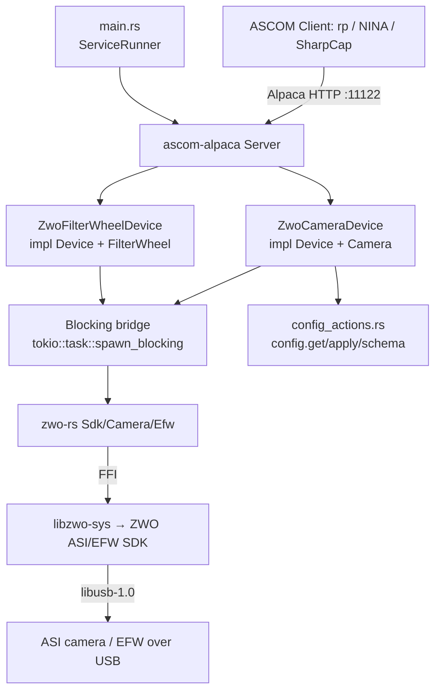

# Zwo-Camera Service Design

> **Status:** **Phase C (Track A) scaffold landed.** The `services/zwo-camera`
> crate now stands up a *bare* Alpaca server on port 11122 that enumerates ASI
> cameras via `zwo-rs` and registers each as a minimal `Camera` device (identity
> + cached geometry; the rest of the imaging surface is the trait's
> `NOT_IMPLEMENTED` default). It builds and links the native SDK
> (`zwo-camera → zwo-rs → libzwo-sys → ` ZWO SDK), is gate-green
> (`cargo rail --profile commit` + clippy `--all-features`), serves the
> simulation camera over Alpaca, and is wired into Cargo (`{ workspace = true }`,
> `zwo-rs` pinned at the real-handles rev) and Bazel (a `manual` +
> `requires-cargo`-tagged `BUILD.bazel`, kept out of `bazel build //...` until a
> `libzwo-sys` `crate.annotation` Bazel-izes the native link; `MODULE.bazel.lock`
> repinned). The **device-trait work is Phase E** (this document remains its
> specification, driving the `@wip` BDD scenarios). The FFI crates it consumes
> ([`zwo-rs`](https://github.com/ivonnyssen/zwo-rs) + `libzwo-sys`) live in a
> standalone repo. (Distinct from the *Delivery phasing* §, whose Phase A–G track
> the FFI-de-risk → full-driver rollout; the agreed decision record is
> [`docs/plans/zwo-driver.md`](../plans/zwo-driver.md).)
>
> **Remaining Track-A item:** wiring the SDK-provisioning step into the shared CI
> workflows (`test.yml`/`conformu.yml`/`safety.yml`) across the OS matrix — the
> reusable `.github/actions/install-zwo-sdk` composite action and the Pi-runner
> provisioning have landed, but the cross-platform wiring (esp. Windows, where the
> INDI mirror ships no blob, and the `infra`-triggered full-`--workspace` builds)
> is an unresolved cross-cutting decision (see *Gating plan* and *Open questions*).

## Overview

The `zwo-camera` service is an ASCOM Alpaca **Camera** (and optional
**FilterWheel**) driver for real ZWO hardware — ASI cameras and EFW filter
wheels. It exposes a connected ASI camera — exposures, ROI/binning, gain/offset,
cooling, readout, ST4 pulse-guiding — and a connected EFW over ASCOM Alpaca on a
fixed port so the `rp` orchestrator (and any Alpaca client: NINA, SGPro,
SharpCap) can drive them like any other device.

It is the ZWO analogue of the in-design [`qhy-camera`](qhy-camera.md) service and
reuses the same `ascom-alpaca` server framework and the
[`sky-survey-camera`](sky-survey-camera.md) (simulator) /
[`qhy-focuser`](qhy-focuser.md) (hardware driver) scaffolding.

**Provenance.** The behaviour is derived from open ZWO drivers as a *behavioural
reference only* — INDI `indi-asi`, INDIGO `ccd_asi`/`wheel_asi`, and
[`python-zwoasi`](https://github.com/stevemarple/python-zwoasi). **No code is
copied** (some references are GPL — see *Behavioural reference & licensing*),
the same clean-room discipline `qhy-camera` took toward `qhyccd-alpaca`.

**Not cross-platform.** Like `qhy-camera`, this service links a **native vendor
SDK** at compile time and is therefore gated out of the default workspace build.
See *Native dependency & build gating* — this is the dominant design constraint.

**How it differs from `qhy-camera` (drives every decision).** The `qhy-camera`
precedent assumed two things that are **both inverted** for ZWO, plus one that is
the same:

| Concern | QHY (the precedent) | ZWO (this service) |
|---|---|---|
| **SDK license** | Closed/proprietary; redistribution unresolved → authenticated/internal cache tier | **MIT** ("Copyright 2015, ZWO Company") → blob may be cached/redistributed on the **public** R2 cache mirror |
| **Rust FFI layer** | Published `qhyccd-rs`/`libqhyccd-sys` already exist; driver just writes the device layer | **No usable equivalent** → we also build & maintain `zwo-rs` + `libzwo-sys` |
| **Build/link gating** | Native lib links at compile time on *every* machine | **Same constraint** (`libzwo-sys` `build.rs` links unconditionally; SDK required at link time even with `--features simulation`) |

Net: ZWO is **legally much easier** but **mechanically more work up front** (we
build the FFI QHY got for free). The device-trait layer is *easier* than QHY — a
cleaner C API and more ASCOM features map natively (see *ASCOM Camera surface*).
See [ADR-008](../decisions/008-zwo-camera-native-sdk-ffi.md) for the FFI-crate /
caching decision and [`docs/plans/zwo-driver.md`](../plans/zwo-driver.md) for the
full decision record.

---

## Native dependency & build gating (the crux)

This is the single most consequential fact about this service and the reason it
is delivered in two tracks.

- The imaging path is `zwo-camera → zwo-rs → libzwo-sys → ` the **ZWO ASI/EFW
  SDK** (a source-less native binary) **+ libusb-1.0**.
- `libzwo-sys`'s `build.rs` emits `cargo:rustc-link-lib` for `ASICamera2` +
  `EFWFilter` + `dylib=usb-1.0` (plus `stdc++`/`c++`, `udev`/IOKit) **with no
  feature/cfg gate** on the link — mirroring `libqhyccd-sys`.
- **Consequence:** *every machine that compiles this package* — dev laptops, CI
  runners, Bazel actions — needs the ZWO SDK installed and discoverable, plus
  `libusb-1.0` dev headers. Not just machines with a camera attached.
- The `zwo-rs` **`simulation` feature** (which this service forwards as its own
  `simulation` feature) makes the build **camera-free, NOT SDK-free**: it
  fabricates fake frames (and EFW position/moving) at runtime. The native SDK is
  still required at link time. *(The ZWO SDK ships **no** simulation backend —
  unlike `qhyccd-rs` — so the simulator is wholly fabricated inside `zwo-rs`.)*

### Why this matters for rusty-photon specifically

The workspace is **100% pure-Rust at the link layer** since the `cfitsio` purge
([ADR-001 Amendment A](../decisions/001-fits-file-support.md)). `qhy-camera` is
the **first** native-SDK exception; `zwo-camera` is the **second**. The
difference is licensing: ZWO's SDK is **MIT**, so unlike the QHY blob it may live
on the **anonymous-read public** cache mirror (`cache.rustyphoton.space`) rather
than the authenticated/internal tier — the attribution notice must travel with
the cached blob. See [ADR-008](../decisions/008-zwo-camera-native-sdk-ffi.md).

### Gating plan

| Concern | Mechanism |
|---|---|
| `cargo build --all` / local dev without SDK | Normal workspace member, but **`cargo build -p zwo-camera` is expected to fail to link without the SDK**. Devs without the SDK use the rest of the workspace normally; `cargo rail`'s `merge_base=true` (affected-packages-only) builds the package only when *its* files change. Documented here and in the service README. |
| CI | An explicit SDK-provisioning step **pulls the pinned ASI/EFW SDK from the public cache** + installs `libusb-1.0-0-dev`, before building/testing this package, mirroring the cross-spawn pre-build pattern already in `.github/workflows/test.yml`. Required even for `simulation`/ConformU jobs; only `cargo check`/clippy jobs (no linker) can skip it. |
| Raspberry Pi nightly runner | Add the SDK + `libusb-1.0-0-dev` + udev `99-asi.rules` to `scripts/setup-pi-runner.sh`. **aarch64 (Pi 5) must be confirmed linking** and added to the matrix. |
| Bazel (shadow build) | Tag the target `requires-cargo` initially (kept out of `bazel test //...` by `.bazelrc`'s default `-requires-cargo`). Later replace with a hand-written `crate.annotation` for `libzwo-sys` (link-search to the installed SDK, `ASICamera2` + `EFWFilter` + `dylib=usb-1.0`). Run `CARGO_BAZEL_REPIN=1 bazel mod tidy && bazel mod tidy` after a `zwo-rs` rev/version change (Rule 10). |

### udev / USB

ZWO devices need a udev rule (`99-asi.rules`: VID `0x03c3`, `MODE=0666`,
`usbfs_memory_mb=200` for USB3 throughput). The EFW is USB-HID (no kernel
driver) but the SDK still talks libusb. macOS `.dylib`s need `install_name_tool`
fixing before linking (INDI automates this).

### Open questions still to resolve before Track A lands

1. **`zwo-rs` maturity.** The FFI crates are author-maintained and pre-1.0. Pin
   exactly (lockstep git rev → `=0.1.x` before merge) and track upstream closely.
2. **macOS `EFWGetNum` thread-safety.** Reportedly not thread-safe on macOS →
   enumeration is serialized (see *Concurrency*).
3. **Pi 5 aarch64 + macOS arm64 link.** The `libzwo-sys` skeleton links green on
   Linux x86_64 and locally on aarch64; CI green on Pi 5 + macOS arm64 is the
   remaining long-pole item (see *Delivery phasing* Phase A).

---

## Architecture



**Key components**

- **`main.rs`** — plain `fn main`, parses clap args, inits `tracing`, runs under
  `ServiceRunner::new("zwo-camera").with_reload().run_with_reload(...)` per
  [`service-lifecycle.md`](../skills/service-lifecycle.md). No hand-rolled signal
  handling, no `materialize_identity` (identities are hardware-derived).
- **`lib.rs`** — `ServerBuilder` that, on `build()`, opens the SDK and
  **enumerates every connected ASI camera** (and EFW when `filterwheel.enabled`),
  registering each as an ASCOM device (index 0, 1, 2, …) with its serial-derived
  UniqueID. Because `ASIGetSerialNumber` requires an *open* camera (see *Device
  identity*), enumeration opens each camera briefly to mint its identity, then
  closes it; the eager per-device connect handshake happens on
  `set_connected(true)`. Returns a `BoundServer`.
- **`camera.rs`** — `ZwoCameraDevice` (one instance per discovered camera)
  implementing `Device` + `Camera` against `zwo-rs`. **Every blocking SDK call
  runs inside `tokio::task::spawn_blocking`** so the async runtime is never
  stalled.
- **`filterwheel.rs`** — `ZwoFilterWheelDevice` (one per discovered EFW)
  implementing `Device` + `FilterWheel` (registered when `filterwheel.enabled`).
- **`config.rs`** — typed `Config` with parse-don't-validate newtypes.
- **`config_actions.rs`** — `ConfigurableDriver` impl + the `dispatch` the
  devices delegate to (`config.get`/`config.apply`/`config.schema`).
- **`mock.rs`** (feature `simulation`/`mock`) — the hardware-free test backend
  (the `zwo-rs` `simulation` camera/EFW + a tiny in-crate trait seam over the SDK
  for unit tests).

**Concurrency.** The ASI/EFW SDKs are blocking C FFI and are **not** safe to call
from arbitrary threads concurrently for a single device. Device state (current
ROI, binning, gain, offset, target temp, exposure state machine, filter position)
is held under `parking_lot::RwLock`; all SDK calls funnel through
`spawn_blocking` and a single logical owner per device. EFW enumeration
(`EFWGetNum`) is serialized for the macOS thread-safety caveat.

---

## MVP scope

The MVP boundary drives BDD scenario selection (Phase 2). Grounded in what the
ASI/EFW C API exposes and what `zwo-rs` will wrap.

**In scope (v0)**

- ASCOM Camera ICameraV3 for **every enumerated ASI camera** (each registered as
  a device on the one port), 16-bit (`ASI_IMG_RAW16`) monochrome **and**
  one-shot-colour (Bayer) sensors.
- Startup enumeration registers all discovered cameras (+ EFWs when enabled);
  per-device connect/disconnect lifecycle: open → `ASIInitCamera` → RAW16
  transfer → snap mode → cache `ASI_CAMERA_INFO` (geometry, pixel size, bit
  depth, cooler/colour/ST4 flags, `ElecPerADU`) and control caps.
- Sensor geometry (`CameraXSize`/`YSize`, `PixelSizeX`/`Y`) from cached info.
  **`PixelSizeX == PixelSizeY`** trivially (ASI exposes a single `PixelSize`).
- **`ElectronsPerADU`** is a **real native value** from `ASI_CAMERA_INFO.ElecPerADU`
  (a ZWO win — QHY ships `NOT_IMPLEMENTED`).
- **Binning** — symmetric only (`CanAsymmetricBin = false`); `MaxBinX/Y` from the
  SDK's `SupportedBins`; ROI rescaled on bin change.
- **ROI** — `StartX/Y`/`NumX/Y` setters accept any `u32`; geometry validated at
  `StartExposure`, **including the ASI alignment rules**: width must be a multiple
  of 8 and height a multiple of 2 (ASI120 USB2 additionally requires
  `width·height % 1024 == 0`).
- **Exposure** — `ExposureMin/Max/Resolution` from `ASIGetControlCaps(ASI_EXPOSURE)`
  (µs; min ~32 µs for current ASI sensors — required for bias frames, see
  [`docs/workspace.md` Duration Units](../workspace.md#duration-units)); single
  `ASIStartExposure` (snap mode); `ImageReady`/`ImageArray`/`ImageArrayVariant`;
  `CameraState` (`Idle`/`Exposing`/`Error`); `PercentCompleted` from
  remaining-exposure µs.
- **Graceful stop AND abort** — `ASIStopExposure` is a single graceful,
  **data-preserving** stop ("image can still be read out"), so `CanStopExposure =
  true`; the same call backs `AbortExposure` (discarding data), so
  `CanAbortExposure = true`. *(A ZWO win — QHY ships `CanStopExposure = false`.)*
- **PulseGuide** — native `ASIPulseGuideOn/Off` (ST4), gated on the `ST4Port`
  capability → `CanPulseGuide = true` when present. *(A ZWO win — QHY defers it.)*
- **Gain / Offset** — current value + `Min`/`Max` from `ASIGetControlCaps`
  (`ASI_GAIN`, `ASI_OFFSET`/brightness); `NOT_IMPLEMENTED` if the control is
  absent on the model.
- **Readout modes** — `ReadoutMode(s)` from the ASI speed/bit-depth combinations
  the driver exposes (e.g. "Normal", "High Speed"); switching updates cached
  state.
- **Cooling** — `CoolerOn`, `CCDTemperature`, `SetCCDTemperature`, `CoolerPower`,
  `CanSetCCDTemperature`, `CanGetCoolerPower` — all gated on
  `ASI_CAMERA_INFO.IsCoolerCam`.
- **Sensor type** — `Monochrome` vs `RGGB` (+ `BayerOffsetX/Y`) from
  `IsColorCam` / `BayerPattern`.
- **`MaxADU`** = `(2^BitDepth) - 1` from `ASI_CAMERA_INFO.BitDepth` (e.g. 65535
  for a 16-bit ADC, 4095 for 12-bit); `SensorName` from the device name.
- **Dark/bias frames** — ASI sensors have **no mechanical shutter**; `Light =
  false` is **accepted** and captures normally (there is no shutter to actuate —
  the frame differs only in metadata). So `HasShutter = false` and darks/bias
  work on every model (a divergence from `qhy-camera`, which rejects darks on
  shutterless models).
- **FilterWheel** as a second ASCOM device on the same port (when present):
  `Names`, `Position` (with moving state), `set_position`, `FocusOffsets`.
- `config.get`/`config.apply`/`config.schema` actions; hardware-derived
  `UniqueID` (camera/EFW SDK serial); in-process reload.
- ConformU integration test driven against the `zwo-rs` `simulation` backend
  (SDK installed in CI, no physical camera).

**Deferred (see *Future Work*)**

- **Video mode** (`ASIStartVideoCapture`) — the high-FPS guiding/planetary path;
  v0 is snap-mode only (snap and video are mutually exclusive).
- **EAF focuser** (`libEAFFocuser` → ASCOM `IFocuserV3`) — a later addition after
  the camera + EFW (see *Future Work*).
- **CAA rotator** (`CAA_API.h`) — only if a ZWO rotator is ever in scope.
- Per-serial connect-time tuning (gain/offset/target-temperature defaults).
- `FullWellCapacity` (no native ASI field; supply a placeholder only if ConformU
  requires it).
- TLS / HTTP Basic Auth (compose `rp-tls` / `rp-auth` later).
- **Vendoring the SDK** into `libzwo-sys` (MIT permits) to drop external
  provisioning — deferred in favour of mirroring `qhyccd-rs`'s external model.

---

## Configuration

The service **enumerates every connected ASI camera** (and EFW, when enabled) at
startup and registers each as an ASCOM device (camera / filter-wheel index
0, 1, 2, …) on the one port. The hardware is the source of truth — there is no
per-camera *binding* in config. Each device's UniqueID comes from its SDK serial;
config carries only optional per-serial display overrides plus a global EFW
toggle and the port.

```jsonc
{
  // Optional per-device overrides, keyed by SDK serial. A device with no entry
  // uses SDK-derived defaults (name from model+serial; EFW filter names
  // "Filter0".."FilterN"). Named `devices` (not `overrides`) to avoid colliding
  // with the config.get response's own `overrides[]` (CLI-pinned paths) field.
  "devices": {
    "ASI2600MM-0A1B2C3D4E5F6071": {
      "name": "Main Imaging",
      "description": "ASI2600MM-Pro @ 1000mm"
    },
    "EFW-1122334455667788": {
      "filter_names": ["L", "R", "G", "B", "Ha", "OIII", "SII"]
    }
  },
  "filterwheel": {
    "enabled": true                  // register discovered EFWs as FilterWheel devices
  },
  "server": {
    "port": 11122
  }
}
```

Sections:

- **devices** — Optional per-device override map keyed by **SDK serial** (the
  16-hex `ASIGetSerialNumber` / `EFWGetSerialNumber` value). Lets an operator give
  a friendly `name`/`description` to a specific camera and human `filter_names` to
  a specific EFW. Any device without an entry uses SDK-derived defaults. v0 does
  **not** carry per-camera connect-time tuning (gain/offset/target temperature) —
  with heterogeneous cameras those are per-serial concerns and clients set them
  over ASCOM; per-serial defaults are deferred (see *Future Work*).
- **filterwheel.enabled** — Global toggle: when `true`, discovered EFWs are
  registered as FilterWheel devices alongside the cameras. Hard read-only
  (toggling adds/removes endpoints → restart-required, not a live apply).
- **server.port** — Listening port (**11122**, next free in the 1112x family;
  11121 is `qhy-camera`). One port hosts all enumerated devices. Hard read-only
  (self-lockout: a port change would make the BFF lose the devices).

### Config actions

Standard cross-driver protocol ([`config-actions.md`](config-actions.md)),
implemented generically in `rusty_photon_config::actions` + the ASCOM adapter in
[`rusty-photon-driver`](../../crates/rusty-photon-driver). `config_actions.rs`
supplies `ConfigurableDriver for ZwoCameraDriver`:

- **Secrets redacted/carried forward:** none in v0 (no auth yet).
- **Locked (identity) fields:** none — UniqueIDs are hardware-derived and not
  stored in config, so there is no identity field to lock (a deliberate
  divergence from the `materialize_identity` convention; see *Device identity*).
- **Hard read-only fields:** `/server/port`, `/filterwheel/enabled` (enabling
  /disabling adds/removes registered endpoints → restart-required, not a live
  apply).
- **Editable fields:** the `devices` map (per-serial `name` / `description` /
  `filter_names`).
- **Validation** at load (parse-don't-validate): `filter_names` entries are
  non-empty strings; `devices` keys are free-form serial strings.

`config.apply` persists atomically, returns `status:"applying"` when a field
changed, and fires the in-process reload (`main.rs` runs under
`with_reload().run_with_reload(...)`).

### Device identity (UniqueID)

ASCOM requires a globally-unique, never-changing `UniqueID`. **This service
derives the UniqueID from the camera's hardware serial** and the EFW's from the
EFW serial — the same scheme as `qhy-camera`.

A **ZWO-specific wrinkle:** `ASIGetSerialNumber` (the stable 8-byte → 16-hex id,
available only since ASI SDK driver V1.14.0227) requires the camera to be
**opened first** — unlike QHY's pre-open read. So enumeration opens each camera
briefly to read its serial, then closes it. The fallback chain is:

1. `ASIGetSerialNumber` (open briefly → read → close) — the canonical identity.
2. `ASIGetID` (a writable, USB3-only flash id) — a weak fallback for older
   cameras that report no serial.
3. Otherwise the device is **refused** and logged at `warn!` (no stable identity).

`EFWGetSerialNumber` provides the EFW UniqueID. Consequences (same as
`qhy-camera`): **no `unique_id` field in config**, **no `materialize_identity`
call** in `main.rs`, and **no locked identity field** in the config-actions
tiers. Two identical-model cameras are naturally distinguished by serial.

---

## Behavioral contracts

Named, testable behaviours, each mapping to a BDD scenario in `tests/features/`
except where a contract notes a unit-tested branch (e.g. E9, and PG2's no-ST4
path). ASCOM error names per [`docs/references/ascom-alpaca.md`](../references/ascom-alpaca.md).
Values are grounded in the `zwo-rs`-backed implementation; the `simulation`
backend presents one **ASI2600MM-Pro-Simulated** camera (6248×4176, monochrome,
16-bit, cooled, ST4 present) and one **7-position EFW-Simulated** wheel.

> The simulator's capability set (cooler + ST4 + 16-bit) is chosen so the BDD
> suite exercises the **full** ASCOM surface from a single device. ST4 on a
> 2600-class body is a simulator convenience, not a shipping-SKU claim; the
> `simulation` backend is wholly fabricated inside `zwo-rs` (the ASI SDK has no
> simulation mode).

### Enumeration & connection lifecycle

- **C0.** At startup `build()` enumerates all connected ASI cameras (and EFWs when
  `filterwheel.enabled`) and registers each as an ASCOM device with its
  serial-derived UniqueID (opening each camera briefly to read the serial). Zero
  discovered cameras is **not** a hard failure — the service starts with no Camera
  devices, logged at `warn!`; a later reload re-enumerates.
- **C1.** `set_connected(true)` on a device opens *that* camera, `ASIInitCamera`,
  selects RAW16, snap mode, and caches `ASI_CAMERA_INFO`, supported binning modes,
  and exposure/gain/offset control caps. On success `Connected = true`.
- **C2.** `set_connected(true)` with the device's camera unreachable / SDK open
  failure returns the mapped driver error and `Connected` stays `false`.
- **C3.** `set_connected(false)` closes that device and returns `NOT_CONNECTED`
  for subsequent operations; an in-flight exposure on it is aborted.
- **C4.** Connect is per-device and independent: connecting/disconnecting one
  camera does not affect the others enumerated on the same service.

### Geometry, binning, ROI

- **G1.** `CameraXSize`/`CameraYSize`/`PixelSizeX`/`PixelSizeY` reflect the cached
  `ASI_CAMERA_INFO`; `PixelSizeX == PixelSizeY` (single SDK `PixelSize`).
- **B1.** `set_bin_x`/`set_bin_y` validate against the SDK's `SupportedBins` and
  set symmetric binning; an unsupported bin returns `INVALID_VALUE`.
- **B2.** `CanAsymmetricBin = false`; `MaxBinX`/`MaxBinY` come from
  `SupportedBins` (typically 1–4, up to 8).
- **B3.** A bin change rescales the cached ROI by the bin ratio.
- **R1.** `StartX/Y`/`NumX/Y` setters accept any `u32`; geometry is validated at
  `StartExposure` (R2/R3), not at the setter.
- **R2.** `StartExposure` with `StartX + NumX > CameraXSize / BinX` (or the Y
  analogue), or `NumX/NumY = 0`, returns `INVALID_VALUE`.
- **R3.** `StartExposure` with a sub-frame that violates the ASI alignment rules —
  `NumX % 8 != 0` or `NumY % 2 != 0` — returns `INVALID_VALUE`; otherwise the ROI
  is applied to the SDK before exposing.

### Exposure

- **E1.** `StartExposure` while disconnected returns `NOT_CONNECTED`.
- **E2.** `StartExposure` while exposing returns `INVALID_OPERATION`.
- **E3.** `StartExposure` `Duration` outside `[ExposureMin, ExposureMax]` returns
  `INVALID_VALUE`.
- **E4.** `StartExposure` with `Light = false` (dark/bias) is **accepted** on
  every model: ASI cameras have no mechanical shutter, so the frame is captured
  identically and differs only in client-applied metadata. `HasShutter = false`.
- **E5.** A successful `StartExposure` sets exposure µs, runs the ASI single-frame
  capture on the blocking bridge, and on completion produces an `ImageArray` of
  the binned sub-frame, `ImageReady = true`,
  `LastExposureStartTime`/`LastExposureDuration` set, `CameraState = Idle`.
- **E6.** `CameraState` is `Exposing` during capture; `PercentCompleted` is
  derived from remaining-exposure µs (clamped to ≤ 100), `100` once ready.
- **E7.** `AbortExposure` during capture calls `ASIStopExposure` and discards the
  frame, leaving `ImageReady = false`; `CanAbortExposure = true`.
- **E8.** `StopExposure` during capture calls `ASIStopExposure` and **preserves**
  the partially-integrated frame ("can still be read out"); `CanStopExposure =
  true`. *(The ZWO inversion of `qhy-camera` E8.)*
- **E9.** A mid-exposure SDK error transitions `CameraState = Error`, sets
  `last_error`, leaves `ImageReady = false`, logged at `warn!`.

### Gain / offset / readout

- **GO1.** `Gain`/`Offset` return the current SDK value, or `NOT_IMPLEMENTED` if
  the control is unavailable on the model.
- **GO2.** `set_gain`/`set_offset` validate against cached `[min, max]` and apply
  via the SDK; out-of-range returns `INVALID_VALUE`.
- **GO3.** `GainMin/Max`, `OffsetMin/Max` reflect the cached SDK min-max.
- **RM1.** `ReadoutModes` is the driver's named speed/bit-depth list;
  `set_readout_mode` validates the index and updates cached state; an invalid
  index returns `INVALID_VALUE`.

### Cooling

- **K1.** `CanSetCCDTemperature` / `CanGetCoolerPower` are `true` iff
  `ASI_CAMERA_INFO.IsCoolerCam`; otherwise the related getters return
  `NOT_IMPLEMENTED`.
- **K2.** `CCDTemperature` returns the current sensor temperature
  (`ASI_TEMPERATURE`, 0.1 °C units) when cooling is supported.
- **K3.** `set_set_ccd_temperature` validates `[-273.15, 80]` and sets the target;
  `SetCCDTemperature` reads it back.
- **K4.** `CoolerOn`/`set_cooler_on` map to `ASI_COOLER_ON`; `CoolerPower` is the
  normalized `ASI_COOLER_POWER_PERC` percent.

### Sensor type & signal

- **ST1.** `SensorType` is `RGGB` (colour) when `IsColorCam`, else `Monochrome`;
  `BayerOffsetX/Y` follow `ASI_CAMERA_INFO.BayerPattern`.
- **ST2.** `ElectronsPerADU` returns the native `ASI_CAMERA_INFO.ElecPerADU`
  (a finite positive value), **not** `NOT_IMPLEMENTED`.
- **ST3.** `MaxADU` = `(2^BitDepth) - 1` from `ASI_CAMERA_INFO.BitDepth`.

### Pulse guiding

- **PG1.** `CanPulseGuide` is `true` iff the camera reports an ST4 port; the
  simulated camera reports ST4 present.
- **PG2.** `PulseGuide(direction, duration)` while disconnected returns
  `NOT_CONNECTED`; a model without ST4 returns `NOT_IMPLEMENTED`. *(The
  disconnected branch is a BDD scenario; the no-ST4 `NOT_IMPLEMENTED` branch is
  covered by unit tests, since the `simulation` backend always reports ST4
  present.)*

### FilterWheel (when `filterwheel.enabled = true`)

- **FW1.** `Names` lists `filter_names` (or generated `Filter0..N`); `Position`
  returns the current slot, or the ASCOM moving sentinel while target ≠ actual.
  *(`EFWGetPosition` returns `EFW_SUCCESS` and writes `-1` into its out-parameter
  while moving — distinct from the `EFW_ERROR_MOVING` enum — which maps directly
  onto ASCOM `Position`'s own `-1` moving sentinel.)*
- **FW2.** `set_position` validates `index < filter_count` and commands the SDK;
  out-of-range returns `INVALID_VALUE`.
- **FW3.** `FocusOffsets` returns zeros per filter in v0 (the EFW SDK exposes no
  per-slot focus offsets).

---

## ASCOM Camera surface — v0 behaviour

| Property / Method | v0 behaviour (backed by `zwo-rs`) |
|---|---|
| `CameraXSize` / `CameraYSize` | Cached `ASI_CAMERA_INFO` MaxWidth/MaxHeight |
| `PixelSizeX` / `PixelSizeY` | Cached `ASI_CAMERA_INFO.PixelSize` (X == Y) |
| `BinX` / `BinY` / `MaxBinX` / `MaxBinY` | Symmetric; max from `SupportedBins` |
| `CanAsymmetricBin` | `false` |
| `NumX` / `NumY` / `StartX` / `StartY` | Setters relaxed; validated at `StartExposure` (incl. %8 / %2) |
| `MaxADU` | `(2^BitDepth) - 1` (65535 for 16-bit, 4095 for 12-bit) |
| `ElectronsPerADU` | **Native** `ASI_CAMERA_INFO.ElecPerADU` |
| `FullWellCapacity` | `NOT_IMPLEMENTED` (no native field; placeholder only if ConformU demands) |
| `ExposureMin` / `Max` / `Resolution` | From `ASIGetControlCaps(ASI_EXPOSURE)` (µs) |
| `Gain` / `GainMin` / `GainMax` | `ASI_GAIN` control; `NOT_IMPLEMENTED` if absent |
| `Offset` / `OffsetMin` / `OffsetMax` | `ASI_OFFSET`/brightness control; `NOT_IMPLEMENTED` if absent |
| `ReadoutMode` / `ReadoutModes` | Driver speed/bit-depth list |
| `SensorType` / `BayerOffsetX/Y` | Mono vs RGGB from `IsColorCam` / `BayerPattern` |
| `CoolerOn` / `CCDTemperature` / `SetCCDTemperature` / `CoolerPower` | Gated on `IsCoolerCam` |
| `CanSetCCDTemperature` / `CanGetCoolerPower` | `true` iff `IsCoolerCam` |
| `HasShutter` | `false` (ASI sensors are shutterless) |
| `CameraState` | `Idle` / `Exposing` / `Error` |
| `PercentCompleted` | From remaining-exposure µs, clamped ≤ 100 |
| `CanAbortExposure` / `CanStopExposure` | `true` / `true` (both via `ASIStopExposure`) |
| `CanPulseGuide` | `true` iff ST4 port present |
| `PulseGuide` | `ASIPulseGuideOn/Off` (ST4) |
| `StartExposure` (`Light=false`) | Accepted; captured normally (no shutter) |
| `StartExposure` / `AbortExposure` / `StopExposure` / `ImageReady` / `ImageArray` / `ImageArrayVariant` | Per *Exposure* contracts; `ImageArray` axes `[X, Y]` |

---

## Service lifecycle (`main.rs`)

Standard shape per [`service-lifecycle.md`](../skills/service-lifecycle.md):

```rust
fn main() -> Result<(), Box<dyn std::error::Error>> {
    let args = Args::parse();
    tracing_subscriber::fmt().with_max_level(args.log_level).init();

    let config_path = rusty_photon_config::resolve_config_path("zwo-camera", args.config);
    // No materialize_identity: ASCOM UniqueIDs are derived from the camera/EFW
    // SDK serials at enumeration (see "Device identity"), not minted into config.

    ServiceRunner::new("zwo-camera")
        .with_reload()
        .run_with_reload(|shutdown, reload| async move {
            loop {
                let bound = ServerBuilder::new()
                    .with_config_source(&config_path, CliOverrides { port: args.port })
                    .with_reload_signal(reload.clone())
                    .build()
                    .await?;           // eager SDK open + enumerate/register devices
                tokio::select! {
                    r = bound.start(shutdown.cancelled()) => return r,
                    () = reload.recv() => continue,
                }
            }
        })
}
```

`info!("Service started successfully …")` only after the bind succeeds; everything
else is `debug!` (CLAUDE.md Rule 9).

---

## Testing

Layered per [`testing.md`](../skills/testing.md).

- **Unit** — config parse/newtype validation, ROI/binning geometry math
  (including the %8 / %2 alignment rules), the `Camera` state machine
  (Idle/Exposing/Error, `ImageReady`, percent-completed), gain/offset range
  checks, cooling gating, Bayer-offset mapping, `MaxADU`-from-`BitDepth` — against
  an in-crate trait seam over the SDK (mockall doubles), so unit tests need
  **neither hardware nor the SDK linked** where possible.
- **BDD** (`bdd-infra::ServiceHandle`) — connection lifecycle (C1–C4), ROI/bin
  validation (R1–R3, B1–B3), exposure happy-path + error paths (E1–E8, incl. the
  graceful-stop / abort split; E9's mid-exposure Error transition is unit-tested),
  gain/offset/readout (GO1–RM1), cooling (K1–K4),
  sensor type & signal (ST1–ST3), pulse-guiding (PG1–PG2), and FilterWheel
  (FW1–FW3 when enabled), driven against the `zwo-rs` `simulation` backend.
- **ConformU** (`tests/conformu_integration.rs`, gated by the `conformu` feature)
  — launches the production binary with `--features simulation` and runs the
  official validator via `run_conformu_tests::<dyn Camera>()` (and
  `::<dyn FilterWheel>()` when enabled).

> **CI caveat (critical):** the `simulation` feature removes the *camera*
> requirement, **not the SDK**. All build/test/ConformU jobs for this package
> still link `ASICamera2` + `EFWFilter`, so CI must install the SDK first (see
> *Gating plan*). Only `cargo check`/clippy jobs (which don't invoke the linker)
> can skip the SDK.

---

## Delivery phasing

This service is built in tracks to isolate the genuinely novel risk (the FFI
crate + native system dependency) from the mechanical-but-large risk (the device
driver itself). The FFI crate is the long pole (~40–50% of effort); once
`simulation` works, the driver builds entirely against it, leaning on the
`sky-survey-camera` + `qhy-camera` scaffolding. Tracks A–G mirror
[`docs/plans/zwo-driver.md`](../plans/zwo-driver.md):

- **Phase A — `libzwo-sys`** *(skeleton stood up)*. `bindgen` over `ASICamera2.h`
  + `EFW_filter.h` + `EAF_focuser.h`; `build.rs` unconditional system-link. Green
  `check` + `test` on Linux x86_64, built + tested locally on aarch64.
  *Remaining:* confirm green link on Pi 5 aarch64 CI + macOS arm64.
- **Phase B — `zwo-rs`** *(skeleton stood up)*. Safe `Sdk`/`Error` surface +
  `simulation`-feature stub. *Remaining:* real safe handles/enums + error mapping
  + the `simulation` backend (camera frames + EFW position/moving); publish 0.1.0.
- **Phase C — Track A.** Bare `zwo-camera` serving an empty/sim Camera on
  `:11122`; prove build/link, CI SDK provisioning, Pi 5 aarch64, Bazel
  `requires-cargo`, repin-twice — *before* device-trait work.
- **Phase D — design doc + ADR + workspace row + BDD feature files** *(this
  document, [ADR-008](../decisions/008-zwo-camera-native-sdk-ffi.md), the
  `docs/workspace.md` row, and the `@wip` feature files)*.
- **Phase E — Track B full Camera.** `Device + Camera` over `zwo-rs` (ROI/bin,
  gain/offset, cooling, readout, exposure state machine, abort + graceful stop,
  PulseGuide, sensor type), config-actions, identity, `spawn_blocking` bridge,
  mock seam.
- **Phase F — EFW `FilterWheel`** fast-follow (position/moving/names/offsets),
  config toggle, BDD/ConformU.
- **Phase G — test + gate + consumer.** BDD + ConformU on the sim backend; `cargo
  rail run --profile commit` + `cargo fmt` green; `rp` `CameraConfig` consumer;
  Bazel `crate.annotation` finish; READMEs/`docs/workspace.md`.

---

## Future Work

- **EAF focuser** (`EAF_focuser.h` / `libEAFFocuser`) → ASCOM `IFocuserV3`
  (absolute + temperature; `EAFIsMoving` is cleaner than the EFW `-1` trick).
  Could eventually supersede the serial [`qhy-focuser`](qhy-focuser.md) pattern
  for ZWO users.
- **Video mode** (`ASIStartVideoCapture`) as a high-FPS guiding/planetary path.
- **CAA rotator** (`CAA_API.h`) if a ZWO rotator is ever in scope.
- **Vendoring the SDK** into `libzwo-sys` (MIT permits) to drop external
  provisioning entirely.
- **Backport** the SDK-free-simulation / feature-gated-link improvement to
  `qhyccd-rs` so `qhy-camera`'s default build can also be pure-Rust.
- Per-serial connect-time tuning; `FullWellCapacity`; TLS / Basic Auth via
  `rp-tls` / `rp-auth`.

## References

- Decision record: [`docs/plans/zwo-driver.md`](../plans/zwo-driver.md) ·
  [ADR-008](../decisions/008-zwo-camera-native-sdk-ffi.md)
- FFI crates (this repo's author): [`zwo-rs`](https://github.com/ivonnyssen/zwo-rs)
  + `libzwo-sys` (siblings to `qhyccd-rs` / `libqhyccd-sys`)
- Same-vendor-class precedent: [`qhy-camera.md`](qhy-camera.md) ·
  [`qhy-focuser.md`](qhy-focuser.md)
- Camera scaffolding template: [`sky-survey-camera.md`](sky-survey-camera.md)
- [`config-actions.md`](config-actions.md) ·
  [`service-lifecycle.md`](../skills/service-lifecycle.md) ·
  [`development-workflow.md`](../skills/development-workflow.md) ·
  [`testing.md`](../skills/testing.md)
- Behavioural references (read-only, clean-room): INDI `indi-asi` (LGPL-2.1+ /
  GPL-2.0+ per file), [`python-zwoasi`](https://github.com/stevemarple/python-zwoasi),
  INDIGO `indigo_drivers/{ccd,wheel,focuser}_asi`
- ASI/EFW SDK (headers + per-arch binaries, MIT): INDI `indi-3rdparty/libasi`
- [ADR-001 Amendment A](../decisions/001-fits-file-support.md) — the pure-Rust /
  no-system-dep posture this service is the second exception to (after
  `qhy-camera`)
