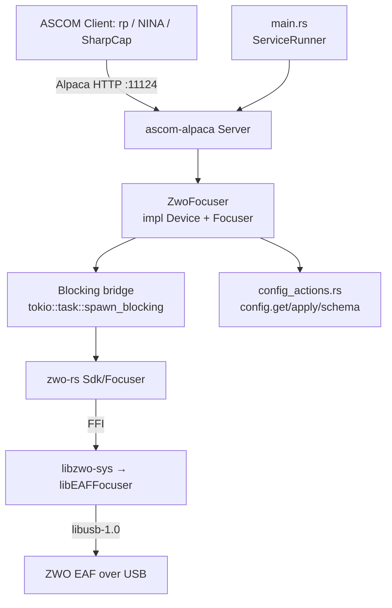

# ZWO EAF Focuser Service Design

> **Status: v0 validated on real hardware (2026-07-09 implemented, 2026-07-14
> hardware-validated).** The full `Device` + `Focuser` surface is built over a
> `zwo_rs::Focuser` FFI handle (the `libEAFFocuser` link directive, previously
> deliberately omitted, lands alongside it). Validated end-to-end against a
> physical EAF with temperature probe: enumeration, serial-derived identity,
> connect/move/halt/settle, temperature, range rejection — and **ConformU
> passes with zero errors, warnings or issues against the real device**.
> Hardware validation surfaced two fixes now baked in: `MaxStep` comes from
> `EAFGetMaxStep` (the firmware's working travel limit), not
> `EAF_INFO::MaxStep` (see *Hardware Constraints*), and the EAF is a USB HID
> device whose `/dev/hidraw*` node needs a udev rule that actually reaches
> hidraw (see *Packaging*). 25 unit tests + 27 BDD scenarios (3 feature
> files) are green against the `zwo-rs` simulation backend, whose movement
> model now mirrors the measured hardware behavior (multi-poll IsMoving,
> live position ramp, halt-freezes-mid-travel).

## Overview

The `zwo-focuser` service is an ASCOM Alpaca **Focuser** driver for the ZWO EAF
(Electronic Auto Focuser). It talks to the hardware over native ZWO SDK FFI
(`libEAFFocuser`) via the vendored [`zwo-rs`](../../crates/zwo-rs) crate — the
same crate `zwo-camera` uses for its ASI camera / EFW filter-wheel devices, now
extended with an EAF `Focuser` handle.

It is the direct analogue of [`qhy-focuser`](qhy-focuser.md) and
[`pa-scops-oag`](pa-scops-oag.md) at the ASCOM `Focuser` interface level, but its
transport is architecturally different from both: the EAF is a **native-SDK USB
device**, not a USB-CDC/FTDI serial device, so `zwo-focuser` is built on
`zwo-rs`'s FFI seam (mirroring `zwo-camera`), **not** on
`rusty-photon-shared-transport` (the serial pattern `qhy-focuser`/`pa-scops-oag`
use).

**Provenance.** This closes out the scope `docs/plans/zwo-driver.md` sequenced
from the start — **Camera → EFW filter wheel → EAF focuser** — using the EAF SDK
header (`EAF_focuser.h`) already vendored alongside the ASI/EFW headers in
`crates/zwo-rs/libzwo-sys/`. See [ADR-008](../decisions/008-zwo-camera-native-sdk-ffi.md)
(native SDK FFI decision) and [ADR-010](../decisions/010-vendor-zwo-rs.md)
(vendoring `zwo-rs`); no new ADR is needed — both already cover this addition.

**Not cross-platform by default.** Like `zwo-camera`, this service links a
**native vendor SDK** (`libEAFFocuser`, MIT-licensed) at compile time. See
*Native dependency & build gating*.

## Native dependency & build gating

Identical posture to `zwo-camera` (see `docs/services/zwo-camera.md` "Native
dependency & build gating" for the full rationale) — summarized here:

- The chain is `zwo-focuser → zwo-rs → libzwo-sys →` the ZWO SDK
  (`libEAFFocuser`).
- `libzwo-sys`'s `build.rs` links per device feature
  ([ADR-014](../decisions/014-zwo-per-device-services-and-link-features.md));
  this service builds `zwo-rs` with `focuser` only, so its link is exactly
  `EAFFocuser` (+ the C++ runtime and `libudev`, whose `udev_*` symbols the
  EAF blob references without declaring) — machines compiling this package
  need that SDK installed and discoverable. (The shared Bazel `zwo-rs`
  targets build the union of device features, so Bazel actions still
  provision all the blobs.)
- The `simulation` feature makes the build **hardware-free, not SDK-free**: it
  fabricates a fake EAF (position/moving/temperature) at runtime; the native SDK
  is still required at link time. `ZWO_SKIP_NATIVE_LINK=1` omits the link
  directives entirely for sanitizer/simulation-only CI jobs, exactly as it does
  for `zwo-camera`.
- **CI provisioning:** `.github/actions/install-zwo-sdk` already downloaded and
  staged `libEAFFocuser` on all three OSes in anticipation of this service, but
  tolerated a missing/failed blob (`|| true` on Linux/macOS, an optional
  download on Windows) since nothing linked it unconditionally yet. Landing
  this service made that link real, so the action was tightened to fail fast
  instead of deferring to a later, less actionable link/runtime error — and a
  macOS-only gap surfaced by CI was fixed alongside it: the `install_name_tool
  -id` rewrite that makes the SDK's dylibs resolvable to Bazel's `rust_test`
  binaries (no `@rpath` entries) covered `ASICamera2`/`EFWFilter` but not the
  newly-required `EAFFocuser`.
- **Bazel:** `zwo-rs`/`zwo-rs_sim` already exist as a real/sim two-variant build
  (ADR-010); `focuser.rs` becomes part of both targets' existing
  `glob(["src/**/*.rs"])` with no `BUILD.bazel` change in `crates/zwo-rs`.
  `zwo-focuser` gets its own `BUILD.bazel`, structurally identical to
  `zwo-camera`'s (see *Testing*).

## Architecture



**Key components**

- **`main.rs`** — plain `fn main`, parses clap args, inits `tracing`, runs under
  `ServiceRunner::new("zwo-focuser").with_reload().run_with_reload(...)` per
  [`service-lifecycle.md`](../skills/service-lifecycle.md). No hand-rolled signal
  handling; no `materialize_identity` (identity is hardware-derived).
- **`lib.rs`** — `ServerBuilder` that, on `build()`, opens the SDK and
  **enumerates every connected EAF** via `zwo_rs::Sdk::focusers()`, registering
  each as an ASCOM `Focuser` device (index 0, 1, 2, …) with a serial-derived
  `UniqueID`. Mirrors `zwo-camera`'s open-briefly-to-mint-identity pattern:
  `EAFGetSerialNumber` requires an open device, so enumeration opens each EAF
  briefly to read its serial, then closes it; the per-device connect handshake
  happens later on `set_connected(true)`.
- **`backend.rs`** — the `FocuserHandle` trait (the SDK seam, mirroring
  `zwo-camera`'s `CameraHandle`): `unique_id`, `info`, `is_open`, `open`, `close`,
  `position`, `is_moving`, `move_to`, `stop`, `max_step`, `temperature`,
  `reverse`/`set_reverse`. `ZwoFocuserHandle` wraps `zwo_rs::Focuser` behind a
  `parking_lot::Mutex` (the SDK handle is `Send` but `!Sync`); `MockFocuserHandle`
  (unit tests only) forces paths the `zwo-rs` simulation can't reach.
- **`focuser.rs`** — `ZwoFocuser` (one instance per discovered EAF) implementing
  `Device` + `Focuser` against the `FocuserHandle` seam. Every blocking SDK call
  runs inside `tokio::task::spawn_blocking`.
- **`config.rs`** — typed `Config` (per-serial device overrides + server port).
- **`config_actions.rs`** — `ConfigurableDriver` impl for `config.get`/`apply`/
  `schema`.

**Concurrency.** The EAF SDK is blocking C FFI and is not safe to call
concurrently on a single handle, so every SDK call funnels through
`spawn_blocking` with one logical owner per device — the same discipline
`zwo-camera` uses. Unlike a camera exposure, an EAF move is not a long-running
integration requiring a detached task with a generation counter: `move_to` starts
the move and returns; the caller polls `is_moving`/`position` for completion, so
there is no in-flight-task cancellation/invalidation machinery to build.

## Hardware Constraints

- **Connection**: USB **HID** (ZWO vendor ID `0x03c3`, shared with ASI cameras
  and EFW — but unlike the cameras, which are bulk-USB/libusb devices, the EAF
  and EFW are HID devices the SDK reaches through `/dev/hidraw*`). Consequence:
  a udev rule that matches only the USB device node (`SUBSYSTEM=="usb"`,
  singular) grants no access; with the hidraw node inaccessible, `EAFGetNum`/
  `EAFGetID` still enumerate (USB descriptors) but `EAFOpen` fails with
  `EAF_ERROR_REMOVED` and a pre-open `EAFGetProperty` returns a degraded
  `EAF_INFO` (`MaxStep` 0). See *Packaging* for the rule this package ships.
- **Two `MaxStep` values — the working limit is the real one.**
  `EAF_INFO::MaxStep` is only the fixed *ceiling* (600000 on the validated
  unit) that the limit can be raised to; the firmware actually stops at the
  user-settable `EAFGetMaxStep` working limit (factory default 60000).
  `EAFMove` validates against the *ceiling*: a target past the working limit
  but within the ceiling is **accepted, and the motor silently stops at the
  limit** (observed on real hardware; ConformU flags it as a Move issue if the
  driver advertises the ceiling). The driver therefore reports and validates
  against `EAFGetMaxStep`, read during enumeration's brief open.
- **Movement timing**: the validated EAF travels ≈ 640 steps per 100 ms;
  `EAFIsMoving` stays true across many polls for a real move (a 1000-step move
  settles in ≈ 1.7 s) and `EAFGetPosition` ramps live toward the target while
  moving. `EAFStop` freezes the position mid-travel.
- **Absolute-position stepper**: `0..=MaxStep` (working limit), with the
  position counter persisted in the focuser across power cycles.
- **Onboard-flash firmware**: like the ASI camera and EFW, the EAF ships firmware
  in onboard flash — no upload step, no cold-plug helper.
- **Temperature sensor**: `EAFGetTemp` reports a live reading (unlike the Scops
  OAG, which has none). With the plug-in temperature probe attached the reading
  is the probe's (validated: ambient-plausible 20.5 °C on the bench).
- **`EAFGetSerialNumber` requires an open device** (`EAF_ERROR_CLOSED` otherwise),
  mirroring the ASI/EFW serial-read pattern; it may return `NOT_SUPPORTED` on
  older firmware, in which case enumeration falls back to a position-based
  identity (see *Device identity*). The validated unit reports a real serial.
- **`EAFIsMoving`** is a dedicated call with two out-parameters (`pbVal`,
  `pbHandControl`) — cleaner than EFW's `-1`-while-moving sentinel on
  `EFWGetPosition`. `pbHandControl` (whether the physical hand-paddle is driving
  the move) has no ASCOM `Focuser` mapping and is discarded in v0 (see *MVP
  scope*).
- **`EAFGetPosition`** has no moving sentinel — it always returns the live
  (ramping) step count, whether or not the focuser is currently moving.

## ASCOM Focuser Mapping

| ASCOM Property/Method | Implementation |
|------------------------|----------------|
| Absolute | `true` (always) |
| IsMoving | `EAFIsMoving` (dedicated call; `pbHandControl` discarded) |
| MaxIncrement | `EAFGetMaxStep` (working travel limit; read at enumeration's brief open) |
| MaxStep | `EAFGetMaxStep` (working travel limit; **not** the `EAF_INFO::MaxStep` ceiling — see *Hardware Constraints*) |
| Position | `EAFGetPosition` (no moving sentinel; ramps live while moving) |
| StepSize | `NOT_IMPLEMENTED` (no prior art; matches `qhy-focuser`/`pa-scops-oag`) |
| TempComp | `false` (stubbed — see note below) |
| TempCompAvailable | `false` |
| Temperature | Live `EAFGetTemp` reading |
| Halt | `EAFStop` (freezes mid-travel) |
| Move | Validates `0..=MaxStep` (working limit), `EAFMove` (absolute-only) |
| InterfaceVersion | `4` (trait default) |

**TempComp is a known limitation, not a firmware-confirmed absence.** Neither
`qhy-focuser` nor `pa-scops-oag` implements real temperature-compensation logic —
both stub `TempComp`/`TempCompAvailable` to `false` and `SetTempComp` to
`NOT_IMPLEMENTED` — so there is no prior art in this codebase for wiring an actual
temp-comp mode, and no confirmed ZWO firmware-level spec for one. `zwo-focuser`
follows the same stubbed precedent rather than inventing untested behavior.
Revisit if EAF firmware is confirmed to support it.

**Absolute-only, no relative move.** The ASCOM `Focuser` trait has a single
`move_(position)` method whose semantics depend on `absolute()`; both existing
focuser drivers return `absolute() = true` and treat `move_` as an absolute move
only. `zwo-focuser` follows the same pattern — there is no relative-move prior
art anywhere in this codebase to diverge from.

## Configuration

The service **enumerates every connected EAF** at startup and registers each as
an ASCOM Focuser device (index 0, 1, 2, …) on the one port, mirroring
`zwo-camera`'s multi-device enumeration (rather than `qhy-focuser`/
`pa-scops-oag`'s single-device shape) — `EAFGetNum` already supports N devices,
and the cost over a single-device design is negligible. The hardware is the
source of truth; config carries only optional per-serial display overrides and
the port.

```jsonc
{
  // Optional per-device overrides, keyed by SDK serial. A device with no entry
  // uses SDK-derived defaults (name from model+serial).
  "devices": {
    "EAF-0a1b2c3d4e5f6071": {
      "name": "Main Focuser",
      "description": "ZWO EAF on the Askar 60F"
    }
  },
  "server": {
    "port": 11124
  }
}
```

Sections:

- **devices** — Optional per-device override map keyed by **SDK serial** (the
  16-hex `EAFGetSerialNumber` value, or `noserial-{index}` when unsupported).
  Any device without an entry uses SDK-derived defaults.
- **server.port** — Listening port (**11124**, next free in the 1112x family;
  11123 is `pa-scops-oag`). Hard read-only (self-lockout: a port change would
  make the BFF lose the devices).

**Deferred** (see *MVP scope*): `EAFSetMaxStep` as a live, config-editable
knob — v0 reads the `EAFGetMaxStep` working limit once, during enumeration's
brief open, and never writes it.

### Config actions

Standard cross-driver protocol ([`config-actions.md`](config-actions.md)),
implemented generically in `rusty_photon_config::actions` + the ASCOM adapter in
[`rusty-photon-driver`](../../crates/rusty-photon-driver). `config_actions.rs`
supplies `ConfigurableDriver for ZwoFocuserDriver`:

- **Secrets redacted/carried forward:** none in v0 (no auth yet).
- **Locked (identity) fields:** none — UniqueIDs are hardware-derived and not
  stored in config, so there is no identity field to lock (same divergence as
  `zwo-camera`; see *Device identity*).
- **Hard read-only fields:** `server.port` (the BFF cannot follow a port
  rebind).
- **Editable fields:** the `devices` map (per-serial `name`/`description`).

`config.apply` persists atomically, returns `status:"applying"` when a field
changed, and fires the in-process reload (`main.rs` runs under
`with_reload().run_with_reload(...)`).

### Device identity (UniqueID)

Derived from the EAF's hardware serial, the same scheme as `zwo-camera`'s ASI
cameras — but with a **simpler fallback chain**, since the EAF SDK exposes no
`ASIGetID`-equivalent second tier:

1. `EAFGetSerialNumber` (open briefly → read → close) — the canonical identity.
2. Otherwise `noserial-{index}` — a stable position-based identity, unique per
   enumeration slot and stable across reconnects for the common single-focuser
   case.

Consequences (same as `zwo-camera`): **no `unique_id` field in config**, **no
`materialize_identity` call**, and **no locked identity field** in the
config-actions tiers.

## MVP scope

**In scope (v0)**

- ASCOM Focuser `IFocuserV4` for **every enumerated EAF** (each registered as a
  device on the one port).
- Startup enumeration registers all discovered EAFs; each is opened briefly to
  cache its `EAF_INFO` (name), working travel limit (`EAFGetMaxStep`), and
  serial; per-device connect/disconnect lifecycle re-opens on demand.
- Absolute `Move` validated against `0..=MaxStep`; `Halt`; `Position`;
  `IsMoving`; live `Temperature`.
- `config.get`/`config.apply`/`config.schema` actions; hardware-derived
  `UniqueID`; in-process reload.
- ConformU integration test driven against the `zwo-rs` `simulation` backend.

**Deferred (Future Work)**

- `EAFSetMaxStep` as a live, config-editable knob (v0 reads the working limit
  at enumeration only and never writes it).
- Backlash get/set (`EAFGetBacklash`/`EAFSetBacklash`).
- Beep/buzzer control (`EAFGetBeep`/`EAFSetBeep`).
- Battery info, BLE pairing/scan/connect, LED control (none have an ASCOM
  `Focuser` mapping).
- Hand-paddle-in-use surfacing (`EAFIsMoving`'s `pbHandControl` out-parameter is
  read but discarded — no ASCOM property exists for it).
- Real temperature-compensation logic (`TempComp`/`SetTempComp`/
  `TempCompAvailable` stay stubbed — see the ASCOM mapping note above).
- Reverse-direction exposure (`EAFGetReverse`/`EAFSetReverse` exist in `zwo-rs`'s
  `Focuser` wrapper for parity with `efw.rs`'s `FilterWheel::is_unidirectional`,
  but are not yet surfaced through the ASCOM device or config — no `IFocuserV4`
  property maps to it).

## Behavioral contracts

Named, testable behaviours, each mapping to a BDD scenario in `tests/features/`.
ASCOM error names per [`docs/references/ascom-alpaca.md`](../references/ascom-alpaca.md).
The `simulation` backend presents one fabricated **EAF-Simulated** focuser whose
values and movement model mirror the hardware-validated unit: working travel
limit (`EAFGetMaxStep`) 60000, `EAF_INFO::MaxStep` ceiling 600000, and a
deterministic move that advances **640 steps per `is_moving` poll** (the real
EAF's ≈ 640 steps/100 ms, with travel keyed to observation instead of wall time
so tests stay deterministic). Position ramps live toward the target across
polls; the poll that reaches the target still reports moving (as the hardware
does); halting freezes the position mid-travel; a move targeted past the
working limit but within the ceiling is accepted and stops at the limit.

### Enumeration & connection lifecycle

- **C0.** At startup `build()` enumerates all connected EAFs and registers each
  as an ASCOM device with its serial-derived UniqueID (opening each briefly to
  read the serial). Zero discovered EAFs is **not** a hard failure — the service
  starts with no Focuser devices, logged at `warn!`; a later reload
  re-enumerates.
- **C1.** `set_connected(true)` on a device opens *that* EAF. On success
  `Connected = true`. (The name, working travel limit, and serial were cached
  at enumeration.)
- **C2.** `set_connected(true)` with the device's EAF unreachable / SDK open
  failure returns the mapped driver error and `Connected` stays `false`.
- **C3.** `set_connected(false)` closes that device and returns `NOT_CONNECTED`
  for subsequent operations.
- **C4.** Connect is per-device and independent: connecting/disconnecting one
  EAF does not affect others enumerated on the same service.

### Movement

- **M1.** `Absolute` is always `true`.
- **M2.** `MaxStep`/`MaxIncrement` report the device's cached working travel
  limit (`EAFGetMaxStep`, read at enumeration's brief open — with a fallback
  to the `EAF_INFO::MaxStep` ceiling if that call fails).
- **M3.** `Position` reports the current step count (`EAFGetPosition`, no
  sentinel — always live, ramping toward the target during a move).
- **M4.** `Move` to a position within `[0, MaxStep]` starts the move
  (`EAFMove`).
- **M5.** `Move` to a position outside `[0, MaxStep]` (including negative, and
  including targets beyond the working limit that the firmware would accept
  and silently truncate) returns `INVALID_VALUE`; no SDK call is made.
- **M6.** `IsMoving` is `true` while a move is in progress — across several
  polls, proportionally to the distance — and settles to `false` once the
  move completes.
- **M7.** `Position` reflects the target position once the move completes;
  while the move is in progress it reports live intermediate values.
- **M8.** A second `Move` while already moving is rejected (SDK error mapped to
  `INVALID_OPERATION`).
- **M9.** `Halt` stops an in-progress move (`EAFStop`), freezing the position
  mid-travel (not at the original target).
- **M10.** `Halt` on an idle focuser succeeds as a no-op.
- **M11.** `Temperature` returns the live `EAFGetTemp` reading.
- **M12.** `StepSize` returns `NOT_IMPLEMENTED`.
- **M13.** `TempComp`/`TempCompAvailable` return `false`; `SetTempComp` returns
  `NOT_IMPLEMENTED`.
- **M14.** `Move`/`Position`/`Halt`/`IsMoving` while disconnected return
  `NOT_CONNECTED`.

## Service lifecycle (`main.rs`)

Standard shape per [`service-lifecycle.md`](../skills/service-lifecycle.md),
structurally identical to `zwo-camera`'s (see that design doc's "Service
lifecycle" section) — swap `Camera` for `Focuser` throughout, `zwo-camera` for
`zwo-focuser`, and drop the `simulation_empty` / `--filterwheel` specifics that
don't apply here.

## Testing

Layered per [`testing.md`](../skills/testing.md), following `zwo-camera`'s
structure:

- **Unit** (`src/*.rs` `#[cfg(test)]`) — config parse/newtype validation, the
  `FocuserHandle` mock seam covering paths the `zwo-rs` simulation cannot force,
  move-range validation, identity minting (hardware serial vs. `noserial-{index}`
  fallback).
- **BDD** (`bdd-infra::ServiceHandle`, `tests/features/*.feature`) — enumeration/
  connection lifecycle (C0–C4), movement (M1–M14), and config actions, driven
  against the `zwo-rs` `simulation` backend.
- **ConformU** (`tests/conformu_integration.rs`, gated by the `conformu`
  feature) — launches the production binary with `--features conformu` and runs
  `bdd_infra::run_conformu("focuser", …)`. Skipped when `CONFORMU_PATH` is unset.

```bash
# Run all tests
bazel test //services/zwo-focuser/...

# Run BDD tests specifically
bazel test --test_tag_filters=bdd //services/zwo-focuser/...

# Run ConformU compliance tests
cargo test -p zwo-focuser --features conformu --test conformu_integration -- --nocapture

# Run in simulation mode
cargo run -p zwo-focuser --features simulation
```

## Real-hardware validation

**Performed 2026-07-14** against a physical EAF with the plug-in temperature
probe attached, on a Linux dev box (`cargo run -p zwo-focuser`, real build, no
`--features simulation`), driven over the Alpaca HTTP API and by ConformU
4.3.0. Results, in the order the original checklist posed them:

- **Linking and enumeration**: `libEAFFocuser` resolves; the unit enumerates
  and registers as device 0 with UniqueID `ZWO:EAF:<16-hex-serial>` —
  `EAFGetSerialNumber` works on this firmware, so the `noserial-0` fallback
  stayed unexercised.
- **Device access is the real prerequisite**: the EAF is a USB **HID** device;
  with `/dev/hidraw*` inaccessible, startup fails at `EAFOpen` with
  `EAF_ERROR_REMOVED` even though USB enumeration works. See *Hardware
  Constraints* and *Packaging*.
- **MaxStep**: the unit reports an `EAF_INFO::MaxStep` ceiling of **600000**
  but a firmware working limit (`EAFGetMaxStep`) of **60000** — and the motor
  silently stops at the working limit when commanded past it (ConformU caught
  this as a Move issue against the original `EAF_INFO`-based implementation).
  The driver now reports/validates the working limit; ConformU passes with
  zero errors, warnings or issues.
- **Movement timing**: ≈ 640 steps per 100 ms; `IsMoving` stays true across
  many polls (1000 steps ≈ 1.7 s) with `Position` ramping live in between.
  The simulation's original settle-after-one-poll / jump-to-target model was
  materially wrong and now mirrors the measured behavior (see *Behavioral
  contracts*).
- **Halt**: `EAFStop` halts a real in-progress move, freezing the position
  mid-travel; a second `Move` while moving is rejected by the firmware
  (`EAF_ERROR_MOVING` → `INVALID_OPERATION`).
- **Temperature**: 20.5 °C on the bench — ambient-plausible (probe reading).
- **Position persistence**: the step counter survives power cycles (stored in
  the focuser, not the host).

## Packaging

Packaged as `rusty-photon-zwo-focuser` (`.deb`/`.rpm`) per
[ADR-012](../decisions/012-service-packaging-architecture.md) /
[ADR-013](../decisions/013-native-sdk-payload-policy.md), mirroring
`zwo-camera`'s packaging: binary at `/usr/bin/rusty-photon-zwo-focuser`, hardened
`rusty-photon-zwo-focuser.service`, and a **uniquely-named** udev rule
(`90-rusty-photon-zwo-focuser.rules`, same VID `03c3` content as `zwo-camera`'s —
a separate file so both packages can install their udev rule on the same host
without a filename collision).

**The udev rule must reach the hidraw node, not just the USB node.** The EAF
(like the EFW, and unlike the ASI cameras) is a USB HID device the SDK opens
via `/dev/hidraw*`; with that node inaccessible the device enumerates but
`EAFOpen` fails with `EAF_ERROR_REMOVED` (observed on real hardware). The
packaged rule's `SUBSYSTEMS=="usb", ATTRS{idVendor}=="03c3"` uses udev's
*parent-walk* match keys, which also match the hidraw child of the ZWO USB
device — **empirically confirmed** via `udevadm test` against a real EAF's
hidraw node, so no explicit `KERNEL=="hidraw*"` line is needed. The singular
`SUBSYSTEM=="usb"` form (as in ZWO's own `asi.rules`, which compensates with
an explicit hidraw line) matches only the USB node itself and leaves the
hidraw node root-only.

**The `plugdev` group is guaranteed by both package channels.** udev drops
the *entire rule line at parse time* when `GROUP="plugdev"` cannot be
resolved (observed on a dev box where the rule file was hand-copied without
any package install), so the group's existence is load-bearing. Debian-family
hosts ship `plugdev` in `base-passwd`; the RPM `%post` scriptlet
(`[package.metadata.generate-rpm]` in this service's `Cargo.toml`) runs
`getent group plugdev || groupadd -r plugdev` *before* the udev reload, so
the rule parses with the group present. A hand-installed rule file on a
plugdev-less host (e.g. a Fedora dev box, outside any package) silently does
nothing — use a resolvable group or ZWO's world-writable rules there.

The MIT-licensed `libEAFFocuser.so` — **exactly the one SDK this binary links**
(zwo-rs `focuser` feature,
[ADR-014](../decisions/014-zwo-per-device-services-and-link-features.md)) —
ships **inside the package**, staged at build time by
`scripts/build-packages.sh` from the same pinned indi-3rdparty ref
`.github/actions/install-zwo-sdk` uses, alongside the SDK license. Because
each zwo package owns only its own blob, this package co-installs cleanly
with `rusty-photon-zwo-camera` (which ships `libASICamera2.so`). ZWO EAFs
keep their firmware in onboard flash, so there is no firmware-install helper.

## Future Work

- `EAFSetMaxStep`/`EAFGetMaxStep` as a config-editable knob.
- Backlash, beep, battery, BLE, LED, and hand-paddle surfacing (see *MVP scope*).
- Real temperature-compensation logic, if a confirmed EAF firmware spec exists.
- Reverse-direction exposure through the ASCOM device/config, if ASCOM tooling
  or a future interface version adds a mapping for it.

## References

- Decision record: [`docs/plans/zwo-driver.md`](../plans/zwo-driver.md) ·
  [ADR-008](../decisions/008-zwo-camera-native-sdk-ffi.md) ·
  [ADR-010](../decisions/010-vendor-zwo-rs.md)
- Same-vendor-class precedent: [`zwo-camera.md`](zwo-camera.md) (native-SDK
  architecture, build gating, Bazel real/sim pattern)
- Same-interface precedent: [`qhy-focuser.md`](qhy-focuser.md) ·
  [`pa-scops-oag.md`](pa-scops-oag.md) (ASCOM Focuser mapping, absolute-only
  move, TempComp stub)
- [`config-actions.md`](config-actions.md) ·
  [`service-lifecycle.md`](../skills/service-lifecycle.md) ·
  [`development-workflow.md`](../skills/development-workflow.md) ·
  [`testing.md`](../skills/testing.md)
- ASI/EFW/EAF SDK (headers + per-arch binaries, MIT): INDI `indi-3rdparty/libasi`
  (`EAF_focuser.h`)
